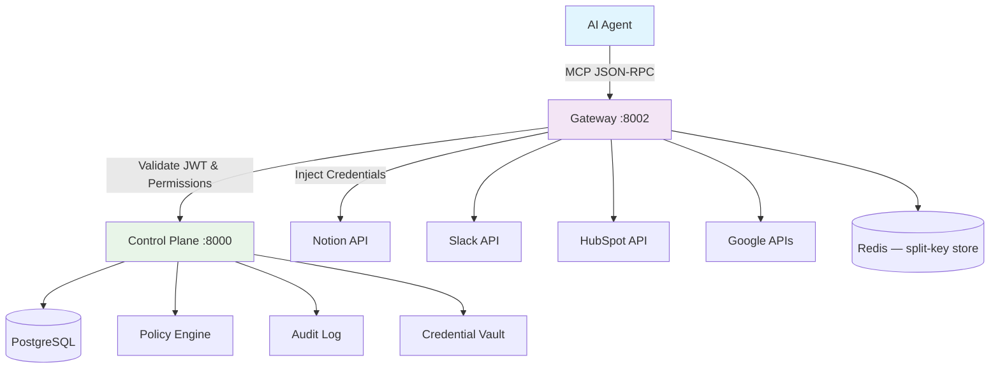

<!-- # DeepSecure: Zero-Trust Security Control Plane for AI Agents -->

<div align="center">
  <h1 style="display: flex; align-items: center;">
    
    <span style="margin-left: 15px;">DeepSecure</span>
  </h1>

  **A Virtual Trust Layer that gives every AI agent a cryptographic identity,
  fine-grained permissions, and audited access to external tools — without
  exposing a single API key.**

  <a href="https://pypi.org/project/deepsecure/">
    
  </a>
  <a href="https://pepy.tech/projects/deepsecure">
    
  </a>
  <a href="https://pypi.org/project/deepsecure/">
    
  </a>
  <a href="https://opensource.org/licenses/Apache-2.0">
    
  </a>
  <a href="https://deepwiki.com/DeepTrail/deepsecure"></a>
  <br/>
  <a href="https://github.com/DeepTrail/deepsecure/stargazers">
    
  </a>
  <a href="https://github.com/DeepTrail/deepsecure/discussions">
    
  </a>
  <a href="https://github.com/DeepTrail/deepsecure/pulls">
    
  </a>
  <a href="https://x.com/imaxxs">
    
  </a>
  <a href="https://x.com/0xdeeptrail">
    
  </a>
  <a href="https://www.linkedin.com/company/deeptrail">
    
  </a>

  <br/><br/>

  [Quickstart](docs/QUICKSTART.md) &middot; [API Reference](docs/API_REFERENCE.md) &middot; [SDK Reference](docs/SDK_REFERENCE.md) &middot; [Examples](examples/) &middot; [Community](https://discord.gg/SUbswk8T)

</div>

---

## The Problem

AI agents today operate with shared static API keys, no identity, all-or-nothing
permissions, and zero audit trail. One compromised agent means full system
compromise.

```python
# Status quo: every agent gets the master key
os.environ["NOTION_API_KEY"]  = "secret_abc..."   # shared across all agents
os.environ["SLACK_BOT_TOKEN"] = "xoxb-..."         # no per-agent scoping
agent.call_tool("notion.delete_page", ...)         # who authorized this?
```

## The Solution

DeepSecure sits between your agents and external services as a **Virtual MCP
Server**. Agents authenticate with Ed25519 cryptographic identities, receive
only the permissions they've been delegated, and never see raw API keys. Every
action is logged with full human attribution.

```python
import deepsecure

client = deepsecure.Client()

# Each agent gets a unique Ed25519 identity stored in the OS keyring
agent = client.agent("research-assistant", auto_create=True)

# Authenticate via challenge-response — no passwords, no API keys
client.authenticate(agent.id)

# Agent calls tools through the MCP Gateway
# The gateway enforces permissions, injects credentials, and logs everything
response = client.gateway.call_tool(
    "notion.search_pages",
    arguments={"query": "Q3 planning"}
)
```

---

## Key Capabilities

| Capability | What it does |
|---|---|
| **Cryptographic Agent Identity** | Every agent gets an Ed25519 keypair. Authentication via challenge-response — no shared secrets. |
| **Virtual MCP Server** | One MCP endpoint exposing 34 tools across 6 services. Agents see only the tools they're allowed to use. |
| **Fine-Grained Delegation** | Users delegate specific permissions to agents. Agents can sub-delegate to other agents. Permissions only shrink, never grow. |
| **Task Tokens** | Short-lived, task-scoped JWTs that further narrow an agent's permissions to exactly what one task requires. |
| **Prompt Injection Detection** | Gateway scans tool arguments for injection patterns before forwarding to external services. |
| **PII Result Filtering** | Sensitive data in tool responses is detected and redacted before reaching the agent. |
| **Fail-Closed Security** | If the Control Plane is unreachable, the Gateway denies all requests. No silent degradation. |
| **Full Audit Trail** | Every authentication, delegation, tool call, and policy decision is logged with human attribution. |
| **SSO Integration** | Authenticate users via Keycloak or Google. Map IdP groups to DeepSecure policies automatically. |

---

## Supported Services

The Gateway acts as a unified MCP endpoint for these backends:

| Service | Tools | Examples |
|---|---|---|
| **Notion** | 8 | `search_pages`, `create_page`, `query_database`, `read_page`, ... |
| **Slack** | 7 | `send_message`, `list_channels`, `search_messages`, `list_users`, ... |
| **HubSpot** | 7 | `search_contacts`, `create_deal`, `list_deals`, `update_contact`, ... |
| **Google Drive** | 4 | `search_files`, `read_file`, `list_files`, `get_file_metadata` |
| **Google Calendar** | 4 | `list_events`, `search_events`, `list_calendars`, `read_event` |
| **Gmail** | 4 | `list_messages`, `read_message`, `search_messages`, `list_labels` |

Each tool maps to a permission URN (e.g., `notion:pages:read`). Agents can only
call tools they've been explicitly delegated.

---

## How It Works

```
  User                    Control Plane              Gateway                External APIs
   │                         │                          │                       │
   │  1. Login (SSO/creds)   │                          │                       │
   │────────────────────────>│                          │                       │
   │  <── User JWT ──────────│                          │                       │
   │                         │                          │                       │
   │  2. Delegate perms      │                          │                       │
   │     to agent            │                          │                       │
   │────────────────────────>│                          │                       │
   │                         │                          │                       │
   │                   Agent │ 3. Challenge-response    │                       │
   │                         │     auth (Ed25519)       │                       │
   │                         │<─────────────────────────│                       │
   │                         │──── Agent JWT ──────────>│                       │
   │                         │                          │                       │
   │                         │  4. MCP tools/call       │                       │
   │                         │     (with Agent JWT)     │                       │
   │                         │     ┌────────────────────│                       │
   │                         │     │ • Validate JWT     │                       │
   │                         │     │ • Check permissions│                       │
   │                         │     │ • Scan for inject. │                       │
   │                         │     │ • Inject secret    │                       │
   │                         │     └────────────────────│── API call ──────────>│
   │                         │                          │<── response ──────────│
   │                         │                          │── filter PII ────>    │
   │                         │     5. Audit logged      │                       │
   │                         │<─────────────────────────│                       │
```

### Architecture

DeepSecure implements a **dual-service architecture** separating policy decisions
from policy enforcement:

**Control Plane** (`deeptrail-control`) — the brain. Manages agent identities,
issues JWTs, stores policies, handles delegation, runs the audit log, and
manages the encrypted credential vault.

**Gateway** (`deeptrail-gateway`) — the enforcer. Exposes a single MCP endpoint,
validates every request against the agent's JWT claims, injects credentials at
the last mile, and forwards calls to external service APIs.



---

## Quick Start

### Prerequisites

- **Docker** and **Docker Compose**
- **Python 3.9+** and **pip**

### 1. Start the backend

```bash
git clone https://github.com/DeepTrail/deepsecure.git
cd deepsecure

docker compose up -d
```

This starts the Control Plane (`:8000`), Gateway (`:8002`), PostgreSQL,
Redis, and Keycloak.

### 2. Install the SDK

```bash
pip install deepsecure
```

### 3. Run the end-to-end demo

The Sarah's Journey demo walks through the full flow — user login, agent
creation, delegation, OAuth service connection, MCP tool calls, security
enforcement, and audit trail:

```bash
# Full automated demo with all steps
./scripts/demo_sarah_journey.sh
```

Or use the interactive Python demo:

```bash
python demos/demo_sarah_journey_interactive.py
```

### 4. Next steps

For a step-by-step HTTP walkthrough with curl commands, see the
[Quickstart Guide](docs/QUICKSTART.md).

---

## Using the Python SDK

```python
import deepsecure

# Connect to your DeepSecure instance
client = deepsecure.Client(
    deeptrail_control_url="http://localhost:8000",
    deeptrail_gateway_url="http://localhost:8002",
)

# Create an agent with a cryptographic identity
agent = client.agent("my-agent", auto_create=True)

# Authenticate (Ed25519 challenge-response)
client.authenticate(agent.id)

# Delegate permissions from user to agent
client.delegate(
    agent_id=agent.id,
    permissions=["notion:pages:read", "slack:messages:write"],
    ttl_seconds=3600,
)

# Call tools through the MCP Gateway
result = client.gateway.call_tool(
    "slack.send_message",
    arguments={"channel": "#updates", "text": "Report ready."}
)

# Check the audit trail
events = client.get_audit_trail(agent_id=agent.id)
```

### Framework Integrations

DeepSecure integrates with LangChain, CrewAI, OpenAI, and Anthropic:

```python
# LangChain
from deepsecure.integrations.langchain import SecureLangChainTools
tools = SecureLangChainTools(client, agent_id=agent.id)

# CrewAI
from deepsecure.integrations.crewai import SecureCrewAITools
tools = SecureCrewAITools(client, agent_id=agent.id)

# OpenAI (gateway-proxied)
response = client.openai.chat_completion(
    model="gpt-4",
    messages=[{"role": "user", "content": "Summarize the Q3 report"}],
)
```

---

## Examples

| # | Example | Description | Framework |
|---|---|---|---|
| 01 | [Create Agent & Issue Credential](examples/01_create_agent_and_issue_credential.py) | Agent identity and credential lifecycle | Core SDK |
| 02 | [SDK Secret Fetch](examples/02_sdk_secret_fetch.py) | Retrieve secrets via the vault | Core SDK |
| 03 | [CrewAI Secure Tools](examples/03_crewai_secure_tools.py) | Multi-agent crew with fine-grained control | CrewAI |
| 04 | [CrewAI Without Fine-Grain](examples/04_crewai_secure_tools_without_finegrain_control.py) | CrewAI with simplified permissions | CrewAI |
| 05 | [LangChain Secure Tools](examples/05_langchain_secure_tools.py) | Secure LangChain agent tools | LangChain |
| 06 | [LangChain Without Fine-Grain](examples/06_langchain_secure_tools_without_finegrain_control.py) | LangChain with simplified permissions | LangChain |
| 07 | [Multi-Agent Communication](examples/07_multi_agent_communication.py) | Agent-to-agent delegation patterns | Core SDK |
| 08 | [Gateway Secret Injection](examples/08_gateway_secret_injection_demo.py) | Automatic credential injection at the gateway | Core SDK |
| 09 | [LangChain Delegation](examples/09_langchain_delegation_workflow.py) | Delegation workflows in LangChain | LangChain |
| 10 | [CrewAI Delegation](examples/10_crewai_delegation_workflow.py) | Delegation workflows in CrewAI | CrewAI |
| 11 | [Advanced Delegation](examples/11_advanced_delegation_patterns.py) | Complex multi-hop delegation chains | Core SDK |
| 12 | [Platform Bootstrap](examples/12_platform_expansion_bootstrap.py) | Kubernetes/AWS/Azure agent bootstrapping | Infrastructure |
| 13 | [OpenAI Quickstart](examples/13_quickstart_openai_list_models.py) | Gateway-proxied OpenAI calls | OpenAI |
| 14 | [OpenAI Policy Enforcement](examples/14_quickstart_openai_policy_enforcement.py) | Policy enforcement on model access | OpenAI |
| 15 | [LangChain + Composio + Notion](examples/15_langchain_composio_notion_integration.py) | End-to-end Notion integration via LangChain | LangChain |

---

## Documentation

| Resource | Description |
|---|---|
| [Quickstart Guide](docs/QUICKSTART.md) | 15-minute walkthrough with curl commands |
| [HTTP API Reference](docs/API_REFERENCE.md) | All Control Plane and Gateway endpoints |
| [Python SDK Reference](docs/SDK_REFERENCE.md) | Client API, integrations, and CLI |
| [CLI Reference](docs/cli_reference.md) | All CLI commands and options |
| [Product Features](docs/PRODUCT_FEATURES.md) | Comprehensive feature list |
| [Product Use Cases](docs/PRODUCT_USE_CASES_BY_PERSONA.md) | Workflows by persona (IT Admin, Engineer, Security) |
| [Developer Workflow](docs/DEVELOPER_WORKFLOW.md) | Development setup and contribution workflow |
| [Sarah's Journey Demo](docs/SARAH_JOURNEY_API_REFERENCE.md) | Step-by-step UI implementation walkthrough |

---

## Contributing

DeepSecure is open source and contributions are welcome.

- **Report bugs or request features**: [GitHub Issues](https://github.com/DeepTrail/deepsecure/issues)
- **Ask questions or share ideas**: [GitHub Discussions](https://github.com/DeepTrail/deepsecure/discussions)
- **Submit code**: See [CONTRIBUTING.md](CONTRIBUTING.md) for setup and guidelines

## Community & Support

- **GitHub Discussions** — questions, use cases, and community conversations
- **GitHub Issues** — bug reports and actionable feature requests
- **Discord** — [Join us](https://discord.gg/SUbswk8T)

## License

Apache 2.0 — see [LICENSE](LICENSE) for details.

---

<div align="center">

**Star us on GitHub if DeepSecure helps secure your AI agents.**

[Quickstart](docs/QUICKSTART.md) &middot; [API Reference](docs/API_REFERENCE.md) &middot; [Discord](https://discord.gg/SUbswk8T)

*Built for the AI agent developer community by [DeepTrail](https://www.deeptrail.ai)*

</div>
