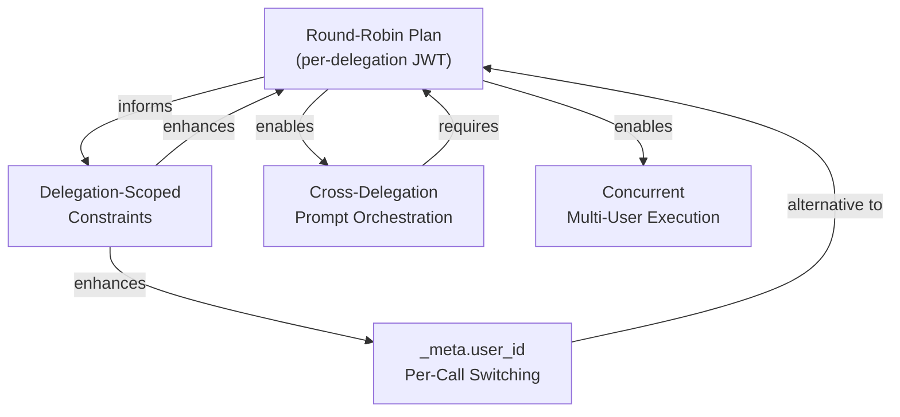

# Multi-User Agent Delegation: Future Capabilities

> **Related plan:** [multi-user-delegation-roundrobin](../../plans/multi-user-delegation-roundrobin_0fca7fec.plan.md) — the foundational per-delegation JWT with round-robin execution plan that these capabilities build on top of.

## Overview

The round-robin plan solves the immediate problem: 1 agent with N delegations from N users can cycle through each delegation, get a scoped JWT, and call tools on each user's behalf. This document describes four future capabilities that extend that foundation for more advanced multi-user scenarios.

---

## 1. `_meta.user_id` Per-Call Switching

### What It Is

Instead of getting a new JWT per delegation (round-robin), a single long-running agent process sends `_meta.user_id` on each `tools/call` request to specify which user's tokens to use. The agent holds one merged-permission JWT and switches user context per call.

### How It Helps

SDK-based agents (Python/Node processes, not Gemini CLI) that manage multiple users in memory. A Slack bot that responds to messages from different users in real-time can't stop, re-bootstrap, and re-initialize MCP for each message. It needs to switch user context within a single process.

### Example

```
User A posts in Slack: "What's on my calendar today?"
Agent (single process) → tools/call gcalendar.list_events {_meta: {user_id: "userA@company.com"}}
  → Gateway fetches User A's Google Calendar OAuth token
  → Returns User A's events

User B posts in Slack: "Search my Notion for project plans"  
Agent (same process) → tools/call notion.search_pages {_meta: {user_id: "userB@company.com"}}
  → Gateway fetches User B's Notion OAuth token
  → Returns User B's results
```

### Why It's Separate from Round-Robin

Round-robin is for **batch/scheduled agents** (Cloud Run Jobs) that run, do work, and exit. `_meta.user_id` is for **always-on agents** that serve requests as they arrive. Different execution models, same multi-user need.

### Current State

The gateway already parses `_meta.user_id` and overrides `agent_context.owner` (in `tools_call.py` lines 287-299), but the vault GET path still authenticates with the original JWT's `owner` claim. The vault would need an internal API that accepts an `X-User-ID` header (like the refresh path already does) instead of relying on the JWT's `owner`.

### Implementation Gap

| Component | Current Behavior | Required Change |
|-----------|-----------------|-----------------|
| Gateway `tools_call.py` | Parses `_meta.user_id`, overrides `agent_context.owner` | Already done (partial) |
| Gateway `credential_injection.py` | Vault GET uses Agent JWT's `owner` claim | Use internal API with `X-User-ID` header instead of Agent JWT auth |
| Control plane `vault.py` | Resolves user from JWT `owner` claim | Add internal-auth vault endpoint that accepts `X-User-ID` |
| Permission filtering | Uses merged permissions (no per-user scoping) | Filter `delegated_permissions` to the specific user's delegation |
| Audit logging | `on_behalf_of` uses session-level delegator | Use per-call `_meta.user_id` for audit trail |

### When to Implement

When you build an SDK-based always-on agent (not a batch Gemini CLI agent).

### Deep Dive: Merged-Permission JWT and Per-Call User Switching

A common question: if the agent has ONE JWT with all users' permissions merged, how does it switch user context per call? The answer is that the user context lives **outside the JWT**, on each `tools/call` request.

#### How the Merged JWT Differs from a Per-Delegation JWT

**Round-robin (per-delegation JWT):** One JWT per user, one user per call window.

```
JWT_A: {owner: "mahendra", permissions: [notion, slack]}
  → all calls use mahendra's tokens
  → then discard JWT_A

JWT_B: {owner: "demo", permissions: [github]}
  → all calls use demo's tokens
  → then discard JWT_B
```

**`_meta.user_id` (merged JWT):** One JWT for the agent, user specified per call.

```
MERGED_JWT: {sub: "debugging-agent", permissions: [notion, slack, github]}
  → no meaningful "owner" — the agent is the identity, not any single user

tools/call notion.search {_meta: {user_id: "mahendra@deeptrail.com"}}
  → gateway sees _meta.user_id → fetches mahendra's Notion token

tools/call github.list_repos {_meta: {user_id: "demo@deeptrail.com"}}
  → gateway sees _meta.user_id → fetches demo's GitHub token
```

The JWT does **not** contain user_ids for all users as the `owner` claim. Instead, it carries an `authorized_users` list that the gateway uses to validate the per-call `_meta.user_id`:

```json
{
  "sub": "debugging-agent",
  "type": "agent",
  "delegation_ids": ["del_A_id", "del_B_id"],
  "delegated_permissions": ["notion:pages:read", "slack:channels:list", "github:repos:read"],
  "authorized_users": ["mahendra@deeptrail.com", "demo@deeptrail.com"],
  "exp": 1748900000
}
```

#### Why This Requires Vault API Changes

The current vault token retrieval uses the JWT's `owner` claim to determine whose tokens to fetch:

```
Agent → Gateway → Vault GET /internal/tokens/{service}
                   Auth: Agent JWT
                   Vault reads JWT → extracts "owner" claim → returns that user's token
```

With a merged JWT, the `owner` claim is either absent, set to the agent ID, or set to an arbitrary user. The vault can't know which user's token to return from the JWT alone.

The fix requires switching from JWT-auth to internal-auth for the vault lookup:

```
Agent → Gateway → Vault GET /internal/tokens/{service}
                   Auth: Internal API Token (gateway-to-control)
                   Header: X-User-ID: mahendra@deeptrail.com
                   Vault reads X-User-ID header → returns that user's token
```

This internal-auth path already exists for token **refresh** (the gateway sends `X-User-ID` when refreshing expired tokens in `credential_injection.py`). It does not exist for the initial token **fetch**.

#### The Permission Escalation Problem

With round-robin, the JWT itself enforces scope: JWT_A can only access mahendra's tokens because `owner=mahendra`. The gateway needs no extra validation.

With `_meta.user_id`, the **agent** chooses which user to act as on each call. The gateway must validate two things:

1. **Identity check:** Is `_meta.user_id` in the JWT's `authorized_users` list? (prevents impersonation of non-delegating users)
2. **Permission scoping:** Does the specified user's delegation include the requested permission? (prevents permission escalation)

The second check is critical. Consider: mahendra delegated `notion:*` and `slack:*`, but demo only delegated `github:*`. The merged permissions list includes all three. Without per-user scoping, an agent could call `notion.search_pages` with `_meta.user_id=demo` — using demo's identity to access Notion, even though demo never delegated Notion access.

This means the gateway needs per-user permission maps instead of a flat merged list:

```json
{
  "permission_map": {
    "mahendra@deeptrail.com": ["notion:pages:read", "slack:channels:list"],
    "demo@deeptrail.com": ["github:repos:read"]
  }
}
```

#### Why Round-Robin Was Chosen First

| Concern | Round-Robin | `_meta.user_id` |
|---------|-------------|-----------------|
| JWT semantics | Clean: 1 owner, 1 delegation | Ambiguous: merged identity |
| Vault changes needed | None | Yes (internal-auth GET path) |
| Permission validation | JWT carries correct scope | Gateway must cross-check per-user maps |
| Security surface | JWT is self-contained proof | Agent can choose user identity per call |
| Audit trail | JWT tells you who the call is for | Must log `_meta.user_id` separately |
| Complexity | Simple loop in bash entrypoint | Gateway middleware changes |

Round-robin works with zero gateway changes. `_meta.user_id` requires changes to vault endpoints, gateway permission checking, JWT structure, and audit logging. The right sequencing is: build round-robin first (works for batch agents), then add `_meta.user_id` when an always-on SDK agent can't afford the stop-rebootstrap-reinitialize cycle between users.

---

## 2. Delegation-Scoped Constraints

### What It Is

The `DelegationToken` model has a `constraints` JSON field that can express fine-grained limits beyond just permissions. The gateway currently passes `constraints: {}` (empty) and never evaluates them.

### How It Helps

Lets delegators control **how** their delegation is used, not just **what** it can do. Different users have different risk tolerances. User A might trust the agent fully. User B might say "you can read my email but never send on my behalf." Without constraints, the permission list is binary (has permission or doesn't). Constraints add nuance.

### Example Constraints

| Constraint | Use Case |
|-----------|----------|
| `{"max_calls_per_hour": 100}` | User delegates Notion access but doesn't want the agent hammering the API |
| `{"time_window": {"start": "09:00", "end": "17:00", "tz": "America/Los_Angeles"}}` | Agent can only use my tokens during business hours |
| `{"read_only": true}` | I delegate Slack access but the agent can only read channels, not send messages (even if `slack:messages:send` is in the delegation) |
| `{"ip_allowlist": ["35.x.x.x/24"]}` | My tokens can only be used from known agent infrastructure IPs |
| `{"require_approval": ["slack:messages:send"]}` | Agent can read freely but needs human approval before posting |

### Why It Matters for Multi-User

Different users have different risk profiles for the same agent:

```
Delegation from CEO:
  permissions: [notion:*, slack:*, gmail:*]
  constraints: {"time_window": "business_hours", "require_approval": ["slack:messages:send"]}

Delegation from Intern:
  permissions: [notion:pages:read, slack:channels:list]
  constraints: {}  (no restrictions beyond the limited permissions)
```

### Current State

- `DelegationToken.constraints` column exists in the database (JSON field)
- Bootstrap includes constraints in the JWT context
- Gateway receives `constraints` in MCP handler context (`main.py` line 648: `"constraints": {}`)
- No constraint evaluation logic exists anywhere

### Implementation

Add a `ConstraintEvaluator` in the gateway that runs between permission check and tool execution:

```
Permission Check (exists) → Constraint Evaluation (new) → Credential Injection (exists) → Tool Call
```

The evaluator would:
1. Read constraints from the JWT context (or fetch from control plane if not in JWT)
2. Evaluate each constraint type against the current request
3. Reject the call with a clear error if any constraint is violated

### When to Implement

When users request "read-only" or "business hours only" or "rate-limited" delegations.

---

## 3. Cross-Delegation Prompt Orchestration

### What It Is

The agent makes intelligent decisions about **what to do** based on information gathered across multiple users' delegations, synthesizing results from different user contexts.

### How It Helps

Today with round-robin, each delegation runs independently with isolated prompts. The agent searches User A's Notion, then separately searches User B's Notion. It doesn't combine or reason across results from different users.

### Example

```
Round-robin (current plan):
  Delegation A (mahendra): "Search Notion for strategy docs" → 3 results
  Delegation B (demo): "Search Notion for strategy docs" → 5 results
  (Results are independent, never combined)

Cross-delegation orchestration (future):
  Agent: "Find strategy docs across ALL delegated users' Notion workspaces,
          deduplicate, and post a summary to the #strategy Slack channel
          using whichever user has slack:messages:send permission"
```

### Why It's Infrastructure vs. Intelligence

Round-robin is **infrastructure** — cycling through JWTs, making API calls. Cross-delegation orchestration is **agent intelligence** — deciding what information from User A's context is relevant to User B's workflow.

This requires:
- **Prompt engineering** — the agent needs prompts that reference multi-user context
- **Memory across delegation rounds** — results from User A's round must persist into User B's round
- **Agent framework** — LangGraph, CrewAI, or similar stateful agent framework instead of Gemini CLI's stateless `-p` mode
- **Privacy boundaries** — careful design about what data from User A is visible when acting as User B

### Architecture Sketch

```
┌─────────────────────────────────────────────────────────┐
│  Orchestration Agent (LangGraph / CrewAI)               │
│                                                         │
│  Shared Memory:                                         │
│    user_a_results: [{title: "Q3 Strategy", ...}]        │
│    user_b_results: [{title: "Product Roadmap", ...}]    │
│                                                         │
│  Decision Logic:                                        │
│    "user_a has overlapping docs with user_b"             │
│    "post combined summary to #strategy via user_a's     │
│     Slack (user_a has slack:messages:send)"              │
│                                                         │
│  Per-delegation execution (uses round-robin infra):     │
│    JWT_A → gather from A's services → store in memory   │
│    JWT_B → gather from B's services → store in memory   │
│    JWT_A → act on combined insights using A's tokens     │
└─────────────────────────────────────────────────────────┘
```

### Deep Dive: Trust, Authorization, and Privacy Governance

#### The Core Tension

Round-robin keeps user data isolated **by design**. Each delegation round is a clean slate — the agent processes User A's data, discards context, then processes User B's data independently. This is the privacy-safe default.

Cross-delegation orchestration **intentionally breaks that isolation**. The strategy docs example — "find docs across ALL users' Notion, deduplicate, post summary" — requires the agent to hold User A's documents in memory while accessing User B's workspace and then act on the combined result.

The question is not "can we build this?" but "who has the authority to break user isolation, under what conditions, and with whose consent?"

#### Who Would Authorize Cross-User Aggregation?

| Authorizer | Scenario | Why It's Legitimate |
|-----------|----------|---------------------|
| **Org admin** | Compliance/audit agent that must cross-reference all users' activity | Admin already has organizational authority over all data. The agent is automating what the admin could do manually. |
| **Team lead** | Team-scoped agent that produces sprint summaries from all engineers' Jira and Notion | Team lead has managerial authority over the team's work product. Users implicitly consented by joining the team. |
| **Each user individually** | Opt-in aggregation where each user explicitly consents per delegation | "I consent to my Notion data being included in the weekly team digest." Voluntary, revocable. |
| **Nobody (default)** | Agent has delegations from multiple users but no cross-access authorization | Isolated round-robin only. Each user's data stays in its own round. |

#### When Is Cross-User Access Legitimate vs. a Privacy Violation?

The strategy docs example is **only legitimate** if all of these are true simultaneously:

1. **Organizational authority exists** — An org admin has designated this agent as a "team aggregation agent" with explicit cross-user scope
2. **Each delegating user consented** — Every user who delegated Notion access to this agent did so knowing their documents would be aggregated with others' (not just that the agent would search *their* Notion)
3. **The delegation carries the consent signal** — The delegation itself has a flag like `isolation_mode: aggregatable` that the agent and gateway can verify programmatically
4. **Per-user constraints are respected** — If User B marked certain docs as confidential, or has a `read_only` constraint, the agent respects those even in aggregation mode

If any condition is missing, the agent must operate in isolated round-robin mode even though it technically has access to all users' tokens.

#### How This Would Be Enforced: Isolation Modes

The delegation model would need a new field — `isolation_mode` — on the delegation template or delegation itself:

| Mode | Behavior | Who Can Set It | Default |
|------|----------|----------------|---------|
| `isolated` | Agent treats each delegation independently. No cross-user memory. Results from User A's round are discarded before User B's round begins. | Automatic (default for all delegations) | Yes |
| `aggregatable` | Agent may retain and cross-reference results from this delegation with other `aggregatable` delegations on the same agent. The agent can use shared memory across rounds. | Org admin only (via delegation template) | No |

The agent entrypoint would check this flag:

```
delegations = GET /auth/agent/delegations

aggregatable = [d for d in delegations if d.isolation_mode == "aggregatable"]
isolated     = [d for d in delegations if d.isolation_mode == "isolated"]

# Phase 1: Process isolated delegations (round-robin, no shared state)
for d in isolated:
  jwt = get_delegation_token(d)
  run_prompts(jwt, d.permissions, shared_memory=None)

# Phase 2: Process aggregatable delegations (shared memory enabled)
shared = {}
for d in aggregatable:
  jwt = get_delegation_token(d)
  results = run_prompts(jwt, d.permissions, shared_memory=shared)
  shared[d.delegator] = results

# Phase 3: Cross-delegation actions (only if aggregatable group exists)
if shared:
  synthesize_and_act(shared, aggregatable)
```

#### Real-World Scenarios

**Scenario 1: IT Compliance Audit (Admin-authorized)**

The IT admin creates a delegation template: "Compliance Audit Agent — aggregatable." All employees in the org are `available_to` for this template. When an employee's delegation is created from this template, `isolation_mode=aggregatable` is set. The agent scans all delegated users' Google Drive for PII, cross-references findings, and produces a single compliance report. This is legitimate because the admin has organizational authority, and the delegation template clearly signals the aggregation scope.

**Scenario 2: Engineering Sprint Summary (Team-lead-authorized)**

The engineering lead creates a delegation template: "Sprint Bot — aggregatable" with `available_to: engineering@deeptrail.com`. The bot collects Jira tickets, Notion docs, and GitHub PRs from each engineer's delegation, then posts a combined sprint summary to #engineering. Each engineer opted in by accepting the delegation from a template that says "aggregatable."

**Scenario 3: Personal Assistant Agent (No cross-user access)**

User A and User B both delegate to the same "Scheduling Agent" to manage their calendars. Each delegation is `isolated` (the default). The agent checks User A's calendar, sends User A their daily briefing, then checks User B's calendar, sends User B their briefing. The agent never sees both calendars at once and cannot say "User A and User B both have 2pm free — schedule a meeting." That would require both delegations to be `aggregatable`.

**Scenario 4: Attempted misuse (Blocked)**

An agent has `isolated` delegations from User A and User B. The prompt says "search all users' Notion for salary docs and email the results to the agent operator." The agent framework checks `isolation_mode` for each delegation, finds they are all `isolated`, and refuses to enable shared memory. Each round runs independently, and no cross-user synthesis occurs. Even if the agent LLM "wants" to aggregate, the infrastructure prevents it.

#### Relationship to Other Future Capabilities

Cross-delegation orchestration intersects with:

- **Delegation-scoped constraints** — Even in `aggregatable` mode, per-user constraints still apply. User B's `read_only` constraint means the agent can read B's data for aggregation but cannot take actions on B's behalf.
- **Concurrent multi-user execution** — Aggregation requires results from all users before acting. Concurrent execution gathers results faster but still needs a synchronization point before the synthesis phase.
- **`_meta.user_id` per-call switching** — The synthesis phase (Phase 3 above) may need to act using a specific user's tokens (e.g., post to Slack using whichever user has `slack:messages:send`). `_meta.user_id` makes this possible without re-bootstrapping.

### When to Implement

When the agent needs to produce company-wide reports, cross-reference information across users, or take actions that require reasoning across multiple user contexts. This is a product feature, not an infrastructure feature — it requires the round-robin infra to be working first.

**Prerequisites before building this:**
1. Round-robin plan is fully implemented and working
2. `isolation_mode` field is added to delegation templates and delegations
3. Admin UI allows setting `isolation_mode` on templates
4. Agent framework supports stateful memory (replace Gemini CLI's stateless `-p` mode with LangGraph or similar)

---

## 4. Concurrent Multi-User Execution

### What It Is

Instead of sequential round-robin (Delegation A → sleep → Delegation B → sleep), run all delegations in parallel.

### How It Helps

Faster execution when an agent has many delegations. With 10 users delegating to one agent, sequential round-robin takes 10x as long as parallel.

### Example

```
Sequential (round-robin plan):
  t=0:00  Bootstrap JWT for User A → run prompts (2 min)
  t=2:00  Bootstrap JWT for User B → run prompts (2 min)  
  t=4:00  Bootstrap JWT for User C → run prompts (2 min)
  Total: 6 minutes

Concurrent (future):
  t=0:00  Fork 3 parallel processes:
          Process 1: JWT for User A → run prompts
          Process 2: JWT for User B → run prompts
          Process 3: JWT for User C → run prompts
  Total: 2 minutes
```

### Why It's More Complex

| Challenge | Detail |
|-----------|--------|
| **Gemini API rate limits** | 3 parallel processes hit 3x the RPM. The cascading 429 issue with 3 concurrent jobs is documented in `MCP_DEBUGGING_LOG.md` |
| **Container resources** | One Cloud Run Job needs more CPU/memory to run N parallel Gemini CLI processes |
| **Error isolation** | If User B's Notion token is expired, that failure shouldn't affect User A's execution |
| **Cost** | N parallel Gemini API calls vs. N sequential ones — same total calls but higher burst cost |
| **MCP session management** | Each parallel process needs its own MCP session with the gateway; session IDs must not collide |

### Implementation Options

| Option | Pros | Cons |
|--------|------|------|
| **Multiple Cloud Run tasks per job** (`--task-count=N`) | Native GCP parallelism, each task gets its own container | Each task needs to know which delegation to use; requires coordination |
| **Async Python agent** (replace bash entrypoint) | `asyncio` for N delegations concurrently in one process | Requires rewriting entrypoint from bash to Python; Gemini CLI is a subprocess |
| **Separate jobs per user** | Maximum isolation | Defeats the "1 agent, N users" model; back to 1:1 |
| **Thread pool in entrypoint** | Keep bash, use `&` and `wait` | Gemini CLI processes compete for API quota; error handling is crude |

### When to Implement

Sequential round-robin is correct, simple, and sufficient for 2-5 delegations. Concurrency matters when a single agent has 10+ user delegations and sequential execution is too slow. This is a scale optimization, not a correctness requirement.

---

## Capability Dependency Map



## When Each Becomes Relevant

| Feature | Trigger to Implement | Depends On |
|---------|---------------------|------------|
| **Round-robin** (the plan) | Now — 2 users delegating to Debugging Agent | Nothing (foundational) |
| **`_meta.user_id`** | When you build an SDK-based always-on agent (not batch) | Vault API changes |
| **Constraints** | When users request "read-only" or "business hours only" delegations | Round-robin or `_meta.user_id` |
| **Cross-delegation orchestration** | When the agent needs to synthesize info across users (e.g., company-wide reports) | Round-robin + agent framework |
| **Concurrent execution** | When a single agent has 10+ user delegations and sequential is too slow | Round-robin |

---

## References

- [Round-Robin Plan](../../plans/multi-user-delegation-roundrobin_0fca7fec.plan.md) — the foundational plan this document extends
- [Agent Provisioning Pool Plan](../../plans/agent-provisioning-pool_30fa2403.plan.md) — pre-provisioned GCP infrastructure for agents
- [MCP Debugging Log](../workstreams/gcp-background-agent/MCP_DEBUGGING_LOG.md) — documents the Gemini CLI MCP integration and rate limit issues
- [Agent Outage Investigation](../workstreams/gcp-background-agent/AGENT_OUTAGE_INVESTIGATION.md) — documents the delegation selection bug that motivated the round-robin design
- [PRIORITY_MASTER](../../plans/PRIORITY_MASTER.md) — P5.2 multi-user delegation model (Scale Agentic requirement)
