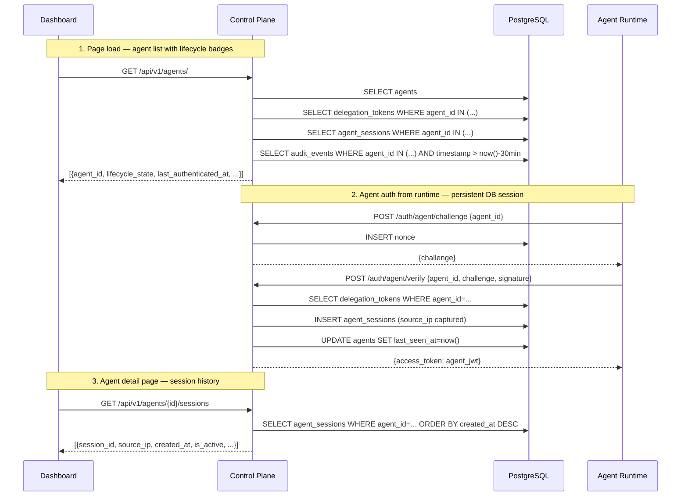

# Spec: Agent Lifecycle

> **Status:** Draft
> **Author:** DeepSecure Team
> **Created:** May 9, 2026
> **Priority:** Priority 2 — Agent Auth Lifecycle + SSE + Onboarding (Q3 2026)
> **Roadmap Phase:** Phase 2: Q3 2026 — Core Experience
> **Priority Master:** [`plans/PRIORITY_MASTER.md`](../../plans/PRIORITY_MASTER.md)
> **Product Roadmap:** [`plans/PRODUCT_ROADMAP.md`](../../plans/PRODUCT_ROADMAP.md)
> **Design Doc:** [`docs/design/agent-lifecycle.md`](../design/agent-lifecycle.md)

---

## Priority & Roadmap Mapping

> **Why this section exists:** `plans/PRIORITY_MASTER.md` and `plans/PRODUCT_ROADMAP.md` define the sequence every workstream must follow. This mapping shows exactly where this spec sits in that sequence, which priorities it covers, and what it unblocks.

### Priority Master Mapping ([`plans/PRIORITY_MASTER.md`](../../plans/PRIORITY_MASTER.md))

This spec covers **Priority 2 — Agent Auth Lifecycle** from the Priority Master.

| Priority Group | Coverage | Items in This Spec |
|---------------|----------|--------------------|
| **Priority 2 — Agent Lifecycle** | ✅ Full | `backend-agent-status`, `backend-session-tracking`, `frontend-lifecycle-badges`, `frontend-detail-page`, `frontend-deploy-config`, `product-doc-update` |
| **Priority 2 — SSE + Onboarding** | ❌ Not in scope | SSE route (`part-c5-sse-route`) and OAuth buttons (`part-c3b-onboarding-connect`) were ✅ pulled into `mvp-foundation` Track B — already done |
| **Priority 2B — Claude Code Integration** | ❌ Not in scope | Separate workstream, parallel with this one |
| **Priority 3 — Token Refresh** | ❌ Not in scope | Independent background worker; no shared files |

### Product Roadmap Mapping ([`plans/PRODUCT_ROADMAP.md`](../../plans/PRODUCT_ROADMAP.md))

This spec delivers **Phase 2: Q3 2026 — Core Experience (Priority 2 items)**.

| Roadmap Phase | Coverage | What This Spec Delivers |
|--------------|----------|------------------------|
| **Phase 1 (1A + 1B + Tooling)** | ✅ Already done | `mvp-foundation` workstream — not in scope here |
| **Phase 2 — Priority 2** | ✅ Complete (5 of 5 remaining items) | `lifecycle_state` backend, session tracking, lifecycle badges UI, agent detail redesign, deploy config tab |
| **Phase 2 — Priority 2B** | ❌ Not in scope | Claude Code MCP proxy — separate workstream |
| **Phase 3 — Priority 3** | ❌ Not in scope | Token refresh worker — independent of lifecycle |
| **Phase 4 — AgentCore** | ❌ Not in scope | Q4 — replaces Deploy Config tab from this spec |

### Persona Capability Unlocked by This Spec

Taken from the roadmap's **"Persona Capability Timeline"**:

| Persona | Capability Unlocked |
|---------|---------------------|
| **Employee (Sarah)** | Four-state lifecycle badges showing exactly where her agent is in the workflow; guided deploy config snippets for env var / AWS Secrets Manager / K8s; session history showing when/where agent last connected |
| **IT Admin (Alex)** | Lifecycle badges on agents he owns (user-scoped, same as Employee view). Can identify which of his org-service agents are delegated but never connected. Source IP in session history for forensics. Org-wide cross-user fleet view is Phase 3. |
| **Security Team** | Session source IP in audit context; accurate per-agent session history for forensics; lifecycle state transitions visible in audit stream |
| **Engineer / Developer** | `lifecycle_state` field in API responses and SDK; clear deploy config for CI/CD secret injection; no more manual challenge-response wiring |

### What This Spec Unblocks

| Blocked Item | Needs | Covered By |
|--------------|-------|-----------|
| Priority 4 — AgentCore | Deploy Config tab established (ARN registration replaces key snippets in P4) | Section 6 — Deploy Config API + Section 8 WS-B |
| Claude Code Integration (2B) | `lifecycle_state` field in SDK responses | Section 6 — Backend API changes |
| SSE real-time badge updates | Session persistence + audit event structure | Section 4 — Technical Design, WS-A3 |
| Security governance UI (Phase 3+) | Session history endpoint with source IP | Section 6 — `GET /agents/{id}/sessions` |

---

## Table of Contents

1. [Objective](#1-objective)
2. [Goals & Non-Goals](#2-goals--non-goals)
3. [Background](#3-background)
4. [Technical Design](#4-technical-design)
5. [Data Models](#5-data-models)
6. [API Contracts](#6-api-contracts)
7. [Security Considerations](#7-security-considerations)
8. [Project Structure](#8-project-structure)
9. [Testing Strategy](#9-testing-strategy)
10. [Demo Scenarios / User Journeys](#10-demo-scenarios--user-journeys)
11. [Rollout Plan](#11-rollout-plan)
12. [Boundaries](#12-boundaries)
13. [Dependencies & Risks](#13-dependencies--risks)
14. [Open Questions](#14-open-questions)
15. [References](#15-references)

---

## 1. Objective

Implement a four-state agent lifecycle (`Registered → Delegated → Authenticated → Active`) visible throughout the DeepSecure dashboard and accessible via the SDK, so every persona can see exactly where an agent stands in its deployment journey and what action is needed next.

Today, the agent list shows only a basic `status` field (active/suspended/revoked), the detail page has no lifecycle progress visualization, and the auth verify path stores sessions in-memory (lost on restart). This workstream wires the existing DB models (`AgentSession`, `DelegationToken`, `AuditEvent`) into computed lifecycle state on the API and builds the UI to surface it.

### User Stories / Acceptance Criteria

- As an **Employee**, I want to see four color-coded lifecycle badges on the agent list so I know which agents are deployed and working vs. stuck waiting for key deployment.
- As an **Employee**, I want a deploy config tab on the agent detail page so I can copy-paste the exact command to deploy the private key to my chosen runtime (env var, AWS Secrets Manager, or Kubernetes).
- As an **IT Admin**, I want to see all agents' lifecycle states at a glance and identify agents that have been delegated but have never authenticated from a real runtime environment.
- As a **Security Team member**, I want session history with source IP so I can identify unexpected auth origins for forensic investigation.
- As an **Engineer**, I want `lifecycle_state` as a first-class field in `GET /agents/` and `GET /agents/{id}` responses so the SDK can expose it in client code.

### Success Criteria

- [ ] `GET /agents/` returns `lifecycle_state` as one of `registered | delegated | authenticated | active` for every agent
- [ ] `GET /agents/{id}` returns `lifecycle_state`, `last_authenticated_at`, `last_active_at`, `delegation_count`, `session_count`
- [ ] `POST /auth/agent/verify` persists an `AgentSession` row to DB (not in-memory) on successful auth, capturing `source_ip`
- [ ] Agent list page shows four-state badges with correct colors: Gray (registered), Amber (delegated), Blue (authenticated), Green (active)
- [ ] Agent detail page has: lifecycle progress bar, deploy config section with 3 runtime snippets, session history table
- [ ] `verify_integration.py` reports 0 CRITICAL after all changes

---

## 2. Goals & Non-Goals

### Goals

- [ ] Backend: Add DB-persistent `AgentSession` row creation on successful auth, capturing `source_ip` for each session
- [ ] Backend: Implement `compute_lifecycle_state(agent_id, db)` that queries `DelegationToken`, `AgentSession`, `AuditEvent` tables
- [ ] Backend: Extend `AgentResponse` schema with `lifecycle_state`, `last_authenticated_at`, `last_active_at`, `delegation_count`, `session_count`
- [ ] Backend: Add `GET /agents/{agent_id}/sessions` endpoint returning recent session history with `source_ip`
- [ ] Frontend: Four-state lifecycle badges on agent list cards
- [ ] Frontend: Lifecycle progress bar on agent detail page (visual step indicator)
- [ ] Frontend: Deploy Config section on agent detail page with env var / AWS / K8s snippets
- [ ] Frontend: Session History table on agent detail page
- [ ] Docs: Update `PRODUCT_USE_CASES_BY_PERSONA.md` Section 5.4 with four-state lifecycle narrative

### Non-Goals

- **Real-time WebSocket/SSE push for state transitions** — the SSE route already exists (`GET /audit/events/stream`); badge state update via SSE polling is deferred to a follow-up. For this workstream, badges refresh on page load / manual refresh.
- **Delegation revocation from the detail page** — existing delegation list already shows them; revocation UI is a separate feature.
- **Org-wide IT Admin fleet view** — `GET /agents/` is user-scoped (returns the authenticated user's own agents). An IT Admin seeing all agents across all users requires a new `GET /admin/agents/` endpoint with role-based access control — that is Phase 3 IT Admin Governance, not this spec.
- **AgentCore (IAM role ARN) registration** — Priority 4; the Deploy Config tab ships interim Ed25519 key snippets as the bridge.
- **Rate limiting on auth endpoints** — Security feature, deferred.
- **Session invalidation from dashboard** — The design doc calls this out as an SSE/real-time feature; deferred to Phase 3.
- **`last_seen_at` gateway update** — Gateway calling back to control plane to update session timestamps requires internal API work; scoped to Phase 3 (token refresh worker).

---

## 3. Background

### Current State

| Capability | Status | Details / File |
|------------|--------|----------------|
| Four-state lifecycle badge | ❌ Missing | Agent list shows only `status` (active/suspended/revoked/registered). No `lifecycle_state` field on backend or frontend. `agents/page.tsx` line 27-36 |
| `lifecycle_state` on API | ❌ Missing | `AgentResponse` schema has `agent_id`, `name`, `status`, `last_seen_at` only. No computed state. `schemas/agent.py` line 55-85 |
| Auth verify → DB session | ⚠️ Partial | `agent_session_service.py:verify_and_create_session` uses in-memory `MVPSession` (line 264-268), not the DB `_create_session` (line 440-473). `AgentSession` table exists and migration is complete. |
| `source_ip` on sessions | ❌ Missing | `AgentSession` model has no `source_ip` column. `app/models/agent_session.py` line 88-230 |
| Session history endpoint | ❌ Missing | No `GET /agents/{id}/sessions` endpoint exists |
| Delegation count on agent | ❌ Missing | Not in `AgentResponse` schema; must be queried from `delegation_tokens` |
| Agent detail — lifecycle bar | ❌ Missing | Detail page has delegations, auth widget, tools, activity feed. No lifecycle progress bar. `agents/[id]/activity/page.tsx` |
| Agent detail — deploy config | ❌ Missing | No deploy config section. `agents/[id]/activity/page.tsx` |
| Agent detail — session history | ❌ Missing | No session history table. `agents/[id]/activity/page.tsx` |
| `DelegationToken` status | ✅ Exists | Computed via `is_valid`, `is_expired`, `is_revoked` hybrid properties. `models/delegation.py` line 184-198 |
| `AuditEvent` with agent_id | ✅ Exists | `agent_id`, `event_type`, `timestamp` columns present. `models/audit_event.py` |
| `AgentSession` model + table | ✅ Exists | Full model with `last_activity_at`, `is_active`, `created_at`, `expires_at`. Migration `f1a2b3c4d5e6`. |
| `PrivateKeyModal` on create | ✅ Exists | Shown when server-gen private key is returned. `agents/create/page.tsx` line 64-71 |
| SSE activity feed | ✅ Exists | `GET /audit/events/stream` + `useSSE` hook already landed in `mvp-foundation` |
| Onboarding OAuth buttons | ✅ Exists | `WelcomeWizard.tsx` real OAuth buttons already landed in `mvp-foundation` |

### Motivation

1. **Agents stuck at "Delegated" with no feedback.** When an employee creates a delegation, the agent card still shows a gray/unknown state. There is no signal that the agent needs to be deployed. This produces support tickets ("why isn't my agent working?") that are actually "private key not deployed" cases. A clear "Delegated — awaiting agent connection" badge with a next-step hint eliminates this confusion entirely.

2. **Session state lost on pod restart.** The MVP auth verify path uses `MVPSession` in-memory. After a pod restart, all session state is gone: the dashboard shows agents as "inactive" even when a production agent is actively calling tools. Persisting to DB means the dashboard reflects real runtime state, not in-memory ephemeral state.

3. **No deploy config guidance.** After the private key modal closes (shown once on agent creation), there is no persistent place to get the config snippets for deploying to AWS Secrets Manager, K8s, or env vars. Users who miss the modal have no recovery path. The Deploy Config tab is the permanent home for this information.

4. **Security team has no session origin data.** `source_ip` is not stored on sessions today. For forensic investigation of unexpected agent authentication, this is the critical missing piece.

---

## 4. Technical Design

### Services Affected

| Service | Impact | Changes |
|---------|--------|---------|
| deeptrail-control | High | Auth verify → DB session; lifecycle state query; new sessions endpoint; schema changes |
| deeptrail-gateway | None | No changes required |
| deepsecure (SDK) | Low | No code changes — `lifecycle_state` field appears automatically in `GET /agents/` JSON response |
| frontend | High | Lifecycle badges, detail page redesign (progress bar, deploy config, session history) |

### Architecture Overview



### Four-State Lifecycle Computation

The lifecycle state is computed on each API read — not stored as a column:

```python
def compute_lifecycle_state(agent_id: str, db: Session) -> str:
    """Compute agent lifecycle state from DB queries.

    State precedence (highest wins):
      active        → has AgentSession active AND audit event in last 30 min
      authenticated → has AgentSession active (but no recent tool calls)
      delegated     → has valid DelegationToken but no active session
      registered    → default (no delegation, no session)
    """
    # Check for recent tool calls (active = tool call within 30 minutes)
    thirty_min_ago = datetime.now(timezone.utc) - timedelta(minutes=30)
    has_recent_activity = db.query(AuditEvent).filter(
        AuditEvent.agent_id == agent_id,
        AuditEvent.event_type == AuditEventType.TOOL_CALL,
        AuditEvent.timestamp >= thirty_min_ago,
    ).first() is not None

    # Check for active session
    has_active_session = db.query(AgentSession).filter(
        AgentSession.agent_id == agent_id,
        AgentSession.is_active == True,
        AgentSession.expires_at > datetime.now(timezone.utc),
    ).first() is not None

    # Check for valid delegation
    has_delegation = db.query(DelegationToken).filter(
        DelegationToken.agent_id == agent_id,
        DelegationToken.revoked_at.is_(None),
        DelegationToken.expires_at > datetime.now(timezone.utc),
    ).first() is not None

    if has_active_session and has_recent_activity:
        return "active"
    elif has_active_session:
        return "authenticated"
    elif has_delegation:
        return "delegated"
    else:
        return "registered"
```

### Key Components

**1. Lifecycle State Service** (`deeptrail-control/app/services/lifecycle_service.py`)

```python
class LifecycleService:
    """Compute agent lifecycle state and aggregate metrics from DB."""

    def __init__(self, db: Session) -> None: ...

    def compute_state(self, agent_id: str) -> str:
        """Return: registered | delegated | authenticated | active"""
        ...

    def compute_state_bulk(self, agent_ids: list[str]) -> dict[str, str]:
        """Efficient bulk computation for agent list — N queries not N*3."""
        ...

    def get_last_authenticated_at(self, agent_id: str) -> Optional[datetime]:
        """Most recent AgentSession.created_at for this agent."""
        ...

    def get_last_active_at(self, agent_id: str) -> Optional[datetime]:
        """Most recent AuditEvent.timestamp for this agent."""
        ...

    def get_session_count(self, agent_id: str) -> int:
        """Count of all AgentSession rows for this agent."""
        ...

    def get_delegation_count(self, agent_id: str) -> int:
        """Count of valid (non-revoked, non-expired) delegations."""
        ...
```

**2. Agent Session Service — Fix auth verify path** (`deeptrail-control/app/services/agent_session_service.py`)

```python
async def verify_and_create_session(
    self,
    agent_id: str,
    challenge: str,
    signature: str,
    source_ip: Optional[str] = None,  # NEW: captured from request
) -> str:
    """Verify Ed25519 signature, persist AgentSession to DB, return JWT."""
    # ... existing signature verification ...
    # NEW: persist to DB instead of in-memory MVPSession
    session = self._create_session(
        agent_id=agent_id,
        delegation_id=delegation.id,
        source_ip=source_ip,
        ...
    )
    db.add(session)
    db.commit()
    return self._generate_jwt(session)
```

**3. Extended Agent Schema** (`deeptrail-control/app/schemas/agent.py`)

```python
class Agent(AgentInDBBase):
    """Agent response with computed lifecycle fields."""
    lifecycle_state: str = Field(
        default="registered",
        description="One of: registered | delegated | authenticated | active",
    )
    last_authenticated_at: Optional[datetime] = None
    last_active_at: Optional[datetime] = None
    delegation_count: int = 0
    session_count: int = 0
```

**4. Session History Schema + Endpoint** (`deeptrail-control/app/api/v1/endpoints/agents.py`)

```python
class AgentSessionSummary(BaseModel):
    session_id: str
    created_at: datetime
    expires_at: datetime
    last_activity_at: Optional[datetime]
    source_ip: Optional[str]
    is_active: bool
    scoped_permissions: List[str]

@router.get("/{agent_id}/sessions", response_model=List[AgentSessionSummary])
def get_agent_sessions(
    agent_id: str,
    limit: int = Query(default=20, le=100),
    db: DbDep = ...,
    _: Any = deps.APIKeyDep,
) -> List[AgentSessionSummary]:
    """Return recent session history for an agent, newest first."""
    ...
```

### Architecture Decisions

| Decision | Options Considered | Chosen | Rationale |
|----------|--------------------|--------|-----------|
| Lifecycle state storage | A) Computed on read B) Stored column | A — Computed | State derives from 3 tables; storing it adds update logic at every transition; computed is always consistent |
| Bulk lifecycle for list | A) N+3 queries per agent B) 3 bulk queries for all agents C) Separate background job | B — 3 bulk queries | List page must load fast; N*3 is O(n) DB round trips; 3 queries with `IN (...)` are single round trips |
| Auth verify → session | A) Fix MVP in-memory path B) Keep MVP + add separate job C) Dual-write | A — Fix MVP path | The `_create_session` method already exists; wiring it up is the right fix; in-memory is the root cause of the P1 CRITICALs |
| `source_ip` capture | A) Header `X-Forwarded-For` B) `request.client.host` C) Both with fallback | C — Both with fallback | Behind a proxy/load balancer, `X-Forwarded-For` has the real IP; `request.client.host` is the fallback for direct connections |

---

## 5. Data Models

### Modified: `AgentSession` — Add `source_ip` Column

The existing migration (`f1a2b3c4d5e6`) creates `agent_sessions` without `source_ip`. A new migration adds it:

| Column | Type | Description |
|--------|------|-------------|
| `source_ip` | `String(45)` nullable | IPv4 or IPv6 address of authenticating agent runtime. `String(45)` covers IPv6 `::ffff:xxx.xxx.xxx.xxx` format. NULL for sessions created before this migration. |

### Modified: `Agent` — No Schema Changes

The `Agent` ORM model (`last_seen_at`) already exists. No new columns needed on the `agents` table — lifecycle state is fully computed from join queries.

### New: `AgentSessionSummary` (Schema Only — No New Table)

Pydantic response schema for `GET /agents/{id}/sessions`. No new DB table — reads from existing `agent_sessions`.

| Field | Type | Source |
|-------|------|--------|
| `session_id` | `str` | `AgentSession.id` |
| `created_at` | `datetime` | `AgentSession.created_at` |
| `expires_at` | `datetime` | `AgentSession.expires_at` |
| `last_activity_at` | `Optional[datetime]` | `AgentSession.last_activity_at` |
| `source_ip` | `Optional[str]` | `AgentSession.source_ip` (new column) |
| `is_active` | `bool` | `AgentSession.is_active` |
| `scoped_permissions` | `List[str]` | `AgentSession.scoped_permissions` |

### Migration Required

New migration `add_source_ip_to_agent_sessions`:
- `ALTER TABLE agent_sessions ADD COLUMN source_ip VARCHAR(45) NULL`
- Down: `ALTER TABLE agent_sessions DROP COLUMN source_ip`

---

## 6. API Contracts

> **CRITICAL**: This section is the CANONICAL source for all API endpoints.
> Task tickets, tests, and implementations MUST match these exactly.

### Endpoint Summary

| Method | Endpoint | Purpose | Auth |
|--------|----------|---------|------|
| `GET` | `/api/v1/agents/` | List all agents with lifecycle state | API Key |
| `GET` | `/api/v1/agents/{agent_id}` | Get single agent with lifecycle state | API Key |
| `POST` | `/api/v1/auth/agent/verify` | Auth verify — now persists DB session with source_ip | None (public challenge-response) |
| `GET` | `/api/v1/agents/{agent_id}/sessions` | List recent session history with source_ip | API Key |

### GET /api/v1/agents/ (Modified)

**Request:**
```
Authorization: Bearer <api-key-or-jwt>
```

**Response (200) — Extended fields added:**
```json
[
  {
    "agent_id": "agent-9e38ab85-f123",
    "name": "Sarah's Sales Assistant",
    "description": "Handles Notion + Slack",
    "status": "active",
    "publicKey": "MCowBQYDK2VwAyEA...",
    "lifecycle_state": "delegated",
    "last_authenticated_at": null,
    "last_active_at": null,
    "delegation_count": 2,
    "session_count": 0,
    "created_at": "2026-05-01T10:00:00Z",
    "updated_at": "2026-05-01T10:00:00Z",
    "last_seen_at": null
  }
]
```

**New fields:**
| Field | Type | Description |
|-------|------|-------------|
| `lifecycle_state` | `str` | `registered \| delegated \| authenticated \| active` |
| `last_authenticated_at` | `datetime \| null` | Most recent successful auth verify |
| `last_active_at` | `datetime \| null` | Most recent MCP tool call audit event |
| `delegation_count` | `int` | Count of valid (non-revoked, non-expired) delegations |
| `session_count` | `int` | Total session count (all time) |

**Error Responses:**
| Status | Condition |
|--------|-----------|
| 401 | Missing or invalid API key / JWT |

### GET /api/v1/agents/{agent_id} (Modified)

Same new fields as the list endpoint. No additional changes.

### POST /api/v1/auth/agent/verify (Modified — Backend Behavior Only)

**Request/Response schema unchanged.** Only the internal behavior changes: on successful signature verification, the service now persists an `AgentSession` row to DB and captures `source_ip` from the request. The JWT returned to the agent is identical to today.

**What changes:**
- `agent_session_service.verify_and_create_session()` calls `_create_session(...)` instead of `MVPSession(...)`
- `source_ip` is extracted from `request.client.host` or `X-Forwarded-For` header and stored on the session row
- `Agent.last_seen_at` is updated on successful verify

### GET /api/v1/agents/{agent_id}/sessions (New)

**Request:**
```
Authorization: Bearer <api-key-or-jwt>
GET /api/v1/agents/{agent_id}/sessions?limit=20
```

**Response (200):**
```json
[
  {
    "session_id": "asess-a1b2c3d4-...",
    "created_at": "2026-05-08T14:30:00Z",
    "expires_at": "2026-05-08T22:30:00Z",
    "last_activity_at": "2026-05-08T16:45:00Z",
    "source_ip": "54.239.28.85",
    "is_active": true,
    "scoped_permissions": ["notion:pages:read", "notion:pages:write"]
  },
  {
    "session_id": "asess-b2c3d4e5-...",
    "created_at": "2026-05-07T09:00:00Z",
    "expires_at": "2026-05-07T17:00:00Z",
    "last_activity_at": "2026-05-07T12:00:00Z",
    "source_ip": "54.239.28.85",
    "is_active": false,
    "scoped_permissions": ["notion:pages:read"]
  }
]
```

**Query Parameters:**
| Param | Type | Default | Description |
|-------|------|---------|-------------|
| `limit` | `int` | `20` | Max sessions to return (max 100) |
| `active_only` | `bool` | `false` | If true, return only active sessions |

**Error Responses:**
| Status | Condition |
|--------|-----------|
| 401 | Missing or invalid auth |
| 404 | Agent not found |

---

## 7. Security Considerations

### Session Persistence Security

- **Source IP stored but not used for auth decisions.** The `source_ip` is metadata for observability/forensics only. It does not gate or affect authentication — an agent authenticating from a new IP is not blocked. IP-based restrictions are a Phase 3+ feature (policy enforcement engine).
- **`source_ip` is read-only after creation.** The field is written once when the session is created and never updated, preventing session hijacking via IP spoofing from affecting audit history.
- **`X-Forwarded-For` trust.** The service reads `X-Forwarded-For` only when a trusted proxy is configured (checked via `settings.TRUSTED_PROXY_IPS` or similar). In local dev with no proxy, falls back to `request.client.host`. If `X-Forwarded-For` is absent, `source_ip` is set to `request.client.host`.

### Session History Endpoint Access Control

- `GET /agents/{id}/sessions` requires the same API Key or JWT Bearer token as other agent endpoints (`APIKeyDep`).
- The endpoint does NOT expose the encrypted token fields from `AgentSession` (`scoped_permissions` is included as it's a permission list, not a secret).
- No `challenge_nonce`, `mcp_sessions`, `owner_email`, or other sensitive internal fields are exposed.

### Deploy Config Snippet Security

- The Deploy Config tab on the frontend renders **the private key placeholder only** — it never fetches or displays the actual private key from the backend. The private key was shown once at creation via `PrivateKeyModal` and is never stored by DeepSecure.
- The config snippets include the `agent_id` and `control_url` (both non-secret) and a `<your-private-key-here>` placeholder that the user fills in from their own secure storage.
- No server-side API call is needed for the deploy config tab — it's rendered purely from the agent record (`agent_id`, `control_url` from settings).

### In-Memory → DB Session Fix (Security Improvement)

The current in-memory MVP session path bypasses the DB `AgentSession` model entirely. This means:
- Session revocation (calling `revoke_all_for_agent`) has no effect on in-memory sessions
- Pod restart silently invalidates all "active" sessions without audit record

After this fix, session revocation is persistent and revocation events are reflected in the lifecycle state on the next API read.

---

## 8. Project Structure

### Workstream A: Backend — Lifecycle State + Session Persistence (Control Plane)

| File | Action | Purpose |
|------|--------|---------|
| `deeptrail-control/app/services/lifecycle_service.py` | Create | `LifecycleService` — compute state, bulk queries, aggregate metrics |
| `deeptrail-control/app/services/agent_session_service.py` | Modify | Wire `verify_and_create_session` → `_create_session(...)` with `source_ip`; capture IP from request |
| `deeptrail-control/app/schemas/agent.py` | Modify | Add `lifecycle_state`, `last_authenticated_at`, `last_active_at`, `delegation_count`, `session_count` to `Agent` + `AgentList` schemas |
| `deeptrail-control/app/api/v1/endpoints/agents.py` | Modify | Inject `LifecycleService`; populate new fields in list + detail GET; add `GET /{agent_id}/sessions` |
| `deeptrail-control/app/api/v1/endpoints/auth.py` | Modify | Pass `source_ip` from `Request` object to `verify_and_create_session` |
| `deeptrail-control/alembic/versions/b2c3d4e5f6a7_add_source_ip_to_agent_sessions.py` | Create | Add `source_ip VARCHAR(45) NULL` to `agent_sessions` |
| `deeptrail-control/tests/services/test_lifecycle_service.py` | Create | Unit tests for all lifecycle state transitions |
| `deeptrail-control/tests/api/v1/test_agents_lifecycle.py` | Create | Integration tests for extended GET /agents/ and GET /agents/{id}/sessions |
| `deeptrail-control/tests/api/v1/test_auth_agent_verify_persistence.py` | Create | Verify that auth/verify now writes AgentSession row to DB |

### Workstream B: Frontend — Lifecycle Badges + Detail Page Redesign

| File | Action | Purpose |
|------|--------|---------|
| `frontend/src/components/agents/LifecycleBadge.tsx` | Create | Four-state badge component: Registered (gray), Delegated (amber), Authenticated (blue), Active (green) |
| `frontend/src/components/agents/LifecycleProgressBar.tsx` | Create | Visual step indicator showing current state in 4-step flow |
| `frontend/src/components/agents/DeployConfigSection.tsx` | Create | Copy-paste snippets for env var, AWS Secrets Manager, Kubernetes |
| `frontend/src/components/agents/SessionHistoryTable.tsx` | Create | Table: session_id, created_at, source_ip, last_activity_at, is_active badge |
| `frontend/src/app/(dashboard)/dashboard/agents/page.tsx` | Modify | Import `LifecycleBadge`; replace plain `status` badge with lifecycle badge using `lifecycle_state` |
| `frontend/src/app/(dashboard)/dashboard/agents/[id]/activity/page.tsx` | Modify | Add `LifecycleProgressBar`, `DeployConfigSection`, `SessionHistoryTable`; fetch `/agents/{id}/sessions` |
| `frontend/src/components/agents/index.ts` | Modify | Export new components |
| `frontend/src/components/agents/__tests__/LifecycleBadge.test.tsx` | Create | Test all 4 badge states render correctly |
| `frontend/src/components/agents/__tests__/DeployConfigSection.test.tsx` | Create | Test snippet generation for each runtime type |
| `frontend/src/components/agents/__tests__/SessionHistoryTable.test.tsx` | Create | Test table renders sessions with source_ip |
| `frontend/src/app/(dashboard)/dashboard/agents/__tests__/page.test.tsx` | Modify | Update test to assert lifecycle badge presence |
| `frontend/src/app/(dashboard)/dashboard/agents/[id]/activity/__tests__/page.test.tsx` | Modify | Add test assertions for new sections |

### Workstream C: Docs Update

| File | Action | Purpose |
|------|--------|---------|
| `docs/PRODUCT_USE_CASES_BY_PERSONA.md` | Modify | Section 5.4: four-state lifecycle narrative; new 5.4.1 "Agent Lifecycle States" |

### Complexity Estimates

| Workstream | Complexity | Rationale |
|------------|------------|-----------|
| WS-A: Backend lifecycle + session persistence | M (1-3 hrs, 4 tasks) | `_create_session` already exists; lifecycle query logic is new; migration is small; bulk query needs care |
| WS-B: Frontend lifecycle UI | M (1-3 hrs, 4 tasks) | Badge and progress bar are new components; detail page adds 3 sections to existing layout |
| WS-C: Docs | S (<1 hr, 1 task) | Section 5.4 update only |

---

## 9. Testing Strategy

### Test Matrix

| Level | What | Location | Framework |
|-------|------|----------|-----------|
| Unit | `LifecycleService.compute_state` — all 4 transitions | `deeptrail-control/tests/services/` | pytest |
| Unit | `compute_state_bulk` — N agents, 3 queries | `deeptrail-control/tests/services/` | pytest |
| Unit | `verify_and_create_session` — DB row created, source_ip captured | `deeptrail-control/tests/services/` | pytest |
| Integration | `GET /agents/` — lifecycle_state in response | `deeptrail-control/tests/api/v1/` | pytest + httpx |
| Integration | `GET /agents/{id}/sessions` — returns history | `deeptrail-control/tests/api/v1/` | pytest + httpx |
| Component | `LifecycleBadge` — 4 states render | `frontend/src/components/agents/__tests__/` | Jest + RTL |
| Component | `DeployConfigSection` — 3 runtime snippets contain correct agent_id | `frontend/src/components/agents/__tests__/` | Jest + RTL |
| Component | `SessionHistoryTable` — renders source_ip, active/inactive badge | `frontend/src/components/agents/__tests__/` | Jest + RTL |

### Key Test Scenarios

- [ ] Agent with no delegation → `lifecycle_state: "registered"`
- [ ] Agent with valid delegation + no session → `lifecycle_state: "delegated"`
- [ ] Agent with active session + no tool calls in 30 min → `lifecycle_state: "authenticated"`
- [ ] Agent with active session + tool call within 30 min → `lifecycle_state: "active"`
- [ ] Expired session → reverts to `"delegated"` (not `"authenticated"`)
- [ ] All delegations revoked → reverts to `"registered"`
- [ ] Auth verify creates `AgentSession` row in DB with `source_ip` from request
- [ ] `GET /agents/{id}/sessions` returns newest session first, respects `limit`
- [ ] Deploy Config section renders `agent_id` and `control_url` in all 3 snippet formats
- [ ] Lifecycle progress bar highlights step 2 (Delegated) when `lifecycle_state == "delegated"`

### Technical Requirements

| Requirement | Correct Pattern | Common Mistake |
|-------------|-----------------|----------------|
| Async test fixtures | `@pytest_asyncio.fixture` | `@pytest.fixture` (breaks async) |
| Mock lifecycle queries | Use SQLite in-memory test DB | Mocking DB session (too brittle) |
| Frontend mock API | MSW or jest mock for `apiClient` | Calling real API in component tests |
| Lifecycle state test | Create real DB rows (delegation, session, audit) then assert | Mocking `compute_lifecycle_state` directly |

### Coverage Requirements

- New `LifecycleService` code: 100% coverage (all 4 state branches)
- New frontend components: 80%+ coverage
- Auth verify DB persistence path: must have a test that asserts `AgentSession` row exists after call

---

## 10. Demo Scenarios / User Journeys

### Scenario 1: Employee (Sarah) — Full Lifecycle Walkthrough

**Persona:** Sarah, Software Engineer at Acme Corp, deploying her first agent
**Pre-conditions:** Sarah has connected Notion and Slack to her DeepSecure account

| Step | Action | Expected Result | Validates |
|------|--------|-----------------|-----------|
| 1 | Opens Agents list | See "Sarah's Sales Assistant" card with **gray "Registered"** badge and "No delegations yet" hint | Lifecycle badge: registered state |
| 2 | Creates delegation granting `notion:pages:read`, `slack:messages:write` | Card now shows **amber "Delegated"** badge, "2 permissions assigned — awaiting agent connection" | Lifecycle badge: delegated state |
| 3 | Clicks agent card to open detail page | Sees Lifecycle Progress Bar with step 2 "Delegated" highlighted; Deploy Config section visible | Detail page: progress bar + deploy config |
| 4 | Clicks "AWS Secrets Manager" tab in Deploy Config | Sees copy-paste `aws secretsmanager create-secret` command with `agent_id` and placeholder for private key | Deploy Config: AWS snippet |
| 5 | Agent runtime authenticates (simulated by test-auth button) | Badge changes to **blue "Authenticated"**; Session History table shows 1 session row with source IP and timestamp | Lifecycle badge: authenticated; session history |
| 6 | Agent calls a Notion tool | Badge changes to **green "Active"**, last tool call shows "just now" | Lifecycle badge: active state |

**Success criteria:** `GET /agents/{id}` returns `lifecycle_state: "active"` after step 6; all badge colors match spec

### Scenario 2: IT Admin (Alex) — Fleet Audit (Own Agents)

**Persona:** Alex, IT Administrator who owns the org-level service agents (data pipeline, API integration bots)
**Pre-conditions:** Alex has registered several agents for org-wide automation tasks
**Scope note:** At this phase, `GET /agents/` returns **agents owned by the authenticated user**. Cross-user org-wide fleet visibility (seeing all employees' agents across Acme Corp) is a Phase 3 IT Admin Governance feature. Alex's "fleet" here is the set of agents he registered and delegated directly.

| Step | Action | Expected Result | Validates |
|------|--------|-----------------|-----------|
| 1 | Opens Agents list | Sees agents with mixed badges: 3 green, 2 amber, 1 gray | Bulk lifecycle computation on list page |
| 2 | Notices agent "Customer Data Agent" stuck at Delegated for 7 days | Amber badge with "awaiting agent connection" — clear signal that key was never deployed | Lifecycle badge guidance |
| 3 | Opens "Customer Data Agent" detail | Session History table is empty; Deploy Config tab shows the snippets to deploy the key | Detail page: empty session history → actionable hint |
| 4 | Forwards Deploy Config snippets to the engineer who manages that deployment | N/A | Business outcome: no ticket needed, the UI provides the fix |

**Success criteria:** `GET /agents/` returns correct `lifecycle_state` for all agents in single request (no N+1 queries)

> **Phase 3 note:** Org-wide fleet view (IT Admin sees all agents across all users in the organization) requires a new `GET /admin/agents/` endpoint with elevated role check. That is **Phase 3 — IT Admin Governance**. This spec does not implement it.

### Scenario 2B: Engineer / Developer — Debugging a CI/CD Fleet

**Persona:** Marcus, Senior Engineer at Acme Corp, manages 4 agents in automated data pipelines
**Pre-conditions:** Marcus has registered agents for prod, staging, and dev environments; has connected Notion + Slack

| Step | Action | Expected Result | Validates |
|------|--------|-----------------|-----------|
| 1 | Opens Agents list after a failed deployment | Sees `prod-pipeline-agent` showing **amber "Delegated"** — expected green "Active" | Badge makes the problem immediately visible |
| 2 | Clicks `prod-pipeline-agent` detail | Session History table is **empty** — confirms the agent never successfully authenticated | Session history as debugging tool |
| 3 | Checks Deploy Config tab | Sees the AWS Secrets Manager snippet with the correct `agent_id` — cross-references with what the pipeline actually uses | Deploy Config validates correct key deployment |
| 4 | Discovers the prod pipeline is using `staging_agent_id` by mistake | N/A — he fixes the pipeline config | Root cause identified from UI alone |
| 5 | Re-runs pipeline; opens Agents list | `prod-pipeline-agent` now shows **green "Active"** | Badge reflects real runtime state |

**Success criteria:** Session History table correctly shows empty state (with helpful hint) when no sessions exist; `lifecycle_state` in the API response lets the SDK surface this in scripts (`client.agents.get("id").lifecycle_state == "delegated"` flags mis-deployment)

### Scenario 3: Error Path — Expired Session Reverts State

**Persona:** Sarah checking on an agent after weekend
**Pre-conditions:** Agent had `lifecycle_state: "authenticated"` Friday; session was 8h window, now expired

| Step | Action | Expected Result | Validates |
|------|--------|-----------------|-----------|
| 1 | Opens Agents list Monday morning | Agent shows **amber "Delegated"** badge (not blue) — session expired | State reverts correctly when session expires |
| 2 | Agent runtime re-authenticates (auto-retry in SDK) | Badge returns to **blue "Authenticated"** | Session re-creation updates lifecycle |
| 3 | IT Admin views session history | New session row appears with new timestamp + same source IP | Session history persists across re-auths |

**Success criteria:** `lifecycle_state` transitions correctly when `AgentSession.expires_at < now()`, even without any explicit revocation action

---

## 11. Rollout Plan

### Phase 1: Backend Foundation (Workstream A)

**Tasks:** WS-A1 (migration), WS-A2 (lifecycle service), WS-A3 (auth verify persistence), WS-A4 (endpoints)
**Duration:** ~1 session
**Deliverable:** All `GET /agents/` responses include `lifecycle_state`; auth verify writes DB session; `GET /agents/{id}/sessions` endpoint live
**Demo impact:** No visible UI change yet; API consumers see new fields immediately

### Phase 2: Frontend Lifecycle UI (Workstream B)

**Tasks:** WS-B1 (LifecycleBadge), WS-B2 (detail page components), WS-B3 (wire into pages)
**Duration:** ~1 session
**Deliverable:** Four-state badges on agent list; lifecycle progress bar + deploy config + session history on detail page
**Demo impact:** Full Sarah journey (Scenario 1) is now demonstrable end-to-end

### Phase 3: Docs Update (Workstream C)

**Tasks:** WS-C1 (product use cases doc update)
**Duration:** <1 hour
**Deliverable:** `PRODUCT_USE_CASES_BY_PERSONA.md` accurately describes four-state lifecycle
**Demo impact:** None (documentation only)

---

## 12. Boundaries

### Always Do

- Use `compute_state_bulk` for list endpoint (3 queries, not N*3)
- Keep `lifecycle_state` as a computed field, not a stored column
- Capture `source_ip` at auth verify time — the only point where the request origin is known
- Write tests that use real DB rows to verify lifecycle transitions (not mocked state)
- Run `verify_integration.py` before declaring workstream complete

### Ask First

- Any changes to the JWT payload shape (affects SDK, Gateway)
- Adding new `AuditEventType` values (shared enum)
- Changes to `challenge_nonce` handling or Ed25519 verification logic

### Never Do

- Store the private key anywhere in the backend (it's shown once via modal and never stored)
- Return `challenge_nonce` or `mcp_sessions` from the sessions history endpoint
- Use `X-Forwarded-For` header without checking proxy trust setting
- Show `source_ip` in public-facing API responses that are accessible to agents (only for admin/user API calls)

---

## 13. Dependencies & Risks

### External Dependencies

| Dependency | Risk | Mitigation |
|------------|------|------------|
| `AgentSession` migration (`f1a2b3c4d5e6`) | Must exist before this workstream | ✅ Already in `feature/frontend-architecture` |
| `DelegationToken` table | Must exist | ✅ Already in `feature/frontend-architecture` |
| `AuditEvent` table | Must exist | ✅ Already in `feature/frontend-architecture` |
| Pre-batch residuals fixed | `user_sessions`, `_pending_sso`, `_connected_services` | ✅ Fixed in commit `28e3f74` |

### Risks

| Risk | Probability | Impact | Mitigation |
|------|-------------|--------|------------|
| `verify_and_create_session` refactor breaks existing auth tests | M | H | Fix auth tests as part of the same task; run full auth test suite before merge |
| Lifecycle bulk query is slow at scale (10,000+ agents) | L | M | Add DB indexes on `agent_id` columns; use `LIMIT` on audit event check; add query time logging |
| `_create_session` has different JWT generation than MVP path | M | H | Audit `_generate_jwt` vs `_generate_mvp_jwt` — they must produce identical token shapes; add test asserting JWT claims shape |
| Frontend detail page becomes too long after adding 3 new sections | L | L | Use tab layout for Deploy Config + Session History (not inline) to keep above-the-fold content clean |

---

## 14. Open Questions

- [ ] **Session history visibility scope:** Should `GET /agents/{id}/sessions` be accessible to the agent itself (using its own JWT) or only to the user/admin? Current spec says API Key only (admin-facing). Confirm before implementation.
- [ ] **`source_ip` privacy:** Should `source_ip` be masked (e.g., last octet zeroed) in the frontend session history table, or shown in full? Full IP is standard for admin audit views but may have GDPR implications for EU deployments.
- [ ] **Lifecycle badge refresh strategy:** On the agent list page, should `lifecycle_state` refresh automatically (polling) or only on manual page reload? If polling, at what interval? (SSE push is deferred to Phase 3.)
- [ ] **Active window for "active" state:** The design doc specifies 30 minutes. Should this be configurable via `settings.AGENT_ACTIVE_WINDOW_MINUTES` or hardcoded?

---

## 15. References

- [`plans/agent_auth_flow_design_66bcb1ec.md`](../../plans/agent_auth_flow_design_66bcb1ec.md) — Four-state lifecycle design, AWS deployment flow, trade-offs table
- [`plans/PRIORITY_MASTER.md`](../../plans/PRIORITY_MASTER.md) — Priority 2 items: `backend-agent-status`, `backend-session-tracking`, `frontend-lifecycle-badges`, `frontend-detail-page`, `frontend-deploy-config`
- [`plans/PRODUCT_ROADMAP.md`](../../plans/PRODUCT_ROADMAP.md) — Phase 2 feature table and Persona Capability Timeline
- [`deeptrail-control/app/models/agent_session.py`](../../deeptrail-control/app/models/agent_session.py) — Existing `AgentSession` model (has `last_activity_at`, no `source_ip`)
- [`deeptrail-control/app/services/agent_session_service.py`](../../deeptrail-control/app/services/agent_session_service.py) — `verify_and_create_session` (uses in-memory MVP path) + `_create_session` (DB path, existing but unwired)
- [`deeptrail-control/app/schemas/agent.py`](../../deeptrail-control/app/schemas/agent.py) — Current `Agent` schema (missing lifecycle fields)
- [`frontend/src/app/(dashboard)/dashboard/agents/page.tsx`](../../frontend/src/app/(dashboard)/dashboard/agents/page.tsx) — Agent list (shows `status` badge only)
- [`frontend/src/app/(dashboard)/dashboard/agents/[id]/activity/page.tsx`](../../frontend/src/app/(dashboard)/dashboard/agents/%5Bid%5D/activity/page.tsx) — Agent detail (missing lifecycle progress, deploy config, session history)
- [`docs/UI_FLOWS_BY_PERSONA.md`](../UI_FLOWS_BY_PERSONA.md) — Employee + IT Admin phase-by-phase UI flows
