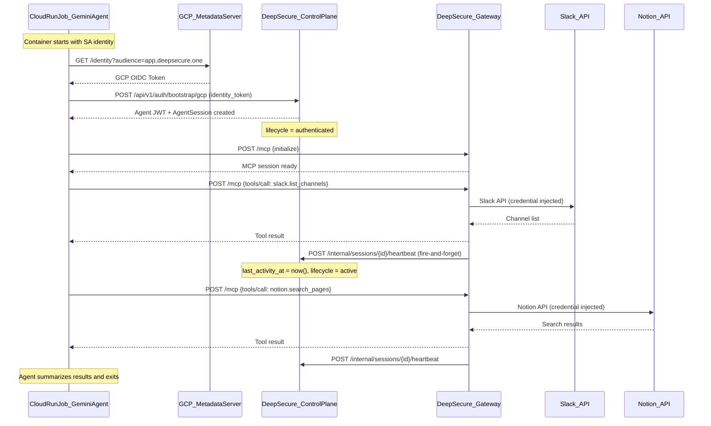

# Spec: GCP Background Agent Deployment

> **Status:** Draft
> **Author:** AI Assistant
> **Created:** May 19, 2026
> **Priority:** P4.5 — Post-P4 Validation (between P4 GCP Identity and P5 Vendor Platform)
> **Roadmap Phase:** Phase 2: Q3 2026 — GCP Experience
> **Priority Master:** [`plans/PRIORITY_MASTER.md`](../../plans/PRIORITY_MASTER.md)
> **Product Roadmap:** [`plans/PRODUCT_ROADMAP.md`](../../plans/PRODUCT_ROADMAP.md)
> **Design Doc:** [`docs/design/gcp-background-agent.md`](../design/gcp-background-agent.md)
> **Plan Source:** [`plans/gcp-background-agent-deployment_244d6b88.plan.md`](../../.cursor/plans/gcp-background-agent-deployment_244d6b88.plan.md)

---

## Priority & Roadmap Mapping

### Priority Master Mapping ([`plans/PRIORITY_MASTER.md`](../../plans/PRIORITY_MASTER.md))

This spec covers **P4.5 — GCP Background Agent Validation**, a new validation priority proving that P4's infrastructure works end-to-end with a real running agent.

| Priority Group | Coverage | Items in This Spec |
|---------------|----------|--------------------|
| **P4 (GCP Identity Provider)** | ⚠️ Bug fix | Fix `last_activity_at` propagation gap (gateway → control plane) discovered during P4 validation |
| **P4.5 (This spec)** | ✅ Full | Heartbeat endpoint, Gemini CLI agent container, Cloud Run Job deployment, lifecycle demo |
| **P5 (Vendor Platform)** | ❌ Not in scope | Org model, vault import — separate workstream |
| **P6 (Claude Code Integration)** | ⚠️ Partial overlap | This spec creates the Stdio-to-HTTP MCP adapter pattern that P6 will reuse |

### Product Roadmap Mapping ([`plans/PRODUCT_ROADMAP.md`](../../plans/PRODUCT_ROADMAP.md))

This spec delivers **Phase 2 validation** from the product roadmap.

| Roadmap Phase | Coverage | What This Spec Delivers |
|--------------|----------|------------------------|
| **Phase 2: Q3 2026 — GCP Experience** | ⚠️ Validation layer | Proves P4 GCP Identity works end-to-end with a real agent on Cloud Run |
| **Phase 3: Q3–Q4 2026 — Platform Expansion** | ⚠️ Architecture foundation | MCP adapter pattern reusable for P6 Claude Code + P5 vendor agents |
| **Phase 4: Q4 2026+ — AWS** | ❌ Not in scope | AWS-specific items deferred |

### Persona Capability Unlocked by This Spec

| Persona | Capability Unlocked |
|---------|---------------------|
| **Engineer / Developer** | Can deploy a real background agent on GCP that authenticates via Workload Identity and calls tools through DeepSecure — zero static keys |
| **Employee (Sarah)** | Can see agents reach "Active" state in the UI, proving the platform is working end-to-end |
| **Vendor Admin** | Architecture pattern for vendor agents connecting from their own GCP projects (cross-project bootstrap) |
| **IT Admin** | Full lifecycle visibility — agent transitions registered→delegated→authenticated→active are observable |

### What This Spec Unblocks

| Blocked Item | Needs | Covered By |
|--------------|-------|-----------|
| P5 vendor cross-project E2E test | Proof that GCP bootstrap + tool calls work from a deployed container | Phase 1 (heartbeat) + Phase 2 (agent container) |
| P6 Claude Code MCP proxy | Stdio-to-HTTP MCP adapter pattern | Phase 3 architecture (adapter design) |
| Demo reliability | Lifecycle never reaches "active" without heartbeat fix | Phase 1 (bug fix) |
| Sales demos | Live running agent making tool calls visible in UI | Phase 2 + Phase 3 (deployment) |

---

## Table of Contents

1. [Objective](#1-objective)
2. [Goals & Non-Goals](#2-goals--non-goals)
3. [Background](#3-background)
4. [Technical Design](#4-technical-design)
5. [Data Models](#5-data-models)
6. [API Contracts](#6-api-contracts)
7. [Security Considerations](#7-security-considerations)
8. [Project Structure](#8-project-structure)
9. [Testing Strategy](#9-testing-strategy)
10. [Demo Scenarios / User Journeys](#10-demo-scenarios--user-journeys)
11. [Rollout Plan](#11-rollout-plan)
12. [Boundaries](#12-boundaries)
13. [Dependencies & Risks](#13-dependencies--risks)
14. [Open Questions](#14-open-questions)
15. [References](#15-references)

---

## 1. Objective

Deploy a real background agent (Gemini CLI) on GCP Cloud Run that authenticates via DeepSecure's GCP Workload Identity bootstrap, calls real tools (Slack, Notion, Google Drive, Calendar, Gmail) through the DeepSecure gateway's MCP endpoint, and demonstrates the full lifecycle progression (registered → delegated → authenticated → active) visible in the production UI at `app.deepsecure.one`.

### User Stories / Acceptance Criteria

- As an **Engineer**, I want to deploy a background agent on Cloud Run that automatically authenticates with DeepSecure using its GCP service account identity — so that I never need to manage static keys for my agent.
- As an **Employee**, I want to see my agent transition to "Active" in the UI after it makes tool calls — so that I have confidence the agent is working.
- As a **Vendor Admin**, I want a reference architecture for deploying agents that connect to DeepSecure from my own GCP project — so that I can integrate my existing agents.

### Success Criteria

- [ ] `last_activity_at` on `agent_sessions` is updated when the gateway processes a `tools/call` (heartbeat propagation works)
- [ ] Gemini CLI container starts on Cloud Run, bootstraps via GCP Metadata Server, obtains Agent JWT, and successfully calls at least 1 tool through the gateway
- [ ] Agent lifecycle in the UI transitions from "Delegated" → "Authenticated" → "Active" without manual intervention
- [ ] All 5 service tool calls succeed: `slack.list_channels`, `notion.search_pages`, `gdrive.search_files`, `gcalendar.list_events`, `gmail.search_messages`
- [ ] Cloud Scheduler triggers the job every 6 hours; agent stays "Active" in the UI across multiple executions (verified after 12+ hours)
- [ ] The entrypoint loops through multiple tool calls with sleep intervals (not a single one-shot execution)

---

## 2. Goals & Non-Goals

### Goals

- [ ] Fix the `last_activity_at` propagation gap (gateway → control plane DB) so lifecycle can reach "active"
- [ ] Create a minimal, reproducible Gemini CLI agent container that demonstrates GCP Workload Identity → bootstrap → MCP tool calls
- [ ] Deploy as a Cloud Run Job that can be triggered on-demand for demos
- [ ] Document the architecture pattern so it can be replicated for Goose, Claude Code, or any MCP-compatible agent
- [ ] Prove the full four-state lifecycle works end-to-end in the production environment

### Non-Goals

- **Production agent orchestration** — This is a demo/validation, not a production-ready agent scheduling system. Deferred to P5 (Vendor Platform).
- **Multi-agent fleet management** — Running multiple agents concurrently is P10 (IT Admin Governance).
- **Claude Code / Goose integration** — Phase 2 documents the adapter pattern but implementation is P6.
- **Coding agent implementation** — Phase 2 specs the extensibility architecture but actual coding agent deployment (GitHub PRs, Linear tasks) is a future workstream.
- **Gateway session persistence** — The gateway's in-memory session management is fine; only `last_activity_at` needs propagation.
- **Always-on Cloud Run Service** — Persistent service with min-instances=1, health endpoint, and webhook triggers. Deferred to P5 (vendor reference architecture). The Cloud Run Job + Scheduler pattern is sufficient for P4.5 validation.

---

## 3. Background

### Current State

| Capability | Current Status | Notes |
|------------|----------------|-------|
| GCP Workload Identity bootstrap | ✅ Implemented | `POST /api/v1/auth/bootstrap/gcp` — validates OIDC token, creates AgentSession, issues JWT |
| Agent registration (platform) | ✅ Implemented | UI supports GCP Workload Identity method, creates attestation policy automatically |
| MCP Gateway (`/mcp` endpoint) | ✅ Implemented | Handles `initialize`, `tools/list`, `tools/call` with permission enforcement |
| Gateway deployed on Cloud Run | ✅ Deployed | Routed at `https://app.deepsecure.one/mcp/*` (lb.tf line 147) |
| Gateway → Control heartbeat | ❌ Missing | `backend_session.update_activity()` only updates in-memory; `agent_sessions.last_activity_at` in DB is never updated |
| Lifecycle "active" state | ❌ Broken | Requires `AgentSession.last_activity_at >= now - 24h` in DB; always null |
| Background agent on GCP | ❌ Missing | No agent container exists that bootstraps and calls tools |
| Gemini CLI + DeepSecure | ❌ Missing | No integration pattern documented or implemented |

### Motivation

1. **Lifecycle validation is broken.** The four-state lifecycle was designed in P2 and implemented — but no agent has ever transitioned from "authenticated" to "active" in production because the heartbeat propagation was never built. This undermines the entire lifecycle feature.

2. **The P4 GCP Identity feature has no end-to-end proof.** We implemented bootstrap, but never deployed an actual agent that uses it autonomously. Until a real container bootstraps itself from the GCP Metadata Server, the feature is unvalidated.

3. **Sales demos need a live agent.** The Sarah's Journey demo (`scripts/demo_sarah_journey.sh`) runs locally against containers. A live agent on `app.deepsecure.one` making real Slack/Notion calls is dramatically more compelling.

4. **Vendor integration pattern needs a reference.** P5 (Vendor Platform) requires vendors to deploy agents that connect to DeepSecure. This spec creates the reference implementation they'll follow.

---

## 4. Technical Design

### Services Affected

| Service | Impact | Changes |
|---------|--------|---------|
| deeptrail-control | Low | Add 1 internal endpoint (`/api/v1/internal/sessions/{agent_id}/heartbeat`) |
| deeptrail-gateway | Low | Add fire-and-forget heartbeat call after `tools/call` succeeds |
| frontend | None | No changes — lifecycle badges already handle "active" state |
| deepsecure (SDK) | None | No SDK changes |
| **New: agents/gemini/** | High | New Dockerfile, entrypoint, settings template |

### Architecture Overview



### Key Components

**1. Internal Heartbeat Endpoint** (`deeptrail-control/app/api/v1/endpoints/agents.py`)

```python
@router.post(
    "/internal/sessions/{agent_id}/heartbeat",
    status_code=204,
    include_in_schema=False,
)
async def session_heartbeat(
    agent_id: str,
    request: Request,
    db: Session = Depends(get_db),
):
    """Update last_activity_at for the agent's most recent active session.

    Called by the gateway after each successful tools/call.
    Authenticated via X-Internal-API-Token header.
    """
    internal_token = request.headers.get("X-Internal-API-Token")
    expected = settings.GATEWAY_INTERNAL_TOKEN
    if not internal_token or internal_token != expected:
        raise HTTPException(status_code=401, detail="Invalid internal token")

    session = (
        db.query(AgentSession)
        .filter(
            AgentSession.agent_id == agent_id,
            AgentSession.is_active.is_(True),
        )
        .order_by(AgentSession.created_at.desc())
        .first()
    )
    if session:
        session.touch()
        db.commit()
    return Response(status_code=204)
```

**2. Gateway Heartbeat Caller** (`deeptrail-gateway/app/mcp/handlers/tools_call.py`)

```python
import asyncio
import httpx

async def _send_heartbeat(control_plane_url: str, internal_token: str, agent_id: str):
    """Fire-and-forget heartbeat to control plane. Failures are logged, not raised."""
    try:
        async with httpx.AsyncClient(timeout=5.0) as client:
            await client.post(
                f"{control_plane_url}/api/v1/internal/sessions/{agent_id}/heartbeat",
                headers={"X-Internal-API-Token": internal_token},
            )
    except Exception as e:
        logger.warning("Heartbeat failed for agent %s: %s", agent_id, e)
```

Called after line 742 (`backend_session.update_activity()`):
```python
backend_session.update_activity()
asyncio.create_task(_send_heartbeat(
    settings.control_plane_url, settings.internal_api_token, agent_id
))
```

**3. Gemini CLI Agent Entrypoint** (`agents/gemini/entrypoint.sh`)

See §4.1 "P4.5 Entrypoint (looped)" above for the full implementation. The entrypoint:
1. Bootstraps with DeepSecure (GCP Metadata → OIDC → Agent JWT)
2. Writes `~/.gemini/settings.json` with the gateway MCP config
3. Loops through tool-call prompts with sleep intervals
4. Re-bootstraps periodically to refresh the JWT before expiry
5. Exits after `MAX_ITERATIONS` (or on SIGTERM from Cloud Run timeout)

### Architecture Decisions

| Decision | Options Considered | Chosen | Rationale |
|----------|--------------------|--------|-----------|
| Heartbeat mechanism | A: Periodic batch update, B: Per-call fire-and-forget, C: Gateway writes to shared DB | B: Per-call fire-and-forget | Non-blocking, uses existing internal token auth, immediate lifecycle update |
| Agent runtime | A: Goose (Rust), B: Claude Code (Node), C: Gemini CLI (Node) | C: Gemini CLI | Only agent with native `httpUrl` MCP transport — no adapter needed |
| Deployment model (P4.5) | A: Cloud Run Job (one-shot), B: Cloud Run Job (looped + scheduled), C: Cloud Run Service (persistent) | B: Cloud Run Job (looped) + Cloud Scheduler | Keeps agent "active" continuously (~$0/month), no always-on cost, proves background agent pattern. See §4.1 Deployment Strategy. |
| Deployment model (P5) | Same as above | C: Cloud Run Service (persistent) | Vendors expect always-on, webhook-capable, zero cold start. Upgrade path from P4.5. |
| Container location | A: `deepsecure-agents/` repo, B: `deepsecure-mvp/agents/`, C: `deepsecure-mvp/examples/` | B: `deepsecure-mvp/agents/gemini/` | Single repo for now; moves to separate repo at P5 scale |
| Gemini API key storage | A: GCP Secret Manager, B: Direct env var | A: GCP Secret Manager | Consistent with existing secrets pattern (`infra/terraform/secrets.tf`) |
| MCP transport | A: Stdio (local proxy), B: SSE, C: Streamable HTTP (`httpUrl`) | C: Streamable HTTP | Direct connection to gateway — no proxy needed |

### 4.1 Deployment Strategy: Two-Phase Approach

**Phase 1 (P4.5): Cloud Run Job + Cloud Scheduler**

The agent runs as a Cloud Run Job triggered by Cloud Scheduler every 6 hours. Each execution loops through tool calls for ~30 minutes, then exits. Since the lifecycle "active" threshold is 24 hours, triggering every 6 hours keeps the agent permanently "active" in the UI.

```
Cloud Scheduler (every 6h)
    │
    ▼
Cloud Run Job (max 30 min)
    │
    ├── Bootstrap (OIDC → Agent JWT)
    ├── Configure Gemini CLI MCP settings
    ├── LOOP (6 iterations × 5 min interval):
    │     ├── gemini -p "<PROMPTS[i]>"  (see §4.2 Prompt Design below)
    │     ├── sleep 300
    │     └── (re-bootstrap every 10 iterations for JWT refresh)
    └── Exit cleanly
```

Each iteration runs one prompt from the PROMPTS array (§4.2), which mirrors the Sarah's Journey demo ACT 5:
- Iteration 1: Notion — search pages + read first result
- Iteration 2: Slack — list channels + read history + post message
- Iteration 3: Gmail — search unread emails
- Iteration 4: Google Drive — search recent files
- Iteration 5: Google Calendar — list today's events
- Iteration 6: Cross-service summary (Slack + Notion + Gmail in one prompt)

| Property | Value |
|----------|-------|
| Trigger | Cloud Scheduler: `0 */6 * * *` (every 6 hours) |
| Task timeout | 2400s (40 min — allows 30 min loop + buffer) |
| Max iterations | 6 (rotate through 5 service tools + 1 summary) |
| Sleep interval | 300s (5 minutes between tool calls) |
| JWT refresh | Re-bootstrap every 50 min (before 1h expiry) |
| Cost | ~$0/month (within free tier: 6 runs × 30 min × 0.25 vCPU) |
| Active state | Permanent — `last_activity_at` refreshed every 6h, threshold is 24h |

**Phase 2 (P5): Cloud Run Service (Persistent)**

Upgrade to an always-on service when vendor reference architecture requires:
- Incoming HTTP endpoint for on-demand prompts/webhooks
- Zero cold start (min-instances=1)
- Continuous heartbeat (not just every 6h)
- WebSocket/SSE for real-time status

| Property | Value |
|----------|-------|
| min-instances | 1 |
| Port | 8080 (health + trigger endpoint) |
| Cost | ~$10-15/month (idle min-instance) |
| JWT refresh | Background thread, re-bootstrap every 50 min |
| Active state | Continuous — heartbeat every 5 min |

**Why entrypoint.sh is required (both phases):**

Gemini CLI cannot bootstrap with DeepSecure on its own. The entrypoint script bridges three systems that don't know about each other:

1. **GCP Metadata Server** — provides OIDC tokens (GCP-specific API)
2. **DeepSecure Control Plane** — exchanges OIDC token for Agent JWT (custom API)
3. **Gemini CLI** — needs a pre-configured `settings.json` with the JWT already injected

No amount of Gemini CLI configuration can replace this glue — DeepSecure bootstrap is a custom protocol, not standard OAuth. The entrypoint is the minimal adapter that makes a generic AI agent (Gemini CLI) work with our identity system.

**P4.5 Entrypoint (looped):**

```bash
#!/bin/bash
set -euo pipefail

CONTROL_URL="${DEEPSECURE_CONTROL_URL:-https://app.deepsecure.one}"
GATEWAY_URL="${DEEPSECURE_GATEWAY_URL:-https://app.deepsecure.one/mcp}"
INTERVAL="${AGENT_INTERVAL_SECONDS:-300}"
MAX_ITERATIONS="${AGENT_MAX_ITERATIONS:-6}"

bootstrap() {
  GCP_TOKEN=$(curl -sf -H "Metadata-Flavor: Google" \
    "http://metadata.google.internal/computeMetadata/v1/instance/service-accounts/default/identity?audience=${CONTROL_URL}")

  BOOTSTRAP_RESPONSE=$(curl -sf -X POST "${CONTROL_URL}/api/v1/auth/bootstrap/gcp" \
    -H "Content-Type: application/json" \
    -d "{\"identity_token\": \"${GCP_TOKEN}\"}")

  AGENT_JWT=$(echo "$BOOTSTRAP_RESPONSE" | jq -r '.access_token')
  AGENT_ID=$(echo "$BOOTSTRAP_RESPONSE" | jq -r '.agent_id')
  echo "[DeepSecure] Bootstrapped as ${AGENT_ID}"

  mkdir -p ~/.gemini
  cat > ~/.gemini/settings.json <<EOF
{
  "mcpServers": {
    "deepsecure": {
      "url": "${GATEWAY_URL}",
      "type": "http",
      "headers": { "Authorization": "Bearer ${AGENT_JWT}" },
      "trust": true,
      "timeout": 30000
    }
  }
}
EOF
}

# Initial bootstrap
bootstrap

# Prompts mirror the Sarah's Journey demo (scripts/demo_sarah_journey.sh ACT 5):
#   Pattern: discover → read → write for each service
#   Tool names must match exactly what the gateway exposes via tools/list
PROMPTS=(
  # Iteration 1: Notion — search docs, read content
  "You have access to tools via the deepsecure MCP server. Call notion.search_pages with query 'strategy' and limit 5. For each result, show the page title and ID. Then pick the first result and call notion.read_page with that page_id to read its properties."

  # Iteration 2: Slack — list channels, read history, post update
  "You have access to tools via the deepsecure MCP server. Call slack.list_channels with limit 10 and types 'public_channel'. Pick the first channel and call slack.get_channel_history with that channel ID and limit 5 to read the last 5 messages. Then call slack.send_message to post '[DeepSecure Agent] Daily sync complete' to that channel."

  # Iteration 3: Gmail — search recent emails
  "You have access to tools via the deepsecure MCP server. Call gmail.search_messages with query 'is:unread' and limit 5. List the sender and subject of each email found."

  # Iteration 4: Google Drive — search recent files
  "You have access to tools via the deepsecure MCP server. Call gdrive.search_files with query 'quarterly report' and limit 5. List the file name, type, and last modified date for each result."

  # Iteration 5: Google Calendar — list today's events
  "You have access to tools via the deepsecure MCP server. Call gcalendar.list_events with calendar_id 'primary' and limit 5. Summarize each event: title, start time, and attendees."

  # Iteration 6: Cross-service summary
  "You have access to tools via the deepsecure MCP server. First call slack.list_channels (limit 3), then call notion.search_pages with query 'meeting notes' (limit 3), then call gmail.search_messages with query 'action items' (limit 3). Write a brief summary of what you found across all three services."
)

iteration=0
while [ $iteration -lt $MAX_ITERATIONS ]; do
  prompt_idx=$((iteration % ${#PROMPTS[@]}))
  PROMPT="${PROMPTS[$prompt_idx]}"

  echo "[DeepSecure] Iteration $((iteration+1))/$MAX_ITERATIONS"
  gemini -p "$PROMPT" || echo "[DeepSecure] Prompt failed, continuing..."

  iteration=$((iteration + 1))

  if [ $iteration -lt $MAX_ITERATIONS ]; then
    echo "[DeepSecure] Sleeping ${INTERVAL}s..."
    sleep "$INTERVAL"
  fi

  # Re-bootstrap every 10 iterations (~50 min) to refresh JWT
  if [ $((iteration % 10)) -eq 0 ] && [ $iteration -lt $MAX_ITERATIONS ]; then
    echo "[DeepSecure] Refreshing JWT..."
    bootstrap
  fi
done

echo "[DeepSecure] Completed $MAX_ITERATIONS iterations. Exiting."
```

### 4.2 Prompt Design: Mapping to Sarah's Journey Demo

The prompts are designed to mirror the exact tool call patterns proven in `scripts/demo_sarah_journey.sh` (ACT 5), adapted for LLM-driven execution:

| Iteration | Service | Pattern | Sarah's Journey Equivalent | What It Proves |
|-----------|---------|---------|---------------------------|----------------|
| 1 | Notion | search → read | Steps 5.3 + 5.4 (`notion.search_pages` → `notion.read_page`) | Credential injection for Notion OAuth |
| 2 | Slack | list → read → write | Steps 5.7 + 5.8 + 5.9 (`slack.list_channels` → `get_channel_history` → `send_message`) | Full read/write Slack flow |
| 3 | Gmail | search | Step 5.G4 (`gmail.search_messages`) | Google OAuth token injection |
| 4 | Google Drive | search | Step 5.G1 (`gdrive.search_files`) | Google Drive OAuth token injection |
| 5 | Google Calendar | list events | Step 5.G3 (`gcalendar.list_events`) | Calendar OAuth token injection |
| 6 | Cross-service | multi-service summary | ACT 5 combined (all services) | Agent orchestrates across services |

**Prompt design principles:**

1. **Explicit tool names** — Prompts name the exact tools (`notion.search_pages`, not "search Notion") to reduce LLM non-determinism. The LLM can still fail to call the right tool, but explicit naming maximizes success rate.
2. **Realistic queries** — "strategy", "quarterly report", "is:unread", "meeting notes" — not synthetic test data.
3. **Discover → Read → Write pattern** — Same escalating permission pattern as Sarah's Journey: prove search works, then prove read works, then prove write works.
4. **Iteration 6 is multi-service** — Proves the agent can orchestrate across multiple backends in a single prompt, which is the core DeepSecure value prop.

**Permission requirements (delegation must include):**

| Service | Permissions Needed | Tool Names |
|---------|-------------------|------------|
| Notion | `notion:pages:search`, `notion:pages:read` | `notion.search_pages`, `notion.read_page` |
| Slack | `slack:channels:list`, `slack:messages:read`, `slack:messages:send` | `slack.list_channels`, `slack.get_channel_history`, `slack.send_message` |
| Gmail | `gmail:messages:search` | `gmail.search_messages` |
| Google Drive | `gdrive:files:search` | `gdrive.search_files` |
| Google Calendar | `gcalendar:events:list` | `gcalendar.list_events` |

---

## 5. Data Models

### No new models or schema changes.

The heartbeat endpoint writes to the existing `agent_sessions` table:

| Column | Type | Usage in This Spec |
|--------|------|-------------------|
| `last_activity_at` | `DateTime(timezone=True)` nullable | Updated by heartbeat endpoint via `session.touch()` |
| `is_active` | `Boolean` NOT NULL | Filtered in heartbeat query to find active sessions |
| `agent_id` | `String(128)` NOT NULL | Used to look up the agent's session |
| `created_at` | `DateTime(timezone=True)` NOT NULL | Used for ordering (most recent session) |

No Alembic migration required — the column already exists but is simply never updated in production.

### Configuration (New Secret)

```yaml
# GCP Secret Manager
gemini-api-key:
  description: "Gemini API key for background agent (free tier)"
  used_by: "Cloud Run Jobs: *-deepsecure-agent-job"
```

---

## 6. API Contracts

### Endpoint Summary

| Method | Endpoint | Purpose | Auth |
|--------|----------|---------|------|
| POST | `/api/v1/internal/sessions/{agent_id}/heartbeat` | Update session activity timestamp | X-Internal-API-Token header |

### POST /api/v1/internal/sessions/{agent_id}/heartbeat

> **Note:** This is an internal endpoint. Not included in OpenAPI schema (`include_in_schema=False`).

**Request:**
```
X-Internal-API-Token: <gateway-internal-secret-token>
Content-Type: application/json
```

No request body required.

**Response (204 No Content):**
Empty body. Session `last_activity_at` updated.

**Response (401 Unauthorized):**
```json
{
  "detail": "Invalid internal token"
}
```

**Response (204 even if no session found):**
If no active session exists for the agent, the endpoint returns 204 silently (no error — the heartbeat is best-effort).

**Error Responses:**

| Status | Condition |
|--------|-----------|
| 204 | Success (session updated or no session to update) |
| 401 | Missing or invalid `X-Internal-API-Token` header |
| 422 | Invalid `agent_id` format |

---

## 7. Security Considerations

### Internal API Authentication

The heartbeat endpoint is internal-only (gateway-to-control). It uses the same `GATEWAY_INTERNAL_TOKEN` mechanism used for other gateway-to-control calls (credential refresh, JIT reassembly).

- Token is stored in GCP Secret Manager (`gateway-internal-token`)
- Passed via `X-Internal-API-Token` header (not Bearer auth — distinguishes from user/agent tokens)
- Endpoint is not included in the OpenAPI schema (not discoverable)
- Endpoint only writes `last_activity_at` — cannot escalate permissions or read sensitive data

### Agent JWT Lifecycle

The Gemini CLI agent's JWT has a 1-hour TTL (set in `bootstrap_gcp_agent()`). For one-shot Cloud Run Jobs that complete in under 5 minutes, this is more than sufficient. For future always-on agents, JWT refresh logic would need to be added to the entrypoint.

### GCP Workload Identity Trust

The agent container runs with a `{slug}-sa` service account (e.g., `debugging-sa`). The trust chain:
1. GCP guarantees the Metadata Server only issues tokens for the attached service account
2. DeepSecure validates the OIDC token against Google's JWKS and extracts the service account email
3. The email matches the registered `selector` in the agent's registration
4. The attestation policy confirms this selector is authorized

No static credentials are stored in the container image or environment variables (except the Gemini API key, which is for the LLM, not for DeepSecure).

---

## 8. Project Structure

### Workstream A: Heartbeat Propagation (Control Plane + Gateway)

| File | Action | Purpose |
|------|--------|---------|
| `deeptrail-control/app/api/v1/endpoints/agents.py` | Modify | Add `POST /internal/sessions/{agent_id}/heartbeat` endpoint |
| `deeptrail-gateway/app/mcp/handlers/tools_call.py` | Modify | Add fire-and-forget heartbeat call after successful tool execution |
| `deeptrail-gateway/app/core/config.py` | Verify | Confirm `control_plane_url` and `internal_api_token` are available |
| `deeptrail-control/tests/api/v1/test_heartbeat.py` | Create | Unit tests for heartbeat endpoint |
| `deeptrail-gateway/tests/mcp/handlers/test_heartbeat_propagation.py` | Create | Test heartbeat is called after tools/call |

### Workstream B: Gemini CLI Agent Container

| File | Action | Purpose |
|------|--------|---------|
| `agents/gemini/Dockerfile` | Create | Container image: Node.js + Gemini CLI + curl + jq |
| `agents/gemini/entrypoint.sh` | Create | Looped bootstrap → configure → call tools → sleep → repeat |
| `agents/gemini/README.md` | Create | Setup, local testing, and deployment instructions |

### Workstream C: GCP Deployment + Scheduling

| File | Action | Purpose |
|------|--------|---------|
| `infra/terraform/secrets.tf` | Modify | Add `gemini-api-key` secret |
| `infra/deploy-agent.sh` | Create | Script to build, push, create Cloud Run Job, create Cloud Scheduler trigger |

### Complexity Estimates

| Workstream | Complexity | Rationale |
|------------|------------|-----------|
| WS-A: Heartbeat | S (2-3 hours) | 1 endpoint + 1 async call + tests |
| WS-B: Agent Container | M (3-4 hours) | Dockerfile + entrypoint logic + MCP config + testing |
| WS-C: Deployment | S (1-2 hours) | Terraform secret + deploy script + Cloud Run Job creation |

---

## 9. Testing Strategy

### Test Matrix

| Level | What | Location | Framework |
|-------|------|----------|-----------|
| Unit | Heartbeat endpoint (control plane) | `deeptrail-control/tests/api/v1/test_heartbeat.py` | pytest |
| Unit | Heartbeat call in gateway | `deeptrail-gateway/tests/mcp/handlers/test_heartbeat_propagation.py` | pytest + respx |
| Integration | Full bootstrap → tool call → heartbeat → lifecycle check | `tests/e2e/test_agent_lifecycle_active.py` | pytest + httpx |
| E2E | Cloud Run Job execution → UI lifecycle update | Manual (deploy + verify in UI) | gcloud + curl |

### Key Test Scenarios

- [ ] Heartbeat endpoint updates `last_activity_at` on the most recent active session
- [ ] Heartbeat endpoint returns 204 even if no session exists (graceful no-op)
- [ ] Heartbeat endpoint rejects invalid internal tokens with 401
- [ ] Gateway sends heartbeat asynchronously (does not block tool response)
- [ ] Gateway continues normally even if heartbeat fails (fire-and-forget)
- [ ] After heartbeat, `lifecycle_state` computation returns "active" for the agent
- [ ] Gemini CLI successfully discovers tools via DeepSecure MCP server
- [ ] Gemini CLI can call `slack.list_channels` and receive real Slack data

### Technical Requirements

| Requirement | Correct Pattern | Common Mistake |
|-------------|-----------------|----------------|
| Async fixtures | `@pytest_asyncio.fixture` | `@pytest.fixture` (breaks async) |
| HTTP mocking (gateway) | `respx` for httpx mocking | Calling live control plane in unit tests |
| Fire-and-forget testing | `asyncio.gather` with timeout | Forgetting to await the background task in tests |

### Coverage Requirements

- Heartbeat endpoint: 100% coverage (critical path)
- Gateway heartbeat call: assertion that task is created (not response content)
- Agent container: manual E2E only (no unit tests for shell scripts)

---

## 10. Demo Scenarios / User Journeys

### Scenario 1: Engineer — Deploy Background Agent on GCP

**Persona:** Dev, deploying an AI agent that searches Slack and Notion
**Pre-conditions:** Agent registered in UI as `debugging-sa@deepsecure-saas.iam.gserviceaccount.com`, delegation active with Slack + Notion + GDrive + GCal + Gmail permissions

| Step | Action | Expected Result | Validates |
|------|--------|-----------------|-----------|
| 1 | Run `gcloud run jobs execute debugging-deepsecure-agent-job` | Job starts, container pulls image | Cloud Run Job works |
| 2 | Container fetches OIDC token from Metadata Server | Token obtained (audience=app.deepsecure.one) | GCP identity flow |
| 3 | Container calls `POST /api/v1/auth/bootstrap/gcp` | Returns `access_token` + `agent_id` | Bootstrap endpoint |
| 4 | Container configures Gemini CLI with DeepSecure MCP | `~/.gemini/settings.json` written | MCP config |
| 5 | Gemini CLI runs first prompt, calls `slack.list_channels` | Real Slack channels returned | Gateway tool execution |
| 6 | Gateway sends heartbeat to control plane | `last_activity_at` updated in DB | Heartbeat propagation |
| 7 | Container sleeps 5 min, then runs next prompt | `notion.search_pages` called | Looped execution works |
| 8 | After 6 iterations (~30 min), container exits cleanly | Exit code 0 | Graceful shutdown |
| 9 | Cloud Scheduler triggers again in 6 hours | Job re-runs, agent stays "active" | Persistent activation |
| 10 | Check UI: agent shows "Active" badge (next day) | Green "Active" lifecycle badge persists | Lifecycle stays active across runs |

**Success criteria:**
```bash
# Trigger the job manually (first time)
gcloud run jobs execute debugging-deepsecure-agent-job --region=us-central1

# Verify lifecycle (within 60s of first tool call)
curl -s https://app.deepsecure.one/api/v1/agents/{agent_id} \
  -H "Authorization: Bearer $USER_TOKEN" | jq '.lifecycle_state'
# Expected: "active"

# Verify Cloud Scheduler is set up
gcloud scheduler jobs describe gemini-agent-trigger --location=us-central1
# Expected: schedule = "0 */6 * * *"

# Verify agent is STILL active 12 hours later (after 2 scheduler triggers)
curl -s https://app.deepsecure.one/api/v1/agents/{agent_id} \
  -H "Authorization: Bearer $USER_TOKEN" | jq '.lifecycle_state'
# Expected: "active" (last_activity_at < 24h)
```

### Scenario 2: Employee — Observe Agent Activity in UI

**Persona:** Sarah, checking on her agent's status
**Pre-conditions:** Agent deployed and triggered

| Step | Action | Expected Result | Validates |
|------|--------|-----------------|-----------|
| 1 | Navigate to Agents page | See agent with "Active" badge | Lifecycle badge |
| 2 | Click agent → Activity tab | See session history with recent activity | Session tracking |
| 3 | Check audit trail | See tool call events attributed to agent | Audit attribution |

### Scenario 3: Error Case — Agent With No Delegation

**Persona:** Engineer deploying an agent before configuring permissions
**Pre-conditions:** Agent registered but no delegation created

| Step | Action | Expected Result | Validates |
|------|--------|-----------------|-----------|
| 1 | Container bootstraps successfully | JWT issued (bootstrap doesn't require delegation) | Bootstrap independence |
| 2 | Container calls `tools/list` via gateway | Empty tool list (no permissions) | Permission enforcement |
| 3 | Container calls `tools/call` | Error: permission denied | Fail-closed behavior |
| 4 | Lifecycle stays "authenticated" (not "active") | No heartbeat sent (no successful tool call) | Correct lifecycle |

---

## 11. Rollout Plan

### Phase 1: Heartbeat Fix (WS-A) — ~3 hours

**Tasks:** Add heartbeat endpoint + gateway async call + tests
**Duration:** 1 session
**Deliverable:** `last_activity_at` updates on tool calls; lifecycle can reach "active"
**Demo impact:** Existing Sarah's Journey demo (local) can now show "active" state
**Deployment:** `build-and-push.sh deeptrail-control deeptrail-gateway && deploy.sh deeptrail-control deeptrail-gateway`

### Phase 2: Agent Container (WS-B) — ~4 hours

**Tasks:** Dockerfile, looped entrypoint, settings template, README
**Duration:** 1 session
**Deliverable:** Working container image that bootstraps, loops through tool calls, and sleeps between iterations
**Demo impact:** Can run locally with `docker run` against production; agent stays "active" for the duration

### Phase 3: GCP Deployment + Scheduling (WS-C) — ~2 hours

**Tasks:** Secret Manager entry, deploy script, Cloud Run Job creation, Cloud Scheduler job (every 6h)
**Duration:** 1 session
**Deliverable:** Live background agent on GCP that runs every 6 hours, keeping lifecycle permanently "active"
**Demo impact:** Open the UI at any time and see the agent as "Active" — no manual triggering needed

**Cloud Scheduler setup:**
```bash
gcloud scheduler jobs create http gemini-agent-trigger \
  --location=us-central1 \
  --schedule="0 */6 * * *" \
  --uri="https://us-central1-run.googleapis.com/apis/run.googleapis.com/v1/namespaces/deepsecure-saas/jobs/debugging-deepsecure-agent-job:run" \
  --http-method=POST \
  --oauth-service-account-email=debugging-sa@deepsecure-saas.iam.gserviceaccount.com
```

### Phase 4 (Future, P5): Persistent Cloud Run Service

**Tasks:** Add HTTP health endpoint, convert to Cloud Run Service with `min-instances=1`, add webhook trigger endpoint
**Deliverable:** Always-on agent that vendors can use as reference architecture
**Why upgrade:** Vendors expect agents to be always-on, respond to webhooks, and have zero cold starts. The Job+Scheduler pattern is sufficient for internal validation but doesn't demonstrate the production deployment model customers will use.

| P4.5 (Job + Scheduler) | P5 (Service) |
|-------------------------|--------------|
| Runs every 6h for ~30 min | Always running |
| ~$0/month | ~$10-15/month |
| No incoming HTTP | Health endpoint + trigger endpoint |
| Active state via periodic heartbeat | Continuous heartbeat every 5 min |
| `gcloud run jobs execute` to trigger | HTTP POST to trigger on-demand prompts |

### Phase 5 (Future): Coding Agent Expansion

**Tasks:** Add GitHub/Linear MCP tools, expand delegation, coding-specific prompts
**Deliverable:** Agent that opens PRs, reviews code, updates Linear tasks
**Note:** Deferred — spec the extensibility architecture but don't implement yet

---

## 12. Boundaries

### Always Do

- Use fire-and-forget for heartbeat (never block tool responses)
- Log heartbeat failures as warnings (never crash on heartbeat error)
- Validate internal token on heartbeat endpoint (never accept unauthenticated writes)
- Use GCP Secret Manager for API keys (never hardcode in container image)

### Ask First

- Adding new MCP transport types (SSE, WebSocket) to the gateway
- Changing the heartbeat frequency (currently per-call; batching would be a design change)
- Creating a persistent Cloud Run Service instead of a Job
- Adding JWT refresh logic to the entrypoint (changes the trust model)

### Never Do

- Store the Agent JWT in a persistent location (it's ephemeral, 1-hour TTL)
- Make heartbeat synchronous/blocking (would add latency to every tool call)
- Include the Gemini API key in the container image (use Secret Manager mount)
- Skip internal token validation on the heartbeat endpoint

---

## 13. Dependencies & Risks

### External Dependencies

| Dependency | Risk | Mitigation |
|------------|------|------------|
| Gemini CLI npm package | Package rename/deprecation | Pin specific version in Dockerfile |
| Gemini API free tier limits | 60 req/min, 1000 req/day | Sufficient for demos; upgrade key if needed |
| GCP Metadata Server availability | Standard GCP infra, highly reliable | No mitigation needed |
| DeepSecure gateway deployed | Already deployed at `app.deepsecure.one/mcp` | Verify health before Job execution |
| Active OAuth tokens in vault | Slack/Notion/GDrive tokens must be fresh | User must have connected services in UI |

### Risks

| Risk | Probability | Impact | Mitigation |
|------|-------------|--------|------------|
| Gemini CLI doesn't support `httpUrl` correctly | Low | High | Tested in research; fall back to local stdio proxy if broken |
| OAuth tokens expired in vault | Medium | Medium | User re-connects services in UI before demo |
| Gateway `/mcp` routing broken | Low | High | Already validated in Sarah's Journey demo |
| Cloud Run Job cold start too slow | Low | Low | Agent has 5-minute timeout; cold start is ~5s |
| Heartbeat adds latency to tool calls | Low | Medium | Fire-and-forget pattern — measured at <5ms overhead |

---

## 14. Open Questions

- [x] **Where does agent code live?** → `deepsecure-mvp/agents/gemini/` (single repo for now)
- [x] **Gemini API key storage?** → GCP Secret Manager (consistent with other secrets)
- [ ] **Should heartbeat be batched?** → Start with per-call; measure latency; batch if >10ms overhead
- [ ] **Does the delegation cover all 5 services?** → Verify current delegation; update in UI if needed
- [ ] **Phase 2 coding agent scope?** → Deferred; just document extensibility architecture

---

## 14.5. Assumptions & Shortcuts (Pre-Implementation Audit)

> **Purpose:** Catalog every assumption made during spec creation. Items marked ✅ Verified have been checked against the actual codebase or official docs. Items marked ⚠️ Unverified need validation before or during implementation.

### Gemini CLI Assumptions

| # | Assumption | Verified? | Finding |
|---|-----------|-----------|---------|
| 1 | **`httpUrl` transport with custom headers** | ✅ Verified | Official docs confirm `httpUrl` is supported with `headers` object. Also `url` field (new unified config) works. Both support custom `Authorization` headers. Ref: [gemini-cli docs](https://google-gemini.github.io/gemini-cli/docs/tools/mcp-server.html) |
| 2 | **`gemini -p` runs non-interactively** | ✅ Verified | `-p` (or `--prompt`) is the official headless mode flag. Returns structured output. Required since Jan 2026 breaking change. |
| 3 | **npm package name** | ✅ CORRECTED | Actual package: `@google/gemini-cli` (NOT `@anthropic-ai/gemini-cli` or `gemini`). Spec §4 Dockerfile had wrong fallback. Current stable: v0.42.0. |
| 4 | **Tool auto-discovery** | ✅ Verified | Gemini CLI calls `tools/list` on MCP servers during startup automatically via `discoverMcpTools()`. No manual tool registration needed. |
| 5 | **`~/.gemini/settings.json` location** | ✅ Verified | Correct path. Can also be overridden with `GEMINI_CLI_HOME` (which appends `.gemini/`). Project-level `.gemini/settings.json` also works. |
| 6 | **Accept header issue (Issue #20018)** | ✅ Resolved | Fixed in PR #20172 (merged Feb 25, 2026). Gemini CLI now sends `Accept: application/json, text/event-stream`. Our gateway doesn't enforce this header anyway. |
| 7 | **`httpUrl` vs `url` field** | ⚠️ Migration in progress | PR #13762 unified `httpUrl`/`url` into just `url` with optional `type: "http"`. Both work currently but `httpUrl` may be deprecated. Should use `url` + `type: "http"` for future-proofing. |

### Gateway Architecture Assumptions

| # | Assumption | Verified? | Finding |
|---|-----------|-----------|---------|
| 8 | **`backend_session.update_activity()` is on line 742** | ✅ Verified (BUT only in mock path) | Line 742 is in the **MVP mock path** (lines 732-755), not the production path (lines 722-730). Production path returns from `_backend_client.call_tool()` at line 724 and never reaches `update_activity()`. **CRITICAL: heartbeat must be added in BOTH paths — after line 730 for production and after line 742 for mock.** |
| 9 | **`settings.control_plane_url` exists** | ⚠️ WRONG config object | Two separate config systems exist: `GatewaySettings` (in `app/core/config.py`) has `control_plane_url`, and `ProxyConfig` (in `app/core/proxy_config.py`) also has `control_plane_url`. The `tools_call.py` handler does NOT currently import either. Must import from `proxy_config` (which is used by the MCP/credential layer). |
| 10 | **`settings.internal_api_token` exists** | ⚠️ WRONG attribute name in spec | The field is `internal_api_token` in `ProxyConfig` (env var: `GATEWAY_INTERNAL_API_TOKEN`). The spec's heartbeat code references `settings.internal_api_token` but `tools_call.py` doesn't have access to any `settings` object. Must import/inject the config. |
| 11 | **`agent_id` available in handler scope** | ✅ Verified | Line 282: `agent_id = context.get("agent_id", agent_session_id)`. Available throughout the handler function scope. |
| 12 | **Fire-and-forget `asyncio.create_task` safe** | ⚠️ Needs care | FastAPI/Starlette does not cancel background tasks when response is sent, but orphaned tasks can be GC'd if not referenced. Should store task reference or use Starlette `BackgroundTasks`. |
| 13 | **One heartbeat per `tools/call` is acceptable** | ⚠️ Shortcut | A single prompt can generate 5-20 tool calls in rapid succession → 5-20 DB writes in seconds. Acceptable at demo scale. Add TODO for rate-limiting/deduplication at production scale. |
| 14 | **Heartbeat placement after "line 742"** | ⚠️ Incorrect assumption | The production path (line 724) returns the result directly from `_backend_client.call_tool()`. The heartbeat needs to be placed **after the successful result is obtained but before it's returned** — meaning we need to restructure the production path to capture the result, send heartbeat, then return. |

### Control Plane Assumptions

| # | Assumption | Verified? | Finding |
|---|-----------|-----------|---------|
| 15 | **`AgentSession.touch()` exists** | ✅ Verified | Confirmed in `app/models/agent_session.py` — updates `last_activity_at = func.now()`. |
| 16 | **Token setting: `settings.GATEWAY_INTERNAL_TOKEN`** | ✅ CORRECTED | Actual name: `settings.GATEWAY_INTERNAL_API_TOKEN` (note the `_API_` in the middle). Spec §4 heartbeat code sample is wrong. |
| 17 | **Heartbeat returns 204 silently on no-session** | ✅ Design shortcut | Intentional best-effort design. Risk: masks bugs where sessions aren't created. Add metric/log "heartbeat with no session found" for observability. |
| 18 | **`include_in_schema=False` hides the endpoint** | ✅ Verified pattern | Used by existing internal endpoints (see `app/api/v1/endpoints/internal.py`). Still reachable via URL — security relies on `X-Internal-API-Token` header. |
| 19 | **No Alembic migration needed** | ⚠️ Needs prod DB check | `last_activity_at` exists in the model. Assumed present in production DB. Should verify with `SELECT column_name FROM information_schema.columns WHERE table_name='agent_sessions'` against prod. |
| 20 | **Reuse existing internal auth pattern** | ✅ Verified | `app/api/v1/endpoints/internal.py` already has `verify_internal_api_key` dependency using `APIKeyHeader(name="X-Internal-API-Token")`. Heartbeat endpoint should reuse this rather than inline validation as shown in spec §4 code. |

### GCP Infrastructure Assumptions

| # | Assumption | Verified? | Finding |
|---|-----------|-----------|---------|
| 21 | **`{slug}-sa` IAM roles** | ⚠️ Unverified | Needs: `roles/run.invoker` (to be triggered by `gcloud run jobs execute`), `roles/secretmanager.secretAccessor` (for Gemini API key). Not documented whether already granted. |
| 22 | **Cloud Run Job egress** | ✅ Likely OK | Cloud Run Jobs have outbound internet by default (no VPC connector needed). `app.deepsecure.one` is a public endpoint. |
| 23 | **Metadata Server audience format** | ⚠️ Sensitive | Earlier debugging confirmed audience must be `https://app.deepsecure.one` (with protocol prefix). The entrypoint uses `${CONTROL_URL}` which defaults to `https://app.deepsecure.one`. Must ensure no trailing slash mismatch. |
| 24 | **`gemini-api-key` secret doesn't exist** | ⚠️ Unverified | May already exist from manual creation. Terraform will error on `google_secret_manager_secret` if it does. Use `terraform import` or check with `gcloud secrets list` first. |
| 25 | **Region: `us-central1`** | ⚠️ Shortcut | Assumed everywhere. Must confirm Artifact Registry and Cloud Run service regions match. |

### Demo & Validation Shortcuts

| # | Assumption | Verified? | Finding |
|---|-----------|-----------|---------|
| 26 | **OAuth tokens for all 5 services are fresh** | ⚠️ Unverified | Google tokens (GDrive, GCal, Gmail) expire after 1 hour unless refresh tokens are stored and working. Slack + Notion tokens are longer-lived. Must verify vault has valid refresh tokens or re-connect services in UI before demo. |
| 27 | **Tool names match gateway** | ⚠️ Unverified | Spec assumes `slack.list_channels`, `notion.search_pages`, etc. Must verify against actual `tools/list` response from gateway for the agent's delegation. |
| 28 | **Delegation covers all 5 services** | ⚠️ Open question | Current delegation for `debugging-deepsecure-agent` may only have a subset of services. Must check/update in UI before demo. |
| 29 | **30-second completion target** | ⚠️ Optimistic | Bootstrap ~2s + MCP init ~1s + 5 tool calls ~10s + LLM processing ~15-30s = likely 30-45s total. Cloud Run Job timeout (5 min) is safe, but "30 seconds" success criterion should be relaxed to "60 seconds". |
| 30 | **LLM calls correct tools** | ⚠️ Non-deterministic | LLM behavior is non-deterministic. Prompt should be explicit: "Call these specific tools in order: 1) slack.list_channels 2) notion.search_pages..." rather than "use the tools" vaguely. |

### Critical Corrections for Implementation

| # | What | Current (Wrong) | Correct |
|---|------|-----------------|---------|
| 3 | Dockerfile npm install | `npm install -g @anthropic-ai/gemini-cli \|\| npm install -g gemini` | `npm install -g @google/gemini-cli@0.42.0` |
| 7 | MCP config field | `"httpUrl": "${GATEWAY_URL}"` | `"url": "${GATEWAY_URL}", "type": "http"` |
| 8 | Heartbeat placement | After mock path only (line 742) | After BOTH production return (line 730) and mock path (line 742) |
| 9-10 | Config import | `settings.control_plane_url` / `settings.internal_api_token` (non-existent) | Import from `app.core.proxy_config` or inject via handler context |
| 16 | Control plane setting | `settings.GATEWAY_INTERNAL_TOKEN` | `settings.GATEWAY_INTERNAL_API_TOKEN` |
| 20 | Auth validation | Inline `request.headers.get(...)` check | Reuse `verify_internal_api_key` dependency from `internal.py` |

---

## 15. References

- [`plans/gcp-background-agent-deployment_244d6b88.plan.md`](../../.cursor/plans/gcp-background-agent-deployment_244d6b88.plan.md) — Original plan (architecture decisions, deployment commands)
- [`deeptrail-control/app/services/lifecycle_service.py`](../../deeptrail-control/app/services/lifecycle_service.py) — Lifecycle state computation (line 10: "active" condition)
- [`deeptrail-gateway/app/mcp/handlers/tools_call.py`](../../deeptrail-gateway/app/mcp/handlers/tools_call.py) — Line 742: where heartbeat should be added
- [`deeptrail-gateway/app/core/config.py`](../../deeptrail-gateway/app/core/config.py) — `control_plane_url` (line 190) already configured
- [`infra/terraform/lb.tf`](../../infra/terraform/lb.tf) — Line 147: `/mcp/*` routes to gateway backend
- [`infra/terraform/secrets.tf`](../../infra/terraform/secrets.tf) — Existing secret pattern to follow
- [Gemini CLI MCP docs](https://github.com/google-gemini/gemini-cli/blob/main/docs/tools/mcp-server.md) — `httpUrl` transport configuration
- [`deepsecure-agents/research/background-coding-agents-landscape.md`](../../../deepsecure-agents/research/background-coding-agents-landscape.md) — Industry landscape for background coding agents
- [`scripts/demo_sarah_journey.sh`](../../scripts/demo_sarah_journey.sh) — Reference for MCP tool call patterns (ACT 5)
