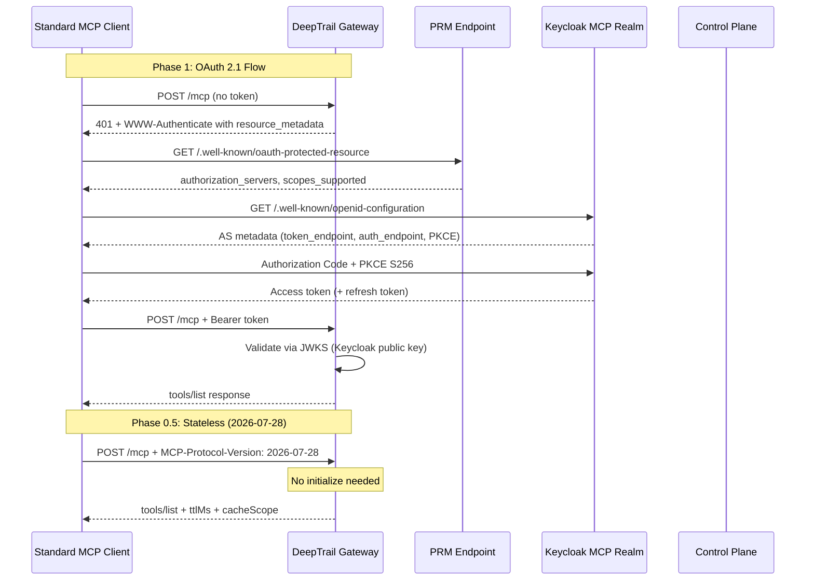

# Spec: MCP Authorization Spec Compliance (P5.3)

> **Status:** Draft
> **Author:** AI Security Audit Agent
> **Created:** 2026-05-28
> **Priority:** P5.3 -- Parallel with P5.2
> **Roadmap Phase:** Phase 1: Now -- Q2/Q3 2026 (Phase 0+0.5 before July 28); Phase 2: Q3 2026 (Phases 1-4)
> **Priority Master:** [`plans/PRIORITY_MASTER.md`](../../plans/PRIORITY_MASTER.md)
> **Product Roadmap:** [`plans/PRODUCT_ROADMAP.md`](../../plans/PRODUCT_ROADMAP.md)
> **Audit Doc:** [`docs/audit-mcp-authorization-spec-vs-deepsecure-implementation.md`](../audit-mcp-authorization-spec-vs-deepsecure-implementation.md)
> **Plan File:** [`plans/mcp_auth_spec_compliance_a37f2515.plan.md`](../../plans/mcp_auth_spec_compliance_a37f2515.plan.md)
> **Design Doc:** `docs/design/mcp-auth-spec-compliance.md` *(populated after `/create-design-doc`)*

---

## Priority & Roadmap Mapping

### Priority Master Mapping ([`plans/PRIORITY_MASTER.md`](../../plans/PRIORITY_MASTER.md))

This spec covers **P5.3 -- MCP Authorization Spec Compliance** from the Priority Master.

| Priority Group | Coverage | Items in This Spec |
|---------------|----------|--------------------|
| **P5.3 MCP Auth Spec Compliance** *(Parallel with P5.2)* | Full | All 12 items: Phase 0 quick wins, Phase 0.5 stateless gateway, Phase 1 PRM + Keycloak + dual auth + error responses + resource param, Phase 2 asymmetric JWT + refresh tokens, Phase 3 CIMD + scopes, Phase 4 enterprise extensions |
| **P5.2 IT Admin Service Catalog** *(Parallel)* | Not in scope | Zero file overlap -- runs independently |
| **P5.4 SDK + Integration Guides** | Not in scope | SDK `resource` param changes (Phase 1.5) pulled into this spec; remaining SDK guides deferred |
| **P5.5 Agent Security Architecture** | Not in scope | Observability dashboard, adaptive access control deferred |

### Product Roadmap Mapping ([`plans/PRODUCT_ROADMAP.md`](../../plans/PRODUCT_ROADMAP.md))

This spec delivers infrastructure under **Phase 3: Q3-Q4 2026 -- Platform Expansion** from the product roadmap. MCP auth compliance is cross-cutting gateway infrastructure that enables standard client interoperability for all P5+ features.

| Roadmap Phase | Coverage | What This Spec Delivers |
|--------------|----------|------------------------|
| **Phase 1: Q2 2026 -- Foundation** | ❌ Not in scope | Already complete (P1A, P1B, P2, GCP SaaS) |
| **Phase 2: Q3 2026 -- GCP Experience** | ❌ Not in scope | Already complete (P3, P4, P4.5) |
| **Phase 3: Q3-Q4 2026 -- Platform Expansion** | ⚠️ Partial | MCP auth spec compliance (gateway + control plane security hardening); enables standard MCP clients for P5 SDK guides, P6 Vendor Platform, and P7 Claude Code Integration |
| **Phase 4: Q4 2026+ -- AWS + Enterprise** | ❌ Not in scope | AWS fixes (P9, P10), AgentCore (P11) deferred |

### Persona Capability Unlocked by This Spec

Taken from the roadmap's "Persona Capability Timeline" -- what becomes non-broken for each persona after this spec lands:

| Persona | Capability Unlocked |
|---------|---------------------|
| **Employee (Sarah)** | Connect Claude Desktop or VS Code to DeepSecure via standard OAuth flow -- no custom SDK needed. Existing Ed25519 agent workflows continue unchanged. |
| **IT Admin (Alex)** | Standard token lifecycle (short-lived access tokens, refresh rotation, JWKS verification) replaces HS256 shared secret. CORS restricted from `*` to explicit allowlist. Token passthrough vulnerability on `/proxy` path closed. |
| **Security Team** | Legacy JWT fallback removed (no more `aud`/`iss` bypass). HS256 → RS256 migration eliminates shared-secret JWT forgery risk. Fail-closed secret injection prevents agent JWT leakage to external APIs. HTTPS enforcement for all AS endpoints. |
| **Engineer / Developer** | Standard MCP clients (official TypeScript/Python/C# SDKs) work with DeepSecure Gateway. Stateless gateway enables horizontal scaling behind round-robin load balancer. OAuth 2.1 + PKCE replaces custom auth for third-party integrations. `resource` parameter in SDK for audience-scoped tokens. |
| **Vendor Admin** | Vendor-deployed agents using standard MCP clients can authenticate without DeepSecure SDK dependency. OAuth Bearer tokens from Keycloak `mcp` realm accepted alongside proprietary JWTs. |

### What This Spec Unblocks

| Blocked Item | Needs | Covered By |
|--------------|-------|-----------|
| Standard MCP client interop (VS Code, Claude Desktop) | OAuth 2.1 + PRM + PKCE | Phase 1 |
| MCP 2026-07-28 compatibility | Stateless protocol, `Mcp-Method`/`Mcp-Name` headers | Phase 0.5 |
| P7 Claude Code Integration | MCP proxy needs standard auth flow | Phase 1 |
| P6 Vendor Platform | Vendors may use standard MCP clients | Phase 1 |

---

## Table of Contents

1. [Objective](#1-objective)
2. [Goals & Non-Goals](#2-goals--non-goals)
3. [Background](#3-background)
4. [Technical Design](#4-technical-design)
5. [Data Models](#5-data-models)
6. [API Contracts](#6-api-contracts)
7. [Security Considerations](#7-security-considerations)
8. [Project Structure](#8-project-structure)
9. [Testing Strategy](#9-testing-strategy)
10. [Demo Scenarios / User Journeys](#10-demo-scenarios--user-journeys)
11. [Rollout Plan](#11-rollout-plan)
12. [Boundaries](#12-boundaries)
13. [Dependencies & Risks](#13-dependencies--risks)
14. [Open Questions](#14-open-questions)
15. [References](#15-references)

---

## 1. Objective

Close 60 identified gaps between the MCP Authorization Specification (2025-11-25 + 2026-07-28 RC) and the DeepSecure implementation. Enable standard MCP clients -- VS Code, Claude Desktop, and any client built with official MCP SDKs -- to authenticate with the DeepSecure Gateway via OAuth 2.1. Simultaneously make the Gateway stateless per the MCP 2026-07-28 protocol before the July 28, 2026 ship date.

### User Stories / Acceptance Criteria

- As an **engineer using Claude Desktop**, I want to connect to the DeepSecure Gateway by simply entering the MCP server URL, so that Claude Desktop discovers the authorization server, performs OAuth login, and I can use DeepSecure-managed tools without any custom SDK.
- As a **DeepSecure agent (existing)**, I want my Ed25519 challenge-response + JWT flow to continue working unchanged, so that migrating to MCP auth compliance does not break my deployment.
- As a **platform operator**, I want the Gateway to handle any MCP request without sticky sessions or shared session stores, so that I can horizontally scale behind a round-robin load balancer.

### Success Criteria

- [ ] A standard MCP 2026-07-28 client can send `tools/list` without `initialize` and receive a valid tool list (Phase 0.5)
- [ ] `Mcp-Method` and `Mcp-Name` headers are validated; mismatches are rejected (Phase 0.5)
- [ ] Legacy JWT fallback (bypasses `aud`/`iss`) is removed (Phase 0)
- [ ] The `/proxy` path rejects requests when no credential can be injected, instead of forwarding the agent JWT (Phase 0)
- [ ] A standard MCP client discovers the AS via `/.well-known/oauth-protected-resource`, performs OAuth 2.1 Authorization Code + PKCE with S256, and calls `tools/list` with the resulting Bearer token (Phase 1)
- [ ] Existing DeepSecure agents using Ed25519 + proprietary JWT continue to work without changes (all phases)
- [ ] 401 responses include `WWW-Authenticate: Bearer resource_metadata="...", scope="..."` (Phase 1)
- [ ] 403 responses include `WWW-Authenticate: Bearer error="insufficient_scope", scope="..."` (Phase 3)

---

## 2. Goals & Non-Goals

### Goals

- [ ] **G1: Stateless Gateway** -- Remove `initialize` requirement and `MCPSessionManager`; derive all state from JWT per-request (Phase 0.5, deadline July 28)
- [ ] **G2: MCP 2026-07-28 Protocol Support** -- `Mcp-Method`/`Mcp-Name` headers, `server/discover`, `ttlMs`/`cacheScope`, W3C Trace Context (Phase 0.5)
- [ ] **G3: OAuth 2.1 Interoperability** -- PRM endpoint, Keycloak AS, PKCE S256, resource parameter (Phase 1)
- [ ] **G4: Dual-Token Validation** -- Gateway accepts both proprietary JWTs and OAuth Bearer tokens from Keycloak (Phase 1)
- [ ] **G5: Security Hardening** -- Asymmetric JWT signing, refresh token rotation, token revocation, HTTPS enforcement (Phase 2)
- [ ] **G6: Scope Management** -- CIMD, scope challenge handling, step-up authorization (Phase 3)
- [ ] **G7: Backward Compatibility** -- Ed25519 + proprietary JWT flow preserved throughout all phases

### Non-Goals

- **Frontend changes** -- This spec is purely backend (gateway, control plane, SDK, Keycloak). No UI work.
- **P5.2 IT Admin Service Catalog** -- Separate workstream, zero file overlap, runs in parallel.
- **Multi-hop agent-to-agent auth** -- Deferred to P7+. This spec covers single-hop MCP client-to-server auth only.
- **Full OpenID Connect identity layer** -- We use Keycloak for OAuth 2.1 token issuance, not as an OpenID identity provider for user profiles.
- **Custom Authorization Server** -- We use Keycloak, not a bespoke AS implementation.

---

## 3. Background

### Current State

The [audit document](../audit-mcp-authorization-spec-vs-deepsecure-implementation.md) (1100 lines, updated 2026-05-28) identified 60 specific gaps against the MCP Authorization Specification. Source of truth for gap details, severity, and code references is that document.

| Capability | Current Status | Location | Notes |
|------------|----------------|----------|-------|
| MCP session management | **In-memory dict** (stateful, required) | `deeptrail-gateway/app/mcp/session_manager.py` | `initialize` creates `AgentMCPSession`; not thread-safe; no Redis |
| Tool permission resolution | **Implemented** (stateless-ready) | `deeptrail-gateway/app/mcp/permission_mapper.py` | `PermissionMapper.filter_tools()` can derive tools from JWT `delegated_permissions` per-request |
| JWT validation | **HS256 shared secret** with legacy fallback | `deeptrail-gateway/app/middleware/jwt_validation.py` | Legacy fallback disables `aud`/`iss` verification |
| JWT TTL | **8 hours** | `deeptrail-control/app/core/security.py` | Far too long per spec guidance |
| Session ID entropy | **48 bits** (`uuid4().hex[:12]`) | `session_manager.py` line 236 | Truncated UUID reduces security margin |
| CORS | **`allow_origins=["*"]`** | `deeptrail-gateway/app/main.py` line 138 | Overly permissive; env var exists but defaults to `*` |
| `WWW-Authenticate` header | **Bare `Bearer`** | `jwt_validation.py` line 568 | No `resource_metadata`, no `scope` |
| Protected Resource Metadata | **Missing** | -- | No `/.well-known/oauth-protected-resource` endpoint |
| Authorization Server Metadata | **Missing** | -- | No RFC 8414 / OIDC Discovery for MCP auth |
| OAuth 2.1 for MCP clients | **Missing** | -- | Ed25519 challenge-response only |
| `Mcp-Method`/`Mcp-Name` headers | **Not read** | `main.py` line 583 | Routes by parsing JSON body |
| `MCP-Protocol-Version` header | **Not read** | -- | Version only in `initialize` params |
| `server/discover` method | **Missing** | -- | Only `initialize`, `tools/list`, `tools/call` |
| `ttlMs`/`cacheScope` | **Missing** | -- | No cache metadata on responses |
| W3C Trace Context | **Missing** | -- | Only `X-Request-ID` |
| `/proxy` secret injection | **Fail-open** | `secret_injection.py` lines 93-96 | Agent JWT forwarded to external APIs on failure |
| Refresh tokens | **Missing** | -- | Single JWT, no refresh mechanism |
| Asymmetric JWT signing | **Missing** (placeholder methods exist) | `jwt_validation.py` lines 586-605 | `_fetch_public_key`, `_validate_jwt_signature` are stubs |
| Keycloak | **Deployed** for RFC 8693 token exchange | `deeptrail-gateway/app/security/token_exchange.py` | Can be extended as MCP AS |
| PKCE | **Implemented** for backend OAuth (Notion, Google) | `deeptrail-control/app/services/oauth_service.py` | S256 method; patterns reusable |
| Supported protocol versions | `["2025-11-25", "2024-11-05", "2024-10-07"]` | `initialize.py` line 51 | `2026-07-28` absent |

### Motivation

1. **Standard MCP client interoperability.** VS Code, Claude Desktop, and clients built with official MCP TypeScript/Python/C# SDKs implement the MCP auth spec. They expect OAuth 2.1 discovery via PRM, PKCE authorization, and Bearer tokens. Without this, DeepSecure is locked into requiring its own custom SDK for all interactions.

2. **MCP 2026-07-28 breaking changes.** The `initialize` handshake and `Mcp-Session-Id` header are removed. After July 28, Tier 1 SDK clients will stop sending `initialize`. The Gateway's in-memory session architecture will break.

3. **Security vulnerabilities.** The audit identified: (a) a confirmed token passthrough vulnerability on `/proxy` (fail-open secret injection), (b) a legacy JWT fallback that disables audience/issuer validation, (c) HS256 shared secret allowing JWT forgery if Gateway is compromised.

---

## 4. Technical Design

### Services Affected

| Service | Impact | Changes |
|---------|--------|---------|
| deeptrail-gateway | **High** | Stateless migration, PRM endpoint, dual-token validation, header routing, error response format |
| deeptrail-control | **Medium** | JWKS endpoint, refresh token endpoint, JWT signing algorithm change |
| deepsecure (SDK) | **Low** | `resource` parameter in token requests, step-up auth retry |
| Keycloak | **Medium** | New `mcp` realm, MCP scopes, audience config, PKCE S256, DCR |
| frontend | **None** | No changes |

### Architecture Overview



### Phase 0: Quick Wins (1-2 days)

Seven changes across four files with no architectural impact:

**1. Remove legacy JWT fallback** (`jwt_validation.py`)

Delete the `except jwt.JWTClaimsError` fallback block (lines 381-409) that retries token validation with `verify_aud: False, verify_iss: False`. Any JWT without valid `iss`/`aud` is rejected.

**2. Restrict CORS** (`main.py`)

Change the default from `"*"` to an explicit allowlist:

```python
_cors_env = os.getenv("CORS_ALLOWED_ORIGINS", "https://app.deepsecure.one")
```

**3. Reduce JWT TTL** (`deeptrail-control/app/core/security.py`)

Change `ACCESS_TOKEN_EXPIRE_MINUTES` from 480 (8 hours) to 30 minutes. This aligns with the spec's guidance: "Authorization servers SHOULD issue short-lived access tokens."

**4. Increase session ID entropy** (`session_manager.py`)

Change `uuid.uuid4().hex[:12]` (48 bits) to `uuid.uuid4().hex` (128 bits).

**5. Enhance 401 responses** (`jwt_validation.py`)

Update `_unauthorized_response` to include structured `WWW-Authenticate`:

```python
headers={"WWW-Authenticate": 'Bearer realm="deepsecure"'}
```

Phase 1 will add `resource_metadata` and `scope` parameters.

**6. Add `2026-07-28` to supported versions** (`initialize.py`)

```python
SUPPORTED_PROTOCOL_VERSIONS = ["2026-07-28", "2025-11-25", "2024-11-05", "2024-10-07"]
```

**7. Make `/proxy` secret injection fail-closed** (`secret_injection.py`)

When Shamir reassembly fails or no domain-to-secret mapping exists, reject the request with 502 instead of forwarding the agent JWT:

```python
if not secret:
    return JSONResponse(
        status_code=502,
        content={"error": "credential_unavailable", "detail": "No credential available for target"}
    )
```

### Phase 0.5: Stateless Gateway Migration (1 week, deadline July 28)

The JWT carries all context needed: `agent_id`, `owner`, `delegated_permissions`, `delegation_id`, `session_id`. The `MCPSessionManager` reconstructs this state during `initialize`, then looks it up by `agent_session_id` on subsequent calls. The stateless migration removes this indirection.

**1. Stateless `tools/list`** (`tools_list.py`)

Derive tools from JWT `delegated_permissions` per-request using `PermissionMapper`:

```python
async def handle_tools_list(params: dict[str, Any]) -> dict[str, Any]:
    context = params.pop("_context", {})
    permissions = context.get("delegated_permissions", [])
    all_tools = get_tool_cache().get_all_tools()
    filtered = PermissionMapper.filter_tools(all_tools, permissions)
    return {
        "tools": filtered,
        "_meta": {"ttlMs": 60000, "cacheScope": "user"},
    }
```

**2. Stateless `tools/call`** (`tools_call.py`)

Resolve credentials from JWT context per-request. The `CredentialInjector` already accepts `agent_jwt_token` and `backend_id` -- it does not need a session object.

**3. Implement `server/discover`** (new `discover.py`)

```python
async def handle_discover(params: dict[str, Any]) -> dict[str, Any]:
    return {
        "protocolVersion": "2026-07-28",
        "capabilities": {"tools": {"listChanged": True}},
        "serverInfo": {"name": "DeepTrail Virtual MCP Server", "version": "0.2.0"},
    }
```

Register as `MCPMethod.DISCOVER = "server/discover"` in `protocol.py`.

**4. `Mcp-Method` and `Mcp-Name` header validation** (`main.py`)

```python
mcp_method_header = request.headers.get("Mcp-Method")
mcp_name_header = request.headers.get("Mcp-Name")
if mcp_method_header and mcp_method_header != req_method:
    return JSONResponse(status_code=400, content={
        "error": "header_body_mismatch",
        "detail": "Mcp-Method header does not match JSON-RPC method"
    })
```

**5. Dual protocol version routing** (`main.py`)

```python
protocol_version = request.headers.get("MCP-Protocol-Version", "")
if protocol_version == "2026-07-28":
    # Stateless path: clientInfo from _meta, no initialize needed
    if not agent_context:
        return self._unauthorized_response(...)
else:
    # Legacy 2025-11-25: initialize handshake still supported
    pass
```

**6. Remove `Mcp-Session-Id` from responses** (`main.py`)

Stop returning `Mcp-Session-Id` on `initialize` responses. Accept but ignore the header if sent by legacy clients.

**7. Add `ttlMs`/`cacheScope` to responses** (handler return values)

Tool list results carry `_meta.ttlMs` (60 seconds) and `_meta.cacheScope` ("user") so clients know how long the response is fresh.

**8. W3C Trace Context** (middleware or `main.py`)

Read `traceparent` and `tracestate` from `_meta` in JSON-RPC params. Propagate to backend calls. This is documentation-level support per SEP-414.

### Phase 1: MCP Standard Interoperability (2-3 weeks)

**1.1 Protected Resource Metadata** (new `well_known.py`)

```python
@router.get("/.well-known/oauth-protected-resource")
@router.get("/.well-known/oauth-protected-resource/mcp")
async def protected_resource_metadata():
    return {
        "resource": "https://gateway.deepsecure.one/mcp",
        "authorization_servers": [
            "https://keycloak.deepsecure.one/realms/mcp"
        ],
        "scopes_supported": ["mcp:tools", "mcp:resources"],
        "bearer_methods_supported": ["header"],
    }
```

**1.2 Keycloak `mcp` Realm**

Create a new Keycloak realm `mcp` (separate from existing `deepsecure` realm) with:
- OIDC Discovery at `/.well-known/openid-configuration`
- `code_challenge_methods_supported: ["S256"]` (MUST per MCP spec)
- MCP scopes: `mcp:tools`, `mcp:resources`
- Audience: `https://gateway.deepsecure.one/mcp`
- Dynamic Client Registration enabled (optional)
- `client_id_metadata_document_supported: true` in AS metadata (for Phase 3)

**1.3 Dual-Token Validation** (new `oauth_validation.py` + modified `jwt_validation.py`)

The Gateway accepts two token types:

| Token Type | Issuer | Algorithm | Validation Method |
|------------|--------|-----------|-------------------|
| Proprietary JWT | `deeptrail-control` | HS256 (Phase 0-1) / RS256 (Phase 2) | Shared secret / JWKS |
| OAuth Bearer | `keycloak.deepsecure.one/realms/mcp` | RS256 | Keycloak JWKS endpoint |

Detection: if `iss` claim starts with Keycloak URL, use JWKS validation. Otherwise, use proprietary JWT validation.

**Scope → Permission Mapping:** OAuth tokens from Keycloak carry scopes (e.g., `mcp:tools`, `mcp:resources`). These must be translated into the `delegated_permissions` array that `PermissionMapper` consumes for stateless tool filtering:

```python
def map_oauth_scopes_to_permissions(token_scopes: list[str]) -> list[str]:
    permissions = []
    for scope in token_scopes:
        if scope == "mcp:tools":
            permissions.append("*:*")  # broad tool access
        elif scope.startswith("mcp:"):
            # mcp:notion:pages:search → notion:pages:search
            permissions.append(scope.removeprefix("mcp:"))
    return permissions
```

For proprietary JWTs, `delegated_permissions` is read directly from the JWT claim (no mapping needed). The `oauth_validation.py` module produces a unified `AgentContext` with `delegated_permissions` populated regardless of token type, so downstream handlers (`tools/list`, `tools/call`) are token-type-agnostic.

**1.4 Structured Error Responses**

401 responses:
```http
HTTP/1.1 401 Unauthorized
WWW-Authenticate: Bearer resource_metadata="https://gateway.deepsecure.one/.well-known/oauth-protected-resource",
                         scope="mcp:tools"
```

403 responses (insufficient scope):
```http
HTTP/1.1 403 Forbidden
WWW-Authenticate: Bearer error="insufficient_scope",
                         scope="mcp:tools mcp:resources",
                         resource_metadata="https://gateway.deepsecure.one/.well-known/oauth-protected-resource",
                         error_description="Additional permissions required"
```

**1.5 Resource Parameter (RFC 8707)**

Define canonical URI: `https://gateway.deepsecure.one/mcp`

Gateway validates that the token's `aud` claim matches this URI (for Keycloak tokens) or `deeptrail-gateway` (for proprietary tokens, backward compat).

SDK sends `resource=https://gateway.deepsecure.one/mcp` in authorization and token requests.

### Phase 2: Security Hardening (1-2 weeks)

**2.1 Asymmetric JWT Signing** -- Control Plane signs with RS256 private key. Gateway validates via JWKS endpoint. Eliminates HS256 shared secret risk.

**2.2 Refresh Tokens** -- Short-lived access tokens (15-30 min) + refresh tokens with rotation for public clients. New `POST /api/v1/auth/token` endpoint with `grant_type=refresh_token`.

**2.3 Token Revocation** -- Revocation endpoint for emergency use. Primary mitigation is short TTL + refresh.

- New `POST /api/v1/auth/revoke` endpoint accepting `token` and `token_type_hint` per RFC 7009
- Gateway checks a lightweight revocation list (Redis SET of revoked `jti` values) on each request in `jwt_validation.py`
- Revocation list entries auto-expire after the token's original TTL (no unbounded growth)
- File: Create `deeptrail-control/app/api/v1/endpoints/revocation.py`; Modify `deeptrail-gateway/app/middleware/jwt_validation.py` (add revocation check)

**2.4 HTTPS Enforcement** -- Production config requires HTTPS for all AS endpoints and redirect URIs.

- Validate that `redirect_uri` in authorization requests uses `https://` or `http://localhost` (per OAuth 2.1 Section 7.2)
- Keycloak realm config: `sslRequired: "external"` (already in §5 realm JSON)
- Gateway startup: reject `CORS_ALLOWED_ORIGINS` entries that are not HTTPS in production mode
- File: Modify `deeptrail-gateway/app/main.py` (CORS origin validation at startup); Modify Keycloak realm config

**2.5 Token Passthrough Audit** -- Comprehensive sweep of all middleware and backend files to verify `request.state.agent_jwt_token` is never forwarded to external services.

- Audit all files in `deeptrail-gateway/app/middleware/` and `deeptrail-gateway/app/backends/`
- Verify `CredentialInjector` only sends agent JWT to Keycloak and Control Plane vault, never to external backend APIs
- Add explicit guardrail: `BackendAdapter._extract_auth_token()` rejects tokens whose `iss` matches `deeptrail-control` (agent JWTs must never reach external services)
- Verify `/proxy` path fail-closed behavior (Phase 0 fix) is tested
- File: Audit (no new files); Add assertion tests in `deeptrail-gateway/tests/security/test_token_passthrough.py` (Create)

### Phase 3: Client Registration and Scopes (1-2 weeks)

**3.1 CIMD** -- Client ID Metadata Documents support per `draft-ietf-oauth-client-id-metadata-document`.

When a client presents a URL-format `client_id` (e.g., `https://myapp.example.com/.well-known/oauth-client`), the AS must:

1. **Fetch metadata** -- HTTP GET to the `client_id` URL. Response is a JSON document with `client_id`, `redirect_uris`, `client_name`, `logo_uri`, etc.
2. **Validate `client_id` match** -- The `client_id` field in the fetched document MUST exactly match the URL used to fetch it. Reject on mismatch.
3. **Validate redirect URIs** -- The `redirect_uris` in the metadata document become the allowlist. Any `redirect_uri` in the authorization request must match one of these.
4. **Consent display** -- Display `client_name` and `logo_uri` from the metadata document in the user consent screen. Warn users when `redirect_uris` contain `localhost` or loopback addresses (development clients).
5. **Domain trust policies** -- Configurable allowlist/blocklist of trusted client domains. Unknown domains trigger admin approval or enhanced consent warnings.

**SSRF protections** (see §7 for full detail): Block private IP ranges (RFC 1918), require HTTPS for `client_id` URLs, enforce DNS resolution to public IPs, rate-limit metadata fetches (max 10/minute per domain), set 5-second fetch timeout.

File: Create `deeptrail-control/app/services/cimd_service.py` with `fetch_client_metadata(client_id_url)` and `validate_client_metadata(metadata, request)`.

**3.2 Scope Challenge Handling** -- 403 responses with `insufficient_scope` and progressive scope discovery.

When a client lacks sufficient scopes, the Gateway returns a 403 with hints for which scopes to request. Clients use a three-step scope selection strategy:

1. **401 scope** -- If the initial 401 `WWW-Authenticate` header includes a `scope` parameter, request those scopes in the authorization request.
2. **PRM scopes** -- If no scope hint in 401, fetch `scopes_supported` from the PRM document and request all listed scopes.
3. **Request all** -- If PRM fetch fails, request no explicit scope (let the AS assign defaults).

The Gateway's 403 response format:
```http
HTTP/1.1 403 Forbidden
WWW-Authenticate: Bearer error="insufficient_scope",
                         scope="mcp:notion:pages:search mcp:notion:pages:create",
                         resource_metadata="https://gateway.deepsecure.one/.well-known/oauth-protected-resource"
```

File: Modify `deeptrail-gateway/app/middleware/jwt_validation.py` (scope-aware 403 with required permission list).

**3.3 Step-Up Authorization** -- SDK retries with expanded scopes, bidirectional scope mapping.

When the SDK receives a 403 with `insufficient_scope`, it:

1. Parses the required scopes from the `WWW-Authenticate` header
2. Initiates a new authorization request with the expanded scope set
3. Tracks retry count (max 2 retries) and cumulative scopes to prevent infinite loops
4. On success, caches the new token and replays the failed request

**Bidirectional scope mapping** between DeepSecure permissions and OAuth scopes:

| Direction | Example | Where |
|-----------|---------|-------|
| Permissions → Scopes | `notion:pages:search` → `mcp:notion:pages:search` | SDK authorization request (add `mcp:` prefix) |
| Scopes → Permissions | `mcp:notion:pages:search` → `notion:pages:search` | Gateway `oauth_validation.py` (strip `mcp:` prefix) |
| Wildcard | `*:*` ↔ `mcp:tools` | Generic scope maps to broad access; reverse requires policy lookup |

File: Modify `deepsecure/_core/base_client.py` (step-up retry with scope tracking); Create `deepsecure/_core/scope_mapper.py` (bidirectional mapping utility).

**3.4 Correlation IDs** -- Generate `X-Request-ID` if absent; include in all error responses.

### Phase 4: Enterprise Extensions (Future)

**4.1** OAuth Client Credentials flow for M2M auth.
**4.2** Enterprise-Managed Authorization (ID-JAG) via existing SSO/IdP integration.
**4.3** Per-client consent at Gateway for confused deputy prevention.
**4.4** Pre-registration for known MCP clients (VS Code, Claude Desktop).

### Architecture Decisions

| Decision | Options Considered | Chosen | Rationale |
|----------|--------------------|--------|-----------|
| Authorization Server | Build custom AS, Use Keycloak, Use Auth0 | Keycloak | Already deployed for RFC 8693; OIDC Discovery native; DCR built-in; zero new infrastructure |
| Keycloak realm | Extend `deepsecure` realm, New `mcp` realm | New `mcp` realm | Clean separation; MCP-specific scopes and audience; no interference with existing token exchange |
| Stateless approach | Redis-backed sessions, JWT-derived per-request | JWT-derived | JWT already carries full context; `PermissionMapper` can resolve tools stateless; aligns with 2026-07-28 spec |
| Dual protocol support | Drop 2025-11-25, Support both, Version negotiation | Support both | Backward compat for existing agents; route on `MCP-Protocol-Version` header |
| JWT algorithm migration | HS256 to RS256, HS256 to EdDSA | RS256 first | Wider library support; Keycloak native RS256; EdDSA can be added later |
| Canonical URI | `app.deepsecure.one/mcp`, `gateway.deepsecure.one/mcp` | `gateway.deepsecure.one/mcp` | Gateway is the resource server; app URL may change; gateway URL is stable |

---

## 5. Data Models

### Database Changes

No new database tables are required. All changes are configuration-level:

| Change | Type | Location |
|--------|------|----------|
| JWT TTL | Config | `ACCESS_TOKEN_EXPIRE_MINUTES` in control plane settings |
| JWT algorithm | Config | `JWT_ALGORITHM` in control plane + gateway settings |
| CORS origins | Environment | `CORS_ALLOWED_ORIGINS` env var |
| Keycloak realm | Infrastructure | Keycloak admin API / realm JSON import |

### Keycloak `mcp` Realm Configuration

```json
{
  "realm": "mcp",
  "enabled": true,
  "sslRequired": "external",
  "registrationAllowed": false,
  "clients": [{
    "clientId": "gateway",
    "publicClient": false,
    "directAccessGrantsEnabled": false,
    "standardFlowEnabled": true,
    "serviceAccountsEnabled": true,
    "attributes": {
      "pkce.code.challenge.method": "S256"
    }
  }],
  "defaultDefaultClientScopes": ["mcp:tools", "mcp:resources"],
  "clientScopes": [
    {"name": "mcp:tools", "protocol": "openid-connect"},
    {"name": "mcp:resources", "protocol": "openid-connect"}
  ]
}
```

---

## 6. API Contracts

> **CRITICAL**: This section is the CANONICAL source for all API endpoints.

### Endpoint Summary

| Method | Endpoint | Purpose | Auth | Phase |
|--------|----------|---------|------|-------|
| GET | `/.well-known/oauth-protected-resource` | Protected Resource Metadata (RFC 9728) | None | 1 |
| GET | `/.well-known/oauth-protected-resource/mcp` | Path-based PRM | None | 1 |
| JSON-RPC | `server/discover` | Server capability discovery (replaces `initialize`) | Bearer | 0.5 |
| POST | `/api/v1/auth/token` | Token refresh | Refresh token | 2 |
| GET | `/api/v1/.well-known/jwks.json` | JWKS public keys (Control Plane) | None | 2 |

### GET /.well-known/oauth-protected-resource

**Request:**
```
GET /.well-known/oauth-protected-resource HTTP/1.1
Host: gateway.deepsecure.one
```

**Response (200):**
```json
{
  "resource": "https://gateway.deepsecure.one/mcp",
  "authorization_servers": ["https://keycloak.deepsecure.one/realms/mcp"],
  "scopes_supported": ["mcp:tools", "mcp:resources"],
  "bearer_methods_supported": ["header"]
}
```

### server/discover (JSON-RPC)

**Request:**
```json
{
  "jsonrpc": "2.0",
  "id": 1,
  "method": "server/discover",
  "params": {}
}
```

**Response (200):**
```json
{
  "jsonrpc": "2.0",
  "id": 1,
  "result": {
    "protocolVersion": "2026-07-28",
    "capabilities": {"tools": {"listChanged": true}},
    "serverInfo": {"name": "DeepTrail Virtual MCP Server", "version": "0.2.0"}
  }
}
```

### POST /api/v1/auth/token (Refresh)

**Request:**
```
POST /api/v1/auth/token HTTP/1.1
Content-Type: application/x-www-form-urlencoded

grant_type=refresh_token&refresh_token=<token>&client_id=<id>
```

**Response (200):**
```json
{
  "access_token": "<new-jwt>",
  "token_type": "Bearer",
  "expires_in": 1800,
  "refresh_token": "<new-refresh-token>"
}
```

**Error Responses:**

| Status | Condition |
|--------|-----------|
| 400 | Missing or invalid `grant_type` |
| 401 | Invalid or expired refresh token |
| 403 | Refresh token revoked |

### GET /api/v1/.well-known/jwks.json

**Response (200):**
```json
{
  "keys": [{
    "kty": "RSA",
    "use": "sig",
    "kid": "deeptrail-control-1",
    "n": "<modulus>",
    "e": "AQAB",
    "alg": "RS256"
  }]
}
```

### Updated Error Responses (All Phases)

| Status | WWW-Authenticate | When |
|--------|-----------------|------|
| 401 | `Bearer resource_metadata=".../.well-known/oauth-protected-resource", scope="mcp:tools"` | Missing or invalid token |
| 403 | `Bearer error="insufficient_scope", scope="mcp:tools mcp:resources", resource_metadata="...", error_description="..."` | Valid token, insufficient permissions |
| 400 | *(no WWW-Authenticate)* | Malformed request, header/body mismatch |

---

## 7. Security Considerations

### Token Passthrough Prevention

The `/proxy` path has a confirmed vulnerability: when `SecretInjectionMiddleware` fails to find a credential mapping, it logs and continues, forwarding the agent JWT to external services via the preserved `Authorization` header.

**Fix (Phase 0):** Make secret injection fail-closed. If no credential can be injected for the target domain, return 502 and do not forward the request. The MCP spec explicitly states: "MCP servers MUST NOT pass through the token it received from the MCP client."

The MCP path (`/mcp`) is already safe -- `CredentialInjector` exchanges the agent JWT for backend-specific OAuth tokens via Keycloak. The agent JWT is sent only to Keycloak and the Control Plane vault, never to external backends.

### Audience Validation

**Current risk:** The legacy JWT fallback retries with `verify_aud: False, verify_iss: False`, accepting any validly-signed JWT regardless of intended audience.

**Fix (Phase 0):** Remove the fallback entirely. Any JWT without `iss=deeptrail-control` and `aud=deeptrail-gateway` (or the Keycloak issuer for OAuth tokens in Phase 1) is rejected.

### HS256 to RS256 Migration

**Current risk:** Both Control Plane and Gateway share the same HS256 secret. If the Gateway is compromised, an attacker can forge JWTs for any agent.

**Fix (Phase 2):** Control Plane signs JWTs with an RS256 private key. Gateway validates via JWKS endpoint (`/api/v1/.well-known/jwks.json`). The private key never leaves the Control Plane.

### SSRF Protections (Phase 3)

When implementing CIMD, the AS fetches a URL provided by an unknown client. Malicious clients could target internal endpoints.

**Mitigations:** Block private IP ranges (RFC 1918), require HTTPS, enforce DNS resolution to public IPs, rate-limit metadata fetches, set aggressive timeouts.

---

## 8. Project Structure

### Workstream A: Phase 0 -- Quick Wins (deeptrail-gateway + deeptrail-control)

| File | Action | Purpose |
|------|--------|---------|
| `deeptrail-gateway/app/middleware/jwt_validation.py` | Modify | Remove legacy fallback (lines 381-409), enhance 401 `WWW-Authenticate`, increase entropy |
| `deeptrail-gateway/app/main.py` | Modify | Change CORS default from `"*"` to `"https://app.deepsecure.one"` |
| `deeptrail-gateway/app/mcp/handlers/initialize.py` | Modify | Add `"2026-07-28"` to `SUPPORTED_PROTOCOL_VERSIONS` |
| `deeptrail-gateway/app/middleware/secret_injection.py` | Modify | Return 502 on reassembly failure instead of continuing |
| `deeptrail-control/app/core/security.py` | Modify | Reduce `ACCESS_TOKEN_EXPIRE_MINUTES` from 480 to 30 |
| `deeptrail-gateway/app/mcp/session_manager.py` | Modify | Change `uuid.uuid4().hex[:12]` to `uuid.uuid4().hex` |
| `deeptrail-gateway/tests/middleware/test_jwt_validation.py` | Modify | Update tests for removed fallback |
| `deeptrail-gateway/tests/middleware/test_secret_injection.py` | Modify | Add fail-closed test |

### Workstream B: Phase 0.5 -- Stateless Gateway (deeptrail-gateway)

| File | Action | Purpose |
|------|--------|---------|
| `deeptrail-gateway/app/mcp/handlers/tools_list.py` | Modify | Derive tools from JWT `delegated_permissions` via `PermissionMapper` |
| `deeptrail-gateway/app/mcp/handlers/tools_call.py` | Modify | Resolve credentials from JWT context, not session lookup |
| `deeptrail-gateway/app/mcp/handlers/discover.py` | Create | `server/discover` handler returning capabilities |
| `deeptrail-gateway/app/mcp/protocol.py` | Modify | Add `DISCOVER` to `MCPMethod`, add header validation logic |
| `deeptrail-gateway/app/main.py` | Modify | Dual protocol routing, `Mcp-Method`/`Mcp-Name` validation, remove `Mcp-Session-Id` echo |
| `deeptrail-gateway/app/mcp/session_manager.py` | Modify | Gut `MCPSessionManager` -- keep class as facade for backward compat, remove in-memory dict |
| `deeptrail-gateway/app/mcp/handlers/initialize.py` | Modify | Make session creation optional (legacy only) |
| `deeptrail-gateway/tests/mcp/test_stateless_tools.py` | Create | Tests for stateless `tools/list` and `tools/call` |
| `deeptrail-gateway/tests/mcp/test_discover.py` | Create | Tests for `server/discover` |
| `deeptrail-gateway/tests/mcp/test_header_validation.py` | Create | Tests for `Mcp-Method`/`Mcp-Name` header enforcement |

### Workstream C: Phase 1 -- MCP Standard Interoperability (deeptrail-gateway + Keycloak)

| File | Action | Purpose |
|------|--------|---------|
| `deeptrail-gateway/app/api/well_known.py` | Create | PRM endpoints (root + path-based) |
| `deeptrail-gateway/app/middleware/oauth_validation.py` | Create | Keycloak JWKS-based token validation |
| `deeptrail-gateway/app/middleware/jwt_validation.py` | Modify | Dual-token detection (proprietary vs OAuth), structured 401/403 |
| `deeptrail-gateway/app/main.py` | Modify | Mount `.well-known` routes, bypass JWT validation for PRM |
| `infra/keycloak/mcp-realm.json` | Create | Keycloak `mcp` realm config with scopes, audience, PKCE |
| `deepsecure/_core/base_client.py` | Modify | Send `resource` parameter in token requests |
| `deeptrail-gateway/tests/api/test_well_known.py` | Create | PRM endpoint tests |
| `deeptrail-gateway/tests/middleware/test_oauth_validation.py` | Create | OAuth token validation tests |

### Workstream D: Phase 2 -- Security Hardening (deeptrail-control + deeptrail-gateway)

| File | Action | Purpose |
|------|--------|---------|
| `deeptrail-control/app/core/security.py` | Modify | RS256 signing with private key |
| `deeptrail-control/app/api/v1/endpoints/jwks.py` | Create | JWKS endpoint serving public key |
| `deeptrail-control/app/api/v1/endpoints/token.py` | Create | Refresh token endpoint |
| `deeptrail-control/app/api/v1/endpoints/revocation.py` | Create | Token revocation endpoint (RFC 7009) |
| `deeptrail-control/app/services/agent_session_service.py` | Modify | Issue refresh tokens alongside access tokens |
| `deeptrail-gateway/app/middleware/jwt_validation.py` | Modify | JWKS-based verification + revocation check (Redis `jti` lookup) |
| `deeptrail-gateway/app/main.py` | Modify | HTTPS-only CORS origin validation in production |
| `deeptrail-gateway/tests/security/test_token_passthrough.py` | Create | Comprehensive JWT leakage assertions across all middleware/backends |

### Workstream E: Phase 3 -- Client Registration and Scopes (deeptrail-control + deeptrail-gateway + SDK)

| File | Action | Purpose |
|------|--------|---------|
| `deeptrail-control/app/services/cimd_service.py` | Create | CIMD fetch, validation (client_id match, redirect URI, consent display), SSRF protection, domain trust policies |
| `deeptrail-gateway/app/middleware/jwt_validation.py` | Modify | Scope-aware 403 with required permission list in `WWW-Authenticate` |
| `deepsecure/_core/base_client.py` | Modify | Step-up auth retry with scope tracking (max 2 retries) |
| `deepsecure/_core/scope_mapper.py` | Create | Bidirectional DeepSecure permissions ↔ OAuth scopes mapping utility |
| `deeptrail-gateway/app/middleware/correlation.py` | Create | Correlation ID middleware (`X-Request-ID` generation + propagation) |

### Workstream F: Phase 4 -- Enterprise Extensions (Future)

| File | Action | Purpose |
|------|--------|---------|
| TBD | TBD | Client credentials, enterprise-managed auth, per-client consent |

### Complexity Estimates

| Workstream | Phase | Complexity | Duration | Rationale |
|------------|-------|------------|----------|-----------|
| WS-A | Phase 0 | S (7 tasks) | 1-2 days | Single-line changes, no architecture impact |
| WS-B | Phase 0.5 | M (10 tasks) | 1 week | Refactoring, not rebuild; `PermissionMapper` exists |
| WS-C | Phase 1 | L (8 tasks) | 2-3 weeks | New endpoints, Keycloak config, dual validation |
| WS-D | Phase 2 | M (8 tasks) | 1-2 weeks | Crypto migration, JWKS, refresh tokens, revocation, HTTPS enforcement, passthrough audit |
| WS-E | Phase 3 | M (5 tasks) | 1-2 weeks | CIMD service with validation, scope mapping, step-up auth, correlation IDs |
| WS-F | Phase 4 | L (4+ tasks) | TBD | Enterprise extensions, future scope |

---

## 9. Testing Strategy

### Test Matrix

| Level | What | Location | Framework |
|-------|------|----------|-----------|
| Unit | JWT validation (no fallback), header mismatch rejection, CORS restriction | `deeptrail-gateway/tests/middleware/` | pytest |
| Unit | Stateless tools/list, tools/call, discover | `deeptrail-gateway/tests/mcp/` | pytest |
| Unit | PRM response format, OAuth token validation | `deeptrail-gateway/tests/api/` | pytest |
| Integration | Keycloak realm config, OIDC discovery | `tests/integration/` | pytest + httpx |
| E2E | Full OAuth flow: PRM discovery -> Keycloak auth -> Bearer token -> tools/list | `tests/e2e/` | pytest + httpx |

### Key Test Scenarios

- [ ] Agent with valid proprietary JWT (iss=deeptrail-control, aud=deeptrail-gateway) can call `tools/list` -- passes
- [ ] Agent with legacy JWT (no iss/aud) is rejected with 401 -- NOT accepted via fallback
- [ ] MCP 2026-07-28 client sends `tools/list` without `initialize` -- receives valid tool list
- [ ] MCP 2026-07-28 client sends `tools/list` with `Mcp-Method: tools/list` -- passes
- [ ] MCP 2026-07-28 client sends `tools/list` with `Mcp-Method: tools/call` (mismatch) -- rejected 400
- [ ] Standard MCP client fetches `/.well-known/oauth-protected-resource` -- receives valid PRM with `authorization_servers`
- [ ] OAuth Bearer token from Keycloak `mcp` realm is accepted by Gateway
- [ ] OAuth Bearer token from wrong Keycloak realm is rejected
- [ ] `/proxy` request to unmapped domain returns 502, not forwarded with agent JWT
- [ ] Refresh token exchange returns new access token + rotated refresh token
- [ ] Expired refresh token returns 401
- [ ] `server/discover` returns capabilities matching 2026-07-28 spec

### Technical Requirements

| Requirement | Correct Pattern | Common Mistake |
|-------------|-----------------|----------------|
| Async fixtures | `@pytest_asyncio.fixture` | `@pytest.fixture` (breaks async) |
| HTTP client | `httpx.AsyncClient` | `requests` (sync) |
| Mock Keycloak | `respx` for JWKS endpoint | Calling live Keycloak |
| JWT creation for tests | `jose.jwt.encode()` with test keys | Hardcoded token strings |

### Coverage Requirements

- Phase 0 changes: 100% coverage (security-critical)
- Phase 0.5 stateless handlers: >90% coverage
- Phase 1 PRM + OAuth validation: >80% coverage

---

## 10. Demo Scenarios / User Journeys

### Scenario 1: Engineer -- Stateless MCP 2026-07-28 Client (Phase 0.5)

**Persona:** Alex, Backend Engineer using a MCP 2026-07-28 compatible client
**Pre-conditions:** Agent registered with Ed25519 key, delegation created, agent JWT obtained via challenge-response

| Step | Action | Expected Result | Validates |
|------|--------|-----------------|-----------|
| 1 | Agent sends `POST /mcp` with `MCP-Protocol-Version: 2026-07-28`, `Mcp-Method: tools/list`, Bearer JWT | Gateway validates JWT, derives tools from `delegated_permissions` via `PermissionMapper` | Stateless tool resolution |
| 2 | Response contains `tools` array + `_meta.ttlMs: 60000` | Client caches tool list for 60 seconds | Cache metadata |
| 3 | Agent sends `tools/call` with `Mcp-Method: tools/call`, `Mcp-Name: notion.search_pages` | Gateway resolves credentials from JWT, calls Notion backend | Stateless credential resolution |
| 4 | Agent sends `tools/list` with `Mcp-Method: tools/call` (header/body mismatch) | Gateway returns 400: header_body_mismatch | Header validation |

**Success criteria:** No `initialize` call needed. Any gateway instance can serve any request.

### Scenario 2: Engineer -- Claude Desktop OAuth Flow (Phase 1)

**Persona:** Sarah, Engineer using Claude Desktop with DeepSecure
**Pre-conditions:** DeepSecure gateway deployed with PRM and Keycloak `mcp` realm configured

| Step | Action | Expected Result | Validates |
|------|--------|-----------------|-----------|
| 1 | Sarah adds `https://gateway.deepsecure.one/mcp` as MCP server in Claude Desktop | Claude Desktop sends request without token | MCP server URL entry |
| 2 | Gateway returns `401` with `WWW-Authenticate: Bearer resource_metadata="..."` | Claude Desktop parses `resource_metadata` URL | PRM discovery |
| 3 | Claude Desktop fetches `/.well-known/oauth-protected-resource` | Receives `authorization_servers` pointing to Keycloak | AS location |
| 4 | Claude Desktop fetches Keycloak OIDC Discovery | Gets `authorization_endpoint`, `token_endpoint`, `code_challenge_methods_supported: ["S256"]` | AS metadata |
| 5 | Claude Desktop opens browser for OAuth login + PKCE S256 | Sarah authenticates, grants MCP scopes | OAuth 2.1 flow |
| 6 | Claude Desktop exchanges auth code for Bearer token with `resource=https://gateway.deepsecure.one/mcp` | Receives access token + refresh token | Token acquisition |
| 7 | Claude Desktop sends `tools/list` with Bearer token | Receives tool list filtered by granted scopes | Authenticated access |

**Success criteria:** Zero custom SDK required. Standard MCP client OAuth flow works end-to-end.

### Scenario 3: Error Path -- Backward Compatibility (All Phases)

**Persona:** Existing DeepSecure agent using Ed25519 + proprietary JWT
**Pre-conditions:** Agent deployed before MCP auth compliance changes

| Step | Action | Expected Result | Validates |
|------|--------|-----------------|-----------|
| 1 | Agent authenticates via Ed25519 challenge-response | Receives proprietary JWT with `iss=deeptrail-control`, `aud=deeptrail-gateway` | Legacy auth preserved |
| 2 | Agent sends `initialize` (2025-11-25 protocol) | Receives capabilities response | Legacy handshake |
| 3 | Agent sends `tools/list` with proprietary JWT | Receives filtered tool list | Dual-token validation |
| 4 | Agent with JWT missing `iss`/`aud` sends `tools/list` | Receives 401 Unauthorized | Legacy fallback removed |

**Success criteria:** Valid proprietary JWTs continue working. Invalid JWTs (no iss/aud) are rejected.

---

## 11. Rollout Plan

### Phase 0: Quick Wins (Workstream A)

**Tasks:** WS-A, 7 changes across 6 files
**Duration:** 1-2 days
**Deliverable:** Legacy JWT fallback removed, CORS restricted, TTL reduced, proxy fail-closed
**Demo impact:** Existing agents with valid JWTs continue working. Agents with legacy (no iss/aud) JWTs are broken -- this is intentional.

### Phase 0.5: Stateless Gateway (Workstream B) -- DEADLINE July 28

**Tasks:** WS-B, 10 tasks
**Duration:** 1 week
**Deliverable:** Gateway processes any MCP 2026-07-28 request without `initialize`. `server/discover` available. Header validation enforced.
**Demo impact:** Existing 2025-11-25 agents still work (dual protocol). New 2026-07-28 clients can connect without `initialize`.

### Phase 1: MCP Standard Interop (Workstream C)

**Tasks:** WS-C, 8 tasks
**Duration:** 2-3 weeks
**Deliverable:** Standard MCP clients (Claude Desktop, VS Code) can authenticate via OAuth 2.1
**Demo impact:** First time a non-DeepSecure client can connect to the Gateway.

### Phase 2: Security Hardening (Workstream D)

**Tasks:** WS-D, 5 tasks
**Duration:** 1-2 weeks
**Deliverable:** RS256 JWT signing, refresh tokens, HTTPS enforcement
**Demo impact:** Transparent to users. Security posture improvement.

### Phase 3: Scopes and Registration (Workstream E)

**Tasks:** WS-E, 4 tasks
**Duration:** 1-2 weeks
**Deliverable:** CIMD support, scope challenges, step-up auth
**Demo impact:** Better error messages for insufficient permissions; standard client registration.

### Phase 4: Enterprise Extensions (Workstream F)

**Duration:** TBD (future)
**Deliverable:** Client credentials, enterprise-managed auth

---

## 12. Boundaries

### Always Do

- Validate JWT `iss` and `aud` on every request -- no fallback
- Reject `/proxy` requests when no credential can be injected (fail-closed)
- Support both 2025-11-25 and 2026-07-28 protocol versions simultaneously
- Run tests before marking any task complete
- Validate `Mcp-Method`/`Mcp-Name` headers match JSON-RPC body

### Ask First

- Keycloak realm configuration changes (scope definitions, audience mappings)
- JWT algorithm migration from HS256 to RS256 (requires coordinated control plane + gateway deploy)
- Changes to `PermissionMapper` tool-to-permission mappings
- Any change to the canonical URI (`https://gateway.deepsecure.one/mcp`)

### Never Do

- Forward agent JWT to external backend services (token passthrough)
- Accept JWTs without `iss`/`aud` validation
- Store Keycloak client secrets in code (use environment variables or Secret Manager)
- Disable PKCE for any OAuth flow
- Default CORS to `allow_origins=["*"]` in production

---

## 13. Dependencies & Risks

### External Dependencies

| Dependency | Risk | Mitigation |
|------------|------|------------|
| Keycloak deployment | Config complexity for new realm | Keycloak already deployed; OIDC Discovery is native; DCR is built-in |
| MCP 2026-07-28 spec finalization | Spec may change between RC and final | RC is locked since May 21; breaking changes unlikely in validation window |
| MCP SDK adoption of 2026-07-28 | Clients may take time to adopt | Dual protocol support ensures backward compat |

### Risks

| Risk | Probability | Impact | Mitigation |
|------|-------------|--------|------------|
| Phase 0.5 misses July 28 deadline | Low | High | JWT already carries full context; refactoring not rebuild; `PermissionMapper` exists |
| Dual-token validation performance | Low | Medium | JWKS caches public keys; asymmetric verification is fast (~1ms) |
| Breaking existing agents (Phase 0 legacy removal) | Medium | Medium | Only affects agents with malformed JWTs (no iss/aud); valid agents unaffected |
| Scope mapping complexity | Medium | Low | DeepSecure permissions map naturally to MCP scopes (`notion:pages:search` -> `mcp:notion:pages:search`) |
| Keycloak OIDC config drift | Low | Low | Realm config in version-controlled JSON; infrastructure-as-code |

---

## 14. Open Questions

- [x] **Dual protocol support?** Yes -- route on `MCP-Protocol-Version` header *(answered)*
- [x] **Keycloak realm?** New `mcp` realm *(answered)*
- [x] **Canonical URI?** `https://gateway.deepsecure.one/mcp` *(answered)*
- [x] **Phase 0.5 hard deadline?** Yes -- July 28, 2026 *(answered)*
- [ ] **Scope naming convention?** Should MCP scopes be `mcp:tools` (generic) or `mcp:notion:pages:search` (granular, matching DeepSecure permissions)? Recommendation: start with generic `mcp:tools` and `mcp:resources`, add granular scopes in Phase 3.
- [ ] **Keycloak deployment URL?** Is `keycloak.deepsecure.one` the right hostname, or should it be `auth.deepsecure.one`?
- [ ] **DCR initial policy?** Should Dynamic Client Registration be open (any client can register) or require admin approval?

---

## 15. References

### Audit Document (Source of Truth for Gaps)
- [`docs/audit-mcp-authorization-spec-vs-deepsecure-implementation.md`](../audit-mcp-authorization-spec-vs-deepsecure-implementation.md) -- 1100 lines, 60 gaps, updated 2026-05-28

### MCP Specifications
- [MCP Authorization Specification (2025-11-25)](https://modelcontextprotocol.io/specification/2025-11-25/basic/authorization)
- [MCP 2026-07-28 Release Candidate](https://blog.modelcontextprotocol.io/posts/2026-07-28-release-candidate/)
- [MCP Security Best Practices](https://modelcontextprotocol.io/specification/2025-11-25/basic/security_best_practices)

### Standards
- [OAuth 2.1 (draft-ietf-oauth-v2-1-13)](https://datatracker.ietf.org/doc/html/draft-ietf-oauth-v2-1-13)
- [RFC 9728 -- Protected Resource Metadata](https://datatracker.ietf.org/doc/html/rfc9728)
- [RFC 8707 -- Resource Indicators](https://datatracker.ietf.org/doc/html/rfc8707)
- [RFC 8414 -- Authorization Server Metadata](https://datatracker.ietf.org/doc/html/rfc8414)
- [RFC 7591 -- Dynamic Client Registration](https://datatracker.ietf.org/doc/html/rfc7591)
- [OAuth Client ID Metadata Documents](https://datatracker.ietf.org/doc/html/draft-ietf-oauth-client-id-metadata-document-00)

### DeepSecure Implementation (Key Files)
- [`deeptrail-gateway/app/middleware/jwt_validation.py`](../../deeptrail-gateway/app/middleware/jwt_validation.py) -- JWT validation, legacy fallback, 401 responses
- [`deeptrail-gateway/app/mcp/session_manager.py`](../../deeptrail-gateway/app/mcp/session_manager.py) -- In-memory session management
- [`deeptrail-gateway/app/mcp/permission_mapper.py`](../../deeptrail-gateway/app/mcp/permission_mapper.py) -- Stateless tool-to-permission mapping
- [`deeptrail-gateway/app/mcp/handlers/initialize.py`](../../deeptrail-gateway/app/mcp/handlers/initialize.py) -- MCP initialize handler
- [`deeptrail-gateway/app/main.py`](../../deeptrail-gateway/app/main.py) -- Gateway entry point, CORS, MCP endpoint
- [`deeptrail-gateway/app/middleware/secret_injection.py`](../../deeptrail-gateway/app/middleware/secret_injection.py) -- Fail-open secret injection
- [`deeptrail-gateway/app/security/token_exchange.py`](../../deeptrail-gateway/app/security/token_exchange.py) -- RFC 8693 token exchange with Keycloak
- [`deeptrail-control/app/core/security.py`](../../deeptrail-control/app/core/security.py) -- JWT creation, HS256 signing

### Plan Files
- [`plans/mcp_auth_spec_compliance_a37f2515.plan.md`](../../plans/mcp_auth_spec_compliance_a37f2515.plan.md) -- Execution roadmap (6 phases)
- [`plans/PRIORITY_MASTER.md`](../../plans/PRIORITY_MASTER.md) -- P5.3 section
