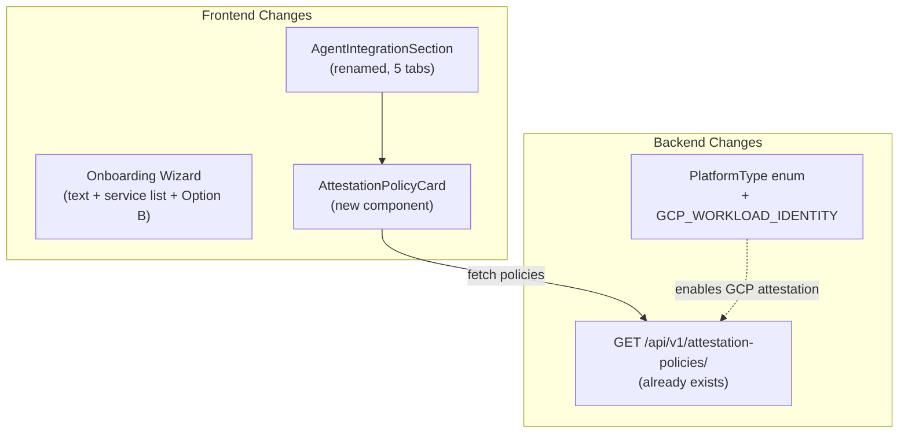

# Spec: P3 — GCP Post-P2 UX Alignment

> **Status:** Draft
> **Author:** Mahendra / AI
> **Created:** May 15, 2026
> **Priority:** P3 — GCP: Post-P2 UX Alignment
> **Roadmap Phase:** Phase 2: Q3 2026 — GCP Experience
> **Priority Master:** [`plans/PRIORITY_MASTER.md`](../../plans/PRIORITY_MASTER.md)
> **Product Roadmap:** [`plans/PRODUCT_ROADMAP.md`](../../plans/PRODUCT_ROADMAP.md)
> **Design Doc:** `docs/design/p3-gcp-ux-alignment.md` *(populated after `/create-design-doc`)*

---

## Priority & Roadmap Mapping

### Priority Master Mapping ([`plans/PRIORITY_MASTER.md`](../../plans/PRIORITY_MASTER.md))

This spec covers **P3 — GCP: Post-P2 UX Alignment** from the Priority Master.

| Priority Group | Coverage | Items in This Spec |
|---------------|----------|--------------------|
| **P3 — GCP: Post-P2 UX Alignment** | ✅ Full | Onboarding text refresh, service list fix, OAuth flow simplification (Option B), Deploy Config → Agent Integration rename, GCP tab, attestation policy tab, `GCP_WORKLOAD_IDENTITY` enum |
| **P8 — AWS: Post-P2 UX Alignment** | ❌ Not in scope | AWS snippet update deferred — no AWS users on current SaaS deployment |
| **P4 — GCP Identity Provider** | ❌ Not in scope | SDK `GcpIdentityProvider`, backend bootstrap endpoint — separate spec. GCP tab shows instructions regardless of SDK readiness |

### Product Roadmap Mapping ([`plans/PRODUCT_ROADMAP.md`](../../plans/PRODUCT_ROADMAP.md))

This spec delivers **Phase 2: Q3 2026 — GCP Experience** P3 items from the product roadmap.

| Roadmap Phase | Coverage | What This Spec Delivers |
|--------------|----------|------------------------|
| **Phase 2: P3 GCP UX Alignment** | ✅ Complete | All 7 items from P3 table in roadmap |
| **Phase 2: P4 GCP Identity Provider** | ❌ Not in scope | Separate spec — SDK + backend implementation |
| **Phase 4: P8 AWS UX Alignment** | ❌ Not in scope | Deferred until AWS vendors need it |

### Persona Capability Unlocked by This Spec

| Persona | Capability Unlocked |
|---------|---------------------|
| **Employee** | Onboarding wizard with correct service list (no HubSpot), non-broken Connect Service step, "trust layer" framing |
| **IT Admin** | Attestation Policy tab on agent detail page — view/create attestation policies per agent |
| **Security Team** | *(indirect)* Attestation policies visible on agent detail page |
| **Engineer / Developer** | Agent Integration tab with GCP Workload Identity snippet, SDK Quick Start, attestation policy management |

### What This Spec Unblocks

| Blocked Item | Needs | Covered By |
|--------------|-------|-----------|
| P4 — GCP Identity Provider | GCP tab in Agent Integration section (shows instructions before SDK is ready) | Section 4.2 (GCP tab) |
| P5 — Vendor Platform | Attestation Policy tab (vendors map platform identity to agents) | Section 4.3 (Attestation tab) |
| P8 — AWS UX Alignment | Component renamed to `AgentIntegrationSection` with extensible tab structure | Section 4.1 (rename + tab structure) |

---

## Table of Contents

1. [Objective](#1-objective)
2. [Goals & Non-Goals](#2-goals--non-goals)
3. [Background](#3-background)
4. [Technical Design](#4-technical-design)
5. [Data Models](#5-data-models)
6. [API Contracts](#6-api-contracts)
7. [Security Considerations](#7-security-considerations)
8. [Project Structure](#8-project-structure)
9. [Testing Strategy](#9-testing-strategy)
10. [Demo Scenarios / User Journeys](#10-demo-scenarios--user-journeys)
11. [Rollout Plan](#11-rollout-plan)
12. [Boundaries](#12-boundaries)
13. [Dependencies & Risks](#13-dependencies--risks)
14. [Open Questions](#14-open-questions)
15. [References](#15-references)

---

## 1. Objective

Align the shipped P2 UI with the GCP SaaS reality on `app.deepsecure.one`. Fix stale text (from "deployment platform" era), a broken OAuth redirect in the onboarding wizard, and reframe the Deploy Config section as Agent Integration with a GCP tab and attestation policy support.

### User Stories / Acceptance Criteria

- As an **Employee**, I want the onboarding wizard to show the correct services (not HubSpot) and not break when I skip connecting services, so that my first experience with DeepSecure is smooth.
- As an **Engineer**, I want a GCP Workload Identity snippet on the agent detail page so I know how to connect my Cloud Run agent to DeepTrail without reading external docs.
- As an **IT Admin**, I want to see and create attestation policies directly from the agent detail page so I can map platform identities to agents without navigating to a separate page.

### Success Criteria

- [ ] Onboarding wizard shows 5 services matching the Services page: Notion, Slack, Gmail, Google Calendar, Google Drive (no HubSpot)
- [ ] Connect Service step in onboarding is read-only with link to Services page (no broken OAuth redirect)
- [ ] All onboarding text uses "trust layer" framing, not "identity-based security"
- [ ] Register Agent step mentions platform attestation alongside Ed25519 keys
- [ ] Agent detail page shows "Agent Integration" (not "Deploy Configuration")
- [ ] Agent Integration has 4 tabs: SDK Quick Start, AWS, GCP, Kubernetes, plus Attestation Policy
- [ ] GCP tab shows Workload Identity snippet with `DEEPSECURE_IDENTITY_PROVIDER=gcp`
- [ ] Attestation Policy tab fetches and displays policies for the current agent from `GET /api/v1/attestation-policies/`
- [ ] `GCP_WORKLOAD_IDENTITY` is a valid `PlatformType` enum value in the backend
- [ ] All 7 existing DeployConfigSection tests updated and passing for new structure
- [ ] Changes deployed to `app.deepsecure.one` via Docker rebuild + Cloud Run update

---

## 2. Goals & Non-Goals

### Goals

- [ ] Fix all stale "deployment platform" text to "trust layer" framing across onboarding wizard
- [ ] Remove broken OAuth Connect buttons from onboarding wizard (Option B: read-only list with link to Services page)
- [ ] Fix service list mismatch (replace HubSpot with Google Calendar)
- [ ] Rename `DeployConfigSection` → `AgentIntegrationSection` with backward-compat alias
- [ ] Add GCP tab with Workload Identity integration snippet
- [ ] Add Attestation Policy tab that fetches from existing backend CRUD API
- [ ] Add `GCP_WORKLOAD_IDENTITY` to `PlatformType` enum with Alembic migration
- [ ] Deploy all changes to `app.deepsecure.one`

### Non-Goals

- **AWS snippet update** — Deferred to P8. The AWS tab keeps its current content.
- **GCP Identity Provider SDK implementation** — Deferred to P4. The GCP tab shows instructions regardless of SDK readiness.
- **Full onboarding OAuth fix (Option A)** — Deferred. Option B (read-only list) chosen for simplicity. Option A can be revisited if users need in-wizard OAuth connections.
- **Inline attestation policy creation form** — V1 shows existing policies and links to create. Inline form is a future enhancement.
- **Organization-scoped attestation policies** — P5 scope. Attestation policies remain user-scoped.

---

## 3. Background

### Current State

| Capability | Current Status | File / Notes |
|------------|----------------|--------------|
| Onboarding page subtitle | "identity-based security" | `onboarding/page.tsx` line 68 |
| Welcome step intro text | "identity-based security" | `WelcomeWizard.tsx` line 124 |
| Trust model first bullet | "Ed25519 cryptographic keys" | `WelcomeWizard.tsx` line 130 |
| OAUTH_SERVICES array | HubSpot present, Google Calendar missing | `WelcomeWizard.tsx` lines 140-146 |
| Connect Service step | Broken OAuth redirect — state lost on return, wizard resets to step 0 | `WelcomeWizard.tsx` lines 148-215 |
| Register Agent text | Ed25519-only framing | `WelcomeWizard.tsx` lines 217-233 |
| Deploy Config component | "Deploy Configuration" title, 3 tabs: Environment / AWS / Kubernetes | `DeployConfigSection.tsx` (188 lines) |
| GCP tab | Missing | Not implemented |
| Attestation Policy tab | Missing (backend CRUD exists at `/api/v1/attestation-policies/`) | Not implemented |
| `GCP_WORKLOAD_IDENTITY` enum | Missing | `attestation_policy.py` has 4 values: kubernetes, aws_iam, azure_managed_identity, docker_container |
| Agent Integration section tests | 7 tests for 3-tab structure | `__tests__/DeployConfigSection.test.tsx` (85 lines) |
| Component export | `DeployConfigSection` in barrel `index.ts` | Line 9 |
| Agent detail page usage | `<DeployConfigSection agentId={agentId} />` at line 329 | `agents/[id]/activity/page.tsx` |

### Motivation

1. **First-impression problem.** New users on `app.deepsecure.one` see "identity-based security" and "Ed25519 cryptographic keys" — technical jargon that doesn't communicate the product value of a "trust layer for AI agents."

2. **Broken onboarding flow.** Clicking Connect for any service triggers an OAuth redirect that loses all wizard state. The user returns to step 0 (Welcome) with no indication the connection succeeded. This is the worst first-time experience.

3. **Missing GCP integration path.** The SaaS runs on GCP. Engineers deploying agents on Cloud Run/GCE have no guidance on the agent detail page for GCP Workload Identity — only Environment (static keys), AWS, and Kubernetes tabs exist.

4. **Attestation policies are invisible.** The backend CRUD API for attestation policies is fully implemented but the frontend has no way to view or manage them from the agent detail page. Vendors and IT admins must use curl.

---

## 4. Technical Design

### Services Affected

| Service | Impact | Changes |
|---------|--------|---------|
| deeptrail-control | Low | Add `GCP_WORKLOAD_IDENTITY` to `PlatformType` enum + Alembic migration |
| deeptrail-gateway | None | No changes |
| deepsecure (SDK) | None | No changes (P4 scope) |
| frontend | High | Onboarding wizard text + flow, DeployConfig → AgentIntegration rename, GCP tab, AttestationPolicyCard |

### Architecture Overview

No cross-service architectural changes. This is primarily a frontend UX update with one backend enum addition.



### Key Components

**1. `AgentIntegrationSection`** (`frontend/src/components/agents/DeployConfigSection.tsx` — renamed)

```typescript
type RuntimeTab = "sdk" | "aws" | "gcp" | "k8s" | "attestation";

interface AgentIntegrationSectionProps {
  agentId: string;
  className?: string;
}
```

Tabs (5 total):

| Tab Key | Label | Icon | Description | New? |
|---------|-------|------|-------------|------|
| `sdk` | SDK Quick Start | `Terminal` | "Add the DeepSecure SDK to your existing agent" | Renamed from "Environment" |
| `aws` | AWS | `Cloud` | Current content unchanged (deferred to P8) | Existing |
| `gcp` | GCP | `Server` | "Authenticate via GCP Workload Identity" | **New** |
| `k8s` | Kubernetes | `Ship` | Current content unchanged | Existing |
| `attestation` | Attestation Policy | `ShieldCheck` | "Map platform identity to this agent" | **New** |

**2. GCP snippet function:**

```typescript
function gcpSnippet(agentId: string): string {
  return `# In your Cloud Run / GCE / GKE deployment, set:
#   DEEPSECURE_AGENT_ID=${agentId}
#   DEEPSECURE_IDENTITY_PROVIDER=gcp
#
# The SDK uses the GCP metadata server to fetch an OIDC
# identity token and prove agent identity automatically.

from deepsecure import Client

client = Client()  # auto-detects GCP identity
agent = client.agents.authenticate()`;
}
```

**3. `AttestationPolicyCard`** (`frontend/src/components/agents/AttestationPolicyCard.tsx` — new)

```typescript
interface AttestationPolicyCardProps {
  agentId: string;
}

// Fetches GET /api/v1/attestation-policies/ (via proxy)
// Filters for policies where agent_name_to_bootstrap matches agentId
// Shows: platform, selector, status, created_at
// If no policies: shows info message with link to create one
```

**4. Updated `ConnectServiceContent` (Option B — read-only):**

```typescript
// No OAuth flows. No handleConnect. No useState for connection state.
// Shows the 5 supported services as a read-only list.
// Includes a link: "Connect services from the Services page"

const SUPPORTED_SERVICES = [
  { id: "notion", label: "Notion", icon: "N" },
  { id: "slack", label: "Slack", icon: "S" },
  { id: "gmail", label: "Gmail", icon: "M" },
  { id: "gcalendar", label: "Google Calendar", icon: "C" },
  { id: "gdrive", label: "Google Drive", icon: "G" },
] as const;
```

**5. Updated SDK Quick Start snippet:**

```typescript
function sdkSnippet(agentId: string): string {
  return `export DEEPSECURE_AGENT_ID="${agentId}"
export DEEPSECURE_DEEPTRAIL_CONTROL_URL="https://app.deepsecure.one"

# Option 1: Platform-native identity (recommended for GCP/AWS)
export DEEPSECURE_IDENTITY_PROVIDER=gcp  # or aws

# Option 2: Ed25519 key-based identity (for local dev / CI)
export DEEPSECURE_PRIVATE_KEY="<your-base64-private-key>"`;
}
```

### Architecture Decisions

| Decision | Options Considered | Chosen | Rationale |
|----------|--------------------|--------|-----------|
| Onboarding Connect Service step | A: Fix OAuth flow, B: Read-only list, C: Hybrid status+link | B: Read-only list | Lowest effort. OAuth flows work perfectly on the Services page. No need to replicate in the wizard. |
| Attestation Policy tab content | Inline CRUD form vs. fetch-and-display with link | Fetch-and-display with link | Backend CRUD exists but inline forms add complexity. V1 shows existing policies and links to a create action. |
| GCP tab placement | After AWS / Before AWS / Last | After AWS (3rd tab) | Matches cloud provider alphabetical grouping: AWS, GCP, K8s |
| Backward-compat alias | Keep old export vs. remove | Keep alias `DeployConfigSection = AgentIntegrationSection` | Prevents breaking any other imports; low cost |

### Provider Parity

No provider-specific behavior changes. The GCP tab is a static code snippet. The attestation policy tab reads from a provider-agnostic API.

---

## 5. Data Models

### Modified: `PlatformType` enum (`deeptrail-control/app/models/attestation_policy.py`)

| Value | Description | Status |
|-------|-------------|--------|
| `KUBERNETES` | Kubernetes service account | Existing |
| `AWS_IAM` | AWS IAM role | Existing |
| `AZURE_MANAGED_IDENTITY` | Azure Managed Identity | Existing |
| `DOCKER_CONTAINER` | Docker container identity | Existing |
| **`GCP_WORKLOAD_IDENTITY`** | **GCP Workload Identity (service account)** | **New** |

### Migration Required

Alembic migration to add `gcp_workload_identity` to the `platformtype` PostgreSQL enum type.

```python
# deeptrail-control/alembic/versions/xxxx_add_gcp_workload_identity.py
def upgrade():
    op.execute("ALTER TYPE platformtype ADD VALUE IF NOT EXISTS 'gcp_workload_identity'")

def downgrade():
    pass  # PostgreSQL does not support removing enum values
```

No other schema changes.

---

## 6. API Contracts

> **No new API endpoints.** This spec consumes existing endpoints only.

### Existing Endpoints Used

| Method | Endpoint | Purpose | Auth |
|--------|----------|---------|------|
| GET | `/api/v1/attestation-policies/` | List attestation policies (filter by `agent_name_to_bootstrap` on client) | User JWT |

The `AttestationPolicyCard` component fetches from `GET /api/v1/attestation-policies/` via the frontend proxy (`/api/proxy/attestation-policies/`). No new endpoints are needed.

### Response Schema (existing)

```json
[
  {
    "id": "uuid",
    "platform": "gcp_workload_identity",
    "selector": "sa@project.iam.gserviceaccount.com",
    "agent_name_to_bootstrap": "my-agent-id",
    "is_active": true,
    "created_at": "2026-05-15T00:00:00Z"
  }
]
```

---

## 7. Security Considerations

### Access Control

- The attestation policy list endpoint is protected by User JWT. Users can only see their own policies.
- The `AttestationPolicyCard` does client-side filtering by `agent_name_to_bootstrap`. This is acceptable because the backend already scopes results to the authenticated user.
- No new write operations are introduced. Attestation policy creation is done through the existing API (accessed from the Attestation Policy tab via a link/button).

### No Token/Credential Changes

This spec does not modify any token handling, credential storage, or authentication flows. The onboarding wizard's OAuth Connect buttons are being **removed**, which eliminates the broken redirect flow — a net security improvement (no more dangling state tokens).

---

## 8. Project Structure

### Workstream A: Onboarding Wizard Refresh (Frontend)

| File | Action | Purpose |
|------|--------|---------|
| `frontend/src/app/(dashboard)/onboarding/page.tsx` | Modify | Update subtitle: "identity-based security" → "trust layer" |
| `frontend/src/components/onboarding/WelcomeWizard.tsx` | Modify | Update WelcomeContent text + trust model bullets; replace OAUTH_SERVICES with SUPPORTED_SERVICES; rewrite ConnectServiceContent as read-only; update RegisterAgentContent text |

### Workstream B: Agent Integration Reframing (Frontend + Backend)

| File | Action | Purpose |
|------|--------|---------|
| `frontend/src/components/agents/DeployConfigSection.tsx` | Modify | Rename component to `AgentIntegrationSection`; change title; rename Environment → SDK Quick Start + update snippet; add GCP tab + snippet; add Attestation Policy tab; change `RuntimeTab` type to 5 values |
| `frontend/src/components/agents/AttestationPolicyCard.tsx` | Create | New component: fetch attestation policies for agent, display or show "no policies" with link to create |
| `frontend/src/components/agents/__tests__/DeployConfigSection.test.tsx` | Modify | Update all 7 tests for new title "Agent Integration", 5 tab buttons, GCP snippet content, attestation tab rendering, SDK Quick Start tab name |
| `frontend/src/components/agents/index.ts` | Modify | Export `AgentIntegrationSection` + backward-compat alias `DeployConfigSection` |
| `frontend/src/app/(dashboard)/dashboard/agents/[id]/activity/page.tsx` | Modify | Update comment "Deploy Configuration" → "Agent Integration" (line 328); optionally update import to use new name |
| `deeptrail-control/app/models/attestation_policy.py` | Modify | Add `GCP_WORKLOAD_IDENTITY = "gcp_workload_identity"` to `PlatformType` enum |
| `deeptrail-control/alembic/versions/` | Create | Migration to add `gcp_workload_identity` to PostgreSQL `platformtype` enum |

### Complexity Estimates

| Workstream | Complexity | Rationale |
|------------|------------|-----------|
| WS-A: Onboarding Wizard Refresh | S (2-3 tasks) | Text-only changes + removing OAuth flow code (simpler, not more complex) |
| WS-B: Agent Integration Reframing | M (5-6 tasks) | New component (AttestationPolicyCard), tab restructure, GCP snippet, enum migration, test updates |

---

## 9. Testing Strategy

### Test Matrix

| Level | What | Location | Framework |
|-------|------|----------|-----------|
| Unit | AgentIntegrationSection renders 5 tabs, GCP snippet, attestation tab | `frontend/src/components/agents/__tests__/DeployConfigSection.test.tsx` | Jest + React Testing Library |
| Unit | AttestationPolicyCard renders policies / empty state | `frontend/src/components/agents/__tests__/AttestationPolicyCard.test.tsx` (new) | Jest + React Testing Library |
| Manual | Onboarding wizard flow on `app.deepsecure.one` | Browser | Manual walkthrough |

### Key Test Scenarios

- [ ] Title renders as "Agent Integration" (not "Deploy Configuration")
- [ ] 5 tab buttons appear: SDK Quick Start, AWS, GCP, Kubernetes, Attestation Policy
- [ ] Default tab (SDK Quick Start) shows `DEEPSECURE_IDENTITY_PROVIDER` env var
- [ ] GCP tab shows `DEEPSECURE_IDENTITY_PROVIDER=gcp` and Cloud Run reference
- [ ] Attestation Policy tab renders (with mocked empty response → shows "No policies" message)
- [ ] Attestation Policy tab renders (with mocked policy → shows platform, selector, agent mapping)
- [ ] Copy button copies GCP snippet content
- [ ] Backward-compat: `DeployConfigSection` alias works
- [ ] Onboarding wizard shows 5 services: Notion, Slack, Gmail, Google Calendar, Google Drive
- [ ] No Connect buttons on onboarding wizard (read-only list)
- [ ] Onboarding welcome text says "trust layer"
- [ ] Register Agent text mentions "platform-native attestation"

### Technical Requirements

| Requirement | Correct Pattern | Common Mistake |
|-------------|-----------------|----------------|
| Mock `fetch` for AttestationPolicyCard | `jest.spyOn(global, 'fetch')` or mock `apiClient` | Calling live API in tests |
| Test tab switching | `fireEvent.click` on tab button, then assert content | Asserting all tabs render simultaneously |

### Coverage Requirements

- New code (`AttestationPolicyCard`): >80% coverage
- Modified code (`AgentIntegrationSection`): maintain existing coverage

---

## 10. Demo Scenarios / User Journeys

### Scenario 1: Employee (Sarah) — First-Time Onboarding

**Persona:** Sarah, Employee at Acme Corp, first login to `app.deepsecure.one`
**Pre-conditions:** Sarah has logged in via Google SSO. Onboarding has not been completed.

| Step | Action | Expected Result | Validates |
|------|--------|-----------------|-----------|
| 1 | Sarah sees the onboarding page | Subtitle says "Follow these steps to set up a trust layer for your AI agents." | Text refresh |
| 2 | Welcome step shows trust model | First bullet says "Agents prove their identity through platform-native attestation" (not Ed25519) | Trust model update |
| 3 | Sarah clicks Next → Connect Service | 5 services shown: Notion, Slack, Gmail, Google Calendar, Google Drive. No Connect buttons. Link says "Connect services from the Services page" | Option B, service list fix |
| 4 | Sarah clicks Next → Register Agent | Text mentions "platform-native attestation or cryptographic keys" | Register Agent text update |
| 5 | Sarah clicks through to Complete | "Go to Dashboard" works | No regressions |

**Success criteria:** No broken OAuth redirects. No HubSpot. All text uses "trust layer" framing.

### Scenario 2: Engineer (Dev) — GCP Agent Integration

**Persona:** Dev, Engineer at Acme Corp, has registered an agent on `app.deepsecure.one`
**Pre-conditions:** Agent exists. Dev is on the agent detail page.

| Step | Action | Expected Result | Validates |
|------|--------|-----------------|-----------|
| 1 | Dev sees the Agent Integration section | Title says "Agent Integration" (not "Deploy Configuration") | Rename |
| 2 | Dev sees 5 tabs | SDK Quick Start, AWS, GCP, Kubernetes, Attestation Policy | Tab structure |
| 3 | Dev clicks GCP tab | Shows snippet with `DEEPSECURE_IDENTITY_PROVIDER=gcp` and `Client()` | GCP snippet |
| 4 | Dev clicks Copy button | GCP snippet copied to clipboard | Copy functionality |
| 5 | Dev clicks Attestation Policy tab | Shows "No attestation policies" message (agent has none yet) with link to create | Attestation tab empty state |

**Success criteria:** Engineer can find GCP integration instructions without leaving the agent detail page.

### Scenario 3: Error/Edge Case — Agent with Existing Attestation Policy

**Pre-conditions:** An attestation policy exists with `agent_name_to_bootstrap` matching the current agent's ID and `platform: gcp_workload_identity`.

| Step | Action | Expected Result | Validates |
|------|--------|-----------------|-----------|
| 1 | User opens agent detail page → Attestation Policy tab | Shows the policy: platform = "GCP Workload Identity", selector = "sa@project.iam.gserviceaccount.com" | Attestation tab with data |
| 2 | API returns 401 (session expired) | Tab shows error message, not crash | Error handling |

---

## 11. Rollout Plan

### Phase 1: Workstream A — Onboarding Wizard (1 session, ~30 min)

**Tasks:** Text updates + service list + Option B rewrite of ConnectServiceContent
**Duration:** ~30 minutes
**Deliverable:** Onboarding wizard with correct text, service list, and non-broken Connect step
**Demo impact:** First-time user experience on `app.deepsecure.one` is fixed

### Phase 2: Workstream B — Agent Integration (1-2 sessions, ~2 hours)

**Tasks:** Rename component, add GCP tab + snippet, create AttestationPolicyCard, add attestation tab, update tests, backend enum migration
**Duration:** ~2 hours
**Deliverable:** Agent detail page shows "Agent Integration" with 5 tabs including GCP and Attestation Policy
**Demo impact:** Engineers and IT admins see GCP integration path and attestation policies on agent pages

### Phase 3: Deploy (1 session, ~15 min)

**Tasks:** Build frontend + control plane images, push, deploy to Cloud Run, run DB migration
**Duration:** ~15 minutes
**Deliverable:** Changes live on `app.deepsecure.one`

```bash
# Frontend
cd frontend
docker build --platform linux/amd64 -t us-central1-docker.pkg.dev/deepsecure-saas/deepsecure/frontend:latest .
docker push us-central1-docker.pkg.dev/deepsecure-saas/deepsecure/frontend:latest
gcloud run services update frontend --region=us-central1 --project=deepsecure-saas \
  --image=us-central1-docker.pkg.dev/deepsecure-saas/deepsecure/frontend:latest

# Control Plane (for enum migration)
cd ../deeptrail-control
docker build --platform linux/amd64 -t us-central1-docker.pkg.dev/deepsecure-saas/deepsecure/deeptrail-control:latest .
docker push us-central1-docker.pkg.dev/deepsecure-saas/deepsecure/deeptrail-control:latest
gcloud run services update deeptrail-control --region=us-central1 --project=deepsecure-saas \
  --image=us-central1-docker.pkg.dev/deepsecure-saas/deepsecure/deeptrail-control:latest

# DB Migration
cd ../infra
./migrate.sh
```

---

## 12. Boundaries

### Always Do

- Run `npm run build` in `frontend/` before pushing Docker image
- Run existing tests (`npm test`) before declaring complete
- Use `--platform linux/amd64` for Docker builds (Apple Silicon → Cloud Run)
- Follow existing tab structure patterns in `DeployConfigSection.tsx`

### Ask First

- Changes to the attestation policy API contract (backend team)
- Changes to the onboarding completion flow (`completeOnboarding()`)

### Never Do

- Commit secrets or private keys
- Remove the backward-compat `DeployConfigSection` export (other code may reference it)
- Modify the AWS tab content (deferred to P8)
- Add OAuth flows back to the onboarding wizard (Option B explicitly removes them)

---

## 13. Dependencies & Risks

### External Dependencies

| Dependency | Risk | Mitigation |
|------------|------|------------|
| `GET /api/v1/attestation-policies/` endpoint | Low — already implemented and tested | Verify endpoint works via curl before building AttestationPolicyCard |
| Frontend proxy routes `api/proxy/attestation-policies/` | Low — catch-all proxy should handle this | Test via browser DevTools network tab |
| Docker build + Cloud Run deploy | Low — process is established (P-I resolved 29 issues) | Follow `infra/DEPLOYMENT_ISSUES_LOG.md` lessons |

### Risks

| Risk | Probability | Impact | Mitigation |
|------|-------------|--------|------------|
| AttestationPolicyCard API call fails on production | Low | Medium — tab shows error instead of policies | Add error boundary with retry button |
| `ALTER TYPE ... ADD VALUE` migration fails on Cloud SQL | Low | Medium — Control Plane won't start | Test migration locally first; `IF NOT EXISTS` clause prevents duplicate errors |
| Existing tests break due to tab rename | Medium | Low — tests are straightforward | Update all 7 tests in same commit |

---

## 14. Open Questions

All resolved:

- [x] OAuth flow option: **Option B** (read-only list, link to Services page) — chosen by user
- [x] GCP-only scope: **Confirmed** — AWS deferred to P8
- [x] Attestation policy tab: **Fetch-and-display** with link to create (not inline form)

---

## 15. References

- [`plans/onboarding_wizard_refresh_ad0436b5.plan.md`](../../plans/onboarding_wizard_refresh_ad0436b5.plan.md) — Onboarding wizard text changes, service list fix, OAuth flow options analysis
- [`plans/deploy_config_ui_reframing_0de53658.plan.md`](../../plans/deploy_config_ui_reframing_0de53658.plan.md) — Deploy Config → Agent Integration reframing, GCP tab, attestation tab design
- [`plans/PRIORITY_MASTER.md`](../../plans/PRIORITY_MASTER.md) — P3 section with all items
- [`plans/PRODUCT_ROADMAP.md`](../../plans/PRODUCT_ROADMAP.md) — Phase 2 GCP Experience section
- [`plans/vendor_agent_use_case_27521870.plan.md`](../../plans/vendor_agent_use_case_27521870.plan.md) — Model A/D positioning context
- [`plans/gcp_identity_provider_1c6d83bc.md`](../../plans/gcp_identity_provider_1c6d83bc.md) — P4 GCP Identity Provider (downstream dependency)
- [`infra/DEPLOYMENT_ISSUES_LOG.md`](../../infra/DEPLOYMENT_ISSUES_LOG.md) — Deployment lessons learned
- [`deeptrail-control/app/api/v1/endpoints/attestation_policies.py`](../../deeptrail-control/app/api/v1/endpoints/attestation_policies.py) — Existing attestation policy CRUD API
- [`frontend/src/components/agents/DeployConfigSection.tsx`](../../frontend/src/components/agents/DeployConfigSection.tsx) — Current component (188 lines, 3 tabs)
- [`frontend/src/components/onboarding/WelcomeWizard.tsx`](../../frontend/src/components/onboarding/WelcomeWizard.tsx) — Current onboarding wizard (273 lines)
