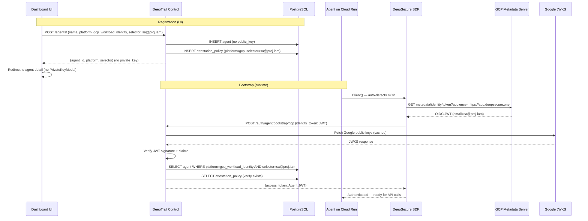

# Spec: P4 — GCP Identity Provider + Agent Registration Redesign

> **Status:** Draft
> **Author:** AI-assisted
> **Created:** May 16, 2026
> **Priority:** P4 — GCP Identity Provider + Agent Registration Redesign
> **Roadmap Phase:** Phase 2: Q3 2026 — GCP Experience
> **Priority Master:** [`plans/PRIORITY_MASTER.md`](../../plans/PRIORITY_MASTER.md)
> **Product Roadmap:** [`plans/PRODUCT_ROADMAP.md`](../../plans/PRODUCT_ROADMAP.md)
> **Plan Source:** [`plans/p4_register_agent_redesign_e32dfe1f.plan.md`](../../plans/p4_register_agent_redesign_e32dfe1f.plan.md)
> **Design Doc:** [`docs/design/p4-gcp-identity-agent-registration.md`](../design/p4-gcp-identity-agent-registration.md)

---

## Priority & Roadmap Mapping

### Priority Master Mapping ([`plans/PRIORITY_MASTER.md`](../../plans/PRIORITY_MASTER.md))

This spec covers **P4** from the Priority Master.

| Priority Group | Coverage | Items in This Spec |
|---------------|----------|--------------------|
| **P4 — GCP Identity Provider + Agent Registration Redesign** | ✅ Full | All Batch 1 (schema + model), Batch 2 (frontend + backend), and Batch 3 (SDK + E2E) items |
| **P3 — GCP UX Alignment** *(completed)* | ❌ Prerequisite only | P3 created `GCP_WORKLOAD_IDENTITY` in `PlatformType` enum and the `AgentIntegrationSection` — P4 replaces the latter |
| **P5 — Vendor Platform** | ❌ Not in scope | Vendor onboarding, org model, vault import — deferred |
| **P8 — AWS UX Alignment** | ❌ Not in scope | AWS snippet updates deferred until AWS vendors need it |
| **P9 — AWS Identity Provider** | ❌ Not in scope | AWS bootstrap security fix deferred since no AWS users today |

### Product Roadmap Mapping ([`plans/PRODUCT_ROADMAP.md`](../../plans/PRODUCT_ROADMAP.md))

This spec delivers the remaining items in **Phase 2: Q3 2026 — GCP Experience**.

| Roadmap Phase | Coverage | What This Spec Delivers |
|--------------|----------|------------------------|
| **Phase 1: Q2 2026** ✅ | ❌ Prerequisite only | Foundation, lifecycle, GCP SaaS already complete |
| **Phase 2: Q3 2026** | ⚠️ Partial (P4 of P3+P4) | GcpIdentityProvider SDK class, GCP bootstrap endpoint, Register Agent redesign, Agent Identity card, 1:1 selector-to-agent resolution |
| **Phase 3: Q3-Q4 2026** | ❌ Not in scope | Vendor Platform, Claude Code, Token Refresh |

### Persona Capability Unlocked by This Spec

| Persona | Capability Unlocked |
|---------|---------------------|
| **Employee** | Register agents via UI with any identity method (key, GCP, AWS, K8s). Simplified post-registration — no key management for platform agents. |
| **IT Admin** | `platform` and `selector` visible on agent records — see how each agent was registered and how it authenticates. |
| **Engineer / Developer** | `Client()` auto-detects GCP and bootstraps via OIDC. Zero-config for Cloud Run / GKE workloads. No `DEEPSECURE_AGENT_ID` env var needed for platform agents. |
| **Vendor Admin** | GCP-hosted vendor agents bootstrap via Workload Identity — no static key exchange with customer. |

### What This Spec Unblocks

| Blocked Item | Needs | Covered By |
|--------------|-------|-----------|
| P5 — Vendor Platform (GCP vendors) | GCP agents that can bootstrap identity | Batch 2-Backend: GCP bootstrap endpoint + Batch 3: GcpIdentityProvider |
| P8 — AWS UX Alignment | `AgentIntegrationSection` replaced, so AWS tab updates have a new target component | Batch 2-Frontend: AgentIdentityCard |
| P9 — AWS Identity Provider | `platform` + `selector` columns on Agent model; AWS bootstrap can reuse same 1:1 selector pattern | Batch 1: Schema foundation |
| P11 — AgentCore Integration | Agent model supports platform identity natively | Batch 1: Schema foundation |

---

## Table of Contents

1. [Objective](#1-objective)
2. [Goals & Non-Goals](#2-goals--non-goals)
3. [Background](#3-background)
4. [Technical Design](#4-technical-design)
5. [Data Models](#5-data-models)
6. [API Contracts](#6-api-contracts)
7. [Security Considerations](#7-security-considerations)
8. [Project Structure](#8-project-structure)
9. [Testing Strategy](#9-testing-strategy)
10. [Demo Scenarios / User Journeys](#10-demo-scenarios--user-journeys)
11. [Rollout Plan](#11-rollout-plan)
12. [Boundaries](#12-boundaries)
13. [Dependencies & Risks](#13-dependencies--risks)
14. [Open Questions](#14-open-questions)
15. [References](#15-references)

---

## 1. Objective

Enable GCP-hosted agents to authenticate with DeepSecure via Workload Identity (no static keys), redesign the Register Agent page to support platform identity selection alongside Ed25519 keys, and replace the 5-tab Agent Integration component with a context-aware Agent Identity card.

### User Stories / Acceptance Criteria

- As an **Engineer**, I want to deploy an agent on Cloud Run that authenticates via GCP Workload Identity so that I don't have to manage Ed25519 private keys.
- As an **Employee**, I want to register a GCP-backed agent through the UI by entering a service account email so that I don't need to use the CLI.
- As an **Engineer**, I want the agent detail page to show how my agent authenticates (key-based or platform) so that I understand the identity model at a glance.
- As a **Vendor Admin**, I want to register a vendor agent with a GCP service account so that the agent can bootstrap from a separate GCP project.

### Success Criteria

- [ ] An agent registered with `platform=gcp_workload_identity` + `selector=sa@project.iam.gserviceaccount.com` can bootstrap on Cloud Run by calling `Client()` — no env vars needed.
- [ ] The Register Agent UI offers 4 identity methods; selecting GCP shows a service account email field; submitting creates an agent + attestation policy.
- [ ] The Agent detail page shows an Agent Identity card (not 5 tabs) that displays method + selector for platform agents, or env vars for key agents.
- [ ] The `selector` column has a UNIQUE constraint; attempting to register two agents with the same selector returns 409.
- [ ] `GET /agents/{id}` returns `platform` and `selector` fields in the response.
- [ ] The GcpIdentityProvider SDK class fetches a GCP OIDC token and bootstraps without `DEEPSECURE_AGENT_ID`.

---

## 2. Goals & Non-Goals

### Goals

- [ ] **G1:** Platform-aware agent registration — backend accepts `platform` + `selector` fields, skips Ed25519 keygen for platform agents, auto-creates attestation policy.
- [ ] **G2:** GCP bootstrap — backend verifies GCP OIDC tokens via Google JWKS and issues Agent JWTs using 1:1 selector lookup.
- [ ] **G3:** SDK GCP provider — `GcpIdentityProvider` class fetches OIDC token from GCP metadata server, `_detect_gcp()` added to `EnvironmentDetector`.
- [ ] **G4:** Register Agent UI redesign — 4-method identity selector with conditional form fields per method.
- [ ] **G5:** Agent Identity card — context-aware single card replaces `AgentIntegrationSection`'s 5 tabs on agent detail page.
- [ ] **G6:** 1:1 selector-to-agent mapping — platform agents resolve by selector alone; no `DEEPSECURE_AGENT_ID` env var needed.

### Non-Goals

- **AWS bootstrap endpoint implementation** — AWS registration UI is included (form accepts IAM Role ARN), but `POST /auth/agent/bootstrap/aws` is NOT fixed (P9). The existing AWS bootstrap has a critical security bug (validates server identity, not agent's) that requires a separate scope.
- **Kubernetes bootstrap endpoint implementation** — K8s registration UI is included, but the existing K8s bootstrap endpoint already works. No changes to it.
- **Organization model / multi-tenancy** — P5 scope. Agent registration remains user-scoped.
- **`DEEPSECURE_IDENTITY_PROVIDER` env var** — Not needed. The 1:1 selector resolve and `Client()` auto-detection eliminate it for platform agents. Key-based agents use `DEEPSECURE_AGENT_ID` + `DEEPSECURE_PRIVATE_KEY` as before.
- **Frontend tests for E2E GCP flow** — The E2E test (Batch 3) requires a real GCP deployment; it cannot run in CI.

---

## 3. Background

### Current State

| Capability | Current Status | Location |
|------------|----------------|----------|
| Agent model columns | `agent_id`, `name`, `description`, `public_key` (NOT NULL, UNIQUE), `created_at`, `updated_at`, `last_seen_at` | `deeptrail-control/app/models/agent.py` |
| `platform` column on Agent | **Missing** | — |
| `selector` column on Agent | **Missing** | — |
| `public_key` nullable | **No** — `nullable=False` | `deeptrail-control/app/models/agent.py:14` |
| `AgentCreate` schema | Accepts `agent_id` (optional), `public_key` (optional bytes). No `platform`/`selector`. | `deeptrail-control/app/schemas/agent.py:30-47` |
| `Agent` response schema | Returns lifecycle fields. No `platform`/`selector`. | `deeptrail-control/app/schemas/agent.py:63-90` |
| `register_agent` endpoint | Only Ed25519 key flow. If no `public_key`, generates keypair, returns `private_key` once. | `deeptrail-control/app/api/v1/endpoints/agents.py:82-138` |
| `AgentCreateResponse` | Returns `private_key` (optional). No `platform`/`selector`. | `deeptrail-control/app/schemas/agent.py:132-144` |
| GCP bootstrap endpoint (`BootstrapService`) | **Missing** from `BootstrapService` — endpoints exist for K8s, AWS, Azure, Docker | `deeptrail-control/app/api/v1/endpoints/auth.py` |
| GCP attestation endpoint (separate) | **Partial** — `POST /bootstrap/attest` exists via `AttestationService.attest_gcp_and_create_agent()`. Verifies GCP OIDC token via `google-auth`, but **creates a new agent with Ed25519 key** instead of looking up existing agent by selector. Has bugs: hex public_key (schema expects base64), `new_agent.id` (should be `agent_id`), attestation policy check is a placeholder. | `deeptrail-control/app/services/attestation_service.py`, `deeptrail-control/app/api/v1/endpoints/bootstrap.py` |
| `validate_gcp_identity_token()` | **Missing** from `BootstrapService` — but `AttestationService` already does GCP OIDC verification via `google.oauth2.id_token.verify_token()` | `deeptrail-control/app/services/attestation_service.py:17-19` |
| `google-auth` library | **Already imported** in `attestation_service.py` — no new dependency needed | `deeptrail-control/app/services/attestation_service.py:2-3` |
| `GcpIdentityProvider` (SDK) | **Missing** — providers exist for Keyring, K8s, AWS, Azure, Docker | `deepsecure/_core/identity_provider.py` |
| `GCP` in `EnvironmentType` | **Missing** — enum has: KUBERNETES, AWS, AZURE, DOCKER, LOCAL, UNKNOWN | `deepsecure/_core/environment_detector.py:14-21` |
| `_detect_gcp()` | **Missing** — detectors exist for K8s, AWS, Azure, Docker, Local | `deepsecure/_core/environment_detector.py:41-47` |
| `GCP_WORKLOAD_IDENTITY` in `PlatformType` | **Implemented** in P3 | `deeptrail-control/app/models/attestation_policy.py` |
| Register Agent page (frontend) | Name, description, agent type (own/vendor), optional agent ID + public key. No identity method selector. | `frontend/src/app/(dashboard)/dashboard/agents/create/page.tsx` |
| `AgentIntegrationSection` (frontend) | 5 tabs: Environment, GCP, AWS, K8s, Attestation Policy. Shows code snippets. | `frontend/src/components/agents/AgentIntegrationSection.tsx` |
| `AgentIdentityCard` (frontend) | **Does not exist** | — |
| `IdentityMethodSelector` (frontend) | **Does not exist** | — |
| `AgentTypeSelector` (frontend) | 2-card selector (`own` | `vendor`). Radiogroup pattern. Good template for IdentityMethodSelector. | `frontend/src/components/agents/AgentTypeSelector.tsx` |

### Motivation

1. **Confusing split between UI and CLI registration.** The Register Agent page only supports Ed25519 key registration, but the GCP tab on the agent detail page tells users to register via CLI with `--platform gcp_workload_identity`. This means the UI created in P3 points users away from the UI.

2. **Unnecessary complexity for platform agents.** The 5-tab Agent Integration section shows code snippets for every platform, but `Client()` auto-detects the platform — the code is identical regardless. For platform agents, the user needs to do **nothing** post-registration.

3. **Key management burden for cloud-native deployments.** Engineers deploying agents on Cloud Run must manage Ed25519 private keys (copy from UI, store in Secret Manager, inject as env var). With GCP Workload Identity, the agent proves its identity using the platform's native OIDC token — zero secrets to manage.

---

## 4. Technical Design

### Services Affected

| Service | Impact | Changes |
|---------|--------|---------|
| deeptrail-control | High | New columns + migration, schema extensions, register endpoint update, new GCP bootstrap endpoint + token verification |
| deeptrail-gateway | None | No changes |
| deepsecure (SDK) | Medium | New `GcpIdentityProvider`, `_detect_gcp()` in `EnvironmentDetector`, `GCP` enum value |
| frontend | High | New `IdentityMethodSelector` + `AgentIdentityCard` components, Register Agent page redesign, agent detail page update |

### Architecture Overview



### Key Components

**1. GCP OIDC Token Verifier** (`deeptrail-control/app/services/bootstrap_service.py`)

```python
@dataclass
class GCPClaims:
    """Validated claims from a GCP identity token."""
    project_id: str
    service_account_email: str
    instance_id: Optional[str] = None

class BootstrapService:
    def validate_gcp_identity_token(self, token: str, expected_audience: str = "https://app.deepsecure.one") -> GCPClaims:
        """Verify a GCP OIDC identity token via Google's JWKS endpoint.
        
        Steps:
        1. Fetch Google's public JWKS (cached with 1-hour TTL)
        2. Decode and verify JWT signature
        3. Validate iss == "https://accounts.google.com"
        4. Validate aud matches expected_audience
        5. Extract email claim as service_account_email
        
        Raises:
            ValueError: If token is invalid, expired, or audience mismatch
        """
        ...

    def bootstrap_gcp_agent(self, identity_token: str, db: Session, client_ip: str = None) -> BootstrapResult:
        """Bootstrap a GCP agent using 1:1 selector lookup.
        
        Unlike other bootstrap methods, does NOT require agent_id in the request.
        The agent is resolved from the service account email in the OIDC token.
        """
        ...
```

**2. GcpIdentityProvider** (`deepsecure/_core/identity_provider.py`)

```python
class GcpIdentityProvider(IdentityProvider):
    """Identity provider using GCP metadata service OIDC identity token."""
    
    GCP_METADATA_URL = (
        "http://metadata.google.internal/computeMetadata/v1/"
        "instance/service-accounts/default/identity"
    )
    
    @property
    def name(self) -> str:
        return "gcp"
    
    def get_identity(self, agent_id: str = None) -> Optional[AgentIdentity]:
        """Fetch GCP OIDC token and bootstrap with DeepTrail Control.
        
        agent_id is optional — the bootstrap endpoint resolves the agent
        from the service account email (1:1 selector mapping).
        """
        ...
```

**3. GCP Environment Detection** (`deepsecure/_core/environment_detector.py`)

```python
def _detect_gcp(self) -> Optional[EnvironmentInfo]:
    """Detect GCP Compute Engine, Cloud Run, Cloud Functions, GKE.
    
    Signals (in priority order):
    1. K_SERVICE env var (Cloud Run)
    2. FUNCTION_TARGET env var (Cloud Functions)
    3. GOOGLE_CLOUD_PROJECT env var (any GCP)
    4. GCE_METADATA_HOST env var
    5. Metadata server probe: http://metadata.google.internal
    """
    ...
```

**4. IdentityMethodSelector** (`frontend/src/components/agents/IdentityMethodSelector.tsx`)

```typescript
export type IdentityMethod = "key" | "gcp" | "aws" | "k8s";

interface IdentityMethodSelectorProps {
  value: IdentityMethod;
  onChange: (method: IdentityMethod) => void;
}
```

Visually follows `AgentTypeSelector` pattern: responsive grid of selectable cards with icon + title + description.

**5. AgentIdentityCard** (`frontend/src/components/agents/AgentIdentityCard.tsx`)

```typescript
interface AgentIdentityCardProps {
  agentId: string;
  platform?: string | null;   // "gcp_workload_identity" | "aws_iam" | "kubernetes" | null
  selector?: string | null;   // service account email, IAM role ARN, k8s system:serviceaccount:ns:name
  className?: string;
}
```

Renders one of two variants:
- **Key-based** (platform is null): shows `DEEPSECURE_AGENT_ID` + `DEEPSECURE_PRIVATE_KEY` env vars with copy buttons.
- **Platform-based**: shows method label + selector value + "No keys or environment variables needed."

### Architecture Decisions

| Decision | Options Considered | Chosen | Rationale |
|----------|--------------------|--------|-----------|
| Agent resolution for platform bootstrap | A. Require `agent_id` in bootstrap request; B. 1:1 selector lookup (no `agent_id` needed) | **B** | Zero post-registration config. The service account email uniquely identifies the agent. Simplest UX for platform agents. |
| GCP token verification library | A. Raw `PyJWT` + manual JWKS fetch; B. `google-auth` library's `id_token.verify_oauth2_token()` | **B** | Already used by existing `AttestationService`. Officially supported by Google, handles JWKS caching and key rotation internally. |
| `platform` column type | A. Enum column; B. Nullable string | **B** | New platforms can be added without migrations. Values are validated at the schema level via Pydantic. |
| Frontend identity card | A. Refactor existing 5-tab component; B. New component, delete old one | **B** | The 5-tab component is fundamentally the wrong abstraction for platform agents. Cleaner to replace than refactor. |
| GCP audience value | A. Hard-coded URL; B. Configurable env var with default | **A** | Use the production URL `https://app.deepsecure.one` as the audience. Non-production environments override via `GCP_BOOTSTRAP_AUDIENCE` env var. |
| Google JWKS caching | A. No cache (fetch every request); B. In-memory cache with TTL | **B** | Cache Google's public keys. Standard practice — Google keys rotate infrequently. `google-auth` library handles caching internally. |

---

## 5. Data Models

### Modified: Agent

| Column | Type | Current | After P4 | Notes |
|--------|------|---------|----------|-------|
| `agent_id` | `String` PK | Exists | No change | |
| `name` | `String(255)` | Exists | No change | |
| `description` | `Text` | Exists | No change | |
| `public_key` | `LargeBinary` | NOT NULL, UNIQUE | **Nullable**, UNIQUE | Platform agents have no key |
| `platform` | `String(64)` | **Missing** | **New** — nullable | `"gcp_workload_identity"`, `"aws_iam"`, `"kubernetes"`, or NULL (key-based) |
| `selector` | `String(255)` | **Missing** | **New** — nullable, UNIQUE | Service account email, IAM role ARN, k8s `system:serviceaccount:namespace:name` |
| `created_at` | `DateTime(tz)` | Exists | No change | |
| `updated_at` | `DateTime(tz)` | Exists | No change | |
| `last_seen_at` | `DateTime(tz)` | Exists | No change | |

**Constraints:**
- `selector` has a UNIQUE index (enforces 1:1 agent-to-platform-identity mapping)
- `public_key` UNIQUE constraint remains (for key-based agents; NULL values don't conflict in PostgreSQL unique indexes)
- Business rule (enforced in Pydantic, not DB): `platform` and `selector` must both be set or both be NULL

### Alembic Migration

Single migration: `add_platform_selector_make_public_key_nullable.py`

```python
def upgrade():
    op.add_column('agents', sa.Column('platform', sa.String(64), nullable=True))
    op.add_column('agents', sa.Column('selector', sa.String(255), nullable=True))
    op.create_unique_constraint('uq_agents_selector', 'agents', ['selector'])
    op.alter_column('agents', 'public_key', nullable=True)

def downgrade():
    op.alter_column('agents', 'public_key', nullable=False)
    op.drop_constraint('uq_agents_selector', 'agents', type_='unique')
    op.drop_column('agents', 'selector')
    op.drop_column('agents', 'platform')
```

### No New Tables

Attestation policies are stored in the existing `attestation_policies` table (created in P3). Platform agent registration auto-creates a row linking the selector to the agent.

---

## 6. API Contracts

> **CRITICAL**: This section is the CANONICAL source for all API endpoints.
> Task tickets, tests, and implementations MUST match these exactly.

### Endpoint Summary

| Method | Endpoint | Purpose | Auth | Change Type |
|--------|----------|---------|------|-------------|
| POST | `/api/v1/agents/` | Register agent (extended) | User Token | **Modified** |
| GET | `/api/v1/agents/{agent_id}` | Get agent (extended response) | User Token | **Modified** |
| GET | `/api/v1/agents/` | List agents (extended response) | User Token | **Modified** |
| POST | `/api/v1/auth/agent/bootstrap/gcp` | GCP agent bootstrap | None (token in body) | **New** |

### POST /api/v1/agents/ (Modified)

Existing endpoint extended to accept platform identity fields.

**Request:**
```
Authorization: Bearer <user-token>
Content-Type: application/json
```

**Key-based registration (unchanged):**
```json
{
  "name": "Sales Agent",
  "description": "Helps with lead gen",
  "agent_id": null,
  "public_key": null
}
```

**Platform registration (NEW):**
```json
{
  "name": "Vendor Sync Agent",
  "description": "Syncs CRM data nightly",
  "platform": "gcp_workload_identity",
  "selector": "vendor-sync@my-project.iam.gserviceaccount.com"
}
```

**Response (201) — key-based (unchanged):**
```json
{
  "agent_id": "agent-c7d7853b-28f0-...",
  "name": "Sales Agent",
  "public_key": "base64...",
  "private_key": "base64...",
  "private_key_warning": "This private key will not be shown again.",
  "platform": null,
  "selector": null
}
```

**Response (201) — platform (NEW):**
```json
{
  "agent_id": "agent-e694edcb-...",
  "name": "Vendor Sync Agent",
  "public_key": null,
  "private_key": null,
  "private_key_warning": null,
  "platform": "gcp_workload_identity",
  "selector": "vendor-sync@my-project.iam.gserviceaccount.com"
}
```

**Error Responses:**

| Status | Condition |
|--------|-----------|
| 400 | `platform` set but `selector` missing (or vice versa) |
| 400 | `platform` value not in allowed set (`gcp_workload_identity`, `aws_iam`, `kubernetes`) |
| 400 | Invalid `selector` format for the given platform |
| 409 | Duplicate `selector` (another agent already registered with this platform identity) |
| 409 | Duplicate `agent_id` or `public_key` |

### GET /api/v1/agents/{agent_id} (Modified Response)

**Response (200):**
```json
{
  "agent_id": "agent-e694edcb-...",
  "name": "Vendor Sync Agent",
  "public_key": null,
  "platform": "gcp_workload_identity",
  "selector": "vendor-sync@my-project.iam.gserviceaccount.com",
  "lifecycle_state": "registered",
  "last_authenticated_at": null,
  "last_active_at": null,
  "session_count": 0,
  "delegation_count": 0
}
```

### POST /api/v1/auth/agent/bootstrap/gcp (New)

**Request:**
```
Content-Type: application/json
```

```json
{
  "identity_token": "<GCP OIDC JWT from metadata server>"
}
```

No `agent_id` in the request — the agent is resolved from the JWT's `email` claim via 1:1 selector lookup.

**Response (200):**
```json
{
  "access_token": "<Agent JWT>",
  "token_type": "bearer",
  "expires_in": 3600,
  "agent_id": "agent-e694edcb-..."
}
```

**Error Responses:**

| Status | Condition |
|--------|-----------|
| 400 | Missing `identity_token` field |
| 401 | Invalid or expired GCP OIDC token (signature verification failed) |
| 401 | Token `iss` is not `https://accounts.google.com` |
| 401 | Token `aud` does not match expected audience |
| 404 | No agent registered with the token's service account email as selector |
| 403 | Attestation policy not found for the agent (registration may have been incomplete) |

---

## 7. Security Considerations

### GCP OIDC Token Verification

- **Token source:** Agent fetches OIDC identity token from GCP metadata server at `http://metadata.google.internal`. This endpoint is only accessible from within GCP (not externally reachable).
- **Verification method:** JWT signature verified against Google's public JWKS at `https://www.googleapis.com/oauth2/v3/certs`. Uses the `google-auth` library's `id_token.verify_oauth2_token()`.
- **Claims validated:** `iss` must be `https://accounts.google.com`; `aud` must match the configured audience (default: `deepsecure`); `exp` must be in the future; `email` must be present and verified (`email_verified: true`).
- **Audience configuration:** The production audience is `https://app.deepsecure.one`. Non-production environments override via `GCP_BOOTSTRAP_AUDIENCE` env var on the control plane. The SDK requests a token with `?audience=<value>` from the metadata server.
- **JWKS caching:** Google's public keys are cached by the `google-auth` library internally. Cache invalidation on signature verification failure triggers a re-fetch (standard `google-auth` behavior).

### 1:1 Selector Uniqueness

- **UNIQUE constraint on `selector`** at the database level prevents two agents from sharing the same platform identity.
- **Fail-closed behavior:** If selector lookup returns no agent, the bootstrap returns 404 (not a generic error that leaks information).
- **No wildcard selectors:** Each selector must be an exact match (e.g., full service account email). Pattern-based selectors (e.g., `*@project.iam.gserviceaccount.com`) are explicitly NOT supported.

### Platform Agent Key Handling

- **Platform agents have no private key.** The `public_key` column is nullable for platform agents. No key is generated, stored, or returned.
- **Key-based agent flow unchanged.** When no `platform` is provided, the existing Ed25519 keygen flow runs. Private key shown once, never stored server-side.
- **Attestation policy auto-creation:** When a platform agent is registered, an attestation policy is automatically created linking the platform + selector to the agent. This policy is required for bootstrap — if it's somehow deleted, bootstrap fails with 403.

### Agent JWT Issuance

- The Agent JWT issued after GCP bootstrap follows the same format and claims as the existing challenge-response JWT.
- JWT includes `sub` (agent_id), `iss` (control plane), `exp`, `iat`, and `owner` (user who registered the agent).
- Token lifetime: 1 hour (matching existing agent JWTs).

---

## 8. Project Structure

### Workstream A: Backend Schema + Model + Registration (deeptrail-control)

| File | Action | Purpose |
|------|--------|---------|
| `deeptrail-control/app/models/agent.py` | Modify | Add `platform` + `selector` columns; make `public_key` nullable |
| `deeptrail-control/app/schemas/agent.py` | Modify | Extend `AgentCreate` with `platform` + `selector`; add validator; extend `Agent` + `AgentCreateResponse` responses |
| `deeptrail-control/alembic/versions/xxxx_add_platform_selector.py` | Create | Migration: add columns, unique constraint, alter `public_key` nullable |
| `deeptrail-control/app/api/v1/endpoints/agents.py` | Modify | Update `register_agent`: platform flow (skip keygen, auto-create attestation policy) |
| `deeptrail-control/tests/api/v1/test_agents_platform.py` | Create | Tests for platform registration, validation, duplicate selector |

### Workstream B: Backend GCP Bootstrap (deeptrail-control)

| File | Action | Purpose |
|------|--------|---------|
| `deeptrail-control/app/services/bootstrap_service.py` | Modify | Add `GCPClaims`, `validate_gcp_identity_token()`, `bootstrap_gcp_agent()` (with 1:1 selector lookup) |
| `deeptrail-control/app/services/attestation_service.py` | Modify | Refactor existing `attest_gcp_and_create_agent()` to use new 1:1 selector pattern (or consolidate into `bootstrap_service.py`) |
| `deeptrail-control/app/api/v1/endpoints/auth.py` | Modify | Add `POST /auth/agent/bootstrap/gcp` endpoint |
| `deeptrail-control/app/api/v1/endpoints/bootstrap.py` | Modify | Update or deprecate `POST /bootstrap/attest` to point to new endpoint |
| `deeptrail-control/app/schemas/bootstrap.py` | Modify | Add `GCPBootstrapRequest` schema (update existing `BootstrapRequest` or create alongside) |
| `deeptrail-control/tests/services/test_bootstrap_gcp.py` | Create | Tests for GCP OIDC verification (mock JWKS), selector lookup |
| `deeptrail-control/tests/api/v1/test_auth_bootstrap_gcp.py` | Create | Tests for the bootstrap endpoint |

### Workstream C: Frontend — Register Agent + Identity Card

| File | Action | Purpose |
|------|--------|---------|
| `frontend/src/components/agents/IdentityMethodSelector.tsx` | Create | 4-card identity method selector (key, GCP, AWS, K8s) |
| `frontend/src/components/agents/AgentIdentityCard.tsx` | Create | Single card: method + selector for platform agents, env vars for key agents |
| `frontend/src/app/(dashboard)/dashboard/agents/create/page.tsx` | Modify | Add identity method selector, conditional form fields, platform POST body |
| `frontend/src/app/(dashboard)/dashboard/agents/[id]/activity/page.tsx` | Modify | Replace `<AgentIntegrationSection>` with `<AgentIdentityCard>` |
| `frontend/src/components/agents/AgentIntegrationSection.tsx` | Delete | Replaced by AgentIdentityCard |
| `frontend/src/components/agents/index.ts` | Modify | Export new components, remove old exports |
| `frontend/src/components/agents/__tests__/IdentityMethodSelector.test.tsx` | Create | Tests for selector component |
| `frontend/src/components/agents/__tests__/AgentIdentityCard.test.tsx` | Create | Tests for identity card variants |
| `frontend/src/components/agents/__tests__/AgentIntegrationSection.test.tsx` | Delete | Replaced by AgentIdentityCard tests |

### Workstream D: SDK — GCP Identity Provider

| File | Action | Purpose |
|------|--------|---------|
| `deepsecure/_core/identity_provider.py` | Modify | Add `GcpIdentityProvider` class |
| `deepsecure/_core/environment_detector.py` | Modify | Add `GCP` to `EnvironmentType`, add `_detect_gcp()` method |
| `deepsecure/_core/identity_manager.py` | Modify | Add GCP to provider chain |
| `tests/_core/test_gcp_identity_provider.py` | Create | Unit tests (mock metadata server) |
| `tests/_core/test_environment_detector_gcp.py` | Create | Unit tests for GCP detection |

### Workstream E: E2E Test

| File | Action | Purpose |
|------|--------|---------|
| `tests/e2e/test_gcp_bootstrap_e2e.py` | Create | Full flow: UI register -> Cloud Run deploy -> bootstrap -> lifecycle check |

### Complexity Estimates

| Workstream | Complexity | Rationale |
|------------|------------|-----------|
| WS-A: Backend Schema + Registration | M (5 tasks) | Schema + migration + endpoint changes with validation logic |
| WS-B: Backend GCP Bootstrap | M (4 tasks) | OIDC verification, new endpoint, selector lookup |
| WS-C: Frontend Components | L (7 tasks) | Two new components, page redesign, component replacement, tests |
| WS-D: SDK GCP Provider | M (4 tasks) | New provider class, environment detection, integration |
| WS-E: E2E Test | S (1 task) | Requires live GCP deployment |

---

## 9. Testing Strategy

### Test Matrix

| Level | What | Location | Framework |
|-------|------|----------|-----------|
| Unit | Platform registration validation, duplicate selector rejection | `deeptrail-control/tests/api/v1/` | pytest |
| Unit | GCP OIDC token verification (mock JWKS) | `deeptrail-control/tests/services/` | pytest |
| Unit | GCP bootstrap endpoint (mock token + DB) | `deeptrail-control/tests/api/v1/` | pytest |
| Unit | `GcpIdentityProvider` (mock metadata server) | `tests/_core/` | pytest |
| Unit | `_detect_gcp()` (mock env vars) | `tests/_core/` | pytest |
| Unit | IdentityMethodSelector, AgentIdentityCard | `frontend/src/components/agents/__tests__/` | Jest + React Testing Library |
| Integration | Register platform agent -> read back -> verify fields | `deeptrail-control/tests/` | pytest |
| E2E | UI register (GCP) -> Cloud Run deploy -> bootstrap -> lifecycle | `tests/e2e/` | pytest + httpx |

### Key Test Scenarios

- [ ] Register agent with `platform=gcp_workload_identity` + `selector=sa@proj.iam` — returns 201 with no `private_key`, agent has no `public_key`
- [ ] Register agent with `platform` set but no `selector` — returns 400
- [ ] Register two agents with same `selector` — second returns 409
- [ ] Register key-based agent (no `platform`) — unchanged Ed25519 flow, `private_key` returned
- [ ] `GET /agents/{id}` returns `platform` and `selector` fields
- [ ] GCP bootstrap with valid OIDC token — returns Agent JWT, agent resolved by selector
- [ ] GCP bootstrap with invalid token — returns 401
- [ ] GCP bootstrap with valid token but no matching agent — returns 404
- [ ] `_detect_gcp()` returns GCP when `K_SERVICE` env var is set (Cloud Run)
- [ ] `_detect_gcp()` returns GCP when `GOOGLE_CLOUD_PROJECT` is set
- [ ] `_detect_gcp()` returns None when no GCP signals present
- [ ] IdentityMethodSelector renders 4 cards, fires `onChange` on click
- [ ] AgentIdentityCard shows env vars for key-based agent
- [ ] AgentIdentityCard shows "GCP Workload Identity" + service account for platform agent
- [ ] Register Agent page shows service account field when GCP selected, no private key modal on platform submit

### Technical Requirements

| Requirement | Correct Pattern | Common Mistake |
|-------------|-----------------|----------------|
| Async fixtures | `@pytest_asyncio.fixture` | `@pytest.fixture` (breaks async) |
| GCP OIDC mock | Use `unittest.mock.patch` on `google.auth.transport.requests.Request` | Calling real Google JWKS in tests |
| Metadata server mock | Use `responses` or `httpx` mock for `metadata.google.internal` | Attempting real GCP metadata call |
| Frontend test for selector | Use `@testing-library/react` `screen.getByRole('radio')` | querySelector for implementation details |

### Coverage Requirements

- New backend code: >80% coverage
- GCP token verification: 100% (security-critical path)
- Frontend components: >80% coverage

---

## 10. Demo Scenarios / User Journeys

### Scenario 1: Engineer — Register GCP Agent via UI

**Persona:** Jordan, Platform Engineer at Acme Corp
**Pre-conditions:** Logged into DeepSecure at `app.deepsecure.one`. Has a GCP project with a service account `vendor-sync@acme-ai.iam.gserviceaccount.com` bound to a Cloud Run service.

| Step | Action | Expected Result | Validates |
|------|--------|-----------------|-----------|
| 1 | Navigate to Agents -> Register Agent | Registration page with Agent Type selector and Identity Method selector | G4 |
| 2 | Select "Own Agent" type, select "GCP Workload Identity" | Form shows: Name, Description, GCP Service Account Email field. Info box: "No private key needed." | G4 |
| 3 | Enter name "Vendor Sync", email `vendor-sync@acme-ai.iam.gserviceaccount.com`, click Register | 201 response. Redirect to delegation creation page for the new agent. No PrivateKeyModal. | G1 |
| 4 | Create delegation (e.g., grant `notion:pages:read`) | Delegation created. Redirect to agent detail page. | Post-registration delegation prompt |
| 5 | View agent detail page | Agent Identity card shows: "Method: GCP Workload Identity / Service Account: vendor-sync@acme-ai.iam... / No keys or environment variables needed." | G5 |
| 6 | Deploy agent to Cloud Run with `from deepsecure import Client; client = Client()` | Agent bootstraps automatically. Lifecycle badge transitions to "Authenticated". | G2, G3, G6 |

**Success criteria:** `curl -s https://app.deepsecure.one/api/v1/agents/<id> | jq '.platform, .selector'` returns `"gcp_workload_identity"` and the service account email.

### Scenario 2: Employee — Register Key-Based Agent (Existing Flow)

**Persona:** Sarah, Marketing Manager at Acme Corp
**Pre-conditions:** Logged into DeepSecure.

| Step | Action | Expected Result | Validates |
|------|--------|-----------------|-----------|
| 1 | Navigate to Agents -> Register Agent | Registration page | G4 |
| 2 | Select "Own Agent", select "Cryptographic Key" (default) | Form shows: Name, Description, info box about server-generated keypair | G4 |
| 3 | Enter name "Sales Agent", click Register | 201 response. PrivateKeyModal appears with private key to copy. | G1 (backwards compat) |
| 4 | View agent detail page | Agent Identity card shows: "Method: Cryptographic Key (Ed25519) / DEEPSECURE_AGENT_ID=... [Copy] / DEEPSECURE_PRIVATE_KEY=<set during creation>" | G5 |

**Success criteria:** Existing Ed25519 flow is unchanged. `platform` and `selector` are null in the API response.

### Scenario 3: Error Path — Duplicate Selector

**Persona:** Jordan, Platform Engineer
**Pre-conditions:** Agent already registered with `selector=vendor-sync@acme-ai.iam.gserviceaccount.com`.

| Step | Action | Expected Result | Validates |
|------|--------|-----------------|-----------|
| 1 | Try to register another agent with same service account email | 409 Conflict: "An agent is already registered with this platform identity." | G6 (1:1 enforcement) |

### Scenario 4: Error Path — GCP Bootstrap with Unregistered Selector

**Persona:** Agent running on Cloud Run
**Pre-conditions:** Service account `unknown@project.iam` is NOT registered in DeepSecure.

| Step | Action | Expected Result | Validates |
|------|--------|-----------------|-----------|
| 1 | Agent calls `Client()` on Cloud Run | SDK detects GCP, fetches OIDC token | G3 |
| 2 | SDK calls `POST /auth/agent/bootstrap/gcp` | 404: "No agent registered with this platform identity." | G2 (fail-closed) |

---

## 11. Rollout Plan

### Phase 1: Schema + Model Foundation (Workstream A) — ~1 session

**Tasks:** WS-A1 through WS-A5
**Deliverable:** `platform` and `selector` columns on Agent, `register_agent` accepts platform registrations.
**Demo impact:** Existing registration flow unchanged. New fields available via API. No frontend changes yet.

### Phase 2: Frontend + Backend (Workstreams B + C) — ~2-3 sessions, parallel

**Frontend (WS-C):** IdentityMethodSelector, Register Agent redesign, AgentIdentityCard.
**Backend (WS-B):** GCP bootstrap endpoint, OIDC verification, selector lookup.
**Deliverable:** Full registration UI with 4 identity methods. Agent detail page shows identity card. GCP bootstrap endpoint functional.
**Demo impact:** Agent Integration section (5 tabs) replaced by Agent Identity card. Register Agent page has identity method selector.

### Phase 3: SDK + E2E (Workstream D + E) — ~1-2 sessions

**Tasks:** GcpIdentityProvider, `_detect_gcp()`, E2E test.
**Deliverable:** `Client()` auto-detects GCP and bootstraps. Full end-to-end flow works.
**Demo impact:** Agents on Cloud Run can authenticate with zero configuration.

---

## 12. Boundaries

### Always Do

- Run `ReadLints` after editing Python/TypeScript files
- Validate `platform` + `selector` co-presence at the Pydantic level (not just frontend)
- Use `google-auth` library for OIDC verification (not raw JWT parsing)
- Run existing agent tests after schema changes to verify backwards compatibility
- Apply Alembic migration before testing backend changes

### Ask First

- Adding new Python dependencies (e.g., `google-auth` — needed for OIDC verification)
- Changing the UNIQUE constraint on `public_key` (currently unique + not null; becomes unique + nullable)
- Modifying the Agent JWT claims structure

### Never Do

- Store platform identity tokens (OIDC JWTs) in the database — they are ephemeral
- Allow wildcard selectors (e.g., `*@project.iam`) — each selector must be exact
- Remove the `AgentIntegrationSection` test file without creating `AgentIdentityCard` tests first
- Generate a private key for platform agents

---

## 13. Dependencies & Risks

### External Dependencies

| Dependency | Risk | Mitigation |
|------------|------|------------|
| Google JWKS endpoint (`googleapis.com/oauth2/v3/certs`) | Outage blocks GCP bootstrap | Cache keys with 1-hour TTL; retry on verification failure with key re-fetch |
| GCP metadata server (`metadata.google.internal`) | Only available inside GCP | SDK `_detect_gcp()` gracefully returns None when not on GCP; tests mock the metadata server |
| `google-auth` Python library | Already in codebase (`attestation_service.py`) — not a new dependency | N/A |

### Risks

| Risk | Probability | Impact | Mitigation |
|------|-------------|--------|------------|
| `public_key` nullable breaks existing queries that assume non-null | Medium | High | Audit all `public_key` references in codebase; add `WHERE public_key IS NOT NULL` where needed |
| Frontend `AgentIdentityCard` doesn't receive `platform`/`selector` from API | Low | Medium | Verify `Agent` response schema returns new fields before starting frontend work |
| GCP OIDC token `email` claim missing for some service accounts | Low | Medium | Validate `email_verified: true` in claims; return clear error if missing |
| Alembic migration fails on production (existing agents have non-null public_key) | Low | Low | Migration only adds nullable columns + alters column to nullable — no data loss risk |

---

## 14. Open Questions

- [x] **GCP audience value** — Resolved: `https://app.deepsecure.one` (production URL). Non-production environments override via `GCP_BOOTSTRAP_AUDIENCE` env var.
- [x] **Google JWKS caching** — Resolved: cache Google's public keys. `google-auth` library handles caching internally.
- [x] **GCP token verification library** — Resolved: `google-auth` library's `id_token.verify_oauth2_token()` (already in codebase).
- [x] **Selector format for Kubernetes** — Resolved: use `system:serviceaccount:namespace:name` (K8s standard subject format). The Register Agent UI will have separate Namespace + Service Account fields and combine them into this format before sending.
- [x] **Post-registration delegation prompt** — Resolved: the Register Agent page WILL prompt the user to create a delegation immediately after platform registration (redirect to delegation creation page for the new agent).
- [x] **`agentType` in POST body** — Deferred to P5 (Vendor Platform). The selector only affects UI text today, not backend behavior.

---

## 15. References

- [`plans/p4_register_agent_redesign_e32dfe1f.plan.md`](../../plans/p4_register_agent_redesign_e32dfe1f.plan.md) — Source plan with UI wireframes, registration flow, batch ordering
- [`plans/gcp_identity_provider_1c6d83bc.md`](../../plans/gcp_identity_provider_1c6d83bc.md) — Archived analysis doc: GCP architecture, sequence diagrams, SDK current state
- [`plans/PRIORITY_MASTER.md`](../../plans/PRIORITY_MASTER.md) — P4 section with full item inventory
- [`plans/PRODUCT_ROADMAP.md`](../../plans/PRODUCT_ROADMAP.md) — Phase 2 feature tables
- [`docs/spec/agent-lifecycle-spec.md`](agent-lifecycle-spec.md) — P2 spec that defined the lifecycle model this spec extends
- [`deeptrail-control/app/services/bootstrap_service.py`](../../deeptrail-control/app/services/bootstrap_service.py) — Existing bootstrap service (K8s, AWS, Azure, Docker)
- [`deepsecure/_core/identity_provider.py`](../../deepsecure/_core/identity_provider.py) — Existing identity providers
- [`deepsecure/_core/environment_detector.py`](../../deepsecure/_core/environment_detector.py) — Existing environment detection
- [Google: Verifying ID Tokens](https://developers.google.com/identity/protocols/oauth2/openid-connect#validatinganidtoken) — Official OIDC verification docs
