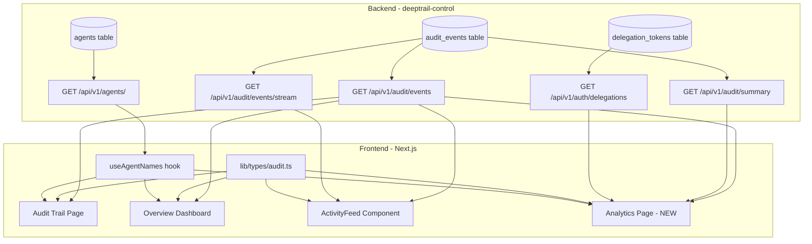

# Spec: P5.1 UI Improvements (Audit Trail + Activity Display)

> **Status:** Draft
> **Author:** Agent (from plan `plans/p5.1_ui_improvements_c44cd70b.plan.md`)
> **Created:** May 26, 2026
> **Priority:** P5.1 -- first item in P5 (IT Admin + Multi-User Delegation + SDK)
> **Roadmap Phase:** Phase 3: Q3-Q4 2026 -- Platform Expansion
> **Priority Master:** [`plans/PRIORITY_MASTER.md`](../../plans/PRIORITY_MASTER.md)
> **Product Roadmap:** [`plans/PRODUCT_ROADMAP.md`](../../plans/PRODUCT_ROADMAP.md)
> **Design Doc:** [`docs/design/p5.1-ui-improvements.md`](../design/p5.1-ui-improvements.md)

---

## Priority & Roadmap Mapping

### Priority Master Mapping ([`plans/PRIORITY_MASTER.md`](../../plans/PRIORITY_MASTER.md))

This spec covers **P5.1 -- UI Improvements (Audit Trail + Activity Display)** from the Priority Master.

| Priority Group | Coverage | Items in This Spec |
|---------------|----------|--------------------|
| **P5.1 UI Improvements** | ✅ Full | All 10 items: audit-ui-tool-name, audit-ui-success, audit-ui-user, audit-ui-duration, audit-ui-expand, overview-rich-activity, audit-ui-agent-name, tool-call-analytics-ui, analytics-denial-breakdown, analytics-delegation-chain-viz |
| **P5.2 IT Admin Service Catalog** | ❌ Not in scope | Deferred -- depends on org model and admin role gates |
| **P5.3 Multi-User Delegation** | ❌ Not in scope | Deferred -- requires backend multi-user token selection |
| **P5.4 SDK + Integration Guides** | ❌ Not in scope | Deferred -- separate workstream |
| **P5.5 Agent Security Architecture** | ❌ Not in scope | Deferred -- observability dashboard overlaps but is a different scope (session trace, not event analytics) |

### Product Roadmap Mapping ([`plans/PRODUCT_ROADMAP.md`](../../plans/PRODUCT_ROADMAP.md))

This spec delivers the **P5.1 UI Improvements** subset of Phase 3.

| Roadmap Phase | Coverage | What This Spec Delivers |
|--------------|----------|------------------------|
| **Phase 1: Q2 2026** | ✅ Complete (already shipped) | N/A -- all Phase 1 items done |
| **Phase 2: Q3 2026** | ✅ Complete (already shipped) | N/A -- P3, P4, P4.5 done |
| **Phase 3: Q3-Q4 2026** | ⚠️ Partial (P5.1 only) | Audit trail enrichment, dashboard activity enrichment, new Tool Call Analytics page, delegation chain visualization |
| **Phase 4+** | ❌ Not in scope | AWS, AgentCore, enterprise governance |

### Persona Capability Unlocked by This Spec

| Persona | Capability Unlocked |
|---------|---------------------|
| **Employee** | See exactly what their agent did (tool name, success/failure, who it acted for) instead of opaque `mcp_tool_call` badges. Expandable details for debugging. |
| **IT Admin** | Aggregated tool call analytics (top tools, denial patterns, delegation utilization). Permission denial breakdown for policy review. |
| **Security Team** | Tool Call Analytics page with denial analysis and insight generation ("65% of denials are write ops"). Delegation chain visualization showing over-provisioned permissions. |
| **Engineer / Developer** | Agent Activity Feed correctly maps API data. Duration shown for performance debugging. |

### What This Spec Unblocks

| Blocked Item | Needs | Covered By |
|--------------|-------|-----------|
| P5.5 Real-time observability dashboard | Aggregated analytics foundation + denial analysis patterns | WS-D (Analytics page) |
| P5.2 Admin delegation templates | Delegation utilization data (which permissions are used/unused) | WS-D (delegation chain viz) |
| IT Admin Governance (Phase 4) | Org-wide audit visibility patterns | Audit Trail redesign patterns (WS-B) are reusable for admin views |

---

## Table of Contents

1. [Objective](#1-objective)
2. [Goals & Non-Goals](#2-goals--non-goals)
3. [Background](#3-background)
4. [UI Wireframes](#4-ui-wireframes)
5. [Technical Design](#5-technical-design)
6. [Data Models](#6-data-models)
7. [API Contracts](#7-api-contracts)
8. [Security Considerations](#8-security-considerations)
9. [Project Structure](#9-project-structure)
10. [Testing Strategy](#10-testing-strategy)
11. [Demo Scenarios / User Journeys](#11-demo-scenarios--user-journeys)
12. [Rollout Plan](#12-rollout-plan)
13. [Boundaries](#13-boundaries)
14. [Dependencies & Risks](#14-dependencies--risks)
15. [Open Questions](#15-open-questions)
16. [References](#16-references)

---

## 1. Objective

Surface the rich audit event data already returned by the backend API across three frontend pages (Audit Trail, Overview dashboard, Agent Activity Feed) and create a new Tool Call Analytics page with aggregated usage insights. Fix the broken SSE endpoint and expose 2 missing denial-related fields in the API response.

### User Stories / Acceptance Criteria

- As an **Employee**, I want to see the tool name (e.g., `notion.search_pages`) and success/failure status for each audit event so I can understand what my agent actually did
- As an **IT Admin**, I want to see aggregated tool call analytics (top tools, denial patterns, delegation utilization) so I can review security posture without reading individual events
- As a **Security Team member**, I want to see a per-agent delegation chain visualization (user -> services -> permissions -> usage count) so I can identify over-provisioned permissions
- As an **Engineer**, I want the Agent Activity Feed to show accurate data from the API (not mismatched types) and real-time updates via SSE

### Success Criteria

- [ ] Audit Trail page shows tool name, success icon, agent display name, user attribution, and duration for every event row
- [ ] Clicking an audit event row expands inline to show arguments, result_summary, delegation_id, session IDs
- [ ] Overview "Recent Activity" shows tool name + success icon + agent name + user instead of `mcp_tool_call` badge + agent_id
- [ ] ActivityFeed component accepts and correctly renders the real `AuditEventResponse` shape from the API
- [ ] New `/dashboard/analytics` page displays: (a) metrics cards, (b) tool volume bar chart by backend, (c) top tools table, (d) permission denial breakdown with insight text, (e) delegation chain visualization per agent
- [ ] SSE endpoint streams events from DB (not the broken `_mvp_audit_events` list)
- [ ] `AuditEventResponse` includes `attempted_tool` and `required_permission` fields for `permission_denied` events
- [ ] All existing tests updated; new tests for analytics page; no test regressions

---

## 2. Goals & Non-Goals

### Goals

- [ ] Enrich audit trail event rows with all available detail fields (tool, success, user, duration, agent name)
- [ ] Replace side-panel detail view with inline expandable rows
- [ ] Add tool and user filter dropdowns to Audit Trail filter bar
- [ ] Enrich Overview dashboard "Recent Activity" with tool name, success indicator, user attribution
- [ ] Fix ActivityFeed component type mismatch (align `ActivityEvent` interface with `AuditEventResponse`)
- [ ] Create Tool Call Analytics page with recharts bar charts, metrics cards, top tools table, denial analysis, delegation chain visualization
- [ ] Add `attempted_tool` and `required_permission` to `AuditEventResponse` (2-field backend addition)
- [ ] Fix SSE endpoint to stream from DB instead of undefined `_mvp_audit_events` list
- [ ] Create shared TypeScript type for audit events used across all pages
- [ ] Create `useAgentNames()` hook for client-side agent_id -> display name resolution

### Non-Goals

- **Multi-user agent view (admin fleet view)** -- P5.2. This spec is scoped to the current single-user view.
- **Anomaly detection / alerting** -- Phase 4 Security Team features. Analytics shows aggregated data but does not detect or alert on anomalies.
- **Policy enforcement engine** -- Phase 4. Analytics identifies denial patterns but cannot create/enforce policies from them.
- **Time-series charts (tool calls over time)** -- Deferred. The `GET /api/v1/audit/summary` endpoint does not return time-bucketed data. Adding a time-series chart would require a new backend endpoint with `GROUP BY date_trunc()`. Pure frontend aggregation from event list is too expensive for large datasets. Revisit when a time-series summary endpoint exists.
- **Export / reporting** -- Shown in `PRODUCT_USE_CASES_BY_PERSONA.md` wireframes but deferred. No CSV/PDF export in this spec.
- **SIEM integration** -- Phase 5 backlog.
- **New backend analytics endpoints** -- We use the existing `GET /api/v1/audit/summary` and `GET /api/v1/audit/events?event_type=permission_denied`. No new aggregation endpoints.

---

## 3. Background

### Current State

| Capability | Current Status | Notes |
|------------|----------------|-------|
| Audit event storage in DB | ✅ Implemented | 3,139 events in production DB with `tool`, `on_behalf_of`, `success`, `duration_ms` populated |
| `GET /api/v1/audit/events` with filters | ✅ Implemented | Returns `QueryEventsResponse` with 17 fields per event. Frontend uses 5 of them. |
| `GET /api/v1/audit/summary` (aggregates) | ✅ Implemented | Returns `by_tool`, `by_agent`, `by_event_type` counts. **Not called by any frontend page.** |
| `GET /api/v1/audit/events/stream` (SSE) | ❌ Broken | References undefined `_mvp_audit_events` list. Would raise `NameError` at runtime. Never migrated from in-memory to DB. |
| `attempted_tool` / `required_permission` in API | ❌ Missing | Columns exist in DB, populated for `permission_denied` events, but `AuditEventResponse` does not include them |
| Audit Trail page -- tool name display | ❌ Missing | Shows `event_type` (e.g., `mcp_tool_call`) instead of tool name (e.g., `notion.search_pages`) |
| Audit Trail page -- success/failure indicator | ❌ Missing | No visual indicator. `success` field returned by API but not rendered |
| Audit Trail page -- user attribution | ❌ Missing | API returns `on_behalf_of`; frontend interface expects `user_id` (wrong field name) |
| Audit Trail page -- duration | ❌ Missing | `duration_ms` returned in API response but not displayed |
| Audit Trail page -- expandable detail | ⚠️ Partial | Side panel shows raw `details` object. API returns typed fields (`arguments`, `result_summary`, etc.) but frontend stuffs them into generic `Record<string, unknown>` |
| Overview "Recent Activity" | ❌ Minimal | Shows only `event_type` badge + `agent_id` + timestamp. No tool name, no success, no user. |
| Agent Activity Feed (`ActivityFeed.tsx`) | ⚠️ Type mismatch | Component expects `ActivityEvent { tool_name, status, details }` but API returns `AuditEventResponse { tool, success, result_summary }`. No mapping layer exists. |
| Agent name resolution in audit | ❌ Missing | Shows raw `agent_id` (e.g., `thunderbolt-agent-001`). Agent has a `name` field but audit pages don't fetch/display it. |
| Tool Call Analytics page | ❌ Missing | No analytics page exists. No charting library installed. |
| Delegation chain visualization | ❌ Missing | No visualization of user -> services -> permissions -> usage count |
| Shared TypeScript types for audit | ❌ Missing | Each page defines its own inline `AuditEvent` interface with different shapes. No generated or shared types. |

### Frontend/Backend Type Mismatch Summary

| Frontend expects | Backend provides | Impact |
|------------------|------------------|--------|
| `user_id` | `on_behalf_of` | User attribution never displays (field name wrong) |
| `token_layer` | Not in API response | Badge renders but value comes from filter, not data |
| `details: Record<string, unknown>` | `arguments`, `result_summary`, `reason`, etc. (typed fields) | Detail panel shows raw unstructured data |
| `attribution_chain?: AttributionLink[]` | Not in API response | Attribution chain section never renders |
| `ActivityEvent.tool_name` | `AuditEventResponse.tool` | Tool name may not display on agent detail page |
| `ActivityEvent.status` | `AuditEventResponse.success` | Status icon may not render correctly |

### Motivation

1. **Product credibility gap.** The audit trail is the core value proposition ("full audit trail with human attribution") but it shows less information than a basic server log. Visitors to `app.deepsecure.one` see opaque `mcp_tool_call` badges instead of `notion.search_pages` with success/failure.
2. **Customer conversation signal.** Scale Agentic (Victor, May 26) needs visibility into what agents are doing across users. The analytics page demonstrates this capability even before multi-user delegation is built.
3. **Data is already there.** All 3,139 production events have `tool`, `success`, `on_behalf_of`, `duration_ms` populated. This is purely a display gap -- the backend is ahead of the frontend.
4. **Independent quick-win.** No backend dependencies on P5.2-P5.5. Can ship immediately.

---

## 4. UI Wireframes

This section collects all UI wireframes that define the target visual design. The design doc and implementation MUST match these wireframes. Wireframes are sourced from canonical product docs and supplemented with before/after comparisons for each changed page.

### 4.1 Canonical Wireframe References

The following wireframes from reference documents define the target UX. Implementations must match these designs.

| Wireframe | Source Document | Section | Lines | What It Defines |
|-----------|-----------------|---------|-------|-----------------|
| Employee: My Agent Activity | `docs/PRODUCT_USE_CASES_BY_PERSONA.md` | §5.6 | 1182-1218 | Target activity table: Time, Tool, Result (check/X), Details per row. Quick Actions footer. |
| Vendor Admin: Recent Activity (multi-user) | `docs/PRODUCT_USE_CASES_BY_PERSONA.md` | §8.5 | 790-796 | Activity rows with user context: `time | user | tool | result | duration` |
| Security: Tool Call Analytics Dashboard | `docs/PRODUCT_USE_CASES_BY_PERSONA.md` | §6.3.3 | 1383-1455 | Full analytics page: volume bar chart, top tools table (rank/tool/calls/success/denials/users), denial analysis, delegation chain viz |
| Security: Threat Monitoring Overview | `docs/PRODUCT_USE_CASES_BY_PERSONA.md` | §6.3.1 | 1304-1353 | Security overview metrics + permission denial table |
| Security: Tool Call Analytics (UI Flow) | `docs/UI_FLOWS_BY_PERSONA.md` | §Phase 1 | 848-903 | Tool Call Analytics with volume chart, top tools, denial analysis, delegation chain, export controls |
| UI Gaps Table | `docs/UI_FLOWS_BY_PERSONA.md` | §6 | 1046-1063 | 5 P5.1 gaps with current vs correct behavior |

### 4.2 Audit Trail Page -- Before / After

**BEFORE (current -- [`audit/page.tsx`](../../frontend/src/app/(dashboard)/dashboard/audit/page.tsx)):**

```
┌──────────────────────────────────────────────────────────────────────────────┐
│  Audit Trail                                                    [Refresh]    │
├──────────────────────────────────────────────────────────────────────────────┤
│                                                                              │
│  Filters: [Event Type v] [Agent ID___] [Token Layer v] [From] [To]          │
│                                                                              │
│  ┌────────────────────────────────────────────────────────────────────────┐  │
│  │  [ScrollText icon] mcp_tool_call          [gateway]  [mcp_tool_call]  │  │
│  │  5/26/2026, 4:00:00 PM    Agent: thunderbolt-agent-001               │  │
│  └────────────────────────────────────────────────────────────────────────┘  │
│  ┌────────────────────────────────────────────────────────────────────────┐  │
│  │  [ScrollText icon] mcp_tool_call          [gateway]  [mcp_tool_call]  │  │
│  │  5/26/2026, 3:59:58 PM    Agent: thunderbolt-agent-001               │  │
│  └────────────────────────────────────────────────────────────────────────┘  │
│                                                                              │
│  Click any row ---> opens side panel with raw JSON key-value pairs           │
│                                                                              │
│  PROBLEMS:                                                                   │
│  • Every row looks identical ("mcp_tool_call" x N)                          │
│  • No tool name (notion.search_pages vs slack.send_message)                 │
│  • No success/failure indicator                                              │
│  • No user attribution (who was this on behalf of?)                         │
│  • No duration                                                               │
│  • Agent shown as raw ID, not display name                                  │
│  • Side panel shows unstructured details blob                               │
│                                                                              │
│  [< Previous]                  Page 1                  [Next >]             │
└──────────────────────────────────────────────────────────────────────────────┘
```

**AFTER (target -- matches `PRODUCT_USE_CASES_BY_PERSONA.md` §5.6 activity table pattern):**

```
┌──────────────────────────────────────────────────────────────────────────────┐
│  Audit Trail                                                    [Refresh]    │
├──────────────────────────────────────────────────────────────────────────────┤
│                                                                              │
│  Filters: [Event Type v] [Agent v] [Tool v] [User v] [From] [To]  [Clear]  │
│                                                                              │
│  ┌────────────────────────────────────────────────────────────────────────┐  │
│  │  ✅  notion.search_pages          Thunderbolt Agent            473ms  │  │
│  │      mahendra@deeptrail.com       May 26, 4:00:00 PM            [v]  │  │
│  └────────────────────────────────────────────────────────────────────────┘  │
│  ┌────────────────────────────────────────────────────────────────────────┐  │
│  │  ✅  slack.list_channels          Thunderbolt Agent            210ms  │  │
│  │      mahendra@deeptrail.com       May 26, 3:59:58 PM            [v]  │  │
│  └────────────────────────────────────────────────────────────────────────┘  │
│  ┌────────────────────────────────────────────────────────────────────────┐  │
│  │  ❌  notion.create_page           Thunderbolt Agent              --   │  │
│  │      DENIED: notion:pages:create  May 26, 3:59:55 PM            [v]  │  │
│  └────────────────────────────────────────────────────────────────────────┘  │
│                                                                              │
│  [v] expands inline:                                                         │
│  ┌ ─ ─ ─ ─ ─ ─ ─ ─ ─ ─ ─ ─ ─ ─ ─ ─ ─ ─ ─ ─ ─ ─ ─ ─ ─ ─ ─ ─ ─ ─ ─ ─┐  │
│  │  Arguments: {"query": "meeting notes"}                                │  │
│  │  Result:    Found 3 pages                                             │  │
│  │  Delegation: del-abc123                                               │  │
│  │  Session: asess-xyz789  |  MCP: mcpsess-456                           │  │
│  └ ─ ─ ─ ─ ─ ─ ─ ─ ─ ─ ─ ─ ─ ─ ─ ─ ─ ─ ─ ─ ─ ─ ─ ─ ─ ─ ─ ─ ─ ─ ─ ─┘  │
│                                                                              │
│  [< Previous]           Page 1 of 157            [Next >]                   │
└──────────────────────────────────────────────────────────────────────────────┘

Row anatomy:
┌─────────────────────────────────────────────────────────────────┐
│  [icon]  tool_name                agent_name        duration_ms │  <- line 1
│          on_behalf_of | reason    timestamp           [expand]  │  <- line 2
└─────────────────────────────────────────────────────────────────┘

Icon: ✅ (success=true) | ❌ (success=false or event_type=permission_denied)
Tool: `tool` field for mcp_tool_call; `attempted_tool` for permission_denied
Agent: resolved display name via useAgentNames() hook (raw ID as tooltip)
Duration: `duration_ms` formatted (e.g., "473ms"); "--" for denials
User: `on_behalf_of` email; for denials, replaced with "DENIED: {required_permission}"
Expand: shows arguments, result_summary, delegation_id, session_id, agent_session_id, mcp_session_id
```

### 4.3 Overview Dashboard "Recent Activity" -- Before / After

**BEFORE (current -- [`dashboard/page.tsx`](../../frontend/src/app/(dashboard)/dashboard/page.tsx)):**

```
┌────────────────────────────────────────────────────────────────┐
│  Recent Activity                                                │
├────────────────────────────────────────────────────────────────┤
│  [mcp_tool_call]  thunderbolt-agent-001     5/26/2026 4:00 PM  │
│  [mcp_tool_call]  thunderbolt-agent-001     5/26/2026 3:59 PM  │
│  [mcp_tool_call]  thunderbolt-agent-001     5/26/2026 3:59 PM  │
│  [mcp_tool_call]  thunderbolt-agent-001     5/26/2026 3:58 PM  │
│                                                                 │
│  PROBLEMS:                                                      │
│  • Every row is identical -- cannot distinguish actions          │
│  • No tool name, no success/failure, no user attribution        │
│  • Raw agent ID instead of display name                         │
│  • No link to full audit trail                                  │
└────────────────────────────────────────────────────────────────┘
```

**AFTER (target -- matches `PRODUCT_USE_CASES_BY_PERSONA.md` §5.6 and §8.5 activity patterns):**

```
┌────────────────────────────────────────────────────────────────┐
│  Recent Activity                                                │
├────────────────────────────────────────────────────────────────┤
│  ✅  notion.search_pages    Thunderbolt   mahendra@    4:00 PM │
│  ✅  slack.list_channels    Thunderbolt   mahendra@    3:59 PM │
│  ❌  notion.create_page     Thunderbolt   mahendra@    3:59 PM │
│      DENIED: notion:pages:create                                │
│  ✅  slack.send_message     Thunderbolt   mahendra@    3:58 PM │
│                                                                 │
│                                 [View Full Audit Trail ->]     │
└────────────────────────────────────────────────────────────────┘

Row anatomy (compact -- no expand):
  [icon]  tool_name        agent_name(short)  user(short)  time
```

### 4.4 Agent Activity Feed -- Before / After

**BEFORE (current -- [`ActivityFeed.tsx`](../../frontend/src/components/agents/ActivityFeed.tsx)):**

The component has the right visual structure (tool name, status icon, timestamp, details) but is fed the wrong data type. The `ActivityEvent` interface expects `tool_name` and `status: "success"|"error"|"pending"` while the API returns `tool` and `success: boolean|null`. In practice, data does not map correctly, so tool names and statuses may not render.

**AFTER (target -- matches `PRODUCT_USE_CASES_BY_PERSONA.md` §5.6):**

```
┌────────────────────────────────────────────────────────────────┐
│  Recent Activity (12)                                           │
├────────────────────────────────────────────────────────────────┤
│  ┌──────────────────────────────────────────────────────────┐  │
│  │  ✅  notion.search_pages                      [success]  │  │
│  │      mahendra@deeptrail.com  •  473ms                    │  │
│  │      May 26, 4:00:00 PM                                  │  │
│  │      Found 3 pages                                        │  │
│  └──────────────────────────────────────────────────────────┘  │
│  ┌──────────────────────────────────────────────────────────┐  │
│  │  ❌  notion.create_page                   [destructive]   │  │
│  │      mahendra@deeptrail.com                               │  │
│  │      May 26, 3:59:55 PM                                   │  │
│  │      DENIED: notion:pages:create not delegated            │  │
│  └──────────────────────────────────────────────────────────┘  │
└────────────────────────────────────────────────────────────────┘

Changes from current ActivityFeed:
• Accept AuditEvent type (not ActivityEvent) -- use `tool` not `tool_name`
• Map `success: boolean` to icon (✅/❌) instead of `status` enum
• Show `on_behalf_of` email (new field, not in current component)
• Show `duration_ms` when available
• Show `result_summary` or `reason` as detail text
```

### 4.5 Tool Call Analytics Page (NEW)

This is a new page at `/dashboard/analytics`. The canonical wireframe is defined in two reference documents that must both be followed:

**Canonical wireframe 1:** `docs/PRODUCT_USE_CASES_BY_PERSONA.md` §6.3.3 (lines 1383-1455)
**Canonical wireframe 2:** `docs/UI_FLOWS_BY_PERSONA.md` §Phase 1: Tool Call Analytics Dashboard (lines 848-903)

Both wireframes agree on four sections. The implementation must include all four:

```
┌──────────────────────────────────────────────────────────────────────────────┐
│  Tool Call Analytics                            [Last 7 days v]  [Refresh]   │
├──────────────────────────────────────────────────────────────────────────────┤
│                                                                              │
│  ┌─ Metrics Cards ─────────────────────────────────────────────────────────┐ │
│  │  Total Calls    │  Success Rate  │  Unique Agents  │  Unique Users      │ │
│  │     3,139       │     97.2%      │       3         │       2            │ │
│  └─────────────────────────────────────────────────────────────────────────┘ │
│                                                                              │
│  SECTION 1: Tool Call Volume by Backend (horizontal bar chart)               │
│  ┌─────────────────────────────────────────────────────────────────────────┐ │
│  │  notion   ████████████████████████████████████████  68%  (2,134)       │ │
│  │  slack    █████████████████                        28%    (879)        │ │
│  │  gmail    ████                                      4%    (126)       │ │
│  └─────────────────────────────────────────────────────────────────────────┘ │
│  Source: PRODUCT_USE_CASES §6.3.3 "Tool Call Volume by Backend"              │
│                                                                              │
│  SECTION 2: Top Tools Called (sortable table)                                │
│  ┌─────────────────────────────────────────────────────────────────────────┐ │
│  │  Rank │ Tool                    │ Calls  │ Success │ Denials │ Users   │ │
│  │ ──────├─────────────────────────├────────├─────────├─────────├──────── │ │
│  │   1   │ notion.search_pages     │  1,521 │  99.8%  │    3    │   --   │ │
│  │   2   │ slack.list_channels     │    703 │ 100.0%  │    0    │   --   │ │
│  │   3   │ notion.read_page        │    492 │  99.9%  │    1    │   --   │ │
│  │   4   │ slack.send_message      │    176 │  91.4%  │   15    │   --   │ │
│  └─────────────────────────────────────────────────────────────────────────┘ │
│  Source: PRODUCT_USE_CASES §6.3.3 "Top 10 Tools Called"                      │
│  Note: "Users" column shows "--" for now (single-user view; multi-user P5.3) │
│                                                                              │
│  SECTION 3: Permission Denial Analysis                                       │
│  ┌─────────────────────────────────────────────────────────────────────────┐ │
│  │  Total Denials: 19          Denial Rate: 0.6%                          │ │
│  │                                                                         │ │
│  │  By Permission Required:                                                │ │
│  │  • slack:messages:write     (15 denials) — 2 agents                    │ │
│  │  • notion:pages:create      ( 3 denials) — 1 agent                     │ │
│  │  • gmail:messages:send      ( 1 denial)  — 1 agent                     │ │
│  │                                                                         │ │
│  │  Insight: 79% of denials are write operations not delegated.           │ │
│  │  Consider reviewing delegation templates.                               │ │
│  └─────────────────────────────────────────────────────────────────────────┘ │
│  Source: PRODUCT_USE_CASES §6.3.3 "Permission Denial Analysis"               │
│                                                                              │
│  SECTION 4: Delegation Chain Visualization                                   │
│  ┌─────────────────────────────────────────────────────────────────────────┐ │
│  │  Select Agent: [thunderbolt-agent-001      v]                          │ │
│  │                                                                         │ │
│  │  mahendra@deeptrail.com                                                 │ │
│  │       │                                                                 │ │
│  │       ├─ Connected Services                                             │ │
│  │       │   ├─ notion (pages:read, pages:search)                          │ │
│  │       │   └─ slack  (messages:read, channels:list)                      │ │
│  │       │                                                                 │ │
│  │       └─ Delegated to: thunderbolt-agent-001                            │ │
│  │           ├─ notion:pages:read    ✅ Used 234 times                     │ │
│  │           ├─ notion:pages:search  ✅ Used 1,021 times                   │ │
│  │           ├─ slack:messages:read  ✅ Used 89 times                      │ │
│  │           └─ slack:channels:list  ⚪ Never used                         │ │
│  │                                                                         │ │
│  │  Permission Utilization: 75% (3 of 4 permissions used)                 │ │
│  └─────────────────────────────────────────────────────────────────────────┘ │
│  Source: PRODUCT_USE_CASES §6.3.3 "Delegation Chain Visualization"           │
│  Source: UI_FLOWS §Phase 1 lines 882-898                                     │
│                                                                              │
│  DEFERRED (not in P5.1):                                                     │
│  • [ Export Report ] [ Schedule Weekly Digest ] [ Create Alert Rule ]       │
│    These action buttons appear in the reference wireframes but require       │
│    backend support not yet built. Deferred to P5.5 / Phase 4.               │
│                                                                              │
└──────────────────────────────────────────────────────────────────────────────┘
```

### 4.6 Sidebar Navigation -- Change

```
BEFORE:                          AFTER:
─────────────                    ─────────────
Overview                         Overview
Agents                           Agents
Policies                         Policies
Services                         Services
Audit Trail  <-- audit here      Audit Trail
Vault                            Analytics    <-- NEW (BarChart3 icon)
Delegation                       Vault
Tasks                            Delegation
                                 Tasks
```

### 4.7 Wireframe Validation Checklist

The design doc and implementation MUST be validated against these wireframes. Each wireframe element maps to a success criterion:

| Wireframe Element | Source | Success Criterion | Validates |
|-------------------|--------|-------------------|-----------|
| Activity row: `Time | Tool | Result (check/X) | Details` | `PRODUCT_USE_CASES` §5.6 | Audit Trail event rows show tool, success icon, details | WS-B |
| Activity row with user context: `time | user | tool | result | duration` | `PRODUCT_USE_CASES` §8.5 | Audit Trail rows include `on_behalf_of` and `duration_ms` | WS-B |
| Bar chart: tool call volume by backend | `PRODUCT_USE_CASES` §6.3.3, `UI_FLOWS` §Phase 1 | Analytics page has horizontal bar chart grouped by service prefix | WS-D |
| Table: top tools with rank/calls/success/denials | `PRODUCT_USE_CASES` §6.3.3, `UI_FLOWS` §Phase 1 | Analytics page has sortable top tools table | WS-D |
| Denial analysis with insight text | `PRODUCT_USE_CASES` §6.3.3, `UI_FLOWS` §Phase 1 | Analytics page shows denial count, rate, per-permission breakdown, insight | WS-D |
| Delegation chain tree: user -> services -> permissions -> usage count | `PRODUCT_USE_CASES` §6.3.3, `UI_FLOWS` §Phase 1 | Analytics page shows delegation chain with utilization % | WS-D |
| Permission utilization percentage | `UI_FLOWS` §Phase 1 line 897 | Chain viz shows "75% (3 of 4 permissions used)" | WS-D |
| Over-provisioned permission highlight | `PRODUCT_USE_CASES` §6.3.3 line 1446 | Unused permissions shown with distinct icon (grey circle) | WS-D |

---

## 5. Technical Design

### Services Affected

| Service | Impact | Changes |
|---------|--------|---------|
| deeptrail-control | Low | Add 2 fields to `AuditEventResponse`; fix SSE endpoint to read from DB |
| deeptrail-gateway | None | No changes |
| deepsecure (SDK) | None | No changes |
| frontend | High | 4 workstreams: shared types, audit trail redesign, dashboard/feed enrichment, new analytics page |

### Architecture Overview



### Key Components

**1. Shared AuditEvent type** (`frontend/src/lib/types/audit.ts`)

```typescript
export interface AuditEvent {
  id: string;
  timestamp: string;
  event_type: string;
  agent_id: string | null;
  on_behalf_of: string;
  organization_id: string | null;
  tool: string | null;
  success: boolean | null;
  arguments: Record<string, unknown> | null;
  result_summary: string | null;
  reason: string | null;
  attempted_tool: string | null;
  required_permission: string | null;
  duration_ms: number | null;
  session_id: string | null;
  agent_session_id: string | null;
  mcp_session_id: string | null;
  delegation_id: string | null;
  extra_data: Record<string, unknown> | null;
}

export interface AuditEventsResponse {
  events: AuditEvent[];
  total: number;
  limit: number;
  offset: number;
}

export interface AuditSummary {
  total_events: number;
  by_event_type: Record<string, number>;
  by_tool: Record<string, number>;
  by_agent: Record<string, number>;
  time_range: Record<string, string>;
}
```

**2. useAgentNames hook** (`frontend/src/hooks/useAgentNames.ts`)

```typescript
export function useAgentNames(): {
  names: Map<string, string>;
  loading: boolean;
  resolve: (agentId: string) => string;
}
```

Fetches `GET /api/v1/agents/` once on mount. Returns a `Map<agent_id, name>` and a `resolve(id)` function that returns the display name or falls back to the raw ID.

**3. Delegation Chain Visualization** (new component in analytics page)

```typescript
interface DelegationChainProps {
  agentId: string;
}

interface PermissionUsage {
  permission: string;
  service: string;
  usageCount: number;
  used: boolean;
}

interface DelegationChainData {
  delegator: string;
  services: string[];
  permissions: PermissionUsage[];
  utilizationPercent: number;
}
```

Cross-references:
- `GET /api/v1/auth/delegations` (user's delegations, filtered client-side by selected agent)
- `GET /api/v1/audit/summary?agent_id={id}` (tool usage counts per agent)

Maps each delegated permission (e.g., `notion:pages:search`) to its tool usage count from the audit summary's `by_tool` data. Highlights permissions with zero usage as "over-provisioned."

**4. SSE endpoint fix** (`deeptrail-control/app/api/v1/endpoints/audit.py`)

Replace `_mvp_audit_events` reference with a DB polling query:

```python
async def event_generator():
    last_id = None
    while True:
        query = db.query(AuditEvent)
        if last_id:
            query = query.filter(AuditEvent.id > last_id)
        if agent_id:
            query = query.filter(AuditEvent.agent_id == agent_id)
        if on_behalf_of:
            query = query.filter(AuditEvent.on_behalf_of == on_behalf_of)
        new_events = query.order_by(AuditEvent.timestamp.asc()).limit(50).all()
        for event in new_events:
            last_id = event.id
            yield f"data: {json_module.dumps(serialize_event(event))}\n\n"
        await asyncio.sleep(2)
```

### Architecture Decisions

| Decision | Options Considered | Chosen | Rationale |
|----------|--------------------|--------|-----------|
| Charting library | recharts, Tremor, Nivo, pure CSS bars | recharts | Most popular React charting lib; lightweight (60KB gzipped); good Tailwind interop; used by shadcn/ui examples |
| Agent name resolution | Server-side join in audit query; client-side lookup | Client-side lookup | No backend change needed; agents list is small (<100); single fetch on mount |
| Detail view UX | Keep side panel; inline expand; modal | Inline expand | Better UX for scanning multiple events; side panel required clicking away to close; modal is too heavy |
| Delegation chain data source | New backend endpoint; client-side cross-reference | Client-side cross-reference | Uses existing `GET /auth/delegations` + `GET /audit/summary`; no new backend endpoint; dataset is small per-user |
| SSE fix approach | DB polling every 2s; Redis pub/sub; pg_notify | DB polling every 2s | Minimal change; matches existing pattern; Redis pub/sub is P8 scope |

---

## 6. Data Models

### Modified: AuditEventResponse (Pydantic -- `deeptrail-control/app/api/v1/endpoints/audit.py`)

Add 2 fields that exist in the DB model but are not exposed:

| Field | Type | Description |
|-------|------|-------------|
| `attempted_tool` | `Optional[str]` | Tool that was attempted but denied (for `permission_denied` events). Already in DB column `attempted_tool`. |
| `required_permission` | `Optional[str]` | Permission that was required but not delegated (for `permission_denied` events). Already in DB column `required_permission`. |

No new tables. No migrations. No schema changes to the DB model itself.

### New: Frontend shared types (`frontend/src/lib/types/audit.ts`)

See Section 5 (Technical Design) for full interface definition. Replaces 3 separate inline `AuditEvent` interfaces across:
- `frontend/src/app/(dashboard)/dashboard/audit/page.tsx` (lines 21-30)
- `frontend/src/app/(dashboard)/dashboard/page.tsx` (lines 15-20)
- `frontend/src/components/agents/ActivityFeed.tsx` (lines 5-11)

---

## 7. API Contracts

> **CRITICAL**: This section is the CANONICAL source for all API changes.

### Endpoint Summary (changes only)

| Method | Endpoint | Change | Auth |
|--------|----------|--------|------|
| GET | `/api/v1/audit/events` | Response adds `attempted_tool`, `required_permission` fields | User JWT |
| GET | `/api/v1/audit/events/stream` | Fix broken SSE endpoint (replace `_mvp_audit_events` with DB query) | User JWT |
| GET | `/api/v1/audit/summary` | No change (already exists, newly consumed by frontend) | User JWT |
| GET | `/api/v1/agents/` | No change (already exists, newly consumed by `useAgentNames` hook) | User JWT |
| GET | `/api/v1/auth/delegations` | No change (already exists, newly consumed by delegation chain viz) | User JWT |

### GET /api/v1/audit/events -- Response change

**Added fields in `AuditEventResponse`:**

```json
{
  "id": "evt-abc123",
  "timestamp": "2026-05-26T23:00:00Z",
  "event_type": "permission_denied",
  "agent_id": "thunderbolt-agent-001",
  "on_behalf_of": "mahendra@deeptrail.com",
  "tool": null,
  "success": false,
  "attempted_tool": "notion.create_page",
  "required_permission": "notion:pages:create",
  "reason": "Permission not delegated",
  "duration_ms": null,
  "arguments": null,
  "result_summary": null,
  "session_id": "usess-xyz",
  "agent_session_id": "asess-123",
  "mcp_session_id": null,
  "delegation_id": "del-abc",
  "extra_data": null,
  "organization_id": null
}
```

For `mcp_tool_call` events, `attempted_tool` and `required_permission` will be `null`.

### GET /api/v1/audit/events/stream -- Fix

**Current (broken):** References `_mvp_audit_events` (undefined) -- raises `NameError`.

**Fixed behavior:** Polls `audit_events` DB table every 2 seconds for new events. Returns the same `AuditEventResponse` shape as the list endpoint (all fields).

**SSE payload per event (expanded from current 5 fields to full response):**

```
data: {"id":"evt-abc","event_type":"mcp_tool_call","agent_id":"thunderbolt-agent-001","on_behalf_of":"mahendra@deeptrail.com","tool":"notion.search_pages","success":true,"timestamp":"2026-05-26T23:00:00Z","duration_ms":473,"result_summary":"Found 3 pages","attempted_tool":null,"required_permission":null}
```

---

## 8. Security Considerations

### Access Control

- All frontend API calls go through the BFF proxy (`/api/proxy/[...path]`) which forwards the user's session cookie as a JWT. No new auth paths are introduced.
- The `GET /api/v1/audit/events` endpoint is user-scoped -- it returns events where `on_behalf_of` matches the authenticated user. This spec does not change that scoping.
- The `GET /api/v1/auth/delegations` endpoint returns only the authenticated user's delegations. The delegation chain visualization is therefore limited to the current user's own data.
- The Analytics page aggregates data from the same user-scoped endpoints. No cross-user or cross-org data is exposed.

### Data Exposure

- `arguments` field may contain sensitive data (e.g., search queries, message content). The gateway already redacts sensitive fields before POSTing to the audit endpoint. The inline expand view displays whatever the backend returns -- no additional redaction needed in the frontend.
- `attempted_tool` and `required_permission` are not sensitive -- they describe the permission structure, not user data.
- The SSE fix does not change what data is streamed -- it fixes the transport (DB query instead of undefined in-memory list). The SSE endpoint already supports `agent_id` and `on_behalf_of` filters.

---

## 9. Project Structure

### Workstream A: Shared Types + Agent Name Resolver (Foundation)

| File | Action | Purpose |
|------|--------|---------|
| `frontend/src/lib/types/audit.ts` | Create | Shared `AuditEvent`, `AuditEventsResponse`, `AuditSummary` types matching backend exactly |
| `frontend/src/hooks/useAgentNames.ts` | Create | Hook: fetch agents once, return `Map<id, name>` and `resolve(id)` helper |

### Workstream B: Audit Trail Page Redesign

| File | Action | Purpose |
|------|--------|---------|
| `frontend/src/app/(dashboard)/dashboard/audit/page.tsx` | Modify | Replace inline `AuditEvent` with shared type; redesign event rows (tool name primary, success icon, agent name, user, duration, inline expand); add tool/user filter dropdowns; use `total` from API for accurate pagination |
| `frontend/src/app/(dashboard)/dashboard/audit/__tests__/page.test.tsx` | Modify | Update mock data to match new `AuditEvent` shape; test new row rendering, expand behavior, new filters |
| `frontend/src/test/msw/handlers/dashboard.ts` | Modify | Update MSW mock audit events to use backend `AuditEventResponse` shape (add `on_behalf_of`, `tool`, `success`, `duration_ms`, `attempted_tool`, `required_permission`; remove `token_layer`, `user_id`, `details`) |

### Workstream C: Overview Dashboard + Agent Activity Feed

| File | Action | Purpose |
|------|--------|---------|
| `frontend/src/app/(dashboard)/dashboard/page.tsx` | Modify | Replace inline `AuditEvent` with shared type; render tool name, success icon, agent name, user in Recent Activity; add "View Full Audit Trail" link |
| `frontend/src/app/(dashboard)/dashboard/__tests__/page.test.tsx` | Modify | Update mock data and assertions for rich activity rows |
| `frontend/src/components/agents/ActivityFeed.tsx` | Modify | Replace `ActivityEvent` interface with shared `AuditEvent` type; update rendering to use `tool` (not `tool_name`), `success` boolean (not `status` enum), `on_behalf_of`, `duration_ms` |
| `frontend/src/components/agents/__tests__/ActivityFeed.test.tsx` | Modify | Update mock data and assertions |
| `frontend/src/app/(dashboard)/dashboard/agents/[id]/activity/page.tsx` | Modify | Update API response parsing to use shared `AuditEvent` type; remove type coercion |
| `frontend/src/app/(dashboard)/dashboard/agents/[id]/activity/__tests__/page.test.tsx` | Modify | Update mock data |

### Workstream D: Tool Call Analytics Page

| File | Action | Purpose |
|------|--------|---------|
| `frontend/src/app/(dashboard)/dashboard/analytics/page.tsx` | Create | Analytics page: metrics cards, recharts bar chart (tool volume by backend), top tools table, permission denial breakdown, delegation chain visualization |
| `frontend/src/app/(dashboard)/dashboard/analytics/__tests__/page.test.tsx` | Create | Tests for analytics page rendering, data loading, empty states |
| `frontend/src/components/layout/sidebar.tsx` | Modify | Add "Analytics" nav item with `BarChart3` icon between "Audit Trail" and "Vault" |
| `frontend/package.json` | Modify | Add `recharts` dependency |

### Workstream E: Backend -- SSE Fix + Denial Fields

| File | Action | Purpose |
|------|--------|---------|
| `deeptrail-control/app/api/v1/endpoints/audit.py` | Modify | Add `attempted_tool` and `required_permission` to `AuditEventResponse`; update `query_events()` serialization to include these fields; fix `stream_audit_events()` to poll DB |
| `deeptrail-control/tests/api/v1/test_audit.py` | Modify | Add tests for new response fields and SSE DB polling |

### Workstream F: E2E Test + MSW Mock Updates

| File | Action | Purpose |
|------|--------|---------|
| `frontend/e2e/dashboard.spec.ts` | Modify | Update Playwright mock data to new shape; update assertions for tool name, success icon |
| `frontend/src/test/mocks/handlers.ts` | Modify | Update minimal mock to include new fields |

### Complexity Estimates

| Workstream | Complexity | Rationale |
|------------|------------|-----------|
| WS-A: Shared Types + Hook | S (2 tasks) | New files, simple interfaces, one API call |
| WS-B: Audit Trail Redesign | M (3 tasks) | Significant UI rework of existing page + filter additions |
| WS-C: Dashboard + Feed | M (3 tasks) | Moderate changes across 3 components + type alignment |
| WS-D: Analytics Page | L (3 tasks) | New page, recharts integration, delegation chain viz, denial analysis |
| WS-E: Backend fixes | S (2 tasks) | Add 2 fields to Pydantic model + fix SSE function |
| WS-F: E2E + MSW | S (2 tasks) | Update mock data shapes and assertions |

---

## 10. Testing Strategy

### Test Matrix

| Level | What | Location | Framework |
|-------|------|----------|-----------|
| Unit | Backend: new fields in response, SSE DB polling | `deeptrail-control/tests/api/v1/test_audit.py` | pytest |
| Unit | Frontend: Audit Trail, Dashboard, ActivityFeed, Analytics page rendering | `frontend/src/app/(dashboard)/dashboard/*/__tests__/` | vitest + React Testing Library |
| E2E | Dashboard audit display, audit trail navigation, analytics page | `frontend/e2e/dashboard.spec.ts` | Playwright |

### Key Test Scenarios

- [ ] Audit Trail page renders tool name (`notion.search_pages`) as primary text instead of `event_type`
- [ ] Success events show green check icon; failure/denied events show red X icon
- [ ] Agent display name renders (from `useAgentNames` lookup) with raw ID as tooltip
- [ ] `on_behalf_of` email renders in each event row
- [ ] `duration_ms` renders as human-readable (e.g., `473ms`) for successful events; `--` for denials
- [ ] Clicking expand chevron shows arguments, result_summary, delegation_id, session IDs inline
- [ ] `permission_denied` events show `attempted_tool` and `required_permission` in denial reason line
- [ ] Overview "Recent Activity" shows tool + success + agent name + user (not `mcp_tool_call` badge)
- [ ] ActivityFeed renders correctly when receiving `AuditEvent` objects (not old `ActivityEvent` shape)
- [ ] Analytics page: metrics cards show total calls, success rate, unique agents, unique users
- [ ] Analytics page: bar chart groups tool calls by backend service prefix (notion, slack, etc.)
- [ ] Analytics page: top tools table shows rank, tool name, call count, success rate, denial count
- [ ] Analytics page: denial breakdown groups by `required_permission`, counts agents
- [ ] Analytics page: delegation chain viz shows permissions with usage count, highlights unused
- [ ] SSE endpoint streams new events after initial connection (backend test with DB insert)
- [ ] `AuditEventResponse` includes `attempted_tool` and `required_permission` for `permission_denied` events

### Technical Requirements

| Requirement | Correct Pattern | Common Mistake |
|-------------|-----------------|----------------|
| Async SSE test | Use `httpx.AsyncClient` with SSE parsing | Using sync `requests` |
| Mock recharts in tests | Mock `recharts` module in vitest config | Trying to render actual SVG charts in JSDOM |
| Agent names hook test | Mock `apiClient` response for agents list | Fetching real API in tests |

### Coverage Requirements

- New code: >80% coverage
- Critical paths (event row rendering, type mapping, denial display): 100% coverage

---

## 11. Demo Scenarios / User Journeys

### Scenario 1: Employee -- Reviewing Agent Activity

**Persona:** Sarah, Sales Representative at Acme Corp
**Pre-conditions:** Agent `thunderbolt-agent-001` has been making tool calls (Notion, Slack). User is logged into `app.deepsecure.one`.

| Step | Action | Expected Result | Validates |
|------|--------|-----------------|-----------|
| 1 | Navigate to `/dashboard` | Overview shows metrics + Recent Activity with tool names | Overview rich activity (C1) |
| 2 | See Recent Activity row | `[check] notion.search_pages  Thunderbolt  mahendra@  4:00 PM` | Tool name, success icon, agent name, user (C1) |
| 3 | Click "View Full Audit Trail" link | Navigates to `/dashboard/audit` | Navigation link (C1) |
| 4 | See Audit Trail event rows | Each row shows tool name, success icon, agent name, user, duration | Audit row redesign (B2) |
| 5 | Click expand chevron on an event | Inline panel shows arguments, result summary, delegation ID, session IDs | Expandable detail (B2) |
| 6 | Filter by Tool: `notion.search_pages` | Only Notion search events shown | Tool filter (B3) |

**Success criteria:** `curl -s "https://app.deepsecure.one/api/proxy/audit/events?limit=5" | jq '.events[0] | {tool, success, on_behalf_of, duration_ms}'` returns non-null values for all 4 fields.

### Scenario 2: IT Admin -- Analyzing Tool Usage Patterns

**Persona:** Alex, IT Administrator at Acme Corp
**Pre-conditions:** Multiple agents have been making tool calls. User has admin access.

| Step | Action | Expected Result | Validates |
|------|--------|-----------------|-----------|
| 1 | Navigate to `/dashboard/analytics` | Analytics page loads with metrics cards | Analytics page (D1) |
| 2 | See metrics cards | Total Calls: 3,139; Success Rate: 97.2%; Unique Agents: 3; Unique Users: 2 | Metrics cards (D1) |
| 3 | See bar chart | Horizontal bars: notion 68%, slack 28%, gmail 4% | Bar chart (D1) |
| 4 | See top tools table | Ranked table with tool name, calls, success rate, denials | Top tools table (D1) |
| 5 | See denial breakdown | "Total Denials: 19, Denial Rate: 0.6%" with per-permission breakdown | Denial analysis (D1) |
| 6 | See insight text | "79% of denials are write operations not delegated" | Insight generation (D1) |

**Success criteria:** Analytics page renders without errors; bar chart shows at least 2 backend services.

### Scenario 3: Security Team -- Delegation Chain Audit

**Persona:** Security analyst reviewing permission utilization
**Pre-conditions:** Agent has active delegation with 4 permissions, 3 of which have been used.

| Step | Action | Expected Result | Validates |
|------|--------|-----------------|-----------|
| 1 | Navigate to `/dashboard/analytics` | Page loads | Analytics page (D1) |
| 2 | Scroll to delegation chain section | Agent selector dropdown visible | Delegation chain viz (D1) |
| 3 | Select agent `thunderbolt-agent-001` | Chain shows: user -> connected services -> 4 delegated permissions | Delegation chain viz (D1) |
| 4 | See permission utilization | 3 permissions marked "Used" with counts; 1 marked "Never used" (highlighted) | Over-provisioning detection |
| 5 | See utilization percentage | "Permission Utilization: 75% (3 of 4 permissions used)" | Utilization metric |

**Success criteria:** Delegation chain renders with correct permission-to-usage mapping; unused permissions are visually distinct.

### Scenario 4: Error Path -- Permission Denied Event Display

**Persona:** Any user reviewing denied tool calls
**Pre-conditions:** Agent attempted `notion.create_page` but permission `notion:pages:create` was not delegated.

| Step | Action | Expected Result | Validates |
|------|--------|-----------------|-----------|
| 1 | Navigate to Audit Trail | See denied event with red X icon | Success/failure icon (B2) |
| 2 | See denied event row | `[X] notion.create_page  Thunderbolt  --` with `DENIED: notion:pages:create` subtitle | Denial display with `attempted_tool` + `required_permission` (B2, E) |
| 3 | Expand the denied event | Shows `reason`, `delegation_id` that was checked | Expandable detail (B2) |

**Success criteria:** `attempted_tool` and `required_permission` fields are non-null in the API response for `permission_denied` events.

---

## 12. Rollout Plan

### Phase 1: Foundation + Backend (WS-A + WS-E) -- ~1 session

**Tasks:** A1 (shared types), A2 (agent names hook), E1 (add 2 fields to response), E2 (fix SSE)
**Duration:** ~2 hours
**Deliverable:** Shared types ready for all frontend workstreams; backend deployed with enriched API response and working SSE
**Demo impact:** No visible UI change yet. API responses include new fields.

### Phase 2: Frontend Enrichment (WS-B + WS-C + WS-D + WS-F) -- ~2-3 sessions

**All three frontend workstreams can run in parallel** since they touch different files:
- WS-B: Audit Trail page redesign
- WS-C: Dashboard + ActivityFeed enrichment
- WS-D: New Analytics page + sidebar nav

**Tasks:** B1-B4, C1-C3, D1-D3, F1-F2
**Duration:** ~6-8 hours total (parallelizable)
**Deliverable:** All UI improvements visible. New Analytics page accessible from sidebar.
**Demo impact:** Full audit trail with tool names, success icons, user attribution. Analytics page with charts and denial analysis. Delegation chain visualization.

### Deployment

- **Backend:** Build + push `deeptrail-control` image; deploy to Cloud Run. No migration needed.
- **Frontend:** Build + push `frontend` image; deploy to Cloud Run.
- Both can be deployed independently. Backend first (adds fields), then frontend (consumes them).

---

## 13. Boundaries

### Always Do

- Use the shared `AuditEvent` type from `lib/types/audit.ts` -- never define inline audit event interfaces
- Resolve agent IDs to display names via `useAgentNames()` hook
- Show `--` for duration on denied/failed events (never `0ms`)
- Show `on_behalf_of` (not `user_id`) in all audit displays
- Run `ReadLints` after editing frontend files

### Ask First

- Adding new backend API endpoints (this spec intentionally avoids them)
- Changing the audit event DB schema (columns exist, no changes needed)
- Adding external charting dependencies beyond recharts

### Never Do

- Expose raw `arguments` data without the backend's existing redaction
- Fetch all audit events client-side for aggregation (use `GET /api/v1/audit/summary` for aggregates)
- Create cross-user or cross-org views (single-user scoped in P5.1)
- Remove existing filter capabilities (event type, agent ID, token layer, date range)

---

## 14. Dependencies & Risks

### External Dependencies

| Dependency | Risk | Mitigation |
|------------|------|------------|
| recharts npm package | Low | Well-maintained (10M+ weekly downloads), stable API |
| `GET /api/v1/audit/summary` endpoint correctness | Low | Already implemented and tested; just not consumed by frontend yet |
| Production data availability | Low | Verified: 3,139 events with populated fields in production DB |

### Risks

| Risk | Probability | Impact | Mitigation |
|------|-------------|--------|------------|
| SSE fix introduces DB load from polling | Low | Low | 2-second polling interval; limit 50 events per poll; SSE is only active on agent detail page |
| ActivityFeed type change breaks agent detail page | Medium | Medium | Thorough test coverage; the page already doesn't render tool names correctly due to type mismatch |
| recharts bundle size impact | Low | Low | recharts is ~60KB gzipped; tree-shakeable; only loaded on analytics page (code-split via Next.js) |
| Delegation chain viz shows stale data | Low | Low | Uses fresh API data on page load; no caching issues |

---

## 15. Open Questions

All resolved:

- [x] **Delegation chain visualization scope?** -- INCLUDED per user decision
- [x] **SSE fix scope?** -- INCLUDED per user decision (small backend change)
- [x] **Denial fields in API?** -- INCLUDED per user decision (add `attempted_tool`, `required_permission`)
- [x] **Charting library?** -- recharts (confirmed in plan)

---

## 16. References

### Wireframe Sources (canonical -- implementation must match these)

- [`docs/PRODUCT_USE_CASES_BY_PERSONA.md` §5.6](../PRODUCT_USE_CASES_BY_PERSONA.md) -- Employee: My Agent Activity wireframe (lines 1182-1218). Defines activity table: `Time | Tool | Result (check/X) | Details` row format, Quick Actions footer.
- [`docs/PRODUCT_USE_CASES_BY_PERSONA.md` §8.5](../PRODUCT_USE_CASES_BY_PERSONA.md) -- Vendor Admin: Recent Activity (multi-user) wireframe (lines 790-796). Defines activity rows with user context: `time | user | tool | result | duration`.
- [`docs/PRODUCT_USE_CASES_BY_PERSONA.md` §6.3.3](../PRODUCT_USE_CASES_BY_PERSONA.md) -- Security Team: Tool Call Analytics Dashboard wireframe (lines 1383-1455). Defines all 4 analytics sections: volume chart, top tools table, denial analysis, delegation chain viz.
- [`docs/UI_FLOWS_BY_PERSONA.md` §Phase 1](../UI_FLOWS_BY_PERSONA.md) -- Tool Call Analytics Dashboard wireframe (lines 848-903). Parallel wireframe with same 4 sections plus delegation chain utilization percentage.
- [`docs/UI_FLOWS_BY_PERSONA.md` §6](../UI_FLOWS_BY_PERSONA.md) -- Current UI Gaps table (lines 1046-1063). Lists all 5 P5.1 gaps with "current vs correct behavior".

### Planning & Roadmap

- [`plans/p5.1_ui_improvements_c44cd70b.plan.md`](../../plans/p5.1_ui_improvements_c44cd70b.plan.md) -- Original plan (this spec's source)
- [`plans/PRIORITY_MASTER.md`](../../plans/PRIORITY_MASTER.md) -- P5.1 items (lines 354-369)
- [`plans/PRODUCT_ROADMAP.md`](../../plans/PRODUCT_ROADMAP.md) -- Phase 3 P5.1 section (lines 164-179)

### Source Code

- [`frontend/src/app/(dashboard)/dashboard/audit/page.tsx`](../../frontend/src/app/(dashboard)/dashboard/audit/page.tsx) -- Current Audit Trail page (478 lines)
- [`frontend/src/app/(dashboard)/dashboard/page.tsx`](../../frontend/src/app/(dashboard)/dashboard/page.tsx) -- Current Overview dashboard (179 lines)
- [`frontend/src/components/agents/ActivityFeed.tsx`](../../frontend/src/components/agents/ActivityFeed.tsx) -- Current ActivityFeed component (105 lines)
- [`deeptrail-control/app/api/v1/endpoints/audit.py`](../../deeptrail-control/app/api/v1/endpoints/audit.py) -- Backend audit API (411 lines)
- [`deeptrail-control/app/models/audit_event.py`](../../deeptrail-control/app/models/audit_event.py) -- Audit event DB model (261 lines)
