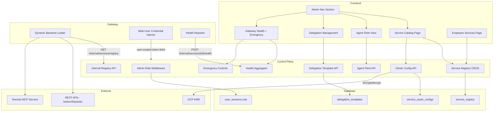
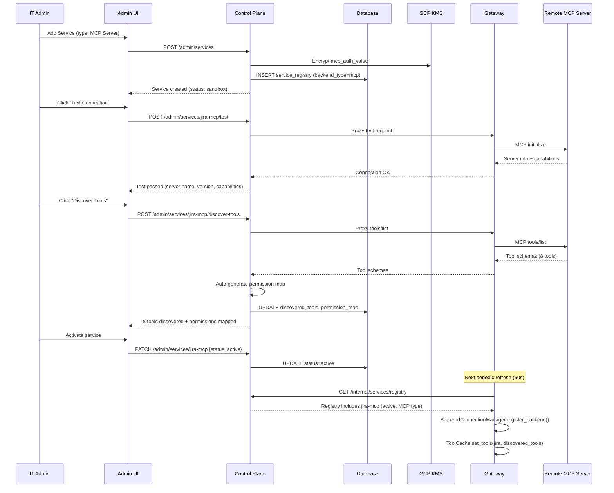
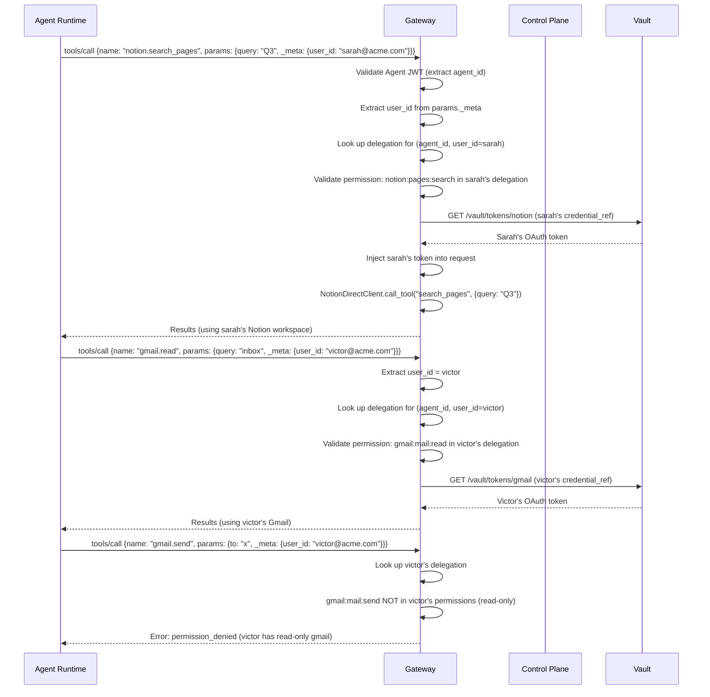

# Spec: P5.2 IT Admin — Service Catalog + MCP Server Management

> **Status:** Draft
> **Author:** Agent (from plan `plans/p5.2_it_admin_service_catalog_cd7a2c1d.plan.md`)
> **Created:** May 28, 2026
> **Priority:** P5.2 — second item in P5 (IT Admin + Multi-User Delegation + SDK)
> **Roadmap Phase:** Phase 3: Q3-Q4 2026 — Platform Expansion
> **Priority Master:** [`plans/PRIORITY_MASTER.md`](../../plans/PRIORITY_MASTER.md)
> **Product Roadmap:** [`plans/PRODUCT_ROADMAP.md`](../../plans/PRODUCT_ROADMAP.md) *(file not yet created — phase mapping derived from PRIORITY_MASTER and P5.1 spec)*
> **Design Doc:** [`docs/design/p5.2-it-admin-service-catalog.md`](../design/p5.2-it-admin-service-catalog.md) *(populated after `/create-design-doc`)*

---

## Priority & Roadmap Mapping

### Priority Master Mapping ([`plans/PRIORITY_MASTER.md`](../../plans/PRIORITY_MASTER.md))

This spec covers **P5.2 — IT Admin: Service Catalog + MCP Server Management** and absorbs all items from the former **P5.3 — Multi-User Agent Delegation Model**.

| Priority Group | Coverage | Items in This Spec |
|---------------|----------|--------------------|
| **P5.1 UI Improvements** | ✅ Complete (shipped) | N/A — prerequisite, already done |
| **P5.2 IT Admin Service Catalog** | ✅ Full | All 12 items: `service-catalog-api`, `org-oauth-config`, `dynamic-mcp-registry`, `role-service-availability`, `service-health-monitoring`, `admin-services-ui`, `org-fleet-view`, `idp-integration-ui` (deferred), `admin-agent-multi-user-view`, `admin-delegation-templates`, `admin-delegation-mgmt-ui` |
| **~~P5.3~~ Multi-User Delegation** (absorbed) | ✅ Full | All 8 items absorbed: `multi-user-delegation`, `user-scoped-tokens`, `per-user-permissions`, `admin-registers-users-delegate`, `agent-user-token-ui`, `user-id-in-tools-call`, `multi-user-demo`, `one-sa-per-customer` |
| **P5.3 MCP Auth Spec Compliance** (new) | ❌ Not in scope | Parallel workstream — no dependency. See `plans/mcp_auth_spec_compliance_a37f2515.plan.md` |
| **P5.4 SDK + Integration Guides** | ❌ Not in scope | Depends on P5.2 service catalog + multi-user runtime |
| **P5.5 Agent Security Architecture** | ❌ Not in scope | Production hardening after P5.2-P5.4 |

### Product Roadmap Mapping

This spec delivers the **P5.2 IT Admin** subset of Phase 3.

| Roadmap Phase | Coverage | What This Spec Delivers |
|--------------|----------|------------------------|
| **Phase 1: Q2 2026** | ✅ Complete (shipped) | N/A — all Phase 1 items done |
| **Phase 2: Q3 2026** | ✅ Complete (shipped) | N/A — P3, P4, P4.5 done |
| **Phase 3: Q3-Q4 2026** | ⚠️ Partial (P5.2 of P5) | Admin role model, service catalog (REST+OAuth + MCP Server), dynamic gateway registry, agent fleet, delegation templates, multi-user runtime, health monitoring, emergency controls |
| **Phase 4+** | ❌ Not in scope | AWS, AgentCore, enterprise governance |

### Persona Capability Unlocked by This Spec

| Persona | Capability Unlocked |
|---------|---------------------|
| **IT Admin** | Configure approved services (REST+OAuth and MCP servers), manage OAuth credentials at org level, view org-wide agent fleet with multi-user lifecycle, create delegation templates with per-permission ceilings, manage cross-user delegations, monitor gateway health, execute emergency controls |
| **Employee** | See all available services (including MCP servers) with clear connect/available distinction, delegations respect admin-defined template ceilings, role-based service visibility |
| **Security Team** | Emergency controls (suspend all, disable delegations, lockdown), encrypted credential storage (GCP KMS), audit trail of emergency actions, gateway health visibility |
| **Engineer / Developer** | Dynamic service registry (add MCP servers without gateway redeployment), multi-user delegation runtime (`_meta.user_id` in tools/call), auto-generated permission maps from MCP tool discovery |

### What This Spec Unblocks

| Blocked Item | Needs | Covered By |
|--------------|-------|-----------|
| P5.4 SDK + Integration Guides | Service catalog API + multi-user tools/call runtime | Phase 2 (backend) + Phase 6 (docs) |
| P6 Vendor Platform | IT Admin service governance + org model | Phase 1 (admin role) + Phase 2 (service registry) |
| P5.1 delegation template analytics | Delegation utilization data from templates | Phase 4 (template CRUD) feeds P5.1 delegation chain viz |
| Org-wide fleet view (Phase 3 roadmap) | Admin APIs for cross-user agent listing | Phase 4 (`GET /admin/agents`) |

---

## Table of Contents

1. [Objective](#1-objective)
2. [Goals & Non-Goals](#2-goals--non-goals)
3. [Background](#3-background)
4. [UI Wireframes](#4-ui-wireframes)
5. [Technical Design](#5-technical-design)
6. [Data Models](#6-data-models)
7. [API Contracts](#7-api-contracts)
8. [Security Considerations](#8-security-considerations)
9. [Project Structure](#9-project-structure)
10. [Testing Strategy](#10-testing-strategy)
11. [Demo Scenarios / User Journeys](#11-demo-scenarios--user-journeys)
12. [Rollout Plan](#12-rollout-plan)
13. [Boundaries](#13-boundaries)
14. [Dependencies & Risks](#14-dependencies--risks)
15. [Open Questions](#15-open-questions)
16. [References](#16-references)

---

## 1. Objective

Build a complete IT Admin workflow for managing MCP backend services, agent fleets, and delegations across an organization. The service catalog supports two fundamentally different backend types — REST-backed OAuth services (existing DirectClients) and Remote MCP Servers (GenericMCPClient) — unified under a single dynamic registry. The multi-user delegation runtime enables one agent to serve N users, each with their own OAuth tokens and permission scopes, selected per tool call.

### User Stories / Acceptance Criteria

- As an **IT Admin**, I want to add a Remote MCP Server (e.g., Jira) to the service catalog so that agents can access it without a gateway code change
- As an **IT Admin**, I want to configure org-level OAuth credentials for REST services so that employees can connect via OAuth consent flow
- As an **IT Admin**, I want to view all agents across all users with per-user delegation details so that I can monitor agent usage org-wide
- As an **IT Admin**, I want to create delegation templates with per-permission ceilings so that users cannot over-provision agent access
- As an **IT Admin**, I want to suspend all agents or disable all delegations in an emergency so that I can respond to security incidents immediately
- As an **Employee**, I want to see all available services (REST and MCP) with clear "Connect" vs "Available" distinction so that I know which tools my agents can use

### Success Criteria

- [ ] Admin can add a Remote MCP Server via UI, gateway picks it up within 60 seconds, and an agent can call its tools
- [ ] Admin can configure OAuth credentials for a REST service, employee connects via OAuth, agent uses their tokens
- [ ] Admin can view all agents cross-user with delegation counts, connected services, and recent activity per user
- [ ] Admin can create a delegation template; user delegation cannot exceed template max_permissions (backend-enforced)
- [ ] Emergency "Suspend All Agents" terminates all agent sessions within 5 seconds
- [ ] `tools/call` with `params._meta.user_id` selects the correct user's delegation and OAuth tokens
- [ ] All OAuth client secrets and MCP auth values encrypted at rest via GCP KMS
- [ ] Employee services page shows both REST+OAuth ("Connect") and MCP ("Available") services from DB

---

## 2. Goals & Non-Goals

### Goals

- [ ] Admin role model: `role` column on `user_sessions`, admin middleware, seed script for initial admin
- [ ] Service registry: DB-driven catalog supporting both `backend_type='rest'` and `backend_type='mcp'`
- [ ] Dynamic gateway loading: Gateway fetches registry from Control Plane, instantiates DirectClient or GenericMCPClient, periodic refresh
- [ ] MCP tool discovery: Admin triggers `tools/list` against remote MCP server, tools cached + permissions auto-generated
- [ ] Org-level OAuth credential management: Admin configures `client_id`/`client_secret` per service, encrypted via GCP KMS
- [ ] Agent fleet view: Cross-user agent listing with per-user delegation details and activity
- [ ] Delegation templates: Per-permission allowed/blocked toggles + constraints (TTL, rate, working hours)
- [ ] Multi-user tools/call: `params._meta.user_id` for per-user token selection and permission enforcement at gateway

### Non-Goals

- **IdP integration (Okta/Azure AD group sync)** — Manual role assignment via seed script + admin API is sufficient for now. Revisit when customer SSO onboarding requires automated role mapping (likely P6+).
- **MCP Authorization Spec Compliance** — All MCP Auth phases (0, 0.5, 1-4) are in the separate P5.3 plan. No dependency between P5.2 and P5.3.
- **Vendor agent approval workflow** — The 4-step vendor approval process from `PRODUCT_USE_CASES_BY_PERSONA.md` Section 3.3.3 is deferred to P6 (requires org model). P5.2 covers basic vendor agent visibility in fleet view.
- **Agent provisioning automation** — Admin registers agents manually or via API. Automated onboarding (e.g., Terraform provider for agent registration) is future work.

---

## 3. Background

### Current State

| Capability | Current Status | Evidence |
|------------|----------------|----------|
| Admin role on `user_sessions` | Missing | No `role` column in [`deeptrail-control/app/models/user_session.py`](../../deeptrail-control/app/models/user_session.py). JWT carries `roles`/`groups` from SSO but no endpoint enforces them |
| Admin middleware / endpoints | Missing | Placeholder comment in [`app/api/deps.py`](../../deeptrail-control/app/api/deps.py) line 289: `# You can add more dependencies here later, e.g., for role checks` |
| Service registry in DB | Missing | Frontend: hardcoded `SERVICE_CATALOG` array (5 services) in [`services/page.tsx`](../../frontend/src/app/(dashboard)/dashboard/services/page.tsx) lines 30-61. Gateway: hardcoded 6 DirectClients in `create_backend_adapter()` |
| DirectClients (REST wrappers) | 6 exist | Notion, Slack, HubSpot, GDrive, GCalendar, Gmail in `deeptrail-gateway/app/backends/` |
| GenericMCPClient (MCP protocol) | Exists, not used | In [`base_mcp_client.py`](../../deeptrail-gateway/app/backends/base_mcp_client.py) — fully implemented with `initialize()`, `list_tools()`, `call_tool()`. Not wired into `create_backend_adapter()` or `main.py` |
| BackendConnectionManager | Exists | `register_backend(BackendConfig)`, health checks, pooled connections — all functional. Not initialized in `main.py` |
| Tool definitions | Hardcoded, partial | Static schemas in `tool_definitions.py` for Notion (8 tools), Slack (7), HubSpot (7). Google Workspace tools get minimal fallback schemas |
| `user_id` in tools/call | Missing | `tools_call.py` derives `owner` from JWT `delegator` claim. No per-call user selection. `_resolve_owner()` used only for token refresh |
| Credential injection | Single-user | `CredentialInjector` uses `_resolve_owner()` from JWT context. `user_id` used for token refresh header (`X-User-ID`) and cache invalidation, not credential selection |
| Delegation model | Supports N:1 at DB | `DelegationToken` has `agent_id` + `delegator`. Multiple users can delegate to same agent. But `agent_session_service.py` picks newest delegation per agent (no `delegator` filter) |
| Organization_id columns | Scaffolded | On 6 tables (nullable, not wired): `user_sessions`, `delegation_tokens`, `agent_sessions`, `audit_events`, `connected_services`, `task_tokens` |
| OAuth credential storage | Env vars only | `oauth_service.py` reads `NOTION_CLIENT_ID`, `SLACK_CLIENT_ID` etc. from env vars. `oauth_config.py` (Pydantic settings) exists but unused at runtime |
| Frontend auth pattern | BFF proxy, no roles | All API calls via `/api/proxy` with httpOnly `__session` cookie. Middleware checks session presence, not roles. No `useAuth` or `useRole` hooks |

### Two Backend Client Types (Critical Architecture Distinction)

The gateway has two parallel client stacks. Only DirectClients are used in production:

| Aspect | REST-backed (DirectClient) | Remote MCP Server (GenericMCPClient) |
|--------|---------------------------|--------------------------------------|
| Production status | **Active** — 6 clients in `create_backend_adapter()` | **Implemented, not wired** — code exists but not in `main.py` |
| Examples | Notion, Slack, Gmail, GDrive, GCal, HubSpot | Any external MCP server (Jira, GitHub, custom) |
| How tools discovered | Hardcoded in `tool_definitions.py` | Via MCP `tools/list` (auto-discovery) |
| Auth to backend | OAuth user token injected by gateway (`CredentialInjector`) | Varies: API key, Bearer token, OAuth, mTLS |
| User connects how | OAuth consent flow (existing Services page) | IT Admin registers; no per-user connection needed |

### Motivation

1. **Service governance is impossible.** IT Admins cannot add, remove, or configure services. Every new backend requires a gateway code change, Docker rebuild, and redeployment. This makes it impossible for customers to manage their own service catalog.

2. **MCP ecosystem is expanding.** Customers want to connect agents to their own MCP servers (Jira MCP, GitHub MCP, financial APIs). The GenericMCPClient infrastructure exists but isn't accessible without code changes. An admin-facing registry unlocks the full MCP ecosystem.

3. **Multi-user delegation is the core customer requirement.** Scale Agentic's Victor confirmed: real customer need is 1 agent serving N users, each with their own tokens and permissions. Today, the gateway picks the newest delegation regardless of user, making multi-user unsafe.

4. **No emergency controls.** If a compromised agent is discovered, there is no way to suspend it or revoke all delegations without direct database access. IT Admins need one-click emergency responses.

---

## 4. UI Wireframes

### Reference Wireframes (from `PRODUCT_USE_CASES_BY_PERSONA.md`)

These wireframes define the target UI and MUST be followed during implementation. Each wireframe is cross-referenced against the reference doc and annotated with implementation details.

| Wireframe | Reference Location | Spec Section | Gap Analysis |
|-----------|-------------------|--------------|--------------|
| Approved Services Registry | Section 4.3 / 3.3.1 (line 508) | Service Catalog page (4.2) | Reference shows `[Import from Catalog]` and `[Bulk Update]` buttons -- defer to future. Core table + Add Service covered |
| Role Permission Configuration | Section 3.3.2 (line 551) | Delegation Management (4.5 sub-panel) | Per-role permission toggles (allowed/blocked) with constraints (TTL, rate, hours). Implemented as part of delegation templates |
| Approved Vendor Agents | Section 3.3.3 (line 585) | Agent Fleet page (4.4 vendor filter) | Vendor approval workflow (4-step). Deferred to P6 (requires org model). Fleet page shows vendor agents with status |
| Emergency Controls | Section 4.4.2 (line 635) | Gateway Health page (4.6 bottom section) | 3 buttons + recent actions log. Fully covered |
| Gateway Operations Dashboard | Section 4.4.3 (line 669) | Gateway Health page (4.6) | 4 panels: metrics, backend status, recent errors, vault status. Fully covered |
| Admin Agent Fleet View | Section 4.6 (line 759) | Agent Fleet page (4.4) | Multi-user lifecycle, delegating users, activity by user. Fully covered |
| Admin Delegation Management | Section 4.7 (line 814) | Delegation Management page (4.5) | Templates table, all delegations cross-user, delegation flow. Fully covered |

### 4.1 Sidebar Navigation (role-aware)

**Implementation**: Add `role` to auth context (from `user_sessions.role` or JWT `roles` claim), conditionally render admin section in [`sidebar.tsx`](../../frontend/src/components/layout/sidebar.tsx). Admin sees everything employees see plus the admin section.

```
SIDEBAR (Employee view - unchanged):          SIDEBAR (Admin view - adds section):
-----------------------------------------     -----------------------------------------
  Overview                                      Overview
  Agents                                        Agents
  Policies                                      Policies
  Services                                      Services
  Audit Trail                                   Audit Trail
  Analytics                                     Analytics
  Vault                                         Vault
  Delegation                                    Delegation
  Tasks                                         Tasks
                                                ------- ADMIN -------
                                                Service Catalog    (ServerCog icon)
                                                Agent Fleet        (Users icon)
                                                Delegation Mgmt    (Shield icon)
                                                Gateway Health     (Activity icon)
```

**Data source**: `GET /api/v1/users/me` returns `role` field. Stored in `useAdminRole()` hook.
**Route guard**: Admin pages at `/dashboard/admin/*` redirect non-admins to `/dashboard`.

### 4.2 Service Catalog Admin Page (`/dashboard/admin/services`)

**Ref**: `PRODUCT_USE_CASES_BY_PERSONA.md` Section 4.3 / 3.3.1 (line 508)

This page is the **MCP Server Registry** -- where the admin adds BOTH REST-backed OAuth services AND remote MCP servers.

```
+-----------------------------------------------------------------------------------+
| Service Catalog                                                  [+ Add Service]  |
+-----------------------------------------------------------------------------------+
| Filter: [All statuses v]  [All types v]  [All data classes v]  [Search...]        |
+-----------------------------------------------------------------------------------+
| Service          | Type       | Status  | Available To      | Data Class | Health |
+------------------+------------+---------+-------------------+------------+--------+
| Notion           | REST+OAuth | Active  | All Employees     | Internal   | UP     |
| Slack            | REST+OAuth | Active  | All Employees     | Internal   | UP     |
| Gmail            | REST+OAuth | Active  | All Employees     | Internal   | UP     |
| Google Calendar  | REST+OAuth | Active  | All Employees     | Internal   | UP     |
| Google Drive     | REST+OAuth | Active  | All Employees     | Internal   | UP     |
| HubSpot          | REST+OAuth | Active  | Sales, Marketing  | Confid.    | SLOW   |
| Jira MCP         | MCP Server | Sandbox | Engineering       | Confid.    | --     |
| GitHub MCP       | MCP Server | Review  | Engineering       | Confid.    | --     |
| Financial API    | MCP Server | Active  | Finance Only      | Restricted | UP     |
+------------------+------------+---------+-------------------+------------+--------+
|                                                                                   |
| Click row to expand -- DIFFERENT detail panels for REST vs MCP:                   |
|                                                                                   |
| EXPANDED: REST+OAuth service (e.g., Notion):                                      |
| +-------------------------------------------------------------------------------+ |
| | Notion (notion)                                          Type: REST + OAuth    | |
| |                                                                               | |
| | CONNECTION DETAILS:                                                           | |
| | Backend API URL: https://api.notion.com/v1                                    | |
| | Gateway Client: NotionDirectClient (built-in)                                 | |
| | Tools: 6 tools (search_pages, read_page, get_page_content, list_databases,    | |
| |        query_database, create_page)                                           | |
| |                                                                               | |
| | OAUTH CONFIGURATION:                                                          | |
| | Client ID: 0ab...def                  [Edit Credentials]                      | |
| | Auth URL: https://api.notion.com/v1/oauth/authorize                           | |
| | Token URL: https://api.notion.com/v1/oauth/token                              | |
| | Scopes: read_content, update_content, insert_content                          | |
| |                                                                               | |
| | AVAILABILITY:                                                                 | |
| | Roles: All Employees           [Edit Roles]                                   | |
| | Data Classification: Internal  [Change]                                       | |
| | Requires Approval: No                                                         | |
| |                                                                               | |
| | HEALTH:                                                                       | |
| | Status: UP  |  Latency: 89ms  |  Errors (24h): 3  |  Active Conns: 12       | |
| | Last Checked: 10:20:01 AM                           [Test Connection]         | |
| |                                                                               | |
| | [Disable Service]  [Delete Service]                                           | |
| +-------------------------------------------------------------------------------+ |
|                                                                                   |
| EXPANDED: Remote MCP Server (e.g., Jira MCP):                                    |
| +-------------------------------------------------------------------------------+ |
| | Jira MCP (jira-mcp)                                    Type: Remote MCP Server| |
| |                                                                               | |
| | MCP SERVER DETAILS:                                                           | |
| | Endpoint URL: https://mcp.atlassian.com/jira                                  | |
| | Transport: streamable-http                                                    | |
| | Protocol Version: 2024-11-05                                                  | |
| | Gateway Client: GenericMCPClient (auto-connected)                             | |
| |                                                                               | |
| | AUTHENTICATION TO MCP SERVER:                                                 | |
| | Auth Method: API Key                                                          | |
| | API Key: atl_...xxx (configured)      [Edit Auth]                             | |
| |                                                                               | |
| | DISCOVERED TOOLS (via MCP tools/list):                                        | |
| | 8 tools discovered:                                                           | |
| | - jira.search_issues: Search Jira issues by JQL                               | |
| | - jira.get_issue: Get issue details by key                                    | |
| | - jira.create_issue: Create a new issue                                       | |
| | - jira.update_issue: Update issue fields                                      | |
| | - jira.add_comment: Add comment to issue                                      | |
| | - jira.transition_issue: Change issue status                                  | |
| | - jira.list_projects: List accessible projects                                | |
| | - jira.get_sprint: Get sprint details                                         | |
| | [Refresh Tools]  (re-runs MCP tools/list to update)                           | |
| |                                                                               | |
| | PERMISSION MAPPING:                                                           | |
| | Auto-generated from tool names:                                               | |
| | jira:issues:search, jira:issues:read, jira:issues:create,                     | |
| | jira:issues:update, jira:comments:create, jira:issues:transition,             | |
| | jira:projects:read, jira:sprints:read                                         | |
| | [Edit Permission Map]                                                         | |
| |                                                                               | |
| | AVAILABILITY:                                                                 | |
| | Roles: Engineering, Product        [Edit Roles]                               | |
| | Data Classification: Confidential  [Change]                                   | |
| | Requires Approval: No                                                         | |
| |                                                                               | |
| | HEALTH:                                                                       | |
| | Status: -- (sandbox, not checked)                     [Test Connection]       | |
| |                                                                               | |
| | [Activate]  [Delete Service]                                                  | |
| +-------------------------------------------------------------------------------+ |
+-----------------------------------------------------------------------------------+
```

**Key implementation details:**
- `Type` column shows `REST+OAuth` vs `MCP Server` based on `service_registry.backend_type`
- Expanded panel is **different** for each type (OAuth config vs MCP auth + tool discovery)
- MCP server tools are auto-discovered via `GenericMCPClient.list_tools()` and cached
- Permission mapping for MCP servers auto-generated from tool names (e.g., `jira.search_issues` -> `jira:issues:search`)
- `[Refresh Tools]` button re-runs MCP `tools/list` and updates tool cache + permission map
- `[Test Connection]` calls the service's health endpoint (REST) or sends MCP `initialize` (MCP)

### 4.3 Add Service Modal

**Two-mode form** that changes based on service type selection.

```
+-----------------------------------------------------------------------------------+
| Add New Service                                                          [X]      |
+-----------------------------------------------------------------------------------+
|                                                                                   |
| SERVICE TYPE:                                                                     |
| (*) Remote MCP Server  -- Connect to an external MCP server                       |
| ( ) REST + OAuth       -- Built-in REST client with OAuth user tokens             |
|                                                                                   |
| --- Common Fields ---                                                             |
| Service ID*:          [jira-mcp                          ]                        |
| Display Name*:        [Jira Issue Tracker                ]                        |
| Description:          [Access Jira issues, sprints, and projects]                 |
| Data Classification:  [confidential v]                                            |
| Available To:         [x] All Employees  [ ] Sales  [x] Engineering              |
| Initial Status:       [sandbox v]                                                 |
|                                                                                   |
| --- MCP Server Configuration (shown when "Remote MCP Server" selected) ---       |
| MCP Endpoint URL*:    [https://mcp.atlassian.com/jira    ]                        |
| Transport*:           [streamable-http v]  (streamable-http | sse | stdio)        |
|                                                                                   |
| Auth to MCP Server:   [API Key v]  (none | api-key | bearer-token | oauth)       |
|   API Key Header:     [Authorization                     ]                        |
|   API Key Value:      [atl_xxxxxxxxxxxxx                 ]                        |
|                                                                                   |
| [Test Connection]  -- sends MCP initialize, shows server info + tool count        |
|                                                                                   |
| --- OAuth Configuration (shown when "REST + OAuth" selected) ---                  |
| Backend API URL*:     [https://api.example.com/v1        ]                        |
| Client ID*:           [0oa1234567890abcdef               ]                        |
| Client Secret*:       [********                          ]                        |
| Auth URL*:            [https://auth.example.com/authorize]                        |
| Token URL*:           [https://auth.example.com/token    ]                        |
| Scopes:               [read, write, admin                ]                        |
|                                                                                   |
| NOTE: REST+OAuth services require a built-in DirectClient in the gateway.         |
| For custom REST APIs, use "Remote MCP Server" type instead and run an MCP         |
| adapter in front of your API.                                                     |
|                                                                                   |
|                          [Cancel]  [Add Service]                                  |
+-----------------------------------------------------------------------------------+
```

**Key implementation details:**
- Form dynamically shows/hides sections based on service type radio
- `[Test Connection]` for MCP servers sends `initialize` + `tools/list` and shows discovered tool count
- For REST+OAuth, requires a matching DirectClient class in gateway code (shown as NOTE)
- After adding an MCP server, gateway picks it up on next periodic refresh
- Auth method dropdown for MCP servers: `none`, `api-key`, `bearer-token`, `oauth`

### 4.4 Agent Fleet View (`/dashboard/admin/agents`)

**Ref**: `PRODUCT_USE_CASES_BY_PERSONA.md` Section 4.6 (line 759)

```
+-----------------------------------------------------------------------------------+
| Agent Fleet                     [All statuses v] [All platforms v] [Search...]     |
+-----------------------------------------------------------------------------------+
|                                                                                   |
| Summary: 4 agents | 6 delegating users | 2 active | 1 authenticated | 1 reg'd    |
|                                                                                   |
| Agent           | Platform      | Status | Users | Last Active   | Services       |
+-----------------+---------------+--------+-------+---------------+----------------+
| Sales Assistant | GCP Workload  | Active |   3   | 2 min ago     | Notion,Slack   |
| Eng Audit Bot   | Ed25519 Key   | Active |   2   | 15 min ago    | Notion,GitHub  |
| HR Helper       | GCP Workload  | Auth'd |   0   | --            | --             |
| Data Agent      | AWS IAM       | Reg'd  |   1   | 3 days ago    | Financial API  |
+-----------------+---------------+--------+-------+---------------+----------------+
|                                                                                   |
| EXPANDED: Sales Assistant                                                         |
| +-------------------------------------------------------------------------------+ |
| | Sales Assistant (agent-xxx-yyy-zzz)                                           | |
| | Platform: GCP Workload Identity                                               | |
| | Service Account: sales-agent-sa@company.iam.gserviceaccount.com               | |
| | Registered by: admin@acme.com on 2026-05-15                                   | |
| |                                                                               | |
| | LIFECYCLE:                                                                    | |
| | *---Reg(admin)---*---Del(3 users)---*---Auth(1x bootstrap)---*---Active---*   | |
| |                                                                               | |
| | DELEGATING USERS (3):                                                         | |
| | User            | Services             | Permissions        | Expires         | |
| | sarah@acme.com  | Notion, Slack,       | Full access (8)    | 6 days          | |
| |                 | Gmail, Calendar      |                    |                 | |
| | victor@acme.com | Notion, Gmail        | Read-only          | 4 days          | |
| |                 |                      | (no email send)    |                 | |
| | priya@acme.com  | Slack only           | messages:read (2)  | 2 days          | |
| |                                                                               | |
| | RECENT ACTIVITY (by user context):                                            | |
| | Time   | User   | Tool                | Status | Result        | Duration     | |
| | 10:15  | sarah  | notion.search_pages | OK     | 3 results     | 473ms        | |
| | 10:16  | victor | gcalendar.list      | OK     | 5 events      | 320ms        | |
| | 10:17  | priya  | slack.list_channels | OK     | 12 channels   | 210ms        | |
| | 10:18  | victor | gmail.send_message  | DENIED | no permission | --           | |
| |                                                                               | |
| | ACTIONS:                                                                      | |
| | [Suspend Agent]  [Revoke All Delegations]  [View Full Audit Trail]            | |
| +-------------------------------------------------------------------------------+ |
+-----------------------------------------------------------------------------------+
```

**Key implementation details:**
- Summary bar shows aggregate counts
- Table includes `Services` column showing which backends the agent's delegations cover
- Expanded detail shows full lifecycle progress bar with annotations (admin, user self-service, bootstrap, heartbeat)
- Delegating Users table shows per-user connected services, permission count, and TTL
- Activity table includes `User` column to distinguish whose context each tool call used
- `[Suspend Agent]` calls `POST /admin/agents/{id}/suspend` and revokes all delegations
- `[Revoke All Delegations]` revokes only delegations, keeps agent registered
- Data sources: `GET /admin/agents` (cross-user), `GET /audit/events?agent_id=X` (recent activity)

### 4.5 Delegation Management (`/dashboard/admin/delegations`)

**Ref**: `PRODUCT_USE_CASES_BY_PERSONA.md` Section 4.7 (line 814)

```
+-----------------------------------------------------------------------------------+
| Delegation Management                                     [+ Create Template]     |
+-----------------------------------------------------------------------------------+
|                                                                                   |
| DELEGATION TEMPLATES:                                                             |
| Agent              | Default Permissions        | Max TTL | Rate Limit | Users    |
+--------------------+----------------------------+---------+------------+----------+
| Sales Assistant    | notion:read, slack:*,      | 7 days  | 500/day    | 5/10     |
|                    | gmail:read, cal:read       |         |            | active   |
| Engineering Audit  | notion:*, slack:*,         | 7 days  | 1000/day   | 3/3      |
|                    | github:read                |         |            | active   |
| Thunderbolt Agent  | notion:*, slack:*,         | 7 days  | unlimited  | 1/inf    |
|                    | gmail:*, gdrive:*          |         |            | active   |
+--------------------+----------------------------+---------+------------+----------+
| [+ Create Template]  [Edit]  [Clone]  [Delete]                                   |
|                                                                                   |
| EXPANDED: Create/Edit Template                                                    |
| +-------------------------------------------------------------------------------+ |
| | Template for: Sales Assistant                                                 | |
| |                                                                               | |
| | MAXIMUM PERMISSIONS (ceiling for users):                                      | |
| | notion:pages:read           [x] Allowed                                       | |
| | notion:pages:create         [x] Allowed                                       | |
| | notion:pages:delete         [ ] Blocked (destructive)                         | |
| | slack:messages:read         [x] Allowed                                       | |
| | slack:messages:send         [x] Allowed                                       | |
| | slack:admin:*               [ ] Blocked (admin-only)                          | |
| | gmail:read                  [x] Allowed                                       | |
| | gmail:send                  [ ] Blocked                                       | |
| | financial:*                 [ ] Not available for this role                    | |
| |                                                                               | |
| | CONSTRAINTS:                                                                  | |
| | Max delegation TTL: [7] days                                                  | |
| | Max actions per day: [500]  (blank = unlimited)                               | |
| | Working hours only:  [ ] Enabled  Start: [06:00]  End: [22:00]                | |
| | Available to roles:  [x] sales-rep  [ ] engineering  [ ] finance              | |
| |                                                                               | |
| |                          [Cancel]  [Save Template]                            | |
| +-------------------------------------------------------------------------------+ |
|                                                                                   |
| --- Separator ---                                                                 |
|                                                                                   |
| ALL ACTIVE DELEGATIONS (across all users):          [Filter by agent v] [Search]  |
| User            | Agent              | Permissions  | Status  | TTL  | Source     |
+-----------------+--------------------+--------------+---------+------+------------+
| sarah@acme      | Sales Assistant    | 12 (full)    | Active  | 6d   | template   |
| victor@acme     | Sales Assistant    | 5 (narrowed) | Active  | 4d   | template   |
| priya@acme      | Sales Assistant    | 4 (narrowed) | Active  | 2d   | manual     |
| mahendra@       | Engineering Audit  | 12 (full)    | Active  | 7d   | template   |
| sarah@acme      | Thunderbolt Agent  | 15 (full)    | Active  | 7d   | template   |
| victor@acme     | Engineering Audit  | -- (pending) | Invited | --   | invite     |
+-----------------+--------------------+--------------+---------+------+------------+
| [Create Delegation]  [Bulk Revoke]  [Export CSV]                                  |
|                                                                                   |
| DELEGATION FLOW (informational):                                                  |
| 1. Admin creates template -> sets max permissions (ceiling) + default TTL         |
| 2. User self-service -> accepts delegation, can NARROW (remove) but not ADD       |
| 3. Admin override -> can revoke any delegation or create on behalf of user        |
+-----------------------------------------------------------------------------------+
```

**Key implementation details:**
- Templates section shows the permission ceiling per agent + constraints (TTL, rate, hours)
- Expanded template edit shows per-permission toggles (Allowed/Blocked) following reference wireframe from `PRODUCT_USE_CASES_BY_PERSONA.md` Section 3.3.2
- Blocked permissions shown grayed out with tooltip explaining why (e.g., "Blocked by admin template")
- `Source` column shows if delegation was created from template, manually by admin, or via invite
- `Status` includes "Invited" for pending delegations where user hasn't accepted yet
- Role permission configuration (Section 3.3.2 wireframe) is integrated INTO the template editor rather than a separate page
- Users who accept a template-based delegation auto-inherit max permissions and can narrow them
- Data sources: `GET /admin/delegation-templates`, `GET /admin/delegations`

### 4.6 Gateway Health Dashboard (`/dashboard/admin/health`)

**Ref**: `PRODUCT_USE_CASES_BY_PERSONA.md` Section 4.4.3 (line 669) + Section 4.4.2 (line 635)

```
+-----------------------------------------------------------------------------------+
| Gateway Health                                 System: OK     Last: 10:20:01 AM   |
+-----------------------------------------------------------------------------------+
|                                                                                   |
| GATEWAY METRICS (Last 24h):                                                       |
| +-------------------------------------------------------------------------------+ |
| | Total MCP Requests: 12,458    |  Success Rate: 99.2%                          | |
| | Active Sessions: 47           |  Unique Agents: 23                            | |
| | Unique Users: 156             |  Delegations Active: 312                      | |
| |                                                                               | |
| | Request Latency:                                                              | |
| |   initialize:  p50: 45ms  |  p95: 120ms  |  p99: 340ms                       | |
| |   tools/list:  p50: 23ms  |  p95:  67ms  |  p99: 150ms                       | |
| |   tools/call:  p50: 89ms  |  p95: 234ms  |  p99: 890ms                       | |
| +-------------------------------------------------------------------------------+ |
|                                                                                   |
| BACKEND MCP SERVER STATUS:                                                        |
| +-------------------------------------------------------------------------------+ |
| | Backend     | Type       | Status | Latency | Errors(24h) | Conns | Health    | |
| | notion      | REST+OAuth | UP     |   89ms  |      3      |  12   | 100%     | |
| | slack       | REST+OAuth | UP     |   45ms  |      0      |   8   | 100%     | |
| | hubspot     | REST+OAuth | SLOW   |  850ms  |     12      |   4   |  87%     | |
| | jira-mcp    | MCP Server | UP     |  120ms  |      0      |   2   | 100%     | |
| | salesforce  | MCP Server | DOWN   |   --    |     47      |   0   |   0%     | |
| |                                                                               | |
| | [Test Connection]  [Refresh]  [View Backend Logs]                             | |
| +-------------------------------------------------------------------------------+ |
|                                                                                   |
| RECENT ERRORS (Last Hour):                                                        |
| +-------------------------------------------------------------------------------+ |
| | Time     | Agent           | Error Type          | Backend    | User           | |
| | 10:18:45 | agent-hr-003    | Vault token expired | notion     | sarah          | |
| | 10:15:22 | agent-sdr-001   | Backend timeout     | hubspot    | mike           | |
| | 10:12:03 | agent-sales-007 | Connection refused  | salesforce | jane           | |
| | 10:08:17 | agent-hr-003    | Permission denied   | slack      | sarah          | |
| |                                                                               | |
| | [View Full Logs]  [Export]                                                    | |
| +-------------------------------------------------------------------------------+ |
|                                                                                   |
| CREDENTIAL VAULT STATUS:                                                          |
| +-------------------------------------------------------------------------------+ |
| | Total Stored Tokens: 234     |  Expiring Soon (7d): 12                        | |
| | Cache Hit Rate: 94.2%        |  Last Refresh: 10:15:00                        | |
| |                                                                               | |
| | Tokens Requiring Attention:                                                   | |
| | - sarah@acme.com - notion - Expires in 2 days                                 | |
| | - mike@acme.com - hubspot - Refresh failed (re-auth needed)                   | |
| +-------------------------------------------------------------------------------+ |
|                                                                                   |
| EMERGENCY CONTROLS:                                                    Caution    |
| +-------------------------------------------------------------------------------+ |
| | [SUSPEND ALL AGENTS]           Terminates all agent sessions                  | |
| |                                Affects: 47 active agents / 312 employees      | |
| |                                                                               | |
| | [DISABLE ALL DELEGATIONS]      Revokes all delegation tokens org-wide         | |
| |                                Affects: 1,247 active delegations              | |
| |                                                                               | |
| | [LOCKDOWN MODE]                Blocks ALL agent activity until re-enabled      | |
| |                                Affects: All agents, all users                 | |
| +-------------------------------------------------------------------------------+ |
| Recent Emergency Actions:                                                         |
| - 2026-05-20 14:32 - Suspended agent-vendor-xyz (admin@acme.com)                 |
| - 2026-05-18 09:15 - Revoked delegation del-abc123 (security@acme.com)           |
+-----------------------------------------------------------------------------------+
```

**Key implementation details:**
- 5 panels matching the reference wireframe: Metrics, Backend Status, Recent Errors, Vault Status, Emergency Controls
- Backend status table includes `Type` column to distinguish REST+OAuth vs MCP Server
- Latency breakdown by MCP method (initialize, tools/list, tools/call) from reference wireframe
- Emergency controls show impact counts (agents affected, delegations affected) before confirmation
- Each emergency button requires a confirmation dialog with reason field
- Recent Emergency Actions shows audit trail of past emergency actions
- Data sources: `GET /admin/health` (aggregated from gateway), `GET /audit/events?event_type=emergency_action`

### 4.7 Employee Services Page (updated)

The existing employee Services page (`/dashboard/services`) will be updated in Phase 6 to read from DB instead of hardcoded catalog. Both REST+OAuth and MCP services are shown, with different action affordances:

```
+-----------------------------------------------------------------------------------+
| Services                                                                          |
+-----------------------------------------------------------------------------------+
|                                                                                   |
| REST+OAuth Service (e.g., Notion):             MCP Service (e.g., Jira MCP):      |
| +-----------------------------------+          +-------------------------------+   |
| | [Notion logo]                     |          | [Jira logo]                   |   |
| | Notion                            |          | Jira Issue Tracker            |   |
| | Workspace collaboration           |          | Issue tracking and sprints    |   |
| |                                   |          |                               |   |
| | Status: Connected                 |          | Status: Available             |   |
| | Scopes: read, write               |          | 8 tools available             |   |
| |                                   |          |                               |   |
| | [Disconnect]                      |          | (No action needed -           |   |
| +-----------------------------------+          |  managed by IT Admin)         |   |
|                                                +-------------------------------+   |
|                                                                                   |
| Not yet connected:                                                                |
| +-----------------------------------+                                             |
| | [HubSpot logo]                    |                                             |
| | HubSpot CRM                       |                                             |
| | Sales and marketing               |                                             |
| |                                   |                                             |
| | [Connect with OAuth]              |                                             |
| +-----------------------------------+                                             |
+-----------------------------------------------------------------------------------+
```

**Key implementation details:**
- REST+OAuth services show "Connect" / "Connected" / "Disconnect" based on OAuth connection status
- MCP services show "Available" badge with tool count -- no user action needed (admin-managed)
- Services filtered by `available_to_roles` matching user's role (employee only sees services available to them)
- Data source: `GET /api/v1/admin/services` (or a new employee-facing endpoint with role filtering)

---

## 5. Technical Design

### Services Affected

| Service | Impact | Changes |
|---------|--------|---------|
| deeptrail-control | High | New admin endpoints (~25), new DB tables (3), migration, admin middleware, service registry service, seed script |
| deeptrail-gateway | High | Dynamic backend loader, multi-user credential injection, `user_id` in tools/call, health reporting |
| frontend | High | 4 new admin pages, admin sidebar section, role detection hook, type-aware service catalog, Add Service modal |
| deepsecure (SDK) | None | No changes |

### Architecture Overview



### MCP Server Registration Flow



### Multi-User Tools/Call Flow



### Key Components

**1. Admin Role Middleware** (`deeptrail-control/app/middleware/admin_auth.py`)

```python
from fastapi import Depends, HTTPException, status
from app.api.deps import get_current_user_claims

async def require_admin(claims: dict = Depends(get_current_user_claims)) -> dict:
    """Verify the current user has admin role.
    
    Reads 'roles' from JWT claims (populated by SSO from IdP groups).
    Falls back to checking user_sessions.role column for non-SSO logins.
    """
    roles = claims.get("roles", [])
    if "admin" not in roles:
        raise HTTPException(
            status_code=status.HTTP_403_FORBIDDEN,
            detail="Admin role required",
        )
    return claims
```

**2. Service Registry Service** (`deeptrail-control/app/services/service_registry_service.py`)

```python
class ServiceRegistryService:
    """Business logic for service catalog CRUD and MCP tool discovery."""

    def __init__(self, db: Session, kms_client: KMSClient):
        self.db = db
        self.kms = kms_client

    async def create_service(self, data: ServiceCreateRequest) -> ServiceRegistry:
        """Create a new service in the registry.
        Encrypts mcp_auth_value or oauth client_secret via GCP KMS."""
        ...

    async def discover_tools(self, service_id: str) -> ToolDiscoveryResult:
        """Proxy tools/list to remote MCP server via gateway.
        Caches discovered tool schemas and auto-generates permission map."""
        ...

    async def test_connection(self, service_id: str) -> ConnectionTestResult:
        """Test backend connectivity.
        REST: health endpoint check. MCP: initialize handshake."""
        ...

    def get_registry_for_gateway(self) -> list[ServiceRegistryGatewayView]:
        """Return active services with connection configs for gateway internal API.
        Includes decrypted auth values (only exposed on internal endpoint)."""
        ...
```

**3. Dynamic Backend Loader** (`deeptrail-gateway/app/backends/dynamic_registry.py`)

```python
class DynamicBackendLoader:
    """Fetches service registry from Control Plane and manages backend lifecycle.
    
    On startup: fetches registry, instantiates DirectClient (REST) or 
    GenericMCPClient (MCP) for each active service.
    Periodic refresh: adds new backends, removes deactivated ones, updates configs.
    """

    def __init__(
        self,
        adapter: BackendClientAdapter,
        connection_manager: BackendConnectionManager,
        tool_cache: ToolCache,
        control_plane_url: str,
        internal_api_token: str,
        refresh_interval_seconds: int = 60,
    ):
        ...

    async def initial_load(self) -> None:
        """Fetch registry and instantiate all active backends."""
        ...

    async def periodic_refresh(self) -> None:
        """Add new backends, remove deactivated, update health."""
        ...

    def _instantiate_rest_backend(self, service: ServiceConfig) -> None:
        """Register a DirectClient for a REST+OAuth service."""
        ...

    def _instantiate_mcp_backend(self, service: ServiceConfig) -> None:
        """Register a GenericMCPClient via BackendConnectionManager."""
        ...
```

**4. Multi-User Credential Resolver** (modification to `deeptrail-gateway/app/mcp/handlers/tools_call.py`)

```python
def _extract_user_id(params: dict) -> str | None:
    """Extract user_id from MCP _meta field.
    
    MCP convention: params._meta contains per-call metadata.
    Returns None if not present (falls back to JWT owner for single-user).
    """
    meta = params.get("_meta", {})
    return meta.get("user_id")


async def _resolve_user_delegation(
    agent_id: str,
    user_id: str,
    session_manager: MCPSessionManager,
) -> DelegationContext:
    """Resolve the specific delegation for (agent_id, user_id) pair.
    
    Unlike current behavior (newest delegation for agent), this filters
    by delegator to find the correct user's delegation and credential_ref.
    """
    ...
```

### Architecture Decisions

| Decision | Options Considered | Chosen | Rationale |
|----------|--------------------|--------|-----------|
| Backend type discriminator | A) Separate tables per type, B) Single table with `backend_type` column, C) Polymorphic inheritance | B) Single table | Simplest schema. Both types share 80% of fields. `backend_type` enum cleanly routes to DirectClient vs GenericMCPClient |
| Encryption for secrets | A) Env var (FERNET_KEY), B) GCP KMS, C) HashiCorp Vault | B) GCP KMS | Already deployed on GCP. More secure than env vars. No new infrastructure needed. Fernet still used for local dev with fallback |
| Multi-user user_id location | A) `params._meta.user_id`, B) Top-level `params.user_id`, C) HTTP header | A) `_meta` | Follows MCP convention for per-call metadata. Doesn't pollute tool argument namespace. Standard MCP clients can extend `_meta` |
| Gateway registry refresh | A) Webhook push from Control Plane, B) Polling with interval, C) Redis pub/sub | B) Polling (60s) | Simplest. Control Plane doesn't need to track gateway instances. Acceptable latency (max 60s to pick up new service) |
| Admin role source | A) DB column only, B) JWT claims only, C) JWT claims + DB fallback | C) JWT + DB | SSO already puts roles in JWT. DB column covers non-SSO logins (dev, CLI). Admin middleware checks both |
| Template enforcement | A) Backend only, B) Frontend + backend, C) Frontend (gray out blocked + tooltip) + backend validation | C) Full stack | Best UX: user sees why a permission is blocked. Backend validation prevents bypass. Both are needed |

---

## 6. Data Models

### New: ServiceRegistry

| Column | Type | Description |
|--------|------|-------------|
| `id` | `UUID` PK | Auto-generated |
| `service_id` | `String(50)` UNIQUE NOT NULL | Stable identifier (e.g., `"notion"`, `"jira-mcp"`) |
| `display_name` | `String(100)` NOT NULL | Human-readable name |
| `description` | `Text` nullable | Service description |
| `backend_type` | `String(20)` NOT NULL, default `'rest'` | `"rest"` (DirectClient) or `"mcp"` (GenericMCPClient) |
| `endpoint_url` | `String(500)` NOT NULL | REST: API base URL. MCP: server endpoint URL |
| `transport` | `String(20)` default `'rest'` | `"rest"`, `"streamable-http"`, `"sse"` |
| `mcp_auth_method` | `String(20)` default `'none'` | MCP only: `"none"`, `"api-key"`, `"bearer-token"`, `"oauth"` |
| `mcp_auth_header` | `String(100)` nullable | e.g., `"Authorization"`, `"X-API-Key"` |
| `mcp_auth_value_encrypted` | `String(2000)` nullable | GCP KMS encrypted API key or token |
| `mcp_protocol_version` | `String(20)` default `'2024-11-05'` | MCP protocol version |
| `discovered_tools` | `JSONB` nullable | Cached tool schemas from `tools/list` |
| `tools_last_discovered_at` | `DateTime(tz)` nullable | When tools were last refreshed |
| `permission_map` | `JSONB` nullable | Auto-generated: `tool_name -> permission_string` |
| `data_classification` | `String(20)` default `'internal'` | `"internal"`, `"confidential"`, `"restricted"` |
| `status` | `String(20)` default `'sandbox'` | `"active"`, `"sandbox"`, `"review"`, `"disabled"` |
| `available_to_roles` | `JSONB` default `'["all"]'` | `["all"]` or `["sales", "engineering"]` |
| `requires_approval` | `Boolean` default `false` | Whether user needs admin approval to use |
| `health_status` | `String(20)` default `'unknown'` | Gateway-reported: `"up"`, `"down"`, `"slow"`, `"unknown"` |
| `health_last_checked_at` | `DateTime(tz)` nullable | Last health probe timestamp |
| `health_latency_ms` | `Integer` nullable | Last probe latency |
| `health_error_count_24h` | `Integer` default `0` | Rolling 24h error count |
| `organization_id` | `UUID` nullable | Multi-tenant org identifier |
| `created_at` | `DateTime(tz)` NOT NULL | Auto-set |
| `updated_at` | `DateTime(tz)` NOT NULL | Auto-updated |

### New: ServiceOAuthConfig

| Column | Type | Description |
|--------|------|-------------|
| `id` | `UUID` PK | Auto-generated |
| `service_id` | `String(50)` FK -> service_registry.service_id | Which service this config belongs to |
| `client_id` | `String(500)` NOT NULL | OAuth client ID |
| `client_secret_encrypted` | `String(2000)` NOT NULL | GCP KMS encrypted client secret |
| `auth_url` | `String(500)` nullable | OAuth authorization URL |
| `token_url` | `String(500)` nullable | OAuth token exchange URL |
| `scopes` | `Text[]` nullable | Available OAuth scopes |
| `organization_id` | `UUID` nullable | Multi-tenant org identifier |
| `created_at` | `DateTime(tz)` NOT NULL | Auto-set |
| `updated_at` | `DateTime(tz)` NOT NULL | Auto-updated |
| | `UNIQUE(service_id, organization_id)` | One config per service per org |

### New: DelegationTemplate

| Column | Type | Description |
|--------|------|-------------|
| `id` | `UUID` PK | Auto-generated |
| `agent_id` | `String(100)` NOT NULL | Which agent this template applies to |
| `max_permissions` | `JSONB` NOT NULL | Permission ceiling: `["notion:pages:read", "slack:messages:*"]` |
| `blocked_permissions` | `JSONB` default `'[]'` | Explicitly blocked: `["notion:pages:delete"]` |
| `default_ttl_days` | `Integer` default `7` | Default delegation TTL |
| `available_to_roles` | `JSONB` default `'["all"]'` | Which roles can use this template |
| `max_actions_per_day` | `Integer` nullable | Rate limit (null = unlimited) |
| `working_hours_start` | `Time` nullable | Constraint: earliest allowed hour |
| `working_hours_end` | `Time` nullable | Constraint: latest allowed hour |
| `organization_id` | `UUID` nullable | Multi-tenant org identifier |
| `created_by` | `String(200)` nullable | Admin who created the template |
| `created_at` | `DateTime(tz)` NOT NULL | Auto-set |
| `updated_at` | `DateTime(tz)` NOT NULL | Auto-updated |

### Modified: UserSession

| Change | Detail |
|--------|--------|
| Add column | `role VARCHAR(20) DEFAULT 'employee'` — values: `'employee'`, `'admin'`, `'security'` |

### Modified: DelegationToken (no schema change, behavior change)

| Change | Detail |
|--------|--------|
| Query behavior | `agent_session_service.py` delegation lookup changes from "newest per agent_id" to "active delegation for (agent_id, delegator)" when `user_id` is provided in tools/call |
| Template reference | Add optional `template_id UUID REFERENCES delegation_templates(id)` column — tracks if delegation was created from a template |
| Source tracking | Add `source VARCHAR(20) DEFAULT 'manual'` — values: `'manual'`, `'template'`, `'invite'`, `'admin'` |

---

## 7. API Contracts

> **CRITICAL**: This section is the CANONICAL source for all API endpoints.
> Task tickets, tests, and implementations MUST match these exactly.

### Endpoint Summary

| Method | Endpoint | Purpose | Auth |
|--------|----------|---------|------|
| `GET` | `/api/v1/admin/services` | List all services in registry | Admin JWT |
| `POST` | `/api/v1/admin/services` | Add service (REST or MCP) | Admin JWT |
| `PATCH` | `/api/v1/admin/services/{service_id}` | Update service config | Admin JWT |
| `DELETE` | `/api/v1/admin/services/{service_id}` | Remove service | Admin JWT |
| `POST` | `/api/v1/admin/services/{service_id}/test` | Test backend connection | Admin JWT |
| `GET` | `/api/v1/admin/services/{service_id}/oauth` | Get OAuth config (redacted) | Admin JWT |
| `PUT` | `/api/v1/admin/services/{service_id}/oauth` | Set OAuth credentials | Admin JWT |
| `POST` | `/api/v1/admin/services/{service_id}/discover-tools` | Run MCP tools/list | Admin JWT |
| `GET` | `/api/v1/admin/agents` | List all agents cross-user | Admin JWT |
| `POST` | `/api/v1/admin/agents/{agent_id}/suspend` | Suspend agent | Admin JWT |
| `GET` | `/api/v1/admin/delegations` | List all delegations | Admin JWT |
| `POST` | `/api/v1/admin/delegations` | Create delegation on behalf | Admin JWT |
| `DELETE` | `/api/v1/admin/delegations/{id}` | Revoke delegation | Admin JWT |
| `GET` | `/api/v1/admin/delegation-templates` | List templates | Admin JWT |
| `POST` | `/api/v1/admin/delegation-templates` | Create template | Admin JWT |
| `PATCH` | `/api/v1/admin/delegation-templates/{id}` | Update template | Admin JWT |
| `DELETE` | `/api/v1/admin/delegation-templates/{id}` | Delete template | Admin JWT |
| `GET` | `/api/v1/admin/health` | Gateway health aggregation | Admin JWT |
| `POST` | `/api/v1/admin/emergency/suspend-all` | Suspend all agents | Admin JWT |
| `POST` | `/api/v1/admin/emergency/disable-delegations` | Revoke all delegations | Admin JWT |
| `POST` | `/api/v1/admin/emergency/lockdown` | Block all agent activity | Admin JWT |
| `POST` | `/api/v1/admin/users/{user_id}/role` | Set user role | Admin JWT |
| `GET` | `/api/v1/internal/services/registry` | Gateway fetches active services | Internal Token |
| `POST` | `/api/v1/internal/services/{id}/health` | Gateway reports health | Internal Token |

### POST /api/v1/admin/services

**Request (MCP Server type):**
```
Authorization: Bearer <admin-jwt>
Content-Type: application/json
```
```json
{
  "service_id": "jira-mcp",
  "display_name": "Jira Issue Tracker",
  "backend_type": "mcp",
  "endpoint_url": "https://mcp.atlassian.com/jira",
  "transport": "streamable-http",
  "mcp_auth_method": "api-key",
  "mcp_auth_header": "Authorization",
  "mcp_auth_value": "atl_xxxxxxxxxxxxx",
  "data_classification": "confidential",
  "available_to_roles": ["engineering", "product-manager"],
  "status": "sandbox"
}
```

**Request (REST+OAuth type):**
```json
{
  "service_id": "salesforce",
  "display_name": "Salesforce CRM",
  "backend_type": "rest",
  "endpoint_url": "https://api.salesforce.com/v1",
  "transport": "rest",
  "data_classification": "confidential",
  "available_to_roles": ["sales"],
  "status": "sandbox"
}
```

**Response (201):**
```json
{
  "id": "uuid-xxx",
  "service_id": "jira-mcp",
  "display_name": "Jira Issue Tracker",
  "backend_type": "mcp",
  "endpoint_url": "https://mcp.atlassian.com/jira",
  "transport": "streamable-http",
  "mcp_auth_method": "api-key",
  "status": "sandbox",
  "data_classification": "confidential",
  "available_to_roles": ["engineering", "product-manager"],
  "discovered_tools": null,
  "health_status": "unknown",
  "created_at": "2026-05-28T12:00:00Z"
}
```

**Error Responses:**
| Status | Condition |
|--------|-----------|
| 400 | Invalid `backend_type`, missing required fields, malformed URL |
| 403 | Non-admin user |
| 409 | `service_id` already exists |

### POST /api/v1/admin/services/{service_id}/discover-tools

**Response (200):**
```json
{
  "service_id": "jira-mcp",
  "tools_discovered": 8,
  "tools": [
    {
      "name": "search_issues",
      "description": "Search Jira issues by JQL",
      "inputSchema": {"type": "object", "properties": {"jql": {"type": "string"}}, "required": ["jql"]}
    }
  ],
  "permission_map": {
    "jira.search_issues": "jira:issues:search",
    "jira.get_issue": "jira:issues:read",
    "jira.create_issue": "jira:issues:create",
    "jira.update_issue": "jira:issues:update",
    "jira.add_comment": "jira:comments:create",
    "jira.transition_issue": "jira:issues:transition",
    "jira.list_projects": "jira:projects:read",
    "jira.get_sprint": "jira:sprints:read"
  },
  "discovered_at": "2026-05-28T12:05:00Z"
}
```

| Status | Condition |
|--------|-----------|
| 404 | Service not found |
| 400 | Service is not `backend_type='mcp'` |
| 502 | MCP server unreachable or returned error |
| 504 | MCP server timeout (>30s) |

### POST /api/v1/admin/services/{service_id}/test

**Response (200):**
```json
{
  "service_id": "jira-mcp",
  "backend_type": "mcp",
  "connection_ok": true,
  "server_name": "Jira MCP Server",
  "server_version": "1.2.0",
  "capabilities": ["tools"],
  "tool_count": 8,
  "latency_ms": 120
}
```

| Status | Condition |
|--------|-----------|
| 404 | Service not found |
| 502 | Backend unreachable |
| 504 | Connection timeout |

### PUT /api/v1/admin/services/{service_id}/oauth

**Request:**
```json
{
  "client_id": "0oa1234567890abcdef",
  "client_secret": "secret_value_here",
  "auth_url": "https://api.notion.com/v1/oauth/authorize",
  "token_url": "https://api.notion.com/v1/oauth/token",
  "scopes": ["read_content", "update_content", "insert_content"]
}
```

**Response (200):**
```json
{
  "service_id": "notion",
  "client_id": "0oa1234567890abcdef",
  "auth_url": "https://api.notion.com/v1/oauth/authorize",
  "token_url": "https://api.notion.com/v1/oauth/token",
  "scopes": ["read_content", "update_content", "insert_content"],
  "updated_at": "2026-05-28T12:00:00Z"
}
```

Note: `client_secret` is NEVER returned in responses. Stored encrypted via GCP KMS.

| Status | Condition |
|--------|-----------|
| 400 | Service is not `backend_type='rest'` |
| 404 | Service not found |

### GET /api/v1/admin/agents

**Response (200):**
```json
{
  "agents": [
    {
      "agent_id": "agent-sdr-001",
      "name": "Sales Assistant",
      "platform": "gcp-workload",
      "lifecycle_state": "active",
      "delegating_users": [
        {
          "user_id": "sarah@acme.com",
          "services": ["notion", "slack", "gmail", "gcalendar"],
          "permission_count": 8,
          "expires_in_days": 6
        },
        {
          "user_id": "victor@acme.com",
          "services": ["notion", "gmail"],
          "permission_count": 5,
          "expires_in_days": 4
        }
      ],
      "user_count": 2,
      "last_active": "2026-05-28T10:15:00Z",
      "connected_services": ["notion", "slack", "gmail", "gcalendar"]
    }
  ],
  "total": 4,
  "summary": {
    "total_agents": 4,
    "delegating_users": 6,
    "active": 2,
    "authenticated": 1,
    "registered": 1
  }
}
```

### POST /api/v1/admin/delegation-templates

**Request:**
```json
{
  "agent_id": "agent-sdr-001",
  "max_permissions": ["notion:pages:read", "notion:pages:create", "slack:messages:read", "slack:messages:send", "gmail:mail:read"],
  "blocked_permissions": ["notion:pages:delete", "slack:admin:*", "gmail:mail:send"],
  "default_ttl_days": 7,
  "max_actions_per_day": 500,
  "working_hours_start": "06:00",
  "working_hours_end": "22:00",
  "available_to_roles": ["sales-rep", "account-exec"]
}
```

**Response (201):**
```json
{
  "id": "tmpl-uuid-xxx",
  "agent_id": "agent-sdr-001",
  "max_permissions": ["notion:pages:read", "notion:pages:create", "slack:messages:read", "slack:messages:send", "gmail:mail:read"],
  "blocked_permissions": ["notion:pages:delete", "slack:admin:*", "gmail:mail:send"],
  "default_ttl_days": 7,
  "max_actions_per_day": 500,
  "working_hours_start": "06:00",
  "working_hours_end": "22:00",
  "available_to_roles": ["sales-rep", "account-exec"],
  "created_by": "admin@acme.com",
  "created_at": "2026-05-28T12:00:00Z"
}
```

### POST /api/v1/admin/emergency/suspend-all

**Request:**
```json
{
  "reason": "Suspicious agent activity detected — precautionary suspension"
}
```

**Response (200):**
```json
{
  "action": "suspend_all_agents",
  "agents_affected": 47,
  "delegations_revoked": 312,
  "executed_by": "admin@acme.com",
  "executed_at": "2026-05-28T14:32:00Z",
  "reason": "Suspicious agent activity detected — precautionary suspension"
}
```

### GET /api/v1/internal/services/registry

**Auth:** `X-Internal-API-Token` header (matches `GATEWAY_INTERNAL_API_TOKEN`)

**Response (200):**
```json
{
  "services": [
    {
      "service_id": "notion",
      "backend_type": "rest",
      "endpoint_url": "https://api.notion.com/v1",
      "transport": "rest",
      "status": "active"
    },
    {
      "service_id": "jira-mcp",
      "backend_type": "mcp",
      "endpoint_url": "https://mcp.atlassian.com/jira",
      "transport": "streamable-http",
      "mcp_auth_method": "api-key",
      "mcp_auth_header": "Authorization",
      "mcp_auth_value_decrypted": "atl_xxxxxxxxxxxxx",
      "mcp_protocol_version": "2024-11-05",
      "discovered_tools": [...],
      "status": "active"
    }
  ],
  "version": "2026-05-28T12:00:00Z"
}
```

Note: `mcp_auth_value_decrypted` is exposed ONLY on this internal endpoint (gateway needs the raw value to connect). Never exposed on admin API.

### POST /api/v1/admin/users/{user_id}/role

**Request:**
```json
{
  "role": "admin"
}
```

**Response (200):**
```json
{
  "user_id": "admin@acme.com",
  "role": "admin",
  "updated_at": "2026-05-28T12:00:00Z"
}
```

| Status | Condition |
|--------|-----------|
| 400 | Invalid role value |
| 404 | User not found |

---

## 8. Security Considerations

### Credential Storage (OAuth Secrets + MCP Auth Values)

- OAuth `client_secret` and MCP `mcp_auth_value` encrypted at rest via **GCP KMS** (envelope encryption: KMS wraps a DEK, DEK encrypts the value)
- **Local dev fallback**: Fernet encryption with key from `FERNET_KEY` env var (detected automatically when KMS is unavailable)
- Raw secrets NEVER returned in admin API responses — `client_secret` field omitted, `mcp_auth_value` shown as `"configured"` or `null`
- Decrypted values exposed ONLY on the internal registry endpoint (`GET /internal/services/registry`) behind `X-Internal-API-Token` auth
- Secrets NEVER logged — logger filters applied to all service registry operations

### Access Control

- All `/admin/*` endpoints require admin role (checked via `require_admin` dependency)
- Admin role sourced from: (1) JWT `roles` claim (SSO path), (2) `user_sessions.role` column (non-SSO path)
- Employee endpoints (`GET /api/v1/services`) filter by `available_to_roles` matching the user's role
- Emergency controls require confirmation dialog (frontend) with reason field — reason logged to audit trail
- **Fail-closed**: If admin role check fails (missing claims, DB unavailable), request is denied (403)

### Multi-User Token Isolation

- When `tools/call` includes `params._meta.user_id`, the gateway resolves the specific delegation for `(agent_id, user_id)` pair
- Each user's OAuth tokens are fetched independently from vault — no cross-contamination
- If `user_id` is provided but no delegation exists for that (agent, user) pair, the request is denied (403)
- If `user_id` is NOT provided, the gateway falls back to the JWT owner (backward-compatible single-user mode)
- Permission enforcement is per-user: User A's delegation may allow `gmail:send`, User B's may be read-only

### Emergency Controls

- `suspend-all`: Marks all agent sessions as revoked, invalidates all delegation tokens, clears all gateway sessions
- `disable-delegations`: Revokes all active delegation tokens without affecting agent registrations
- `lockdown`: Sets a global flag checked on every `tools/call` — all requests blocked until admin re-enables
- All emergency actions are audit-logged with `event_type='emergency_action'`, `executed_by`, `reason`, and `affected_count`
- Emergency actions affect the entire organization (scoped by `organization_id` when multi-tenant is wired)

---

## 9. Project Structure

### Workstream A: Foundation — Admin Role + DB Schema (Control Plane)

| File | Action | Purpose |
|------|--------|---------|
| `deeptrail-control/alembic/versions/xxx_add_service_registry.py` | Create | Migration: 3 new tables + role column |
| `deeptrail-control/app/models/service_registry.py` | Create | ServiceRegistry + ServiceOAuthConfig models |
| `deeptrail-control/app/models/delegation_template.py` | Create | DelegationTemplate model |
| `deeptrail-control/app/models/user_session.py` | Modify | Add `role` column |
| `deeptrail-control/app/models/delegation.py` | Modify | Add `template_id` and `source` columns |
| `deeptrail-control/app/middleware/admin_auth.py` | Create | Admin role middleware (`require_admin`) |
| `deeptrail-control/scripts/seed_admin.py` | Create | Seed script to set initial admin user |
| `deeptrail-control/app/core/kms.py` | Create | GCP KMS client wrapper for encrypt/decrypt |
| `deeptrail-control/tests/middleware/test_admin_auth.py` | Create | Admin middleware tests |

### Workstream B: Service Catalog Backend + Gateway Dynamic Loading (Control + Gateway)

| File | Action | Purpose |
|------|--------|---------|
| `deeptrail-control/app/services/service_registry_service.py` | Create | Service CRUD, tool discovery proxy, connection test |
| `deeptrail-control/app/api/v1/endpoints/admin_services.py` | Create | Service registry CRUD + OAuth + tool discovery endpoints |
| `deeptrail-control/app/api/v1/endpoints/internal.py` | Modify | Add registry fetch + health reporting endpoints |
| `deeptrail-control/app/main.py` | Modify | Register admin routers |
| `deeptrail-gateway/app/backends/dynamic_registry.py` | Create | Dynamic backend loader |
| `deeptrail-gateway/app/core/config.py` | Modify | Add dynamic registry config alongside hardcoded fallback |
| `deeptrail-gateway/app/main.py` | Modify | Initialize from registry API, start periodic refresh |
| `deeptrail-gateway/app/backends/adapter.py` | Modify | `register_client()` / `unregister_client()` for dynamic add/remove |
| `deeptrail-gateway/app/backends/connection_manager.py` | Modify | Support dynamic `register_backend()` / `unregister_backend()` |
| `deeptrail-gateway/app/mcp/tool_definitions.py` | Modify | ToolCache populated from `discovered_tools` dynamically |
| `deeptrail-gateway/app/mcp/handlers/tools_call.py` | Modify | Multi-user: extract `user_id` from `_meta`, resolve per-user delegation |
| `deeptrail-gateway/app/middleware/credential_injection.py` | Modify | Accept `user_id` to select correct vault tokens per delegating user |
| `deeptrail-control/tests/services/test_service_registry_service.py` | Create | Service registry service tests |
| `deeptrail-control/tests/api/test_admin_services.py` | Create | Admin service API tests |
| `deeptrail-gateway/tests/backends/test_dynamic_registry.py` | Create | Dynamic loader tests |
| `deeptrail-gateway/tests/handlers/test_tools_call_multiuser.py` | Create | Multi-user tools/call tests |

### Workstream C: Service Catalog + Admin Nav Frontend

| File | Action | Purpose |
|------|--------|---------|
| `frontend/src/hooks/useAdminRole.ts` | Create | Admin role detection hook |
| `frontend/src/lib/types/admin.ts` | Create | Admin TypeScript types |
| `frontend/src/components/layout/sidebar.tsx` | Modify | Add conditional admin nav section |
| `frontend/src/app/(dashboard)/dashboard/admin/services/page.tsx` | Create | Service Catalog with type-aware panels |
| `frontend/src/components/admin/AddServiceModal.tsx` | Create | Type-selector modal |
| `frontend/src/app/(dashboard)/dashboard/admin/health/page.tsx` | Create | Gateway Health + Emergency Controls |

### Workstream D: Agent Fleet + Delegation Management Backend

| File | Action | Purpose |
|------|--------|---------|
| `deeptrail-control/app/api/v1/endpoints/admin_fleet.py` | Create | Fleet + delegation template + delegation management |
| `deeptrail-control/app/api/v1/endpoints/admin_emergency.py` | Create | Emergency control endpoints |
| `deeptrail-control/app/services/delegation_template_service.py` | Create | Template CRUD + enforcement logic |
| `deeptrail-control/tests/api/test_admin_fleet.py` | Create | Fleet API tests |
| `deeptrail-control/tests/api/test_admin_emergency.py` | Create | Emergency endpoint tests |

### Workstream E: Agent Fleet + Delegation Management Frontend

| File | Action | Purpose |
|------|--------|---------|
| `frontend/src/app/(dashboard)/dashboard/admin/agents/page.tsx` | Create | Agent Fleet view |
| `frontend/src/app/(dashboard)/dashboard/admin/delegations/page.tsx` | Create | Delegation Management + templates |
| `frontend/src/components/admin/DelegationTemplateEditor.tsx` | Create | Per-permission toggle editor |

### Workstream F: Integration + Employee Updates + Demo

| File | Action | Purpose |
|------|--------|---------|
| `frontend/src/app/(dashboard)/dashboard/services/page.tsx` | Modify | Read from DB, show MCP servers as "Available" |
| `deeptrail-control/app/api/v1/endpoints/delegation.py` | Modify | Enforce template ceilings on user delegations |
| `tests/e2e/test_admin_service_catalog_e2e.py` | Create | Full-flow E2E tests |
| `demos/demo_admin_multi_user.py` | Create | Multi-user delegation demo script |

### Complexity Estimates

| Workstream | Complexity | Rationale |
|------------|------------|-----------|
| WS-A: Foundation | M (5 tasks) | Migration, models, middleware, seed — well-defined patterns |
| WS-B: Service Catalog Backend + Gateway | L (12 tasks) | Cross-service, dynamic loading, multi-user credential injection |
| WS-C: Service Catalog Frontend | M (6 tasks) | 2 new admin pages, modal, sidebar changes, role hook |
| WS-D: Fleet + Delegation Backend | M (5 tasks) | CRUD APIs, template enforcement, emergency endpoints |
| WS-E: Fleet + Delegation Frontend | M (3 tasks) | 2 admin pages, template editor component |
| WS-F: Integration + Demo | M (4 tasks) | Employee page update, E2E tests, multi-user demo |

---

## 10. Testing Strategy

### Test Matrix

| Level | What | Location | Framework |
|-------|------|----------|-----------|
| Unit | Admin middleware, service registry service, KMS wrapper, template enforcement, dynamic loader | `deeptrail-control/tests/`, `deeptrail-gateway/tests/` | pytest |
| Integration | Admin API endpoints with real DB, service registry CRUD, internal API | `deeptrail-control/tests/api/` | pytest + httpx.AsyncClient |
| E2E | Admin adds MCP server -> gateway picks up -> agent calls tool -> audit logged | `tests/e2e/` (root) | pytest + httpx |
| Frontend | Admin pages render, Add Service modal, role-based sidebar | `frontend/src/**/__tests__/` | vitest + @testing-library/react |

### Key Test Scenarios

- [ ] Admin with `role='admin'` can access `/admin/services`; employee gets 403
- [ ] Adding an MCP server with `backend_type='mcp'` stores encrypted auth value (verify via DB read)
- [ ] `discover-tools` for MCP server returns tool schemas and auto-generated permission map
- [ ] `test-connection` for MCP server sends `initialize` and returns server info
- [ ] Gateway picks up newly activated service within 60s refresh interval
- [ ] `tools/call` with `_meta.user_id` selects correct user's delegation and tokens
- [ ] `tools/call` with `_meta.user_id` for a user without delegation returns 403
- [ ] `tools/call` without `_meta.user_id` falls back to JWT owner (backward compatibility)
- [ ] Delegation created from template cannot exceed `max_permissions` (backend rejects)
- [ ] Emergency `suspend-all` revokes all delegations and logs audit event
- [ ] OAuth `client_secret` is never returned in API responses (only `client_id`)
- [ ] Employee services page shows REST services with "Connect" and MCP services with "Available"
- [ ] Non-admin user cannot see admin nav items in sidebar

### Technical Requirements

| Requirement | Correct Pattern | Common Mistake |
|-------------|-----------------|----------------|
| Async fixtures | `@pytest_asyncio.fixture` | `@pytest.fixture` (breaks async) |
| HTTP client | `httpx.AsyncClient` | `requests` (sync) |
| Mock GCP KMS | `unittest.mock.patch` for KMS client | Calling live KMS in tests |
| DB isolation | Per-test transaction rollback | Shared state between tests |
| Admin JWT | Include `roles: ["admin"]` in test JWT claims | Using employee JWT for admin tests |

### Coverage Requirements

- New code: >80% coverage
- Critical paths (credential encryption, permission enforcement, emergency controls): 100% coverage
- Multi-user token selection: 100% coverage (security-critical)

---

## 11. Demo Scenarios / User Journeys

### Scenario 1: IT Admin — Add MCP Server to Catalog

**Persona:** IT Admin at Acme Corp
**Pre-conditions:** Admin role set, Control Plane + Gateway running

| Step | Action | Expected Result | Validates |
|------|--------|-----------------|-----------|
| 1 | Navigate to Admin > Service Catalog | See existing 6 REST+OAuth services in table | Admin role detection, sidebar nav |
| 2 | Click "+ Add Service" | Modal opens with type selector | Add Service modal |
| 3 | Select "Remote MCP Server", fill in Jira MCP details | Form shows MCP-specific fields (endpoint, transport, auth) | Type-aware form |
| 4 | Click "Test Connection" | Modal shows "Connection OK, Jira MCP Server v1.2.0, 8 tools" | Connection test proxy |
| 5 | Click "Add Service" | Service appears in table with status "sandbox" | Service CRUD API |
| 6 | Expand Jira MCP row, click "Discover Tools" | 8 tools listed with auto-generated permissions | Tool discovery |
| 7 | Change status to "Active" | Service activated | Status update |
| 8 | Wait 60s, verify agent can call `jira.search_issues` | Agent gets results from Jira | Gateway dynamic loading |

**Success criteria:** `curl -X POST /mcp -d '{"method":"tools/call","params":{"name":"jira.search_issues","arguments":{"jql":"project=DEV"}}}' | jq '.result'` returns Jira results

### Scenario 2: IT Admin — Create Delegation Template

**Persona:** IT Admin managing Sales Assistant agent
**Pre-conditions:** Agent registered, services active

| Step | Action | Expected Result | Validates |
|------|--------|-----------------|-----------|
| 1 | Navigate to Admin > Delegation Management | See existing delegations table | Delegation list |
| 2 | Click "+ Create Template" | Template editor opens with permission toggles | Template editor |
| 3 | Select Sales Assistant, allow Notion read/create, block delete | Per-permission toggles with allowed/blocked state | Permission toggles |
| 4 | Set max TTL=7 days, rate=500/day, working hours 6-22 | Constraints section filled | Constraint fields |
| 5 | Save template | Template appears in list | Template CRUD |
| 6 | Sarah creates delegation for Sales Assistant | UI shows allowed permissions, grayed-out blocked with tooltip | Template enforcement (frontend) |
| 7 | Sarah tries to add `notion:pages:delete` via API | 400 error: exceeds template ceiling | Template enforcement (backend) |

### Scenario 3: Multi-User Delegation (2+ Users, Same Agent)

**Persona:** Agent "Sales Assistant" serving Sarah (full access) and Victor (read-only)
**Pre-conditions:** Template created, both users delegated with different permission levels

| Step | Action | Expected Result | Validates |
|------|--------|-----------------|-----------|
| 1 | Agent calls `notion.search_pages` with `_meta.user_id=sarah` | Results from Sarah's Notion workspace | Multi-user token selection |
| 2 | Agent calls `gmail.read` with `_meta.user_id=victor` | Results from Victor's Gmail inbox | User-scoped credentials |
| 3 | Agent calls `gmail.send` with `_meta.user_id=victor` | 403: `gmail:mail:send` not in Victor's delegation (read-only) | Per-user permission enforcement |
| 4 | Agent calls `notion.search_pages` with `_meta.user_id=unknown@acme.com` | 403: No delegation for this user | Missing delegation guard |
| 5 | Admin views Fleet page, expands Sales Assistant | Shows Sarah (8 perms, 6d TTL) and Victor (5 perms, 4d TTL) | Fleet multi-user view |

**Success criteria:** Demo script executes all 5 steps with correct responses

### Scenario 4: Emergency Response — Compromised Agent

**Persona:** IT Admin responding to security incident
**Pre-conditions:** Active agents and delegations exist

| Step | Action | Expected Result | Validates |
|------|--------|-----------------|-----------|
| 1 | Navigate to Admin > Gateway Health | See metrics, backend status, active sessions | Health dashboard |
| 2 | Click "SUSPEND ALL AGENTS" | Confirmation dialog with reason field and impact count | Emergency UX |
| 3 | Enter reason, confirm | All agents suspended, all delegations revoked | Emergency API |
| 4 | Verify agent `tools/call` fails | 403: agent suspended | Suspension enforcement |
| 5 | Check audit trail | Emergency action logged with reason, admin, affected count | Audit logging |

---

## 12. Rollout Plan

### Phase 1: Foundation (Workstream A)
**Tasks:** WS-A1 through WS-A5
**Duration:** ~2 sessions
**Deliverable:** Admin role model functional — seed script can set admin, middleware blocks non-admins, DB tables created
**Demo impact:** No user-visible changes. Admin role checked but no admin pages yet

### Phase 2: Service Catalog Backend + Gateway Dynamic Loading + Multi-User Runtime (Workstream B)
**Tasks:** WS-B1 through WS-B12
**Duration:** ~5-6 sessions
**Deliverable:** Admin can add/manage services via API. Gateway loads backends from DB. Multi-user `tools/call` with `_meta.user_id` works end-to-end
**Demo impact:** Existing services continue working (hardcoded fallback). New MCP servers can be added via API

### Phase 3: Service Catalog Frontend + Admin Nav (Workstream C)
**Tasks:** WS-C1 through WS-C6
**Duration:** ~3 sessions
**Deliverable:** Admin sidebar visible, Service Catalog page with type-aware panels, Add Service modal, Gateway Health dashboard
**Demo impact:** Admin can manage services via UI. Employee services page unchanged (still hardcoded)

### Phase 4: Agent Fleet + Delegation Backend (Workstream D)
**Tasks:** WS-D1 through WS-D5
**Duration:** ~3 sessions
**Deliverable:** Admin fleet API, delegation templates, emergency endpoints functional via API
**Demo impact:** Admin can view cross-user fleet and manage delegation templates via API

### Phase 5: Agent Fleet + Delegation Frontend (Workstream E)
**Tasks:** WS-E1 through WS-E3
**Duration:** ~2 sessions
**Deliverable:** Agent Fleet view and Delegation Management pages with template editor in admin UI
**Demo impact:** Full admin UI complete

### Phase 6: Employee Updates + Integration + Demo (Workstream F)
**Tasks:** WS-F1 through WS-F4
**Duration:** ~2-3 sessions
**Deliverable:** Employee services page reads from DB (shows MCP as "Available"), template ceiling enforcement on user delegation, full-flow E2E tests, multi-user demo script
**Demo impact:** Complete feature — admin manages catalog, employee sees services from DB, agents use multi-user delegation

---

## 13. Boundaries

### Always Do

- Encrypt OAuth secrets and MCP auth values via GCP KMS before storing
- Validate admin role on ALL `/admin/*` endpoints (fail-closed)
- Log emergency actions to audit trail with reason and affected counts
- Use `@pytest_asyncio.fixture` for async test fixtures
- Enforce template ceilings at both frontend (gray out + tooltip) and backend (400 rejection)
- Follow existing `deeptrail-control/app/` file path conventions (`app/models/`, `app/services/`, `app/api/v1/endpoints/`)

### Ask First

- Database schema changes (migration review required)
- New external dependencies (GCP KMS client library)
- Changes to JWT claim structure (affects both Control Plane and Gateway)
- Emergency control scope (org-wide vs per-team)

### Never Do

- Return raw `client_secret` or `mcp_auth_value` in API responses
- Log decrypted credential values
- Allow non-admin access to `/admin/*` endpoints
- Skip template ceiling enforcement on backend (frontend-only enforcement is insufficient)
- Remove existing DirectClient hardcoded fallback until dynamic registry is proven stable

---

## 14. Dependencies & Risks

### External Dependencies

| Dependency | Risk | Mitigation |
|------------|------|------------|
| GCP KMS API | Service unavailability blocks credential encryption/decryption | Local Fernet fallback for dev. KMS has 99.999% SLA. Circuit breaker pattern for graceful degradation |
| Remote MCP Servers | Third-party servers may be unreachable, return unexpected schemas | Health probes with timeout. Validate tool schemas against MCP spec before caching. Mark DOWN and skip during routing |
| PostgreSQL (JSONB) | Complex JSONB queries for permission maps and tool schemas | Index on `service_id` and `status`. No deep JSONB queries in hot paths |

### Risks

| Risk | Probability | Impact | Mitigation |
|------|-------------|--------|------------|
| Gateway restart during dynamic registry reload | M | H | Graceful reload: merge new configs, don't remove active backends mid-request. Keep hardcoded fallback during transition |
| Multi-user tools/call breaks existing single-user flow | M | H | Backward compatible: if `_meta.user_id` absent, fall back to JWT owner. All existing flows continue working |
| Large scope (P5.3 multi-user absorbed) | H | M | Phases 4-5 can be deferred if timeline is tight. Phases 1-3 deliver standalone Service Catalog value |
| Admin role bootstrapping (first admin chicken-and-egg) | L | L | Seed script + env var `ADMIN_EMAILS` to auto-promote on login |
| REST+OAuth services require matching DirectClient code | M | L | UI shows NOTE: "For custom REST APIs, use Remote MCP Server type with MCP adapter." REST type limited to services with built-in DirectClients |
| MCP tool discovery returns non-compliant schemas | L | L | Validate tool schemas before caching. Log warnings for non-compliant tools. Admin can edit permission map manually |

---

## 15. Open Questions

All questions resolved during spec clarification. Decisions recorded:

- [x] **IdP integration** — Deferred. Manual role assignment via seed script + `POST /admin/users/{user_id}/role`
- [x] **MCP Auth items** — Clean separation. All MCP Auth in P5.3, no items in P5.2
- [x] **Encryption** — GCP KMS with Fernet fallback for local dev
- [x] **Multi-user user_id** — `params._meta.user_id` (MCP convention)
- [x] **Employee services page** — Show all services; REST+OAuth = "Connect", MCP = "Available"
- [x] **Template enforcement** — Frontend grays out blocked + tooltip, backend validates
- [x] **E2E testing** — API integration per phase + full-flow E2E in Phase 6
- [x] **Demo format** — Python script + admin UI screenshots/walkthrough

---

## 16. References

- [`plans/p5.2_it_admin_service_catalog_cd7a2c1d.plan.md`](../../plans/p5.2_it_admin_service_catalog_cd7a2c1d.plan.md) — Source plan with UI wireframes
- [`plans/PRIORITY_MASTER.md`](../../plans/PRIORITY_MASTER.md) — P5.2 items (lines 371-388), P5.3 absorbed (lines 389-425)
- [`docs/PRODUCT_USE_CASES_BY_PERSONA.md`](../PRODUCT_USE_CASES_BY_PERSONA.md) — Wireframe references: Section 3.3.1 (line 505), 3.3.2 (line 547), 4.4 (line 609), 4.6 (line 754), 4.7 (line 809)
- [`plans/mcp_auth_spec_compliance_a37f2515.plan.md`](../../plans/mcp_auth_spec_compliance_a37f2515.plan.md) — P5.3 (parallel, no dependency)
- [`deeptrail-gateway/app/backends/base_mcp_client.py`](../../deeptrail-gateway/app/backends/base_mcp_client.py) — Existing GenericMCPClient implementation
- [`deeptrail-gateway/app/backends/adapter.py`](../../deeptrail-gateway/app/backends/adapter.py) — Current hardcoded backend adapter
- [`deeptrail-control/app/models/delegation.py`](../../deeptrail-control/app/models/delegation.py) — Current delegation model
