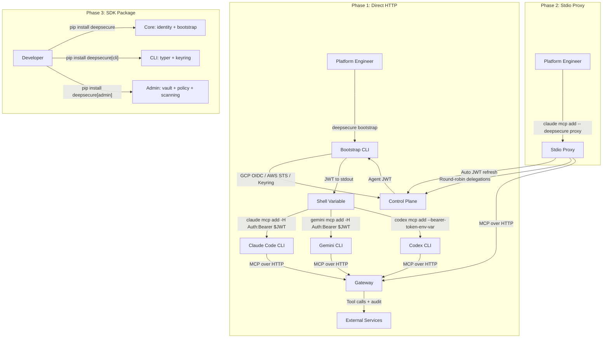

# Spec: P5.4 — SDK + Integration Guides

> **Status:** Draft — awaiting review
> **Author:** Agent
> **Created:** June 8, 2026
> **Priority:** P5.4 — SDK + Integration Guides
> **Roadmap Phase:** Phase 3: Q3–Q4 2026 — Platform Expansion
> **Priority Master:** [`docs/PRIORITY_MASTER.md`](../PRIORITY_MASTER.md)
> **Product Roadmap:** [`plans/PRODUCT_ROADMAP.md`](../../plans/PRODUCT_ROADMAP.md) *(file not yet created — phase mapping derived from PRIORITY_MASTER)*
> **Plan Source:** [`plans/p5.4_sdk_spec_80daa9bd.plan.md`](../../.cursor/plans/p5.4_sdk_spec_80daa9bd.plan.md)
> **Design Doc:** [`docs/design/p5.4-sdk-integration-guides.md`](../design/p5.4-sdk-integration-guides.md)

---

## Priority & Roadmap Mapping

### Priority Master Mapping ([`docs/PRIORITY_MASTER.md`](../PRIORITY_MASTER.md))

This spec covers **P5.4 SDK + Integration Guides** — the items that make DeepSecure accessible to customers deploying their own agents.

| Priority Group | Coverage | Items in This Spec |
|---------------|----------|--------------------|
| **P5.4 SDK + Integration Guides** | ⚠️ Partial (Tier 1 + Tier 2) | `deepsecure bootstrap` CLI, Gemini CLI guide, Claude Code CLI guide, Codex CLI guide, SDK package split, stdio proxy |
| **P5.4 remaining** | ❌ Deferred | LangChain guide, CrewAI guide, Terraform module, UI Deploy Instructions tab, reference container |
| **P7 Claude Code Integration** | ⚠️ Absorbed (Phase 2) | Stdio proxy and plugin packaging from P7 are now Phase 2 of this spec; P7 as separate priority is collapsed |
| **P5.5 Agent Security Architecture** | ❌ Not in scope | Production hardening after P5.4 |
| **P6 Vendor Platform** | ❌ Not in scope | Multi-tenant org model |

### Product Roadmap Mapping

| Roadmap Phase | Coverage | What This Spec Delivers |
|--------------|----------|------------------------|
| **Phase 1–2** | ✅ Complete (shipped) | N/A |
| **Phase 3: Q3–Q4 2026** | ⚠️ Partial | Bootstrap CLI, integration guides for 3 CLI tools, stdio proxy, SDK package split |
| **Phase 4+** | ❌ Not in scope | Vendor platform, AWS, enterprise governance |

### Persona Capability Unlocked by This Spec

| Persona | Capability Unlocked | User Stories |
|---------|---------------------|--------------|
| **Platform Engineer** | Can deploy any agent runtime (Gemini CLI, Claude Code, Codex) connected to DeepSecure using copy-paste commands; bootstrap handles identity without custom scripts | [§1 Platform Engineer](#user-stories--platform-engineer) |
| **IT Admin** | Agents deployed by platform engineers appear in fleet dashboard with proper identity; delegations work across all runtimes | [§1 IT Admin](#user-stories--it-admin) |
| **Engineer / Developer** | Lightweight `pip install deepsecure` for programmatic access; clear separation between SDK core and admin tooling | [§1 Engineer / Developer](#user-stories--engineer--developer) |

*Security Team is not directly affected by this spec — no new security boundaries or audit changes.*

### What This Spec Unblocks

| Blocked Item | Needs | Covered By |
|--------------|-------|-----------|
| P6 Vendor Platform — vendor agent integration | Documented bootstrap + SDK for vendors to embed | Phase 1 (bootstrap) + Phase 3 (SDK) |
| P5.5 SDK-embedded delegation propagation | SDK `Client.bootstrap()` API | Phase 3 |
| Customer adoption | Integration guides for top 3 CLI runtimes | Phase 1 |
| Open-source SDK | Lightweight core package without admin bloat | Phase 3 |

---

## Table of Contents

1. [Objective](#1-objective)
2. [Goals & Non-Goals](#2-goals--non-goals)
3. [Background](#3-background)
4. [UI Wireframes (Delta)](#4-ui-wireframes-delta)
5. [Technical Design](#5-technical-design)
6. [Data Models](#6-data-models)
7. [API Contracts](#7-api-contracts)
8. [Security Considerations](#8-security-considerations)
9. [Project Structure](#9-project-structure)
10. [Testing Strategy](#10-testing-strategy)
11. [Demo Scenarios / User Journeys](#11-demo-scenarios--user-journeys)
12. [Rollout Plan](#12-rollout-plan)
13. [Boundaries](#13-boundaries)
14. [Dependencies & Risks](#14-dependencies--risks)
15. [Open Questions](#15-open-questions)
16. [References](#16-references)

---

## 1. Objective

Provide platform engineers with everything they need to connect any AI agent runtime to DeepSecure — from a single `deepsecure bootstrap` command that converts platform identity (GCP OIDC, AWS STS) into an Agent JWT, to copy-paste integration guides for the three major CLI tools, to a lightweight open-source-ready SDK package.

### User Stories / Acceptance Criteria

#### User Stories — Platform Engineer

- As a **Platform Engineer**, I run `deepsecure bootstrap --agent-id my-agent` and get a valid Agent JWT on stdout so that I can pass it to any MCP-capable CLI tool without writing custom auth scripts
- As a **Platform Engineer**, I follow a 5-step integration guide to connect Claude Code CLI to DeepSecure's MCP gateway so that my developers can use Claude Code with company-approved tool permissions
- As a **Platform Engineer**, I follow a 5-step integration guide to connect Gemini CLI to DeepSecure so that my production agents run with proper identity and delegation
- As a **Platform Engineer**, I run `deepsecure proxy --agent-id my-agent` as a stdio MCP server so that long-running Claude Code sessions automatically refresh expired JWTs without manual re-bootstrap
- As a **Platform Engineer**, I deploy a Cloud Run Job with `pip install deepsecure` and 10 lines of Python to bootstrap an agent identity from GCP Workload Identity so that I don't need shell scripts for production deployments

#### User Stories — IT Admin

- As an **IT Admin**, I see agents deployed via Claude Code and Codex in the same fleet dashboard as Gemini agents so that I have unified visibility regardless of runtime
- As an **IT Admin**, I create delegation templates that work identically across all agent runtimes so that permission management is runtime-agnostic

#### User Stories — Engineer / Developer

- As an **Engineer**, I run `pip install deepsecure` and get a lightweight package (~3,300 lines, 3 dependencies) so that I can embed bootstrap in my agent without pulling admin tooling, scanning modules, or framework-specific integrations
- As an **Engineer**, I run `pip install deepsecure[admin]` when I need vault management, policy CRUD, and security scanning so that the admin tooling is available but opt-in
- As an **Engineer**, I use `deepsecure.Client().bootstrap()` in Python to get an Agent JWT programmatically so that I can build custom agent runtimes beyond the supported CLI tools

### Bootstrap Semantics

> **What "bootstrap" means in this spec**

1. The `deepsecure bootstrap` command detects the platform (GCP metadata server, AWS IMDS, or local keyring) and exchanges platform-native identity for a DeepSecure Agent JWT
2. The platform engineer does **not** need to manage Ed25519 keys, challenge-response flows, or OIDC token acquisition manually — bootstrap handles all of this
3. Bootstrap supports three modes: `--platform gcp` (default on Cloud Run), `--platform aws` (on ECS/Lambda), and `--platform local` (uses keyring for local dev)
4. The output is a JWT string on stdout — suitable for shell variable capture (`export JWT=$(deepsecure bootstrap ...)`) or piping to other commands
5. Bootstrap does **not** list delegations or select a specific delegation — that is the caller's responsibility (or the proxy's in Phase 2)

| Mode | Identity Source | API Endpoint | When Used |
|------|----------------|--------------|-----------|
| `gcp` | GCP metadata server → OIDC token | `POST /api/v1/auth/bootstrap/gcp` | Cloud Run, GKE, Compute Engine |
| `aws` | AWS IMDS → STS token | `POST /api/v1/auth/bootstrap/aws` | ECS, Lambda, EC2 (tested in Phase 1) |
| `local` | OS keyring → Ed25519 private key | `POST /api/v1/auth/agent/challenge` + `verify` | Developer laptops, CI/CD |

### Success Criteria

**Platform Engineer**

- [ ] `deepsecure bootstrap --agent-id X` outputs a valid JWT to stdout (exit 0) on GCP Cloud Run
- [ ] `deepsecure bootstrap --agent-id X --platform local` works with keyring-stored keys
- [ ] Claude Code integration guide: 5 commands from zero to working MCP connection
- [ ] Gemini CLI integration guide: documents existing `entrypoint.sh` pattern as official guide
- [ ] Codex CLI integration guide: 5 commands from zero to working MCP connection
- [ ] `deepsecure proxy` stdio server refreshes JWT transparently (no client-side token management)
- [ ] All three CLI tools can call MCP tools through the gateway and see results in audit trail

**IT Admin**

- [ ] Agents bootstrapped via any runtime appear in fleet dashboard with correct identity
- [ ] Delegation templates apply identically across Gemini, Claude Code, and Codex agents

**Engineer / Developer**

- [ ] `pip install deepsecure` installs core package with ≤5 dependencies (httpx, pyjwt[crypto], pydantic)
- [ ] `pip install deepsecure[cli]` adds typer, rich, keyring, toml for CLI commands
- [ ] `pip install deepsecure[admin]` adds vault, policy, scanning, hardening modules
- [ ] `deepsecure.Client().bootstrap()` returns Agent JWT from Python

**All personas**

- [ ] Full test suite passes (`make check-all`)
- [ ] Integration tests cover bootstrap on GCP and local platforms
- [ ] No regressions to existing Gemini agent flow

---

## 2. Goals & Non-Goals

### Goals

- [ ] G1: Ship a `deepsecure bootstrap` CLI command that converts platform identity → Agent JWT in one command
- [ ] G2: Publish integration guides for Gemini CLI, Claude Code CLI, and Codex CLI
- [ ] G3: Build a stdio MCP proxy that handles JWT refresh and multi-user round-robin for production sessions
- [ ] G4: Split the SDK package into lightweight core (`deepsecure`) vs admin extras (`deepsecure[admin]`)
- [ ] G5: Migrate HTTP client from `requests` to `httpx` for async support
- [ ] G6: Make `keyring` an optional dependency (`deepsecure[cli]`)

### Non-Goals

- **LangChain / CrewAI integration guides** — Deferred. These are framework-specific SDK wrappers that depend on G4 (SDK split). Pick up after Phase 3.
- **Terraform module for GCP agent provisioning** — Deferred to P6 (vendor platform). Platform engineers use `gcloud` directly for now.
- **UI Deploy Instructions tab** — Deferred. Requires frontend changes; will be P5.4+ or P6.
- **Reference container (public)** — Deferred until after SDK is stable for open-source.
- **MCP Auth Phase 4 (DCR, pre-registration)** — Separate workstream. This spec uses the current proprietary bootstrap, not standard OAuth.
- **AWS bootstrap production deployment** — Endpoint exists and will be tested in Phase 1, but deploying a production AWS agent (ECS/Lambda) is out of scope for this spec. That is a P10/P11 deliverable.
- **Security Team persona** — No new audit fields, security boundaries, or compliance features in this spec.

---

## 3. Background

### Current State

| Capability | Status | Notes |
|------------|--------|-------|
| GCP OIDC bootstrap | ✅ Implemented | `POST /api/v1/auth/bootstrap/gcp` — used by Gemini agent |
| AWS STS bootstrap | ⚠️ Partial | `POST /api/v1/auth/bootstrap/aws` endpoint exists; included in Phase 1 testing |
| Ed25519 challenge-response | ✅ Implemented | `POST /api/v1/auth/agent/challenge` + `verify` — SDK + CLI |
| Delegation listing | ✅ Implemented | `GET /api/v1/auth/agent/delegations` — used by Gemini agent |
| Per-delegation JWT | ✅ Implemented | `POST /api/v1/auth/agent/delegation-token` — used by Gemini agent |
| Gateway stateless MCP | ✅ Implemented | Streamable HTTP, MCP Auth Phase 0.5 |
| Gemini CLI integration | ✅ Working | `agents/gemini/entrypoint.sh` — full round-robin, 265 lines bash |
| Claude Code CLI integration | 🔲 Missing | No guide, no config, not tested |
| Codex CLI integration | 🔲 Missing | No guide, no config, not tested |
| `deepsecure bootstrap` CLI command | 🔲 Missing | Bootstrap logic exists in `entrypoint.sh` (bash) and `_core/agent_client.py` (Python) but no unified CLI command |
| Stdio MCP proxy | 🔲 Missing | `mcp-bridge.mjs` exists but is unused; no Python proxy |
| SDK package split | 🔲 Missing | All 59 files ship as one package (10,753 lines) |
| `httpx` as declared dependency | ❌ Bug | Used throughout `base_client.py`, `agent_client.py` but not in `pyproject.toml` core deps |
| `keyring` as optional | 🔲 Missing | Currently required in core deps; cloud agents don't use it |

### SDK Package Audit (Current)

| Category | Files | Lines | Ships In Core | Should Be |
|----------|-------|-------|---------------|-----------|
| Core Identity + Auth | 8 | ~2,151 | ✅ | ✅ Core |
| Public Client API | 9 | ~1,245 | ✅ | ✅ Core (slimmed) |
| CLI (Typer) | 12 | ~2,245 | ✅ | `[cli]` extra |
| Admin/Enterprise | 12 | ~2,779 | ✅ | `[admin]` extra |
| Integrations | 8 | ~742 | ✅ | `[integrations]` extra |
| Broken/Legacy | 3+ | ~500+ | ✅ | Remove |
| **Total** | **59** | **~10,753** | | **~3,300 core** |

**Known issues in current SDK:**
- `httpx` used but undeclared in core dependencies
- `deepsecure.core` imports in `resources/agents.py` and unregistered CLI commands (should be `_core`)
- Two duplicate `VaultClient` implementations (`_core/vault_client.py` + `_core/client.py`)
- `_core/client.py` contains a legacy test harness (`if __name__`)
- 8 CLI commands exist as files but are not registered in `main.py` (broken imports)

### Motivation

1. **Customer adoption requires documentation.** The Gemini agent works end-to-end, but the bootstrap flow is a 265-line bash script. Platform engineers need a one-command bootstrap and a 5-step guide per runtime.
2. **Claude Code is the largest developer audience.** Claude Code supports native HTTP MCP transport (`claude mcp add --transport http`). Without a guide, platform engineers can't connect it to DeepSecure.
3. **The SDK is too heavy for embedding.** At 10,753 lines with admin tooling, security scanning, and framework stubs, `pip install deepsecure` pulls in far more than what an agent needs. For open-source viability, the core must be lightweight.
4. **JWT lifecycle is unmanaged.** Agent JWTs expire (default 1h). The Gemini entrypoint handles refresh manually in bash. A stdio proxy that transparently refreshes JWTs and rotates delegations eliminates this operational burden for all runtimes.

---

## 4. UI Wireframes (Delta)

No frontend changes in this spec. §4 UI Wireframes not applicable.

All deliverables are CLI commands, a stdio proxy server, SDK package restructuring, and markdown integration guides.

---

## 5. Technical Design

### Services Affected

| Service | Impact | Changes |
|---------|--------|---------|
| deeptrail-control | None | No changes — all bootstrap endpoints already exist |
| deeptrail-gateway | None | No changes — stateless MCP already works |
| deepsecure (SDK) | High | New `bootstrap` command, new `proxy` server, package restructuring |
| frontend | None | No changes |

### Architecture Overview



### Key Components

**1. Bootstrap CLI Command** (`deepsecure/commands/bootstrap.py`)

```python
import typer
from deepsecure._core.identity_provider import GcpIdentityProvider
from deepsecure._core.base_client import BaseClient

app = typer.Typer()

@app.command()
def bootstrap(
    agent_id: str = typer.Option(..., help="Agent ID to bootstrap"),
    platform: str = typer.Option("auto", help="Platform: auto|gcp|aws|local"),
    control_url: str = typer.Option(None, help="Control plane URL"),
    gateway_url: str = typer.Option(None, help="Gateway URL (for --output mcp-json)"),
    output: str = typer.Option("jwt", help="Output format: jwt|mcp-json|env"),
    delegation_id: str = typer.Option(None, help="Specific delegation ID"),
) -> None:
    """Exchange platform identity for a DeepSecure Agent JWT."""
    ...
```

Output formats:
- `jwt` (default): Raw JWT string on stdout — `export JWT=$(deepsecure bootstrap ...)`
- `mcp-json`: JSON MCP server config block for embedding in `settings.json` or `.claude.json`
- `env`: `export DEEPSECURE_JWT=xxx` shell statement

**2. Stdio MCP Proxy** (`deepsecure/proxy/server.py`)

```python
class DeepSecureProxy:
    """Stdio MCP proxy that sits between a CLI tool and the DeepSecure gateway.

    Handles:
    - JWT lifecycle (bootstrap + refresh at 80% TTL)
    - Delegation round-robin (cycles through active delegations)
    - MCP protocol translation (stdio JSON-RPC ↔ HTTP JSON-RPC)
    """

    def __init__(
        self,
        agent_id: str,
        control_url: str,
        gateway_url: str,
        platform: str = "auto",
    ) -> None: ...

    async def handle_stdin(self) -> None:
        """Read JSON-RPC messages from stdin, forward to gateway, write responses to stdout."""
        ...

    async def _ensure_jwt(self) -> str:
        """Refresh JWT if within 20% of expiry."""
        ...

    async def _rotate_delegation(self) -> None:
        """Switch to next delegation in round-robin order."""
        ...
```

**3. SDK Package Core** (`deepsecure/bootstrap.py` — public API)

```python
from deepsecure._core.base_client import BaseClient
from deepsecure._core.identity_provider import (
    GcpIdentityProvider,
    AwsIdentityProvider,
    KeyringIdentityProvider,
)

class BootstrapResult:
    """Result of a bootstrap operation."""
    jwt: str
    agent_id: str
    expires_in: int
    delegations: list[dict] | None

def bootstrap(
    agent_id: str,
    control_url: str | None = None,
    platform: str = "auto",
) -> BootstrapResult:
    """Bootstrap an agent identity and return a JWT.

    Auto-detects platform (GCP, AWS, local) unless explicitly specified.
    """
    ...
```

### Architecture Decisions

| Decision | Options Considered | Chosen | Rationale |
|----------|--------------------|--------|-----------|
| Phase 1 transport | A) Direct HTTP, B) Stdio proxy, C) Both | A) Direct HTTP | Simplest path; all 3 CLIs support native HTTP MCP. Proxy is Phase 2. |
| JWT TTL for interactive | A) 15min (current), B) 1h, C) 4-8h | C) 4-8h with server config | Long sessions need longer TTL. Backend already supports configurable TTL via `ACCESS_TOKEN_EXPIRE_MINUTES`. |
| HTTP client library | A) requests (current), B) httpx | B) httpx (Phase 3) | Async support needed for proxy; httpx already used throughout but undeclared. Phase 1 keeps requests for compatibility. |
| Keyring dependency | A) Core dep, B) Optional | B) Optional (`[cli]`) | Cloud agents (GCP, AWS) use metadata servers, not keyring. Keyring is only for local dev. |
| Package split strategy | A) Separate packages, B) Extras in same package | B) Extras (`[cli]`, `[admin]`, `[integrations]`) | Single `pip install deepsecure` with opt-in extras is simpler than managing 4 PyPI packages. |
| Proxy protocol | A) Stdio (stdin/stdout), B) Local HTTP server | A) Stdio | All 3 CLI tools support stdio MCP natively. Stdio avoids port conflicts and firewall issues. |

---

## 6. Data Models

No database schema changes. All bootstrap endpoints already exist in the control plane.

### Configuration Models

**Bootstrap CLI config** (stored in `~/.deepsecure/config.toml`):

```toml
[default]
control_url = "https://app.deepsecure.one"
gateway_url = "https://app.deepsecure.one/mcp"

[agents.my-agent]
platform = "gcp"
agent_id = "my-agent"
```

**Claude Code MCP config** (in project `.claude.json` or `~/.claude.json`):

```json
{
  "mcpServers": {
    "deepsecure": {
      "type": "http",
      "url": "https://app.deepsecure.one/mcp",
      "headers": {
        "Authorization": "Bearer ${DEEPSECURE_JWT}"
      }
    }
  }
}
```

**Gemini CLI MCP config** (managed by `gemini mcp add`):

```json
{
  "mcpServers": {
    "deepsecure": {
      "httpUrl": "https://app.deepsecure.one/mcp",
      "httpHeaders": {
        "Authorization": "Bearer ${DEEPSECURE_JWT}"
      }
    }
  }
}
```

**Codex CLI MCP config** (in `~/.codex/config.toml`):

```toml
[mcp_servers.deepsecure]
type = "http"
url = "https://app.deepsecure.one/mcp"

[mcp_servers.deepsecure.headers]
Authorization = "Bearer ${DEEPSECURE_JWT}"
```

---

## 7. API Contracts

> **Note:** This spec introduces **no new backend endpoints**. All bootstrap, delegation, and MCP endpoints already exist and are production-tested. This section documents the existing contracts that the bootstrap CLI and proxy consume.

### Endpoint Summary (Existing — Consumed by Bootstrap)

| Method | Endpoint | Purpose | Auth |
|--------|----------|---------|------|
| `POST` | `/api/v1/auth/bootstrap/gcp` | Exchange GCP OIDC token for Agent JWT | None (OIDC token in body) |
| `POST` | `/api/v1/auth/bootstrap/aws` | Exchange AWS STS token for Agent JWT | None (STS token in body) |
| `POST` | `/api/v1/auth/agent/challenge` | Request Ed25519 challenge nonce | None |
| `POST` | `/api/v1/auth/agent/verify` | Submit signed challenge for Agent JWT | None |
| `GET` | `/api/v1/auth/agent/delegations` | List active delegations for agent | Agent JWT |
| `POST` | `/api/v1/auth/agent/delegation-token` | Exchange delegation ID for scoped JWT | Agent JWT |

### Bootstrap CLI Interface (New)

```
deepsecure bootstrap [OPTIONS]

Options:
  --agent-id TEXT       Agent ID to bootstrap [required]
  --platform TEXT       Platform: auto|gcp|aws|local [default: auto]
  --control-url TEXT    Control plane URL [default: from config]
  --gateway-url TEXT    Gateway URL [default: from config]
  --output TEXT         Output: jwt|mcp-json|env [default: jwt]
  --delegation-id TEXT  Specific delegation ID [optional]
  --quiet               Suppress stderr logging [default: false]
```

**Output — `jwt` format (default):**
```
eyJhbGciOiJIUzI1NiIsInR5cCI6IkpXVCJ9...
```

**Output — `mcp-json` format:**
```json
{
  "deepsecure": {
    "type": "http",
    "url": "https://app.deepsecure.one/mcp",
    "headers": {
      "Authorization": "Bearer eyJhbG..."
    }
  }
}
```

**Output — `env` format:**
```bash
export DEEPSECURE_JWT="eyJhbG..."
export DEEPSECURE_AGENT_ID="my-agent"
export DEEPSECURE_GATEWAY_URL="https://app.deepsecure.one/mcp"
```

**Exit codes:**

| Code | Meaning |
|------|---------|
| 0 | Success — JWT printed to stdout |
| 1 | Bootstrap failed — platform identity not available |
| 2 | Agent not registered — no matching agent in control plane |
| 3 | No delegations — agent has no active delegations |

### Proxy CLI Interface (New — Phase 2)

```
deepsecure proxy [OPTIONS]

Options:
  --agent-id TEXT       Agent ID [required]
  --control-url TEXT    Control plane URL [default: from config]
  --gateway-url TEXT    Gateway URL [default: from config]
  --platform TEXT       Platform: auto|gcp|aws|local [default: auto]
  --round-robin         Cycle through delegations [default: false]
  --delegation-id TEXT  Pin to specific delegation [optional]
  --refresh-margin INT  Seconds before expiry to refresh [default: 300]
```

**Protocol:** JSON-RPC over stdio (stdin/stdout). The proxy reads MCP requests from stdin, adds the current Bearer token, forwards to the gateway via HTTP, and writes responses to stdout. JWT refresh is transparent to the client.

### SDK Public API (New — Phase 3)

```python
from deepsecure import bootstrap, Client

# Functional API
result = bootstrap(agent_id="my-agent")
# result.jwt, result.agent_id, result.expires_in

# Object API
client = Client(control_url="https://app.deepsecure.one")
result = client.bootstrap(agent_id="my-agent", platform="gcp")
```

---

## 8. Security Considerations

### JWT Lifecycle and TTL

- **Current TTL:** 1 hour (`ACCESS_TOKEN_EXPIRE_MINUTES=60` in production). No changes needed.
- **Phase 1 (direct HTTP):** 1h TTL is sufficient — production agents re-bootstrap in their loop (see `entrypoint.sh`), and dev testing sessions fit within 1h. If a session exceeds 1h, re-run `deepsecure bootstrap`.
- **Phase 2 (proxy):** Refreshes JWT at 80% of TTL (e.g., at 48 min for a 60 min JWT). Refresh is a full re-bootstrap (GCP OIDC → bootstrap endpoint), not a token refresh endpoint. This is the proper solution for long-running sessions — no need for a separate "interactive TTL" config.
- **Revocation:** JWTs are stateless. Revocation is handled by revoking the delegation (which makes the delegation-token exchange fail on next attempt). The proxy detects 401/403 and stops.

### Key Storage

| Platform | Key Storage | Risk |
|----------|------------|------|
| GCP Cloud Run | No persistent keys — OIDC from metadata server | Low — ephemeral, auto-rotated by GCP |
| AWS ECS/Lambda | No persistent keys — STS from IMDS | Low — ephemeral, auto-rotated by AWS |
| Local dev | OS keyring (macOS Keychain, Linux Secret Service) | Medium — requires `[cli]` extra; keys persist until cleanup |
| CI/CD | Environment variable (`DEEPSECURE_JWT`) or GCP SA key | Medium — JWT should have short TTL in CI |

### Credential Exposure

- Bootstrap outputs JWT to stdout. The platform engineer is responsible for not logging stdout in CI/CD.
- The `--quiet` flag suppresses all stderr logging to prevent accidental token leaks in verbose mode.
- The proxy never writes JWTs to stdout — only MCP protocol messages.
- Integration guides include a warning about not committing JWTs to source control.

### Stdio Proxy Security

- The proxy runs as a local process owned by the same user as the CLI tool — no network exposure.
- The proxy authenticates to the gateway using the same JWT mechanism as direct HTTP — no privilege escalation.
- The proxy does not cache or persist JWTs to disk — they are held in memory only.

---

## 9. Project Structure

### Workstream A: Bootstrap CLI Command (Phase 1)

| File | Action | Purpose |
|------|--------|---------|
| `deepsecure/commands/bootstrap.py` | Create | Bootstrap CLI command with platform auto-detection |
| `deepsecure/_core/bootstrap.py` | Create | Platform-agnostic bootstrap logic (extract from `identity_provider.py` + `base_client.py`) |
| `deepsecure/main.py` | Modify | Register bootstrap command |
| `deepsecure/__init__.py` | Modify | Export `bootstrap` function |
| `tests/commands/test_bootstrap.py` | Create | Unit tests for bootstrap CLI |
| `tests/_core/test_bootstrap.py` | Create | Unit tests for bootstrap logic |

### Workstream B: Integration Guides (Phase 1)

| File | Action | Purpose |
|------|--------|---------|
| `docs/guides/quickstart.md` | Create | Common prerequisites (install, configure, register agent) |
| `docs/guides/gemini-cli.md` | Create | Gemini CLI integration guide (document existing pattern) |
| `docs/guides/claude-code-cli.md` | Create | Claude Code CLI integration guide |
| `docs/guides/codex-cli.md` | Create | Codex CLI integration guide |

### Workstream C: Stdio MCP Proxy (Phase 2)

| File | Action | Purpose |
|------|--------|---------|
| `deepsecure/proxy/__init__.py` | Create | Proxy package |
| `deepsecure/proxy/server.py` | Create | Stdio MCP proxy server |
| `deepsecure/proxy/jwt_manager.py` | Create | JWT lifecycle management (refresh, rotation) |
| `deepsecure/proxy/delegation_rotator.py` | Create | Round-robin delegation cycling |
| `deepsecure/commands/proxy.py` | Create | Proxy CLI command |
| `deepsecure/main.py` | Modify | Register proxy command |
| `tests/proxy/test_server.py` | Create | Proxy unit tests |
| `tests/proxy/test_jwt_manager.py` | Create | JWT refresh tests |

### Workstream D: SDK Package Split (Phase 3)

| File | Action | Purpose |
|------|--------|---------|
| `pyproject.toml` | Modify | Restructure dependencies into core / `[cli]` / `[admin]` / `[integrations]` extras |
| `deepsecure/__init__.py` | Modify | Conditional imports for optional modules |
| `deepsecure/client.py` | Modify | Slim down — move vault/policy/audit to lazy imports |
| `deepsecure/_core/client.py` | Delete | Remove legacy duplicate vault client |
| `deepsecure/resources/agents.py` | Delete | Remove broken `deepsecure.core` import module |
| `deepsecure/commands/scan.py` | Modify | Move to `[admin]` extra with conditional import |
| `deepsecure/commands/harden.py` | Modify | Move to `[admin]` extra |
| `deepsecure/commands/deploy.py` | Modify | Move to `[admin]` extra |
| `deepsecure/commands/risk.py` | Modify | Move to `[admin]` extra |
| `deepsecure/commands/scorecard.py` | Modify | Move to `[admin]` extra |
| `deepsecure/commands/sandbox.py` | Modify | Move to `[admin]` extra |
| `deepsecure/commands/ide.py` | Modify | Move to `[admin]` extra |
| `deepsecure/commands/inventory.py` | Modify | Move to `[admin]` extra |
| `tests/test_package_split.py` | Create | Verify core installs without extras, extras add modules |

### Workstream E: httpx Migration (Phase 3)

| File | Action | Purpose |
|------|--------|---------|
| `pyproject.toml` | Modify | Replace `requests` with `httpx` in core deps |
| `deepsecure/_core/base_client.py` | Modify | Standardize on httpx (already mostly uses httpx) |
| `deepsecure/_core/vault_client.py` | Modify | Replace remaining `requests` calls with httpx |
| `deepsecure/_core/client.py` | Delete | Already scheduled for removal in WS-D |
| `deepsecure/integrations/gateway.py` | Modify | Already uses httpx — verify consistency |

### Complexity Estimates

| Workstream | Complexity | Rationale |
|------------|------------|-----------|
| WS-A: Bootstrap CLI | M (3-4 tasks) | Core logic exists in `entrypoint.sh` and `identity_provider.py`; needs CLI wrapping + output formats |
| WS-B: Integration Guides | S (3-4 tasks) | Documentation only; Gemini guide is mostly documenting what exists |
| WS-C: Stdio Proxy | L (5-6 tasks) | New component; JSON-RPC parsing, async JWT refresh, delegation rotation |
| WS-D: Package Split | M (4-5 tasks) | Restructuring existing code; conditional imports; no new logic |
| WS-E: httpx Migration | S (2-3 tasks) | Most code already uses httpx; just cleanup and declare dependency |

---

## 10. Testing Strategy

### Test Matrix

| Level | What | Location | Framework |
|-------|------|----------|-----------|
| Unit | Bootstrap CLI (mock platform identity) | `tests/commands/test_bootstrap.py` | pytest + responses/respx |
| Unit | Bootstrap core logic | `tests/_core/test_bootstrap.py` | pytest |
| Unit | Proxy JSON-RPC handling | `tests/proxy/test_server.py` | pytest-asyncio |
| Unit | JWT refresh logic | `tests/proxy/test_jwt_manager.py` | pytest |
| Unit | Package split verification | `tests/test_package_split.py` | pytest |
| Integration | Bootstrap (GCP) → control plane → JWT | `tests/e2e/test_bootstrap_e2e.py` | pytest + live backend |
| Integration | Bootstrap (AWS) → control plane → JWT | `tests/e2e/test_bootstrap_aws_e2e.py` | pytest + live backend |
| E2E | Gemini CLI → gateway → tool call | `tests/e2e/test_gemini_e2e.py` | pytest + docker |
| E2E | Claude Code → gateway → tool call | `tests/e2e/test_claude_code_e2e.py` | pytest + docker |
| Manual | Follow each integration guide from scratch | — | Manual walkthrough |

### Key Test Scenarios

- [ ] Bootstrap with GCP OIDC mock returns valid JWT (unit)
- [ ] Bootstrap with AWS STS mock returns valid JWT (unit)
- [ ] Bootstrap with keyring-stored key returns valid JWT (unit)
- [ ] Bootstrap with expired OIDC token returns exit code 1 (unit)
- [ ] Bootstrap with unregistered agent returns exit code 2 (unit)
- [ ] Bootstrap `--output mcp-json` produces valid MCP config JSON (unit)
- [ ] Proxy refreshes JWT 5 minutes before expiry (unit, mock clock)
- [ ] Proxy rotates to next delegation after completing prompts (unit)
- [ ] Proxy handles gateway 401 by re-bootstrapping (unit)
- [ ] `pip install deepsecure` succeeds without keyring/typer (integration)
- [ ] `pip install deepsecure[cli]` adds bootstrap command (integration)
- [ ] Gemini agent bootstrap → delegation → tool call → audit trail (E2E)

### Technical Requirements

| Requirement | Correct Pattern | Common Mistake |
|-------------|-----------------|----------------|
| Async fixtures | `@pytest_asyncio.fixture` | `@pytest.fixture` (breaks async) |
| HTTP mocking (sync) | `responses` library | Calling live APIs in unit tests |
| HTTP mocking (async) | `respx` library | Using `responses` with httpx |
| Platform detection mock | Patch `GcpIdentityProvider._get_oidc_token` | Actually calling metadata server |
| Stdio testing | `asyncio.subprocess` + pipe | Manual stdin/stdout manipulation |

### Coverage Requirements

- New code: >80% coverage
- Bootstrap logic: 100% coverage (critical auth path)
- Proxy JWT refresh: 100% coverage (security-sensitive)

---

## 11. Demo Scenarios / User Journeys

### Scenario 1: Platform Engineer — Connect Claude Code to DeepSecure (Phase 1)

**Persona:** Alex, Platform Engineer at Acme Corp, deploying Claude Code for the engineering team
**Pre-conditions:** DeepSecure SaaS account exists; agent `coding-agent` registered with GCP Workload Identity; delegation from IT Admin with GitHub + Notion permissions

| Step | Action | Expected Result | Validates |
|------|--------|-----------------|-----------|
| 1 | `pip install deepsecure` | Package installs with core deps only | G6 (lightweight) |
| 2 | `deepsecure configure set-url https://app.deepsecure.one` | Config saved to `~/.deepsecure/config.toml` | Existing CLI |
| 3 | `export DEEPSECURE_JWT=$(deepsecure bootstrap --agent-id coding-agent --platform gcp)` | JWT printed to stdout, captured in env var | G1 (bootstrap) |
| 4 | `claude mcp add --transport http deepsecure https://app.deepsecure.one/mcp --header "Authorization:Bearer $DEEPSECURE_JWT"` | MCP server registered in Claude Code | G2 (guide) |
| 5 | In Claude Code: "Search Notion for Q3 planning docs" | Claude calls `notion.search_pages` via MCP gateway; results returned | E2E |
| 6 | Check DeepSecure dashboard → Audit Trail | Tool call appears with agent ID, delegation, user attribution | IT Admin visibility |

**Success criteria:** 6 commands from zero to working MCP connection.

### Scenario 2: Platform Engineer — Production Gemini Agent on Cloud Run (Phase 1)

**Persona:** Alex, deploying the company's Gemini debugging agent
**Pre-conditions:** Agent registered with GCP Workload Identity; 3 delegations from different users

| Step | Action | Expected Result | Validates |
|------|--------|-----------------|-----------|
| 1 | Build container with `pip install deepsecure` in Dockerfile | Lightweight image (no admin deps) | G4 (split) |
| 2 | In `entrypoint.sh`: `DISCOVERY_JWT=$(deepsecure bootstrap --agent-id debugging-agent --platform gcp --quiet)` | JWT acquired from GCP metadata server | G1 (bootstrap) |
| 3 | Agent lists delegations, cycles through each with `deepsecure bootstrap --delegation-id $DID` | Per-delegation JWTs for round-robin | Existing flow |
| 4 | Agent configures `gemini mcp add` per delegation, runs prompts | Tools invoked per-user delegation scope | G2 (guide) |
| 5 | Cloud Scheduler triggers every 1h | Agent runs, heartbeats, appears Active in fleet | IT Admin |

**Success criteria:** The existing Gemini agent flow works with `deepsecure bootstrap` replacing the bash bootstrap function.

### Scenario 3: Platform Engineer — Long-Running Claude Code Session with Proxy (Phase 2)

**Persona:** Alex, enabling developers to use Claude Code in 8-hour work sessions
**Pre-conditions:** Same as Scenario 1

| Step | Action | Expected Result | Validates |
|------|--------|-----------------|-----------|
| 1 | `claude mcp add deepsecure -- deepsecure proxy --agent-id coding-agent --gateway-url https://app.deepsecure.one/mcp` | Stdio proxy registered as MCP server | G3 (proxy) |
| 2 | Developer uses Claude Code for 4 hours | Proxy transparently refreshes JWT twice (at ~48 min each) | JWT refresh |
| 3 | Admin revokes delegation mid-session | Proxy receives 403, logs error, stops serving tools | Revocation |
| 4 | Admin adds new delegation | On next refresh, proxy picks up new delegation | Delegation rotation |

**Success criteria:** 8-hour Claude Code session with zero manual JWT management.

### Scenario 4: Engineer — Embed Bootstrap in Custom Agent (Phase 3)

**Persona:** Jordan, developer building a custom Python agent
**Pre-conditions:** Agent registered; delegation active

| Step | Action | Expected Result | Validates |
|------|--------|-----------------|-----------|
| 1 | `pip install deepsecure` | Core package only (httpx, pyjwt, pydantic) — no typer, keyring | G4, G5, G6 |
| 2 | `from deepsecure import bootstrap` | Import succeeds | SDK API |
| 3 | `result = bootstrap(agent_id="my-agent")` | `result.jwt` contains valid Agent JWT | G1 (programmatic) |
| 4 | Use `result.jwt` with any HTTP client to call gateway | MCP tools accessible | E2E |

**Success criteria:** 10 lines of Python from platform identity to Agent JWT.

### Scenario 5: Error Path — Bootstrap Without Registration

**Persona:** Alex, attempting bootstrap for an unregistered agent

| Step | Action | Expected Result | Validates |
|------|--------|-----------------|-----------|
| 1 | `deepsecure bootstrap --agent-id unknown-agent --platform gcp` | Exit code 2, stderr: "Agent 'unknown-agent' not registered. Register via dashboard or CLI." | Error handling |
| 2 | `deepsecure bootstrap --agent-id my-agent --platform local` (no keyring) | Exit code 1, stderr: "No identity found. Install `deepsecure[cli]` for keyring support or set --platform gcp/aws." | Graceful degradation |

---

## 12. Rollout Plan

### Phase 1: Bootstrap CLI + Integration Guides (Workstreams A + B)

**Tasks:** WS-A1 through WS-A4, WS-B1 through WS-B4
**Duration:** ~3-4 sessions
**Deliverable:** `deepsecure bootstrap` command + 4 markdown guides
**Demo impact:** Platform engineers can connect Claude Code and Codex to DeepSecure for the first time. Gemini guide formalizes existing pattern.
**Prerequisite:** None (all backend endpoints exist)

### Phase 2: Stdio MCP Proxy (Workstream C)

**Tasks:** WS-C1 through WS-C6
**Duration:** ~4-5 sessions
**Deliverable:** `deepsecure proxy` stdio server with JWT refresh + delegation rotation
**Demo impact:** Long-running Claude Code sessions work without manual JWT management. Production agents can use Python proxy instead of bash scripts.
**Prerequisite:** Phase 1 (bootstrap logic reused by proxy)

### Phase 3: SDK Package Split + httpx Migration (Workstreams D + E)

**Tasks:** WS-D1 through WS-D5, WS-E1 through WS-E3
**Duration:** ~3-4 sessions
**Deliverable:** Restructured `pyproject.toml` with `[cli]`, `[admin]`, `[integrations]` extras; httpx as primary HTTP client
**Demo impact:** `pip install deepsecure` is lightweight (~3,300 lines, 3 deps). Open-source-ready.
**Prerequisite:** Phase 1 (bootstrap must be in core); Phase 2 (proxy uses httpx async)

---

## 13. Boundaries

### Always Do

- Run tests before marking task complete
- Follow existing code patterns in `deepsecure/_core/`
- Use type hints throughout
- Output JWT to stdout only (never to stderr or log files)
- Include `--quiet` flag on all commands that produce JWT output
- Test each integration guide end-to-end before publishing

### Ask First

- Changes to JWT TTL defaults (affects all agents)
- New dependencies in core package (affects install footprint)
- Breaking changes to `Client()` public API (affects existing users)
- Any changes to backend endpoints (should not be needed)

### Never Do

- Log JWTs at any log level (even DEBUG)
- Commit API keys or tokens in guide examples
- Make `keyring` a core dependency (cloud agents don't need it)
- Add framework-specific deps (langchain, crewai) to core or `[cli]`
- Break the existing Gemini agent `entrypoint.sh` flow

---

## 14. Dependencies & Risks

### External Dependencies

| Dependency | Risk | Mitigation |
|------------|------|------------|
| Claude Code HTTP MCP transport | Medium — API may change | Pin to documented transport flags; test each CLI tool release |
| Codex CLI MCP support | Medium — newer CLI, less stable | Mark Codex guide as "beta" |
| GCP metadata server availability | Low — standard GCP infra | Timeout + retry with exponential backoff |
| Gateway stateless MCP | Low — already production-tested | No changes needed |

### Risks

| Risk | Probability | Impact | Mitigation |
|------|-------------|--------|------------|
| CLI tool MCP config format changes | Medium | Medium | Version-pin guide instructions; test against latest CLI versions in CI |
| JWT TTL too short for interactive sessions | Medium | Medium | Phase 2 proxy handles refresh automatically; manual re-bootstrap is acceptable for Phase 1 |
| `httpx` migration breaks existing SDK users | Low | High | Phase 3 after integration guides; thorough test coverage |
| Stdio proxy adds complexity | Medium | Low | Proxy is Phase 2 (optional); Phase 1 works without proxy |
| Package split breaks `from deepsecure import ...` | Medium | Medium | Lazy imports with clear `ImportError` messages ("pip install deepsecure[admin]") |

---

## 15. Open Questions

- [x] ~~SDK split timing~~ → Phase 3 (decided)
- [x] ~~requests vs httpx~~ → httpx in Phase 3 (decided)
- [x] ~~keyring optional~~ → yes, `[cli]` extra (decided)
- [x] ~~Interactive JWT TTL~~ → Not needed. Current 1h TTL is sufficient for Phase 1 (production agents re-bootstrap in loop; dev sessions fit within 1h). Phase 2 proxy handles automatic refresh for long sessions — no separate TTL config required.
- [x] ~~AWS bootstrap testing~~ → Include in Phase 1. AWS agent deployments are planned; endpoint exists and must be tested alongside GCP.
- [x] ~~Proxy packaging~~ → Separate `deepsecure-proxy` package. Keeps core SDK lightweight; proxy has its own async dependencies (httpx, asyncio) and can be versioned independently. Install via `pip install deepsecure-proxy`.

---

## 16. References

- [`agents/gemini/entrypoint.sh`](../../agents/gemini/entrypoint.sh) — Reference bootstrap implementation (265 lines, production-proven)
- [`deepsecure/_core/identity_manager.py`](../../deepsecure/_core/identity_manager.py) — Ed25519 key management and challenge-response
- [`deepsecure/_core/identity_provider.py`](../../deepsecure/_core/identity_provider.py) — GCP/AWS/Keyring identity providers
- [`deepsecure/_core/base_client.py`](../../deepsecure/_core/base_client.py) — HTTP client with auth headers
- [`docs/SDK_REFERENCE.md`](../SDK_REFERENCE.md) — Current SDK reference (v0.1.12)
- [`plans/claude_code_integration.plan.md`](../../plans/claude_code_integration.plan.md) — Prior Claude Code plan (superseded by this spec for Phase 1; Phase 2 proxy design reused)
- [`plans/p5.4_sdk_spec_80daa9bd.plan.md`](../../.cursor/plans/p5.4_sdk_spec_80daa9bd.plan.md) — Plan file that prompted this spec
- [`docs/PRIORITY_MASTER.md`](../PRIORITY_MASTER.md) — Priority Master §5.4
- [Gemini CLI MCP docs](https://ai.google.dev/gemini-api/docs/cli/mcp) — `gemini mcp add` transport options
- [Claude Code MCP docs](https://docs.anthropic.com/en/docs/claude-code/mcp) — `claude mcp add --transport http`
- [Codex CLI docs](https://github.com/openai/codex) — `codex mcp add` configuration
