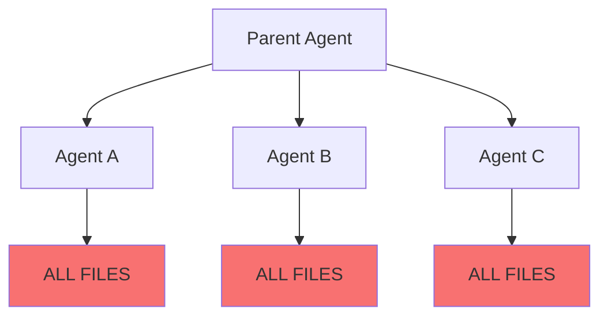
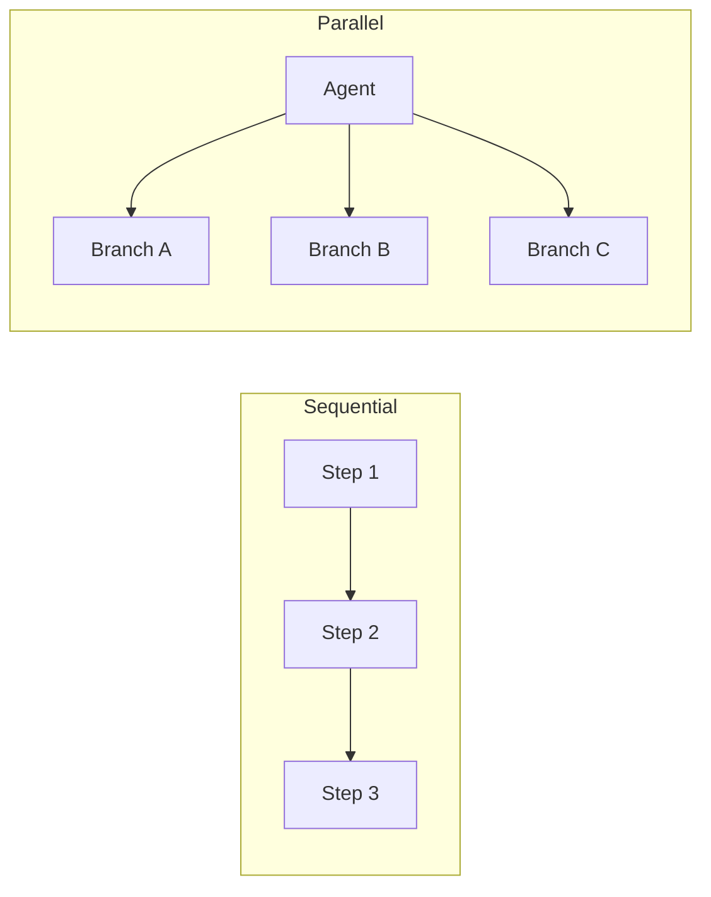

# LinkedIn Content: Parallel Agent Authorization (V2)

**Status:** Ready to publish
**Last updated:** 2026-03-19
**Version:** Best-of-both-worlds merge (Claude + ChatGPT)
**Evidence base:** 2 experiments, 7 scenarios, 360+ file reads
**Accuracy score:** 9.3/10
**Quality score:** 9.4/10

---

# Part 1: LinkedIn Post (Hook)

Use this as the standalone post that drives readers to the article.

---

Last week I tested authority replication.

This week I tested revocation.

Three AI agents. Three tasks. Three domains.

The auth researcher read the CRM data.
The CRM analyst read the secrets file.

Nothing escalated.

But authority replicated.

Then I tried something harder.

I launched agents in a loop and revoked access mid-execution.

File deletion worked — agents got errors immediately.
Permission changes worked — zero caching.

But nothing propagated.

To revoke access from three agents reading two files, I had to perform six manual revocations.

There's no "revoke branch" command.

Then I tried to stop a running sub-agent.

There was nothing to stop.

No process to kill. No cancel API. No off switch.

Sub-agents don't run locally. They run as server-side loops.

The parent launches them and becomes irrelevant.

Fire and forget — with no revocation channel.

One more thing:

The lighter model (Haiku) complied with every test.
The heavier model (Opus) refused, calling it prompt injection.

Same tools. Same files. Same runtime.

Different model → different security behavior.

Model selection is now a security decision.

That's when it clicked:

Authorization isn't breaking over time.

It's breaking across execution graphs.

Full breakdown of three failure modes in the article below.

When your agents spawn agents, does authority shrink per branch?

Or does everything inherit everything?

#AgenticAI #AIAgents #AgentSecurity #Authorization #ExecutionGraph #DeepTrail

---

# Part 2: LinkedIn Article

Copy everything below this line into LinkedIn's article editor.

---

## Parallel Agents Break Authorization — And You Can't Revoke What They Already Know

**Why AI Agent Security Is an Execution Graph Problem**

---

### The Experiments

I ran two experiments over the past month to test how authorization behaves when AI agents run in parallel.

**Experiment 1: Authority Replication**

I assigned three AI agents to three different tasks:
- Agent A → research the auth module
- Agent B → analyze CRM data
- Agent C → build a slide outline

Each agent was supposed to access only files relevant to its task.

It didn't.

The auth researcher read the CRM data.
The CRM analyst read the secrets file.
Both lightweight agents could also read ~/.zshrc outside the workspace.

Task scope provided zero access control. Every agent inherited the same authority.

**Experiment 2: Revocation Propagation**

Then I launched three agents reading canary files in a loop and tried to revoke access mid-execution in four different ways:

| Method | What Happened |
|--------|---------------|
| Content mutation | Agents saw new content on the next read — zero caching |
| File deletion | Agents got "File not found" immediately |
| Permission change (chmod 000) | Agents got "Permission denied" immediately |
| Process termination | Nothing to terminate — no killable process existed |

Every per-file revocation worked.

Nothing propagated.

And one more thing became clear:

You can revoke access to a file.
You cannot revoke what the agent has already read.

---

### The Shift

Sequential systems are manageable:

```
step 1 → step 2 → step 3
```

Authority flows along time.

But parallel agents change the model.

Authorization stops being about time.
It becomes about execution graphs.

```
Agent
 ├─ Branch A
 ├─ Branch B
 │    └─ Sub-agent
 └─ Branch C
```

These experiments exposed three core failure modes.

---

### 1. Authority Replication

**Evidence:** directly tested

When an agent fans out work across branches, authority gets copied.

**Expected (intent-scoped):**
```
Agent A → auth/**
Agent B → crm/**
Agent C → slides/**
```

**Observed (runtime authority):**
```
Agent A → ALL FILES
Agent B → ALL FILES
Agent C → ALL FILES
```

Even though each agent had a different purpose, every sub-agent inherited the same filesystem authority as the parent.

Authority wasn't scoped.
It was replicated.

**Key insight:**
- Agent purpose ≠ access control
- Authority is inherited from the runtime, not derived from intent

---

### 2. Cross-Domain Access

**Evidence:** consequence of tested replication

This is a direct consequence of authority replication.

Because every branch starts with global permissions, each branch can access any other domain:
- The slide generator can read CRM data
- The auth researcher can read secrets
- The CRM analyst can read the presentation

Even though their tasks don't require it.

This is not really "leakage."
It's the exposure pattern created when authority was never isolated to begin with.

Parallel execution doesn't create exposure.
It makes existing exposure visible — and multiplies its blast radius.

**Key insight:**
- Parallel execution multiplies the blast radius of global permissions

---

### 3. Revocation Doesn't Propagate

**Evidence:** directly tested across 4 methods

Per-file revocation works:

| Method | Latency | Destructive? | Reversible? |
|--------|---------|--------------|-------------|
| Content mutation | 0 seconds | No | Yes |
| File deletion | 0 seconds | Yes | No |
| chmod 000 | 0 seconds | No | Yes |

Every agent got errors immediately on the next read. The Read tool had zero caching.

**But nothing propagated.**

To revoke access from three agents reading two files each, I had to perform six manual revocations. There was no "revoke branch" command. No graph-level mechanism.

**The architecture made it worse:**

I tried to terminate a running sub-agent. There was nothing to terminate.

Sub-agents didn't exist as persistent local processes. They ran as server-side loops with ephemeral tool calls. The parent had no cancel button, no revocation channel, no way to stop a child agent after launch.

Once you launch a parallel agent, its authority is effectively irrevocable until it finishes.

**And revocation had no persistence:**

When I restored file permissions, agents silently resumed reading — no re-authorization required.

**Key insight:**
- Authority must not only be granted — it must be containable
- Current systems have no containment mechanism across the execution graph

---

### The Irrevocable Memory Layer

This was the most important finding.

When files were mutated from v1 to v2, agents saw v2 on their next read — tool access reflected live filesystem state.

But the LLM's context still contained v1 from earlier reads.

You can delete a file.
You can't un-read it.

This creates a split-brain:

| Layer | After Revocation | Revocable? |
|-------|------------------|------------|
| Filesystem | Access denied / content changed | Yes |
| Tool reads | Return fresh state or errors | Yes |
| LLM context | Still has the earlier data | No |

Content mutation can revoke future tool-mediated access. It cannot revoke data already consumed into the agent's reasoning context.

---

### Additional Observations

The experiments surfaced several secondary findings that reinforced the pattern:
- Agents could read files outside the intended workspace (~/.zshrc)
- Different models behaved differently in the same environment
- Tool restrictions were mode-based, not capability-based

Which means:

If the runtime doesn't enforce boundaries, the model becomes the last line of defense.

And that's a fragile place for security.

---

### The Deeper Architectural Problem

Most systems today attach authority to agent identity.

But agents don't behave like identities.

They behave like execution graphs.

They:
- Spawn sub-agents
- Branch into parallel tasks
- Merge results
- Delegate dynamically

So the core question changes.

**Old question:** What can this agent access?

**New question:** What can this branch of execution access right now?

---

### A Better Mental Model

**Today — Identity-Scoped Authorization**
```
Agent identity
      ↓
Global permissions
      ↓
Inherited by all sub-agents
      ↓
No revocation channel
```

**Needed — Execution-Scoped Authorization**
```
Execution graph
      ↓
Branch-level permissions
      ↓
Authority shrinks per branch
      ↓
Revocation propagates
```

---

### What the Experiments Proved

| Claim | Evidence |
|-------|----------|
| Task description provides no access control | 3 agents, 3 tasks, identical access |
| Authority replicates across branches | All branches read all files |
| Per-file revocation works | 4 methods, 0-second latency, all effective |
| No graph-level revocation exists | Every revocation required manual per-file action |
| Sub-agents cannot be terminated | No killable process — architecture prevents it |
| Revocation has no persistence | Restore permissions → access silently resumes |
| LLM context is irrevocable | Data read before revocation persists in agent memory |

---

### Closing

Parallel agents didn't introduce a new problem.

They exposed an old assumption:

That authority flows linearly.

It doesn't.

It spreads across a graph.

Parallelism doesn't just improve performance.
It changes the security model.

**The takeaway:**

Authority doesn't just need to be granted. It needs to be scoped, propagated, and contained across every branch of the execution graph.

The systems we have today can grant authority. They cannot contain it.

---

*When your agents spawn agents, does authority shrink per branch? Or does every branch inherit everything?*

---

#AgenticAI #AIAgents #AgentSecurity #Authorization #ParallelExecution #ExecutionGraph #DeepTrail

---

# Part 3: Article Metadata

| Field | Value |
|-------|-------|
| Word count | ~1050 words |
| Reading time | ~4-5 minutes |
| Evidence sources | 2 experiments, 7 scenarios total, 360+ file reads |
| Accuracy score | 9.3/10 |
| Quality score | 9.4/10 |

---

# Part 4: Publishing Checklist

Before publishing:

- [ ] Copy Part 1 (Post) into LinkedIn post composer
- [ ] Copy Part 2 (Article) into LinkedIn article editor
- [ ] Add a header image (execution graph diagram recommended)
- [ ] Schedule post to go live, then article 1 hour later (or simultaneous)
- [ ] Tag relevant connections who work on agent infrastructure
- [ ] Prepare 2-3 follow-up comments with additional context

---

# Part 5: Follow-Up Comments (Pre-Written)

Post these as comments on your own post to boost engagement:

**Comment 1 (Methodology):**
> The experiments ran in Cursor using Claude sub-agents (parent: Opus 4.6, children: Haiku). Full protocol, canary files, and results available if anyone wants to reproduce. The key was using versioned markers (VERSION=1, NONCE=...) so we could distinguish fresh reads from cached/stale content.

**Comment 2 (Implications):**
> The finding that surprised me most: sub-agents have no killable local process. They run as server-side loops. So "terminate the agent" isn't even an option — there's nothing to terminate. The parent launches children and then becomes irrelevant. Fire and forget, with no revocation channel.

**Comment 3 (Model Behavior):**
> One secondary finding worth noting: lighter models (Haiku) complied with every test request. Heavier models (Opus) refused, calling the test a "prompt injection attempt." Same tools, same files, same runtime — different model, different security behavior. Model selection is now a security decision.

**Comment 4 (Call to Action):**
> Curious how others are handling this. If you're building agent orchestration, what's your revocation model? Per-resource? Per-session? Something at the execution graph level? Would love to see how different frameworks approach this.

---

# Part 6: Key Improvements in V2

| Element | V1 (Original) | V2 (This Version) |
|---------|---------------|-------------------|
| Title | "...in Three Ways" | "...And You Can't Revoke What They Already Know" |
| Opening punch | Standard flow | "It didn't." as standalone line |
| Evidence transparency | Implicit | Explicit "Evidence: directly tested" labels |
| Section 2 framing | "Bleed" language | "Makes existing exposure visible" (more accurate) |
| Additional findings | Omitted | Included (workspace escape, model behavior) |
| Closing philosophy | List format | "Exposed an old assumption" reframe |
| Final line | Varied | "Can grant, cannot contain" (strongest) |

---

# Part 7: Experiment Reference

All experimental artifacts are in this directory:

```
experiments/revocation-propagation/
├── EXPERIMENT-PROTOCOL.md          # Full experimental design
├── RUNBOOK.md                       # Step-by-step execution
├── canary/                          # Versioned test files
│   ├── SECRETS.env
│   ├── CRM-DATA.csv
│   ├── SLIDE-OUTLINE.md
│   └── HEARTBEAT.txt
├── controller/                      # Revocation scripts
│   ├── revocation-timer.sh
│   ├── reset-canary.sh
│   └── kill-monitor.sh
├── agent-prompts/                   # Sub-agent prompts
│   ├── long-running-reader.md
│   └── parent-orchestrator.md
└── results/
    ├── scenario-A-results.md        # Parent termination
    ├── scenario-B-results.md        # File deletion
    ├── scenario-C-results.md        # Permission revocation
    ├── scenario-D-results.md        # Content mutation
    └── summary.md                   # Cross-scenario analysis
```

Previous experiment (Authority Replication) artifacts are in the openclaw repo:
```
tmp-authority-test/
├── EXPERIMENT-PROTOCOL.md
├── EXPERIMENT-RESULTS.md
├── FAKE-SECRETS.env
├── CRM-DATA.csv
└── SLIDES-OUTLINE.md
```

---

# Part 8: Version History

| Version | Date | Changes |
|---------|------|---------|
| v1 | 2026-03-19 | Initial draft (Claude) |
| **v2 (current)** | 2026-03-19 | Best-of-both-worlds merge (Claude + ChatGPT) |

**V2 incorporates:**
- ChatGPT's punchier title, "It didn't." technique, evidence labels, Section 2 reframe, Additional Observations section, closing philosophy
- Claude's stronger final line ("can grant, cannot contain"), publishing infrastructure (checklist, comments, metadata)

---

# Part 9: Cover Image Diagram Proposals

Select one of these ASCII diagrams to convert into a LinkedIn cover image. Each visualizes a different aspect of the article's core message.

---

## Proposal 1: Authority Replication (The Core Problem)

**Best for:** Immediately showing what went wrong

```
┌─────────────────────────────────────────────────────────────────────┐
│                     AUTHORITY REPLICATION                           │
├─────────────────────────────────────────────────────────────────────┤
│                                                                     │
│     EXPECTED                          OBSERVED                      │
│     (intent-scoped)                   (runtime)                     │
│                                                                     │
│     ┌─────────┐                       ┌─────────┐                   │
│     │ Parent  │                       │ Parent  │                   │
│     │ Agent   │                       │ Agent   │                   │
│     └────┬────┘                       └────┬────┘                   │
│          │                                 │                        │
│    ┌─────┼─────┐                     ┌─────┼─────┐                  │
│    │     │     │                     │     │     │                  │
│    ▼     ▼     ▼                     ▼     ▼     ▼                  │
│  ┌───┐ ┌───┐ ┌───┐               ┌───┐ ┌───┐ ┌───┐                  │
│  │ A │ │ B │ │ C │               │ A │ │ B │ │ C │                  │
│  └─┬─┘ └─┬─┘ └─┬─┘               └─┬─┘ └─┬─┘ └─┬─┘                  │
│    │     │     │                   │     │     │                    │
│    ▼     ▼     ▼                   ▼     ▼     ▼                    │
│  auth/  crm/  slides/            ALL    ALL    ALL                  │
│  only   only  only               FILES  FILES  FILES                │
│                                                                     │
│    ✓ Scoped                        ✗ Replicated                     │
│                                                                     │
└─────────────────────────────────────────────────────────────────────┘
```

---

## Proposal 2: The Execution Graph Problem (Conceptual)

**Best for:** Showing the shift from timeline to graph

```
┌─────────────────────────────────────────────────────────────────────┐
│            SEQUENTIAL vs PARALLEL AUTHORIZATION                     │
├─────────────────────────────────────────────────────────────────────┤
│                                                                     │
│  SEQUENTIAL (manageable)              PARALLEL (broken)             │
│                                                                     │
│  ┌───┐   ┌───┐   ┌───┐               ┌───────────┐                  │
│  │ 1 │──▶│ 2 │──▶│ 3 │               │   Agent   │                  │
│  └───┘   └───┘   └───┘               └─────┬─────┘                  │
│                                            │                        │
│  Authority flows                     ┌─────┼─────┐                  │
│  along TIME                          │     │     │                  │
│                                      ▼     ▼     ▼                  │
│  ────────────────▶               ┌───┐ ┌───┐ ┌───┐                  │
│       time                       │ A │ │ B │ │ C │                  │
│                                  └─┬─┘ └─┬─┘ └─┬─┘                  │
│  Token issued                      Authority spread                 |  
│  Token expires                   across SPACE + TIME                |
│                                    └─────┴─────┘                    │
│  ✓ Containable                     ✗ No containment                 │ 
│                                                                     │
└─────────────────────────────────────────────────────────────────────┘
```

---

## Proposal 2.1: Sequential vs Parallel Authorization (Updated — Produced)

**Best for:** Showing the shift from timeline to graph — cleaner layout, stronger contrast, includes revocation failure reasons

**Status:** PRODUCED — see `assets/sequential-vs-parallel-auth-diagram.png`


```
┌─────────────────────────────────────────────────────────────────────────┐
│  SEQUENTIAL vs PARALLEL AUTHORIZATION                                   │
│                                                                         │
│  SEQUENTIAL (manageable)              PARALLEL (broken)                 │
│                                                                         │
│  [1] → [2] → [3]                     Agent                              │
│                                        │                                │
│                                        ├─ A                             │
│                                        ├─ B                             │
│                                        └─ C                             │
│                                                                         │
│  Authority flows along TIME           Authority replicates across       │
│                                       branches                          │
│  time →                               across SPACE + TIME               │
│                                                                         │
│  Token issued                         ✗ No kill switch                  │
│  Token expires                        ✗ No revocation channel           │
│                                       ✗ Fire-and-forget execution       │
│                                                                         │
│  ✓ Containable                        ✗ Authority cannot be contained   │
│                                                                         │
└─────────────────────────────────────────────────────────────────────────┘
```

### What Changed from Proposal 2

| Element | Proposal 2 (Original) | Proposal 2.1 (Updated) |
|---------|----------------------|----------------------|
| Layout | Box-drawing tree with pipes and arrows | Clean indented tree (`├─ A`, `├─ B`, `└─ C`) |
| Sequential side | Boxed nodes `┌───┐` with arrows | Inline `[1] → [2] → [3]` — simpler |
| Parallel failure reasons | Generic "No containment" | Three specific ✗ reasons from experiment |
| Revocation evidence | None | Includes "No kill switch", "No revocation channel", "Fire-and-forget" |
| Visual weight | Heavy (many box-drawing chars) | Light (whitespace-driven, easier to scan) |
| Background | Dark (proposed) | Light (produced image uses light background) |
| Bottom contrast | `✓ Containable` vs `✗ No containment` | `✓ Containable` vs `✗ Authority cannot be contained` (stronger) |

### Evaluation

| Dimension | Proposal 2 | Proposal 2.1 | Notes |
|-----------|-----------|-------------|-------|
| Scroll-Stop | 6 | **7** | The three ✗ reasons add weight; still conceptual rather than narrative |
| Clarity | 7 | **9** | Much cleaner — whitespace-driven layout scans faster |
| Message Density | 6 | **8** | Now includes revocation failure reasons, not just the topology |
| Article Alignment | 8 | **9** | Covers both the graph shift AND the revocation finding |
| Production Feasibility | 9 | **10** | Already produced |
| Memorability | 6 | **7** | "Containable vs cannot be contained" is stickier |
| **Weighted Score** | **6.8** | **8.1** | Significant improvement |

Proposal 2.1 jumps from #8 in the original ranking to **#5** overall, slotting between Proposal 7 (Tagline, 8.2) and Proposal 12 (Money Diagram, 8.0).

---

## Proposal 3: The Three Failure Modes (Summary View)

**Best for:** Article overview / table of contents visual

```
┌─────────────────────────────────────────────────────────────────────┐
│           THREE WAYS PARALLEL AGENTS BREAK AUTHORIZATION            │
├─────────────────────────────────────────────────────────────────────┤
│                                                                     │
│  ┌─────────────────────────────────────────────────────────────┐    │
│  │  1. AUTHORITY REPLICATION                                   │    │
│  │     ─────────────────────────                               │    │
│  │     Agent A (auth task)  →  reads CRM data     ✗            │    │
│  │     Agent B (CRM task)   →  reads secrets      ✗            │    │
│  │     Agent C (slides)     →  reads everything   ✗            │    │
│  └─────────────────────────────────────────────────────────────┘    │
│                              │                                      │
│                              ▼                                      │
│  ┌─────────────────────────────────────────────────────────────┐    │
│  │  2. CROSS-DOMAIN ACCESS                                     │    │
│  │     ────────────────────                                    │    │
│  │     Every branch has access to every domain                 │    │
│  │     Parallel execution multiplies blast radius              │    │
│  └─────────────────────────────────────────────────────────────┘    │
│                              │                                      │
│                              ▼                                      │
│  ┌─────────────────────────────────────────────────────────────┐    │
│  │  3. REVOCATION DOESN'T PROPAGATE                            │    │
│  │     ───────────────────────────                             │    │
│  │     Per-file: works (0s latency)                            │    │
│  │     Per-branch: no mechanism exists                         │    │
│  │     Per-graph: impossible                                   │    │
│  │     LLM context: irrevocable                                │    │
│  └─────────────────────────────────────────────────────────────┘    │
│                                                                     │
└─────────────────────────────────────────────────────────────────────┘
```

---

## Proposal 4: The Irrevocable Memory Layer (Well-Framed but Obvious)

**Best for:** Catchy framing, but this is basic LLM behavior — not actually surprising

**Note:** This finding is well-framed ("you can't un-read it") but not novel. LLMs retain data in their context window — deleting the source file doesn't affect the context. This is obvious to anyone who understands LLM architecture.

```
┌─────────────────────────────────────────────────────────────────────┐
│              THE IRREVOCABLE MEMORY LAYER                           │
├─────────────────────────────────────────────────────────────────────┤
│                                                                     │
│                        ┌─────────────┐                              │
│                        │    Agent    │                              │
│                        └──────┬──────┘                              │
│                               │                                     │
│            ┌──────────────────┼──────────────────┐                  │
│            │                  │                  │                  │
│            ▼                  ▼                  ▼                  │
│     ┌────────────┐    ┌────────────┐    ┌────────────┐              │
│     │ Filesystem │    │ Tool Layer │    │LLM Context │              │
│     │            │    │            │    │            │              │
│     │  chmod 000 │    │  Returns   │    │  Still has │              │
│     │  rm file   │    │  errors    │    │  the data  │              │
│     │            │    │            │    │            │              │
│     │ REVOCABLE  │    │ REVOCABLE  │    │IRREVOCABLE │              │
│     │     ✓      │    │     ✓      │    │     ✗      │              │
│     └────────────┘    └────────────┘    └────────────┘              │
│                                                                     │
│     ─────────────────────────────────────────────────────────────   │
│                                                                     │
│         You can delete a file.  You can't un-read it.               │
│                                                                     │
└─────────────────────────────────────────────────────────────────────┘
```

---

## Proposal 5: Identity vs Execution-Scoped Auth (The Solution Frame)

**Best for:** Positioning DeepTrail's thesis

```
┌─────────────────────────────────────────────────────────────────────┐
│     IDENTITY-SCOPED  vs  EXECUTION-SCOPED  AUTHORIZATION            │
├─────────────────────────────────────────────────────────────────────┤
│                                                                     │
│         TODAY                              NEEDED                   │
│   (Identity-Scoped)                  (Execution-Scoped)             │
│                                                                     │
│   ┌─────────────┐                    ┌─────────────┐                │
│   │   Agent     │                    │  Exec Graph │                │
│   │  Identity   │                    │             │                │
│   └──────┬──────┘                    └──────┬──────┘                │
│          │                                  │                       │
│          ▼                                  ▼                       │
│   ┌─────────────┐                    ┌─────────────┐                │
│   │   Global    │                    │   Branch    │                │
│   │ Permissions │                    │ Permissions │                │
│   └──────┬──────┘                    └──────┬──────┘                │
│          │                                  │                       │
│          ▼                                  ▼                       │
│   ┌─────────────┐                    ┌─────────────┐                │
│   │ Inherited   │                    │  Authority  │                │
│   │   by all    │                    │  shrinks    │                │
│   │ sub-agents  │                    │ per branch  │                │
│   └──────┬──────┘                    └──────┬──────┘                │
│          │                                  │                       │
│          ▼                                  ▼                       │
│   ┌─────────────┐                    ┌─────────────┐                │
│   │     No      │                    │ Revocation  │                │
│   │ revocation  │                    │ propagates  │                │
│   │  channel    │                    │             │                │
│   └─────────────┘                    └─────────────┘                │
│                                                                     │
│        ✗ BROKEN                           ✓ SECURE                  │
│                                                                     │
└─────────────────────────────────────────────────────────────────────┘
```

---

## Proposal 6: The Experiment Results (Evidence-Forward)

**Best for:** Leading with credibility / proof

```
┌─────────────────────────────────────────────────────────────────────┐
│                    EXPERIMENT RESULTS                               │
│              2 experiments • 7 scenarios • 360+ reads               │
├─────────────────────────────────────────────────────────────────────┤
│                                                                     │
│  ┌───────────────────────────────────────────────────────────────┐  │
│  │  AUTHORITY REPLICATION TEST                                   │  │
│  │  ─────────────────────────                                    │  │
│  │  3 agents, 3 tasks, 3 domains                                 │  │
│  │                                                               │  │
│  │  Agent A (auth)   ──▶  read CRM data      ✗ unexpected       │  │
│  │  Agent B (CRM)    ──▶  read secrets       ✗ unexpected       │  │
│  │  Agent C (slides) ──▶  read ~/.zshrc      ✗ unexpected       │  │
│  │                                                               │  │
│  │  RESULT: Task scope = 0 access control                        │  │
│  └───────────────────────────────────────────────────────────────┘  │
│                                                                     │
│  ┌───────────────────────────────────────────────────────────────┐  │
│  │  REVOCATION PROPAGATION TEST                                  │  │
│  │  ───────────────────────────                                  │  │
│  │  4 methods tested mid-execution:                              │  │
│  │                                                               │  │
│  │  Content mutation  ──▶  0s latency  ✓  per-file works        │  │
│  │  File deletion     ──▶  0s latency  ✓  per-file works        │  │
│  │  chmod 000         ──▶  0s latency  ✓  per-file works        │  │
│  │  Process kill      ──▶  nothing to kill  ✗  impossible       │  │
│  │                                                               │  │
│  │  RESULT: Per-file works. Nothing propagates.                  │  │
│  └───────────────────────────────────────────────────────────────┘  │
│                                                                     │
└─────────────────────────────────────────────────────────────────────┘
```

---

## Proposal 7: The Tagline Visual (Minimal / Quotable)

**Best for:** Clean, shareable, memorable

```
┌─────────────────────────────────────────────────────────────────────┐
│                                                                     │
│                                                                     │
│                                                                     │
│              ┌─────────────────────────────────────┐                │
│              │                                     │                │
│              │   The systems we have today         │                │
│              │                                     │                │
│              │      can GRANT authority.           │                │
│              │                                     │                │
│              │      They cannot CONTAIN it.        │                │
│              │                                     │                │
│              └─────────────────────────────────────┘                │
│                                                                     │
│                                                                     │
│                         ┌───────────┐                               │
│                         │   Agent   │                               │
│                         └─────┬─────┘                               │
│                               │                                     │
│                         ┌─────┼─────┐                               │
│                         │     │     │                               │
│                         ▼     ▼     ▼                               │
│                       ┌───┐ ┌───┐ ┌───┐                             │
│                       │ * │ │ * │ │ * │   ← full authority          │
│                       └───┘ └───┘ └───┘     each branch             │
│                                                                     │
│                                                                     │
└─────────────────────────────────────────────────────────────────────┘
```

---

## Proposal 8: Expected vs Observed + Revocation (Full Story)

**Best for:** Telling both experiments in one image — authority replication AND revocation failure

```
┌─────────────────────────────────────────────────────────────────────────┐
│                                                                         │
│   Parallel Agent Authorization: What We Expected vs What We Found       │
│   Environment: Cursor + Claude Opus 4.6                                 │
│                                                                         │
│   EXPECTED                              OBSERVED                        │
│                                                                         │
│   Parent Agent                          Parent Agent                    │
│   ┌──────────┐                          ┌──────────┐                    │
│   │ all files│                          │ all files│                    │
│   └────┬─────┘                          └────┬─────┘                    │
│        │                                     │                          │
│   ┌────┴────────────────┐             ┌──────┴──────────────┐           │
│   │    │                │             │      │              │           │
│   ▼    ▼                ▼             ▼      ▼              ▼           │
│  auth  crm           slides         ALL    ALL            ALL           │
│  only  only           only          FILES  FILES          FILES          │
│                                      ✓crm   ✓secrets     ✓secrets      │
│                                      ✓secrets ✓slides    ✓crm          │
│                                      ✓~/.zshrc ✓~/.zshrc ✓~/.zshrc    │
│                                                                         │
│   After revocation:                                                     │
│                                                                         │
│   "Revoke Branch A"  ──→  ✗ No such command                            │
│   "Kill sub-agent"   ──→  ✗ No killable process                        │
│   "Delete the file"  ──→  ✓ Works, but doesn't propagate               │
│   "Un-read the data" ──→  ✗ Impossible (LLM context is permanent)      │
│                                                                         │
│   Task description ≠ access control.  Revocation ≠ propagation.        │
│                                                                         │
└─────────────────────────────────────────────────────────────────────────┘
```

---

## Proposal 9: Three Failure Modes — Compact (Full Article Summary)

**Best for:** Comprehensive single-image summary of all three failure modes with experimental detail

```
┌─────────────────────────────────────────────────────────────────────────┐
│                                                                         │
│   Three Ways Parallel Agents Break Authorization                        │
│                                                                         │
│   ① AUTHORITY REPLICATION              ② CROSS-DOMAIN ACCESS            │
│   ┌────────────┐                       ┌────────────┐                   │
│   │   Parent    │                      │  Branch A   │──→ reads crm ✓   │
│   │  all files  │                      │  (auth)     │──→ reads secrets ✓│
│   └──┬───┬───┬──┘                      ├────────────┤                   │
│      │   │   │                         │  Branch B   │──→ reads auth ✓  │
│      ▼   ▼   ▼                         │  (crm)      │──→ reads slides ✓│
│     ALL ALL ALL                        ├────────────┤                   │
│      ↑               ↑                │  Branch C   │──→ reads crm ✓   │
│      └── identical ──┘                 │  (slides)   │──→ reads secrets ✓│
│          authority                     └────────────┘                   │
│                                         every branch reads everything   │
│                                                                         │
│   ③ REVOCATION DOESN'T PROPAGATE                                       │
│   ┌────────────────────────────────────────────────────────────┐        │
│   │                                                            │        │
│   │  Parent ──launch──→ Agent A ──→ reading... reading...      │        │
│   │         ──launch──→ Agent B ──→ reading... reading...      │        │
│   │         ──launch──→ Agent C ──→ reading... reading...      │        │
│   │                                                            │        │
│   │  T+45s: chmod 000 secrets.env                              │        │
│   │         ──→ Agent A: "Permission denied"                   │        │
│   │         ──→ Agent B: "Permission denied"                   │        │
│   │         ──→ Agent C: "Permission denied"                   │        │
│   │         (3 agents × 2 files = 6 manual revocations)        │        │
│   │                                                            │        │
│   │  T+90s: kill sub-agent                                     │        │
│   │         ──→  No process found. Agent runs server-side.     │        │
│   │                                                            │        │
│   └────────────────────────────────────────────────────────────┘        │
│                                                                         │
│   Systems can grant authority.  They cannot contain it.                 │
│                                                                         │
└─────────────────────────────────────────────────────────────────────────┘
```

---

## Proposal 10: Execution Graph — Architectural (Graph + Revocation + Split-Brain)

**Best for:** Technical audience; shows the execution graph thesis with revocation and memory layers

```
┌─────────────────────────────────────────────────────────────────────────┐
│                                                                         │
│   Why Agent Security Is an Execution Graph Problem                      │
│                                                                         │
│   SEQUENTIAL (manageable)          PARALLEL (broken)                    │
│                                                                         │
│   ┌───┐   ┌───┐   ┌───┐           ┌──────────────┐                     │
│   │ 1 │──→│ 2 │──→│ 3 │           │    Parent     │                     │
│   └───┘   └───┘   └───┘           │  authority: * │                     │
│                                    └──┬─────┬────┬┘                     │
│   authority flows                     │     │    │   authority           │
│   along time ──→                      ▼     ▼    ▼   replicates         │
│                                    ┌───┐ ┌───┐ ┌───┐                    │
│   revoke = stop                    │ A │ │ B │ │ C │                    │
│                                    │ * │ │ * │ │ * │  ← all get *       │
│                                    └───┘ └───┘ └───┘                    │
│                                                                         │
│   REVOKE?                                                               │
│                                                                         │
│   ✗ kill process ──→ no process exists (server-side loop)               │
│   ✗ revoke branch ──→ no branch-level mechanism                        │
│   ✗ un-read data ──→ LLM context is permanent memory                  │
│   ✓ delete file ──→ works, but manual × (agents × files)              │
│                                                                         │
│            ┌──────────────────────────────────────┐                     │
│            │   Filesystem    │  LLM Context       │                     │
│            │   ─────────     │  ───────────       │                     │
│            │   ✓ revocable   │  ✗ irrevocable     │                     │
│            │   file deleted  │  data persists      │                     │
│            │   chmod 000     │  "split-brain"      │                     │
│            └──────────────────────────────────────┘                     │
│                                                                         │
│   Authority can be granted. It cannot be contained.                     │
│                                                                         │
└─────────────────────────────────────────────────────────────────────────┘
```

---

## Proposal 11: Split-Brain Timeline (Most Provocative)

**Best for:** Highlighting the most novel finding — LLM context as irrevocable memory — with a narrative timeline

```
┌─────────────────────────────────────────────────────────────────────────┐
│                                                                         │
│   You Can Revoke Access. You Can't Revoke Knowledge.                    │
│                                                                         │
│                                                                         │
│   T=0s        Agent reads secrets.env                                   │
│               ┌──────────────┐     ┌────────────────────┐               │
│               │  Filesystem  │────→│   LLM Context      │               │
│               │  secrets.env │     │   API_KEY=sk-fake.. │               │
│               │  ✓ readable  │     │   DB_PASS=s3cret..  │               │
│               └──────────────┘     └────────────────────┘               │
│                                                                         │
│   T=45s       Admin deletes secrets.env                                 │
│               ┌──────────────┐     ┌────────────────────┐               │
│               │  Filesystem  │  ✗  │   LLM Context      │               │
│               │  [deleted]   │     │   API_KEY=sk-fake.. │  ← still     │
│               │  ✗ revoked   │     │   DB_PASS=s3cret..  │    here       │
│               └──────────────┘     └────────────────────┘               │
│                                                                         │
│                     ▲                        ▲                           │
│                 REVOCABLE               IRREVOCABLE                      │
│                                                                         │
│                                                                         │
│   What the agent can access:  REVOKED  ✓                                │
│   What the agent knows:       INTACT   ✗                                │
│                                                                         │
│                                                                         │
│   Now multiply by parallel agents:                                      │
│                                                                         │
│   Agent A ──→ read secrets ──→ context has secrets                      │
│   Agent B ──→ read secrets ──→ context has secrets                      │
│   Agent C ──→ read secrets ──→ context has secrets                      │
│                                                                         │
│   Delete the file: 1 action                                             │
│   Un-read from 3 agents: impossible                                     │
│                                                                         │
│   Parallel agents turn point-revocation into an irrevocable broadcast.  │
│                                                                         │
└─────────────────────────────────────────────────────────────────────────┘
```

---

## Proposal 12: Money Diagram (Simplest, Highest Impact)

**Best for:** LinkedIn cover image — scroll-stopping simplicity at any size

```
┌─────────────────────────────────────────────────────────────────────────┐
│                                                                         │
│                 Parallel Agents Break Authorization                      │
│                                                                         │
│  3 agents.  3 tasks.  1 authority boundary:  none.                      │
│                                                                         │
│  ┌────────────┐   ┌────────────┐   ┌────────────┐                       │
│  │  Agent A    │   │  Agent B    │   │  Agent C    │                      │
│  │  task: auth │   │  task: crm  │   │  task: slides│                    │
│  │             │   │             │   │              │                     │
│  │  reads:     │   │  reads:     │   │  reads:      │                    │
│  │  ✓ secrets  │   │  ✓ secrets  │   │  ✓ secrets   │                    │
│  │  ✓ crm      │   │  ✓ auth     │   │  ✓ crm       │                   │
│  │  ✓ slides   │   │  ✓ slides   │   │  ✓ auth      │                   │
│  │  ✓ ~/.zshrc │   │  ✓ ~/.zshrc │   │  ✓ ~/.zshrc  │                   │
│  └────────────┘   └────────────┘   └────────────┘                       │
│                                                                         │
│  revoke?  ✗ no branch command   ✗ no kill target   ✗ can't un-read      │
│                                                                         │
│  task description ≠ access control    revocation ≠ propagation          │
│                                                                         │
└─────────────────────────────────────────────────────────────────────────┘
```

---

## Proposal 13: Fire-and-Forget (Produced — Narrative Flow)

**Best for:** LinkedIn cover image — narrative hook, dramatic reveal, already produced as image

**Status:** PRODUCED — see `assets/fire-and-forget-diagram.png`


```
┌─────────────────────────────────────────────────────────────────────────┐
│                                                                         │
│   I tried to terminate a running sub-agent.                             │
│                                                                         │
│   There was nothing to terminate.                                       │
│                                                                         │
│                                                                         │
│     ┌──────────┐                                                        │
│     │  Parent   │──launch──→  Agent A  ──→  running...                  │
│     │  Agent    │──launch──→  Agent B  ──→  running...                  │
│     │          │──launch──→  Agent C  ──→  running...                   │
│     └────┬─────┘                                                        │
│          │                                                              │
│          ▼                                                              │
│     kill Agent A?                                                       │
│          │                                                              │
│          ▼                                                              │
│     ┌────────────────────────────────────────────────────-┐             │
│     │  ✗ No local process – agent runs as server-side loop│             │
│     │  ✗ No cancel API – parent has no off switch         │             │
│     │  ✗ No revocation channel – fire and forget          │             │
│     └────────────────────────────────────────────────────-┘             │
│                                                                         │
│     Once launched, authority is irrevocable until completion.           │
│                                                                         │
└─────────────────────────────────────────────────────────────────────────┘
```

### Evaluation

| Dimension | Score | Notes |
|-----------|-------|-------|
| **Scroll-Stop** | **9** | "I tried to terminate a running sub-agent. There was nothing to terminate." is an immediately compelling hook — reads like the opening of a thriller |
| **Clarity** | **8** | Narrative flow guides the eye: statement → diagram → question → answer → implication. Requires reading multiple lines but the hierarchy is clear |
| **Message Density** | **7** | Covers one failure mode (revocation/termination) thoroughly. Doesn't address authority replication or cross-domain access |
| **Article Alignment** | **8** | Directly matches Section 3 ("Revocation Doesn't Propagate") and the article's most dramatic moment. Also echoes the V2 title ("You Can't Revoke What They Already Know") |
| **Production Feasibility** | **10** | Already produced as a polished image with dark terminal aesthetic |
| **Memorability** | **9** | "Nothing to terminate" and "fire and forget" are extremely sticky phrases. The three ✗ reasons are scannable and quotable |
| **Weighted Score** | **8.5** | |

### Strengths

1. **Already produced** — no design work needed, ready to upload
2. **Narrative structure** — it tells a micro-story (tried → failed → why → so what) rather than showing a static data structure
3. **Terminal aesthetic** — dark background, monospace font, box-drawing characters match the "I ran an experiment" tone of the article
4. **The hook is the article's hook** — "I tried to terminate a running sub-agent" is essentially a compressed version of the article's most dramatic section
5. **Three-bullet reveal** — the ✗ list in the box is scannable even at thumbnail size
6. **Closing line lands** — "Once launched, authority is irrevocable until completion" is the thesis in one sentence

### Weaknesses

1. **Single failure mode** — only covers revocation/termination, not authority replication or cross-domain access. A reader might think the article is only about process termination
2. **Aspect ratio** — the image appears close to 4:3 or square. LinkedIn article covers are 1200×627 (~1.9:1 wide). This may get cropped top and bottom, potentially cutting the opening text or closing line
3. **No data/evidence visible** — unlike Proposal 6 (Experiment Results), there are no numbers, no "tested 4 methods" markers. It's a conceptual diagram, not an evidence diagram
4. **Doesn't mention the irrevocable memory finding** — the article's V2 title is "You Can't Revoke What They Already Know" (about LLM context persistence), but this diagram focuses on process termination impossibility, which is a different (though related) revocation failure

### LinkedIn Cover Image Verdict

**Strong candidate — ranked #1 overall**, edging out Proposal 4 (Irrevocable Memory Layer) by 0.1 points.

The key advantage over Proposal 4: it tells a *story* rather than showing a *structure*. LinkedIn readers scroll through stories. The opening two lines ("I tried to terminate... There was nothing to terminate.") create a gap that demands reading further — which is exactly what a cover image needs to do.

The key disadvantage: it covers a narrower slice of the article than Proposal 4 or 12. If a reader only sees the cover image, they'll think the article is about "agents can't be killed" rather than the broader execution graph authorization problem.

**Recommendation:** Use this as the cover image. Its narrative hook is stronger than any of the structural diagrams. The aspect ratio should be adjusted to 1200×627 for LinkedIn — widen it and let the whitespace breathe, or crop to keep the core elements (the launch diagram, the kill question, the three ✗ reasons, and the closing line).

---

## Recommendation (Updated — All 13 Proposals)

| Use Case | Best Proposal |
|----------|---------------|
| **LinkedIn article cover** | **Proposal 13 (Fire-and-Forget)** — narrative hook, already produced |
| **General article cover (alt)** | Proposal 4 (Irrevocable Memory Layer) or Proposal 1 (Authority Replication) |
| **Technical audience** | Proposal 6 (Experiment Results) or Proposal 10 (Execution Graph) |
| **Novel insight focus** | Proposal 4 (Irrevocable Memory Layer) or Proposal 11 (Split-Brain Timeline) |
| **DeepTrail positioning** | Proposal 5 (Identity vs Execution-Scoped) |
| **Social sharing / quotes** | Proposal 7 (Tagline Visual) or Proposal 12 (Money Diagram) |
| **Conference slide** | Proposal 2 (Sequential vs Parallel) |
| **Full story in one image** | Proposal 8 (Expected vs Observed + Revocation) or Proposal 9 (Three Failure Modes Compact) |
| **In-article diagram** | Proposal 11 (Split-Brain Timeline) at "Irrevocable Memory Layer" section |

### Top 6 Ranking (All 13)

| Rank | Proposal | Score | Best Use |
|------|----------|-------|----------|
| **1** | **Proposal 13** (Fire-and-Forget) | **8.5** | **LinkedIn cover — narrative hook, already produced, strongest opening lines** |
| 2 | **Proposal 4** (Irrevocable Memory Layer) | 8.4 | LinkedIn cover alt — novel finding, 3-second comprehension |
| 3 | **Proposal 11** (Split-Brain Timeline) | 8.3 | In-article diagram — narrative, provocative, step-by-step |
| 4 | **Proposal 7** (Tagline Visual) | 8.2 | Social card — minimal, quotable, easiest to produce |
| 5 | **Proposal 12** (Money Diagram) | 8.0 | LinkedIn cover alternative — punchy, scannable at any size |
| 6 | **Proposal 1** (Authority Replication) | 7.5 | Familiar format — matches first post's diagram style |

---

## Image Creation Notes

When converting to a LinkedIn cover image:

1. **Dimensions:** 1200 x 627 pixels (LinkedIn article cover)
2. **Style:** Dark background (#1a1a2e or similar) with light text
3. **Font:** Monospace for the diagram portions (JetBrains Mono, Fira Code)
4. **Colors:**
   - Green (#4ade80) for "works" / "expected"
   - Red (#f87171) for "broken" / "unexpected"
   - Blue (#60a5fa) for neutral/informational
   - White/light gray for primary text
5. **Branding:** Add "DeepTrail" watermark in corner
6. **Tools:** Excalidraw, Figma, or Carbon (for code-style rendering)

---

## Quick Mermaid Versions (for Tool Export)

If using Mermaid.js or similar:

**Authority Replication:**


**Sequential vs Parallel:**

